# Section 03: Business Domain Glossary as Semantic Engine

## Section Summary  
### Section 03: Business Domain Glossary as Semantic Engine delivers:  
✅ Sub-section A: SRP-Enforced Domain Registry Architecture - Framework for single-purpose domain entries with validation and compilation engines  
✅ Sub-section B: FQD Implementation Patterns - Complete lifecycle from definition to platform-specific realization with detailed examples  
✅ Sub-section C: Cross-Platform Taxonomy Design - Universal consistency framework with constraint pattern library and validation testing  

### Key Technical Achievements  
- Complete FQD Example: Accounting.InvoiceAmount shown across all major database platforms   
- Platform-Specific Patterns: Exact SQL implementations for PostgreSQL, SQL Server, Snowflake, MySQL, BigQuery    
- Validation Framework: Semantic equivalence testing and performance assessment methodologies  
- Three Detailed Mermaid Diagrams: Registry architecture, FQD implementation flow, and cross-platform taxonomy  

### Critical Implementation Details  
- SRP Enforcement: Each domain serves exactly one business purpose with mathematical precision  
- Universal Compilation: Same business rule generates appropriate constraints across all platforms  
- Validation Testing: Systematic verification that different platforms produce identical business behavior  
- Constraint Pattern Library: Reusable templates for each database engine's capabilities  

> **Section 03 establishes the technical foundation for transforming glossaries into executable semantic engines.**


[🏠 Home](section-01-table-of-contents--strategic-overview) | [📋 Table of Contents](section-01-table-of-contents--strategic-overview#table-of-contents) | [🔼 Back to TOC](#back-to-toc)

---

## A. SRP-Enforced Domain Registry Architecture

### Single Responsibility Principle in Domain Design

The Business Domain Glossary transforms from passive documentation into an active semantic engine through strict Single Responsibility Principle (SRP) enforcement. Each domain entry serves exactly one business purpose and maps to specific, enforceable database constraints across all target platforms.


### Domain Registry Core Components

#### SRP Validation Engine
**Purpose**: Ensures each domain entry represents exactly one business concept.

**Validation Rules**:
- Domain name must clearly indicate business purpose
- Definition must describe single responsibility without ambiguity
- Constraints must enforce only the specific business rule for that domain
- No overlap with existing domain responsibilities

**Example SRP Validation**:
```
VALID: Accounting.InvoiceAmount
- Purpose: Non-negative monetary values for invoice totals
- Constraint: Amount >= 0 AND Amount IS NOT NULL
- Default: 0.00

INVALID: Finance.GeneralAmount
- Problem: Too generic, multiple possible meanings
- Lacks specific business context and enforceable rules
```

#### Semantic Consistency Checker
**Purpose**: Validates that domain definitions maintain logical coherence across business contexts.

**Consistency Rules**:
- Related domains must use compatible data types
- Foreign key relationships must reference appropriate primary domains
- Temporal domains must include valid time boundary constraints
- Quality indicator patterns must be consistent across domain families

#### Cross-Platform Compiler
**Purpose**: Generates platform-specific database constraints while preserving semantic meaning.

**Compilation Process**:
1. Parse domain definition into semantic components
2. Map components to target platform capabilities
3. Generate appropriate constraint syntax for each platform
4. Validate constraint behavior matches business rules
5. Create deployment scripts with rollback procedures

---

## B. FQD (Fully Qualified Domain) Implementation Patterns

### Domain Definition Framework

Fully Qualified Domains (FQDs) establish the complete semantic contract for each business concept, including data type family, default values, constraint predicates, governance metadata, and cross-platform compilation rules.

```mermaid
flowchart LR
    subgraph DEFINITION ["📝    FQD    Definition    Components"]
        DEF1[Schema.DomainName]
        DEF2[Business Definition]
        DEF3[Data Type Family]
        DEF4[Default Value]
        DEF5[Constraint Predicate]
        DEF6[Governance Metadata]
    end
    
    subgraph COMPILATION ["⚙️    Platform-Specific    Compilation"]
        COMP1[PostgreSQL Domain]
        COMP2[SQL Server Type + Constraints]
        COMP3[Snowflake Named Constraints]
        COMP4[MySQL Convention Pattern]
        COMP5[BigQuery Schema Validation]
    end
    
    subgraph ENFORCEMENT ["🛡️    Constraint    Enforcement    Patterns"]
        ENF1[DEFAULT Value Assignment]
        ENF2[CHECK Constraint Validation]
        ENF3[Foreign Key Relationships]
        ENF4[Temporal Validity Checking]
        ENF5[Quality Flag Management]
    end
    
    DEF1 --> COMP1
    DEF2 --> COMP2
    DEF3 --> COMP3
    DEF4 --> COMP4
    DEF5 --> COMP5
    DEF6 --> COMP1
    
    COMP1 --> ENF1
    COMP2 --> ENF2
    COMP3 --> ENF3
    COMP4 --> ENF4
    COMP5 --> ENF5
    
    style DEFINITION fill:#f0fffe,stroke:#00695c,stroke-width:3px,color:#000
    style COMPILATION fill:#f8f0ff,stroke:#7b1fa2,stroke-width:3px,color:#000
    style ENFORCEMENT fill:#f0f8f0,stroke:#388e3c,stroke-width:3px,color:#000
    
    %% Definition to compilation connections
    linkStyle 0 stroke:#00695c,stroke-width:3px
    linkStyle 1 stroke:#00695c,stroke-width:3px
    linkStyle 2 stroke:#00695c,stroke-width:3px
    linkStyle 3 stroke:#00695c,stroke-width:3px
    linkStyle 4 stroke:#00695c,stroke-width:3px
    linkStyle 5 stroke:#7b1fa2,stroke-width:2px
    
    %% Compilation to enforcement connections
    linkStyle 6 stroke:#3f51b5,stroke-width:4px
    linkStyle 7 stroke:#3f51b5,stroke-width:4px
    linkStyle 8 stroke:#3f51b5,stroke-width:4px
    linkStyle 9 stroke:#3f51b5,stroke-width:4px
    linkStyle 10 stroke:#3f51b5,stroke-width:4px
    
    style DEF1 fill:#e0f2f1,stroke:#00695c,stroke-width:3px,color:#000
    style DEF2 fill:#e0f2f1,stroke:#00695c,stroke-width:2px,color:#000
    style DEF3 fill:#e0f2f1,stroke:#00695c,stroke-width:2px,color:#000
    style DEF4 fill:#e0f2f1,stroke:#00695c,stroke-width:2px,color:#000
    style DEF5 fill:#e0f2f1,stroke:#00695c,stroke-width:2px,color:#000
    style DEF6 fill:#e0f2f1,stroke:#00695c,stroke-width:2px,color:#000
    
    style COMP1 fill:#f3e5f5,stroke:#7b1fa2,stroke-width:2px,color:#000
    style COMP2 fill:#f3e5f5,stroke:#7b1fa2,stroke-width:2px,color:#000
    style COMP3 fill:#f3e5f5,stroke:#7b1fa2,stroke-width:2px,color:#000
    style COMP4 fill:#f3e5f5,stroke:#7b1fa2,stroke-width:2px,color:#000
    style COMP5 fill:#f3e5f5,stroke:#7b1fa2,stroke-width:2px,color:#000
    
    style ENF1 fill:#e8f5e8,stroke:#388e3c,stroke-width:3px,color:#000
    style ENF2 fill:#e8f5e8,stroke:#388e3c,stroke-width:3px,color:#000
    style ENF3 fill:#e8f5e8,stroke:#388e3c,stroke-width:3px,color:#000
    style ENF4 fill:#e8f5e8,stroke:#388e3c,stroke-width:3px,color:#000
    style ENF5 fill:#e8f5e8,stroke:#388e3c,stroke-width:3px,color:#000
```



### Complete FQD Example: Accounting.InvoiceAmount

#### Domain Definition Structure
```
Schema.DomainName: Accounting.InvoiceAmount

Business Definition: 
"Non-negative monetary amount representing invoice totals with automatic currency precision and audit trail support."

Data Type Family: DECIMAL(12,2)

Default Value: 0.00

Constraint Predicate: (VALUE >= 0.00) AND (VALUE IS NOT NULL)

Governance Metadata:
- Owner: Accounting Department
- Steward: Chief Financial Officer  
- Sensitivity: Financial
- Retention: 7 years
- Quality Indicator: IsDataMissing flag available
- Audit Trail: Required for all changes
```

#### Platform-Specific Realizations

**PostgreSQL Implementation**:
```sql
CREATE DOMAIN accounting."InvoiceAmount"
AS NUMERIC(12,2)
DEFAULT 0.00
CHECK (VALUE >= 0.00);

-- Usage in table
CREATE TABLE accounting."Invoice" (
  "Amount" accounting."InvoiceAmount" NOT NULL
);
```

**SQL Server Implementation**:
```sql
CREATE TYPE Accounting.InvoiceAmount FROM DECIMAL(12,2);

-- Usage with constraints
CREATE TABLE Accounting.Invoice (
  Amount Accounting.InvoiceAmount NOT NULL
    CONSTRAINT DF_Accounting_Invoice_Amount DEFAULT (0.00)
    CONSTRAINT CHK_Accounting_Invoice_Amount_NonNegative CHECK (Amount >= 0.00)
);
```

**Snowflake Implementation**:
```sql
CREATE TABLE ACCOUNTING.INVOICE (
  AMOUNT NUMBER(12,2) NOT NULL DEFAULT 0.00
    CONSTRAINT CHK_ACCOUNTING_INVOICE_AMOUNT CHECK (AMOUNT >= 0.00)
);

ALTER TABLE ACCOUNTING.INVOICE
  ALTER COLUMN AMOUNT COMMENT = 'FQD: Accounting.InvoiceAmount - Non-negative currency (default 0.00)';
```

### FQD Lifecycle Management

#### Creation Process
1. **Business Analysis**: Identify single-purpose business concept requiring data representation
2. **Definition Validation**: Ensure SRP compliance and semantic clarity
3. **Constraint Design**: Define mathematical predicates that enforce business rules
4. **Platform Mapping**: Determine optimal realization patterns for each target database
5. **Testing Validation**: Verify constraint behavior across all platforms
6. **Registry Registration**: Add to Business Domain Glossary with full metadata

#### Evolution Process
1. **Change Request**: Business stakeholder proposes modification to existing FQD
2. **Impact Analysis**: Assess effects on dependent tables, applications, and integrations
3. **Backward Compatibility**: Design changes that preserve existing data validity
4. **Platform Compilation**: Generate updated constraints for all target platforms
5. **Migration Strategy**: Create deployment scripts with rollback procedures
6. **Validation Testing**: Confirm constraint behavior matches business requirements

---

## C. Cross-Platform Taxonomy Design

### Universal Semantic Consistency Framework

Cross-platform taxonomy design ensures that business semantics remain consistent regardless of underlying database technology. Each FQD compiles into platform-appropriate constraints while preserving identical business meaning and enforcement behavior.


### Platform Capability Matrix

#### Native Domain Support Assessment

**PostgreSQL - Full Native Support**:
- CREATE DOMAIN with constraints and defaults
- Automatic inheritance by columns using domain
- Built-in constraint validation at database level
- Domain-level comment support for metadata

**SQL Server - Hybrid Support**:
- CREATE TYPE for semantic aliasing
- Named constraints required at column level
- DEFAULT and CHECK constraints must be explicitly applied
- Extended properties for metadata storage

**Snowflake - Constraint-Based Support**:
- No native domain objects
- Named CHECK and DEFAULT constraints supported
- Column-level COMMENT for metadata embedding
- Database and schema level organization

**MySQL - Convention-Based Support**:
- No native domain support
- CHECK constraints supported in 8.0.16+
- Convention-based FQTN simulation required
- Column COMMENT for metadata preservation

**BigQuery - Schema Validation Support**:
- No native domain objects
- LIMITED CHECK constraint support
- OPTIONS(description) for column metadata
- Enforcement often requires ETL/pipeline validation

### Constraint Pattern Library

#### Pattern 1: CREATE DOMAIN (PostgreSQL)
```sql
CREATE DOMAIN schema."DomainName"
AS DataType
DEFAULT DefaultValue
CHECK (Predicate);

-- Constraint naming automatic
-- Metadata via COMMENT ON DOMAIN
```

#### Pattern 2: CREATE TYPE + Constraints (SQL Server)
```sql
CREATE TYPE Schema.DomainName FROM DataType;

-- Column usage with explicit constraints
ColumnName Schema.DomainName NOT NULL
  CONSTRAINT DF_Schema_Table_Column DEFAULT (DefaultValue)
  CONSTRAINT CHK_Schema_Table_Column_Predicate CHECK (Predicate);
```

#### Pattern 3: Named Constraints (Snowflake)
```sql
ColumnName DataType NOT NULL DEFAULT DefaultValue
  CONSTRAINT CHK_Schema_Table_Column_Predicate CHECK (Predicate);

-- Metadata via column comment
ALTER TABLE Schema.Table
  ALTER COLUMN ColumnName COMMENT = 'FQD: Schema.DomainName - Description';
```

#### Pattern 4: Convention-Based (MySQL)
```sql
-- Table with convention-based FQTN
CREATE TABLE `Database`.`Schema.Table` (
  `ColumnName` DataType NOT NULL DEFAULT DefaultValue,
  CONSTRAINT `CHK_Schema.Table_Column_Predicate` CHECK (Predicate)
) COMMENT = 'FQD: Schema.DomainName - Description';
```

#### Pattern 5: Schema Validation (BigQuery)
```sql
CREATE TABLE project.dataset.table (
  column_name DataType NOT NULL DEFAULT DefaultValue
) OPTIONS (
  description = 'FQD: Schema.DomainName - Description'
);

-- Check constraints limited; often enforced in ETL
```

### Consistency Validation Framework

#### Semantic Equivalence Testing
**Purpose**: Verify that different platform realizations produce identical business behavior.

**Test Categories**:
- Default value assignment consistency
- Constraint validation behavior equivalence  
- NULL handling uniformity
- Data type precision preservation
- Metadata accessibility across platforms

#### Constraint Behavior Verification
**Process**:
1. Define test cases covering valid and invalid data scenarios
2. Execute identical tests against all platform implementations
3. Verify constraint violation messages and error codes
4. Confirm default value application behavior
5. Validate temporal constraint enforcement patterns

#### Performance Impact Assessment
**Metrics**:
- Constraint evaluation overhead per platform
- Index interaction effects with domain constraints
- Query performance impact of complex predicates
- Bulk data loading performance with constraint validation
- Backup and restore performance considerations

---

### Back to TOC

[🔼 Back to TOC](#back-to-toc)
