# Section 03: Business Domain Glossary as Semantic Engine (REVISED)

## Section 03 REVISED Complete and Ready for Review  

### Section Summary  

### Section 03: Business Domain Glossary as Semantic Engine (REVISED) delivers:  
✅ Sub-section A: SRP-Enforced Business Domain Glossary (BDG) Registry Architecture - Clear distinction between BDG and FQD with one-to-many taxonomy relationships  
✅ Sub-section B: Fully Qualified Domain (FQD) Implementation Patterns - Corrected example using "Accounting"."Amount" with proper target database delimiters throughout  
✅ Sub-section C: Cross-Platform Taxonomy Design - Universal consistency framework showing BDG-to-multiple-database-taxonomy mappings with delimiter standards  

### Key Corrections Applied  
- Terminology Precision: All references now clearly distinguish Business Domain Glossary (BDG) vs Fully Qualified Domain (FQD)
- SRP Example Corrected: Changed from "Accounting.InvoiceAmount" to "Accounting"."Amount" for broader reusability
- BDG Relationship Clarified: Shows one-to-many from BDG to target database taxonomies

### Delimiter Consistency: Uses proper target database delimiters throughout:  
- PostgreSQL: "schema"."domain"
- SQL Server: "Schema"."Domain"
- Snowflake: "SCHEMA"."DOMAIN"
- MySQL: Schema.Domain
- BigQuery: project.dataset.domain

### Horizontal Reuse: Schema names reusable, domain names unique per database, reused across enterprise

### Critical Fixes Implemented
- FQD Structure: Schema reusable + domain unique + horizontal enterprise reuse
- Business Context: Column specificity (InvoiceAmount) comes from application context, not FQD name
- Target Database Mapping: Each BDG entry maps to multiple platform-specific taxonomies
- Constraint Patterns: All examples use appropriate delimiters for each database engine

> **Section 03 REVISED now accurately represents D4 methodology principles.**

[🏠 Home](section-01-table-of-contents--strategic-overview) | [📋 Table of Contents](section-01-table-of-contents--strategic-overview#table-of-contents) | [🔼 Back to TOC](#back-to-toc)

---

## A. SRP-Enforced Business Domain Glossary (BDG) Registry Architecture

### Single Responsibility Principle in Business Domain Glossary Design

The Business Domain Glossary (BDG) transforms from passive documentation into an active semantic engine through strict Single Responsibility Principle (SRP) enforcement. Each Fully Qualified Domain (FQD) entry serves exactly one business purpose and maps to specific, enforceable database constraints across all target platforms through standardized taxonomies.


### Business Domain Glossary (BDG) Core Components

#### SRP Validation Engine
**Purpose**: Ensures each Fully Qualified Domain (FQD) entry represents exactly one business concept with broad reusability.

**Validation Rules**:
- FQD name must indicate business purpose without excessive specificity
- Definition must describe single responsibility that enables multiple column applications
- Constraints must enforce only the core business rule for that conceptual area
- No overlap with existing FQD responsibilities within the same schema

**Corrected SRP Validation Example**:
```
VALID: "Accounting"."Amount"
- Purpose: Non-negative monetary values with currency precision
- Constraint: Amount >= 0 AND Amount IS NOT NULL  
- Default: 0.00
- Broad Application: InvoiceAmount, PaymentAmount, RefundAmount columns

INVALID: "Finance"."GeneralAmount"  
- Problem: Too generic across schema boundaries
- Lacks specific business context for constraint definition
- Should be: "Finance"."Amount" with same constraints as Accounting schema
```

#### Business Domain Glossary (BDG) to Target Database Relationship
**Architecture**: One-to-many relationship where each BDG entry maps to multiple target database FQD taxonomies.

**Relationship Structure**:
- **BDG Entry**: Single business concept definition with universal constraints
- **Target Database Taxonomies**: Platform-specific constraint implementations
- **Horizontal Reuse**: Same FQD name and semantics across all enterprise-supported databases
- **Schema Reusability**: Schema names ("Accounting", "Sales") reused across databases
- **Domain Uniqueness**: Domain names ("Amount", "CustomerID") unique within each target database

#### Cross-Platform Taxonomy Compiler
**Purpose**: Generates target database-specific FQD implementations while preserving semantic meaning and using appropriate delimiters.

**Compilation Process**:
1. Parse BDG entry into semantic components
2. Map components to target platform capabilities and delimiter conventions
3. Generate appropriate constraint syntax with platform-specific delimiters
4. Validate constraint behavior matches business rules
5. Create deployment scripts with rollback procedures

---

## B. Fully Qualified Domain (FQD) Implementation Patterns

### FQD Definition Framework with Target Database Delimiters

Fully Qualified Domains (FQDs) establish the complete semantic contract for each business concept, including data type family, default values, constraint predicates, governance metadata, and cross-platform compilation rules using target database-specific delimiters.

```mermaid
flowchart TB
    subgraph BDGENTRY ["📝 BDG Entry"]
        BDG_DEF1[Schema.DomainName Structure]
        BDG_DEF2[Business Definition]  
        BDG_DEF3[Data Type Family]
        BDG_DEF4[Default Value]
        BDG_DEF5[Constraint Predicate]
        BDG_DEF6[Governance Metadata]
    end
    
    subgraph COMPILATION ["⚙️ Database Compilation"]
        COMP1["PostgreSQL: Schema.Domain"]
        COMP2["SQL Server: Schema.Domain"]
        COMP3["Snowflake: SCHEMA.DOMAIN"]
        COMP4["MySQL: Schema.Domain"]
        COMP5["BigQuery: schema.domain"]
    end
    
    subgraph ENFORCEMENT ["🛡️ Constraint Enforcement"]
        ENF1[DEFAULT Value Assignment]
        ENF2[CHECK Constraint Validation]
        ENF3[Foreign Key Relationships]
        ENF4[Temporal Validity Checking]
        ENF5[Quality Flag Management]
    end
    
    BDG_DEF1 --> COMP1
    BDG_DEF2 --> COMP2
    BDG_DEF3 --> COMP3
    BDG_DEF4 --> COMP4
    BDG_DEF5 --> COMP5
    BDG_DEF6 --> COMP1
    
    COMP1 --> ENF1
    COMP2 --> ENF2
    COMP3 --> ENF3
    COMP4 --> ENF4
    COMP5 --> ENF5
    
    style BDGENTRY fill:#f0fffe,stroke:#00695c,stroke-width:3px,color:#000
    style COMPILATION fill:#f8f0ff,stroke:#7b1fa2,stroke-width:3px,color:#000
    style ENFORCEMENT fill:#f0f8f0,stroke:#388e3c,stroke-width:3px,color:#000
    
    %% BDG to compilation connections
    linkStyle 0 stroke:#00695c,stroke-width:3px
    linkStyle 1 stroke:#00695c,stroke-width:3px
    linkStyle 2 stroke:#00695c,stroke-width:3px
    linkStyle 3 stroke:#00695c,stroke-width:3px
    linkStyle 4 stroke:#00695c,stroke-width:3px
    linkStyle 5 stroke:#7b1fa2,stroke-width:2px
    
    %% Compilation to enforcement connections
    linkStyle 6 stroke:#3f51b5,stroke-width:4px
    linkStyle 7 stroke:#3f51b5,stroke-width:4px
    linkStyle 8 stroke:#3f51b5,stroke-width:4px
    linkStyle 9 stroke:#3f51b5,stroke-width:4px
    linkStyle 10 stroke:#3f51b5,stroke-width:4px
    
    style BDG_DEF1 fill:#e0f2f1,stroke:#00695c,stroke-width:3px,color:#000
    style BDG_DEF2 fill:#e0f2f1,stroke:#00695c,stroke-width:2px,color:#000
    style BDG_DEF3 fill:#e0f2f1,stroke:#00695c,stroke-width:2px,color:#000
    style BDG_DEF4 fill:#e0f2f1,stroke:#00695c,stroke-width:2px,color:#000
    style BDG_DEF5 fill:#e0f2f1,stroke:#00695c,stroke-width:2px,color:#000
    style BDG_DEF6 fill:#e0f2f1,stroke:#00695c,stroke-width:2px,color:#000
    
    style COMP1 fill:#f3e5f5,stroke:#7b1fa2,stroke-width:2px,color:#000
    style COMP2 fill:#f3e5f5,stroke:#7b1fa2,stroke-width:2px,color:#000
    style COMP3 fill:#f3e5f5,stroke:#7b1fa2,stroke-width:2px,color:#000
    style COMP4 fill:#f3e5f5,stroke:#7b1fa2,stroke-width:2px,color:#000
    style COMP5 fill:#f3e5f5,stroke:#7b1fa2,stroke-width:2px,color:#000
    
    style ENF1 fill:#e8f5e8,stroke:#388e3c,stroke-width:3px,color:#000
    style ENF2 fill:#e8f5e8,stroke:#388e3c,stroke-width:3px,color:#000
    style ENF3 fill:#e8f5e8,stroke:#388e3c,stroke-width:3px,color:#000
    style ENF4 fill:#e8f5e8,stroke:#388e3c,stroke-width:3px,color:#000
    style ENF5 fill:#e8f5e8,stroke:#388e3c,stroke-width:3px,color:#000
```



### Complete FQD Example: "Accounting"."Amount"

#### Business Domain Glossary (BDG) Entry Structure
```
Schema.DomainName: Accounting.Amount

Business Definition: 
"Non-negative monetary amounts with standard currency precision for broad accounting applications including invoices, payments, refunds, and adjustments."

Data Type Family: DECIMAL(12,2)

Default Value: 0.00

Constraint Predicate: (VALUE >= 0.00) AND (VALUE IS NOT NULL)

Governance Metadata:
- Owner: Accounting Department  
- Steward: Chief Financial Officer
- Sensitivity: Financial
- Retention: 7 years
- Quality Indicator: IsDataMissing flag available
- Audit Trail: Required for all changes
```

#### Target Database-Specific Realizations with Proper Delimiters

**PostgreSQL Implementation**:
```sql
CREATE DOMAIN "accounting"."Amount"
AS NUMERIC(12,2)
DEFAULT 0.00
CHECK (VALUE >= 0.00);

-- Usage in table with proper delimiters
CREATE TABLE "accounting"."Invoice" (
  "InvoiceAmount" "accounting"."Amount" NOT NULL
);
```

**SQL Server Implementation**:
```sql
CREATE TYPE "Accounting"."Amount" FROM DECIMAL(12,2);

-- Usage with constraints and proper delimiters
CREATE TABLE "Accounting"."Invoice" (
  "InvoiceAmount" "Accounting"."Amount" NOT NULL
    CONSTRAINT "DF_Accounting.Invoice_InvoiceAmount" DEFAULT (0.00)
    CONSTRAINT "CHK_Accounting.Invoice_InvoiceAmount_NonNegative" CHECK ("InvoiceAmount" >= 0.00)
);
```

**Snowflake Implementation**:
```sql
CREATE TABLE "ACCOUNTING"."INVOICE" (
  "INVOICEAMOUNT" NUMBER(12,2) NOT NULL DEFAULT 0.00
    CONSTRAINT "CHK_ACCOUNTING.INVOICE_INVOICEAMOUNT" CHECK ("INVOICEAMOUNT" >= 0.00)
);

ALTER TABLE "ACCOUNTING"."INVOICE"
  ALTER COLUMN "INVOICEAMOUNT" COMMENT = 'FQD: Accounting.Amount - Non-negative currency (default 0.00)';
```

**MySQL Implementation (with D4 Convention)**:
```sql
CREATE DATABASE IF NOT EXISTS `Sales`;

CREATE TABLE `Sales`.`Accounting.Invoice` (
  `InvoiceAmount` DECIMAL(12,2) NOT NULL DEFAULT 0.00,
  CONSTRAINT `CHK_Accounting.Invoice_InvoiceAmount_NonNegative` CHECK (`InvoiceAmount` >= 0.00)
) COMMENT='FQD: Accounting.Amount - Non-negative currency (default 0.00)';
```

**BigQuery Implementation**:
```sql
CREATE TABLE `project.sales.accounting_invoice` (
  InvoiceAmount NUMERIC NOT NULL DEFAULT 0.00
) OPTIONS (
  description = 'FQD: Accounting.Amount - Non-negative currency (default 0.00)'
);

-- CHECK constraint enforcement typically handled in ETL/pipeline
```

### FQD Lifecycle Management

#### Business Domain Glossary (BDG) Entry Creation Process
1. **Business Analysis**: Identify single-purpose business concept requiring broad data representation
2. **SRP Validation**: Ensure domain serves single responsibility with multiple column applications
3. **Constraint Design**: Define mathematical predicates that enforce core business rules
4. **Target Database Mapping**: Determine optimal realization patterns for each supported database
5. **Delimiter Consistency**: Apply appropriate delimiter conventions per target database
6. **BDG Registration**: Add to Business Domain Glossary with complete metadata and taxonomy mappings

#### FQD Evolution Process  
1. **Change Request**: Business stakeholder proposes modification to existing BDG entry
2. **Cross-Platform Impact Analysis**: Assess effects on all target database taxonomies
3. **Backward Compatibility Design**: Ensure changes preserve existing data validity
4. **Target Database Compilation**: Generate updated constraints using proper delimiters
5. **Migration Strategy**: Create deployment scripts with platform-specific rollback procedures  
6. **Validation Testing**: Confirm constraint behavior matches business requirements across all databases

---

## C. Cross-Platform Taxonomy Design

### Universal Semantic Consistency Framework with Delimiter Standards

Cross-platform taxonomy design ensures that business semantics from the Business Domain Glossary (BDG) remain consistent regardless of underlying database technology. Each BDG entry compiles into target database-appropriate FQD constraints using proper delimiter conventions while preserving identical business meaning and enforcement behavior.

```mermaid
flowchart TB
    subgraph BDGSOURCE ["🌐 BDG Source"]
        BDG_SRC1["Universal FQD<br/>Definitions"]
        BDG_SRC2["Business Constraint<br/>Rules"]
        BDG_SRC3["Cross-Platform<br/>Semantics"]
        BDG_SRC4["Governance Metadata<br/>Standards"]
    end
    
    subgraph TAXONOMIES ["🔧 Target Database Taxonomies"]
        TAX_PG["PostgreSQL:<br/>schema.domain"]
        TAX_SS["SQL Server:<br/>Schema.Domain"]
        TAX_SF["Snowflake:<br/>SCHEMA.DOMAIN"]
        TAX_MY["MySQL:<br/>Database.Schema.Domain"]
        TAX_BQ["BigQuery:<br/>project.dataset.domain"]
    end
    
    subgraph PATTERNS ["📋 Constraint Patterns"]
        direction LR
        PAT_DOM["CREATE DOMAIN<br/>Pattern"]
        PAT_TYP["CREATE TYPE +<br/>Constraint Pattern"]
        PAT_CON["Named Constraint<br/>Pattern"]
        PAT_CONV["Convention-Based<br/>Pattern"]
        PAT_VAL["Schema Validation<br/>Pattern"]
    end
    
    subgraph VALIDATION ["✅ Consistency Validation"]
        direction LR
        VAL_SEM["Semantic Equivalence<br/>Testing"]
        VAL_DEL["Delimiter Convention<br/>Verification"]
        VAL_BEH["Constraint Behavior<br/>Validation"]
        VAL_MIG["Cross-Platform<br/>Migration Testing"]
    end
    
    BDG_SRC1 --> TAX_PG
    BDG_SRC1 --> TAX_SS
    BDG_SRC1 --> TAX_SF
    BDG_SRC1 --> TAX_MY
    BDG_SRC1 --> TAX_BQ
    
    BDG_SRC2 --> PAT_DOM
    BDG_SRC2 --> PAT_TYP
    BDG_SRC2 --> PAT_CON
    BDG_SRC2 --> PAT_CONV
    BDG_SRC2 --> PAT_VAL
    
    TAX_PG --> PAT_DOM
    TAX_SS --> PAT_TYP
    TAX_SF --> PAT_CON
    TAX_MY --> PAT_CONV
    TAX_BQ --> PAT_VAL
    
    PAT_DOM --> VAL_SEM
    PAT_TYP --> VAL_DEL
    PAT_CON --> VAL_BEH
    PAT_CONV --> VAL_MIG
    PAT_VAL --> VAL_SEM
    
    style BDGSOURCE fill:#f0fffe,stroke:#00695c,stroke-width:3px,color:#000
    style TAXONOMIES fill:#e8f4fd,stroke:#1976d2,stroke-width:3px,color:#000
    style PATTERNS fill:#f8f0ff,stroke:#7b1fa2,stroke-width:3px,color:#000
    style VALIDATION fill:#f0f8f0,stroke:#388e3c,stroke-width:3px,color:#000
    
    %% BDG to taxonomy connections
    linkStyle 0 stroke:#00695c,stroke-width:3px
    linkStyle 1 stroke:#00695c,stroke-width:3px
    linkStyle 2 stroke:#00695c,stroke-width:3px
    linkStyle 3 stroke:#00695c,stroke-width:3px
    linkStyle 4 stroke:#00695c,stroke-width:3px
    
    %% BDG to pattern connections
    linkStyle 5 stroke:#7b1fa2,stroke-width:2px
    linkStyle 6 stroke:#7b1fa2,stroke-width:2px
    linkStyle 7 stroke:#7b1fa2,stroke-width:2px
    linkStyle 8 stroke:#7b1fa2,stroke-width:2px
    linkStyle 9 stroke:#7b1fa2,stroke-width:2px
    
    %% Taxonomy to pattern connections
    linkStyle 10 stroke:#1976d2,stroke-width:3px
    linkStyle 11 stroke:#1976d2,stroke-width:3px
    linkStyle 12 stroke:#1976d2,stroke-width:3px
    linkStyle 13 stroke:#1976d2,stroke-width:3px
    linkStyle 14 stroke:#1976d2,stroke-width:3px
    
    %% Pattern to validation connections
    linkStyle 15 stroke:#3f51b5,stroke-width:4px
    linkStyle 16 stroke:#3f51b5,stroke-width:4px
    linkStyle 17 stroke:#3f51b5,stroke-width:4px
    linkStyle 18 stroke:#3f51b5,stroke-width:4px
    linkStyle 19 stroke:#3f51b5,stroke-width:4px
    
    style BDG_SRC1 fill:#e0f2f1,stroke:#00695c,stroke-width:3px,color:#000
    style BDG_SRC2 fill:#e0f2f1,stroke:#00695c,stroke-width:2px,color:#000
    style BDG_SRC3 fill:#e0f2f1,stroke:#00695c,stroke-width:2px,color:#000
    style BDG_SRC4 fill:#e0f2f1,stroke:#00695c,stroke-width:2px,color:#000
    
    style TAX_PG fill:#e3f2fd,stroke:#1976d2,stroke-width:2px,color:#000
    style TAX_SS fill:#e3f2fd,stroke:#1976d2,stroke-width:2px,color:#000
    style TAX_SF fill:#e3f2fd,stroke:#1976d2,stroke-width:2px,color:#000
    style TAX_MY fill:#e3f2fd,stroke:#1976d2,stroke-width:2px,color:#000
    style TAX_BQ fill:#e3f2fd,stroke:#1976d2,stroke-width:2px,color:#000
    
    style PAT_DOM fill:#f3e5f5,stroke:#7b1fa2,stroke-width:2px,color:#000
    style PAT_TYP fill:#f3e5f5,stroke:#7b1fa2,stroke-width:2px,color:#000
    style PAT_CON fill:#f3e5f5,stroke:#7b1fa2,stroke-width:2px,color:#000
    style PAT_CONV fill:#f3e5f5,stroke:#7b1fa2,stroke-width:2px,color:#000
    style PAT_VAL fill:#f3e5f5,stroke:#7b1fa2,stroke-width:2px,color:#000
    
    style VAL_SEM fill:#e8f5e8,stroke:#388e3c,stroke-width:3px,color:#000
    style VAL_DEL fill:#e8f5e8,stroke:#388e3c,stroke-width:3px,color:#000
    style VAL_BEH fill:#e8f5e8,stroke:#388e3c,stroke-width:3px,color:#000
    style VAL_MIG fill:#e8f5e8,stroke:#388e3c,stroke-width:3px,color:#000

```



### Target Database Delimiter Standards and Taxonomy Patterns

#### Delimiter Convention Matrix

**PostgreSQL - Double Quotes (Case Preserving)**:
- Schema/Domain: `"schema"."domain"`
- Table/Column: `"table"."column"`  
- Constraint: `"constraint_name"`

**SQL Server - Double Quotes (ANSI Standard)**:
- Schema/Domain: `"Schema"."Domain"`
- Table/Column: `"Table"."Column"`
- Constraint: `"Constraint_Name"`

**Snowflake - Double Quotes (Case Sensitive)**:
- Schema/Domain: `"SCHEMA"."DOMAIN"`
- Table/Column: `"TABLE"."COLUMN"`
- Constraint: `"CONSTRAINT_NAME"`

**MySQL - Backticks (Reserved Word Protection)**:
- Database/Schema: `\`Database\`.\`Schema.Table\``
- Column: `\`ColumnName\``
- Constraint: `\`Constraint_Name\``

**BigQuery - Backticks (Multi-Part Names)**:
- Project/Dataset: `\`project.dataset.table\``
- Column: `column_name` (unquoted unless reserved)
- Description: `OPTIONS(description='...')`

### Business Domain Glossary (BDG) to Target Database Taxonomy Mapping

#### One-to-Many Relationship Structure

**Single BDG Entry**:
```
FQD: "Accounting"."Amount"
Business Rule: Non-negative monetary values with currency precision
Default: 0.00
Constraint: >= 0 AND NOT NULL
```

**Multiple Target Database Taxonomies**:

**PostgreSQL Taxonomy Entry**:
```sql
CREATE DOMAIN "accounting"."Amount"
AS NUMERIC(12,2)
DEFAULT 0.00  
CHECK (VALUE >= 0.00);
```

**SQL Server Taxonomy Entry**:
```sql
CREATE TYPE "Accounting"."Amount" FROM DECIMAL(12,2);
-- Applied with: DEFAULT (0.00) + CHECK (>= 0.00)
```

**Snowflake Taxonomy Entry**:
```sql  
-- Materialized as: NUMBER(12,2) NOT NULL DEFAULT 0.00
-- With: CONSTRAINT "CHK_SCHEMA_TABLE_COLUMN" CHECK (>= 0.00)
```

**MySQL Taxonomy Entry**:
```sql
-- Materialized as: DECIMAL(12,2) NOT NULL DEFAULT 0.00
-- With: CONSTRAINT `CHK_Schema.Table_Column_NonNegative` CHECK (>= 0.00)
```

**BigQuery Taxonomy Entry**:
```sql
-- Materialized as: NUMERIC NOT NULL DEFAULT 0.00
-- With: OPTIONS(description='FQD: Accounting.Amount - Non-negative currency')
-- CHECK enforcement via ETL/pipeline validation
```

### Consistency Validation Framework

#### Semantic Equivalence Testing
**Purpose**: Verify that different target database taxonomies produce identical business behavior from single BDG entries.

**Test Categories**:
- Default value assignment consistency across delimiter conventions
- Constraint validation behavior equivalence with proper identifier quoting
- NULL handling uniformity regardless of platform-specific syntax
- Data type precision preservation across different numeric implementations
- Metadata accessibility and format consistency

#### Delimiter Convention Verification
**Process**:
1. Generate identical test datasets using proper delimiters for each database
2. Execute CREATE, INSERT, UPDATE, DELETE operations with quoted identifiers
3. Verify constraint violation handling respects delimiter conventions
4. Confirm metadata queries return consistent results across platforms
5. Validate that schema evolution preserves delimiter patterns

#### Cross-Platform Migration Testing
**Validation Steps**:
1. Create equivalent FQD implementations across all target databases
2. Populate with identical test data using appropriate delimiter syntax
3. Execute business rule validation tests on each platform
4. Compare constraint violation messages and error handling
5. Verify data export/import preserves semantic meaning and constraint behavior

---

### Back to TOC

[🔼 Back to TOC](#back-to-toc
