# Section 04: Two-Valued Predicate Logic Framework

## Section Summary

### Section 04: Two-Valued Predicate Logic Framework delivers:  
✅ Sub-section A: Eliminating NULL Ambiguity Through Defaults - Mathematical foundation, default value strategies, and IsDataMissing quality indicators  
✅ Sub-section B: Constraint-Based Business Rule Enforcement - Schema-level implementation, comprehensive rule categories, and automated constraint generation  
✅ Sub-section C: Golden Record Generation by Design - Complete implementation example with automated quality management and cross-platform consistency  

### Key Technical Achievements  
- Mathematical Predicate Formalization: Formal logic expressions for all business rules with deterministic True/False outcomes
- Complete Golden Record Example: Master.Customer table with comprehensive D4 patterns including quality scoring and automated promotion
- Cross-Platform Implementation: Examples showing Golden Record patterns across PostgreSQL, SQL Server, and Snowflake
- Three Detailed Mermaid Diagrams: Two-valued logic transformation, business rule enforcement flow, and Golden Record mechanisms

### Critical D4 Framework Elements
- Two-Valued Logic: Eliminates NULL ambiguity through explicit defaults and CHECK constraints
- Schema-Level Enforcement: Business rules become database constraints, not application logic
- IsDataMissing Pattern: Quality indicators distinguish user data from system defaults
- Golden Record by Design: Every row meets business requirements through constraint enforcement
- Automated Quality Management: Triggers and procedures maintain data quality without manual intervention

> **Section 04 establishes the technical foundation for transforming data quality from reactive to proactive through schema-level constraint enforcement.**


[🏠 Home](section-01-table-of-contents--strategic-overview) | [📋 Table of Contents](section-01-table-of-contents--strategic-overview#table-of-contents) | [🔼 Back to TOC](#back-to-toc)

---

## A. Eliminating NULL Ambiguity Through Defaults

### Mathematical Foundation of Two-Valued Logic

Traditional database systems rely on three-valued logic (True, False, Unknown/NULL) which creates ambiguous states and complex query behaviors. D4 eliminates this complexity by implementing two-valued predicate logic where every data element exists in precisely one of two states: a valid business value or an explicit system-defined default.


### Default Value Strategy Framework

#### Business-Driven Default Selection

D4 requires that every default value represent a meaningful business state rather than a technical placeholder. Default values must be explicitly chosen to support business operations and decision-making processes.

**Default Value Categories**:

**Zero Defaults for Quantitative Measures**:
```sql
-- Accounting.Amount FQD
Amount DECIMAL(12,2) NOT NULL DEFAULT 0.00
CONSTRAINT CHK_Accounting_Invoice_Amount_NonNegative CHECK (Amount >= 0.00)
```

**Status Defaults for Categorical Values**:
```sql
-- HR.EmployeeStatus FQD  
Status VARCHAR(20) NOT NULL DEFAULT 'Active'
CONSTRAINT CHK_HR_Employee_Status_Valid CHECK (Status IN ('Active', 'Inactive', 'Terminated'))
```

**Temporal Defaults for Time-Based Values**:
```sql
-- System.CreatedDate FQD
CreatedDate TIMESTAMP NOT NULL DEFAULT CURRENT_TIMESTAMP
CONSTRAINT CHK_System_Record_CreatedDate_Valid CHECK (CreatedDate <= CURRENT_TIMESTAMP)
```

#### IsDataMissing Quality Indicator Pattern

D4 implements an explicit quality flag that distinguishes between user-provided values and system-assigned defaults, preserving data quality signals while eliminating NULL ambiguity.

**Standard Implementation Pattern**:
```sql
CREATE TABLE Accounting.Customer (
  CustomerId BIGINT IDENTITY(1,1),
  CustomerName VARCHAR(100) NOT NULL DEFAULT 'Unknown Customer',
  IsCustomerNameMissing BIT NOT NULL DEFAULT 1,
  Email VARCHAR(255) NOT NULL DEFAULT 'no-email@company.com',
  IsEmailMissing BIT NOT NULL DEFAULT 1,
  CreatedDate TIMESTAMP NOT NULL DEFAULT CURRENT_TIMESTAMP,
  IsCreatedDateMissing BIT NOT NULL DEFAULT 0,
  CONSTRAINT PK_Accounting_Customer PRIMARY KEY (CustomerId)
);
```

**Automated Quality Flag Management**:
```sql
-- Trigger to manage IsDataMissing flags automatically
CREATE TRIGGER TR_Accounting_Customer_QualityFlags
AFTER INSERT, UPDATE ON Accounting.Customer
FOR EACH ROW
BEGIN
  -- Clear missing flags when actual values are provided
  IF NEW.CustomerName != 'Unknown Customer' THEN
    SET NEW.IsCustomerNameMissing = 0;
  END IF;
  
  IF NEW.Email != 'no-email@company.com' THEN
    SET NEW.IsEmailMissing = 0;
  END IF;
END;
```

### Mathematical Predicate Formalization

#### Formal Logic Expression Framework

Every D4 constraint represents a mathematical predicate that can be formally validated and reasoned about. This formalization enables automated constraint generation, validation, and cross-platform translation.

**Predicate Structure**:
```
∀x ∈ Domain: Predicate(x) → {True, False}

Where:
- Domain represents the set of all possible values for an entity
- Predicate represents the business rule as a mathematical function
- Result is always deterministic (True or False, never Unknown)
```

**Example Formal Predicates**:

**Age Requirement Predicate**:
```sql
-- Business Rule: Customers must be at least 18 years old
CONSTRAINT CHK_Sales_Customer_AgeRequirement 
CHECK (DATEDIFF(YEAR, BirthDate, CURRENT_DATE) >= 18)

-- Formal Logic:
-- ∀x ∈ Customer: Age(x) >= 18
```

**Amount Range Predicate**:
```sql
-- Business Rule: Invoice amounts must be positive and below credit limit
CONSTRAINT CHK_Accounting_Invoice_AmountRange
CHECK (Amount > 0 AND Amount <= CreditLimit)

-- Formal Logic:
-- ∀x ∈ Invoice: (Amount(x) > 0) ∧ (Amount(x) <= CreditLimit(x))
```

**Status Transition Predicate**:
```sql
-- Business Rule: Order status must follow valid progression
CONSTRAINT CHK_Sales_Order_StatusTransition
CHECK (
  (PreviousStatus = 'Draft' AND CurrentStatus IN ('Pending', 'Cancelled')) OR
  (PreviousStatus = 'Pending' AND CurrentStatus IN ('Approved', 'Cancelled')) OR
  (PreviousStatus = 'Approved' AND CurrentStatus IN ('Shipped', 'Cancelled'))
)

-- Formal Logic:
-- ∀x ∈ Order: ValidTransition(PreviousStatus(x), CurrentStatus(x))
```

---

## B. Constraint-Based Business Rule Enforcement

### Schema-Level Business Rule Implementation

D4 transforms business rules from application-layer validation into database-level constraints, ensuring consistent enforcement regardless of how data is accessed or modified. This approach creates a single source of truth for business logic that cannot be bypassed or inconsistently implemented.

```mermaid
flowchart LR
    subgraph SOURCES ["📋    Business    Rule    Sources"]
        SRC1[Business Requirements]
        SRC2[Regulatory Compliance]
        SRC3[Domain Expert Knowledge]
        SRC4[Historical Business Logic]
    end
    
    subgraph ANALYSIS ["🔍    Rule    Analysis    &    Design"]
        ANA1[Predicate Identification]
        ANA2[Constraint Formalization]
        ANA3[Default Value Selection]
        ANA4[Quality Flag Definition]
    end
    
    subgraph IMPLEMENTATION ["⚙️    Schema-Level    Implementation"]
        IMP1[CHECK Constraint Creation]
        IMP2[DEFAULT Value Assignment]
        IMP3[IsDataMissing Flag Setup]
        IMP4[Trigger-Based Automation]
    end
    
    subgraph VALIDATION ["✅    Cross-Platform    Validation"]
        VAL1[Constraint Behavior Testing]
        VAL2[Performance Impact Assessment]
        VAL3[Error Message Consistency]
        VAL4[Migration Script Validation]
    end
    
    SRC1 --> ANA1
    SRC2 --> ANA2
    SRC3 --> ANA3
    SRC4 --> ANA4
    
    ANA1 --> IMP1
    ANA2 --> IMP2
    ANA3 --> IMP3
    ANA4 --> IMP4
    
    IMP1 --> VAL1
    IMP2 --> VAL2
    IMP3 --> VAL3
    IMP4 --> VAL4
    
    style SOURCES fill:#e8f4fd,stroke:#1976d2,stroke-width:3px,color:#000
    style ANALYSIS fill:#f8f0ff,stroke:#7b1fa2,stroke-width:3px,color:#000
    style IMPLEMENTATION fill:#f0f8f0,stroke:#388e3c,stroke-width:3px,color:#000
    style VALIDATION fill:#fff4e6,stroke:#f57c00,stroke-width:3px,color:#000
    
    linkStyle 0 stroke:#1976d2,stroke-width:3px
    linkStyle 1 stroke:#1976d2,stroke-width:3px
    linkStyle 2 stroke:#1976d2,stroke-width:3px
    linkStyle 3 stroke:#1976d2,stroke-width:3px
    
    linkStyle 4 stroke:#7b1fa2,stroke-width:3px
    linkStyle 5 stroke:#7b1fa2,stroke-width:3px
    linkStyle 6 stroke:#7b1fa2,stroke-width:3px
    linkStyle 7 stroke:#7b1fa2,stroke-width:3px
    
    linkStyle 8 stroke:#3f51b5,stroke-width:4px
    linkStyle 9 stroke:#3f51b5,stroke-width:4px
    linkStyle 10 stroke:#3f51b5,stroke-width:4px
    linkStyle 11 stroke:#3f51b5,stroke-width:4px
    
    style SRC1 fill:#e3f2fd,stroke:#1976d2,stroke-width:2px,color:#000
    style SRC2 fill:#e3f2fd,stroke:#1976d2,stroke-width:2px,color:#000
    style SRC3 fill:#e3f2fd,stroke:#1976d2,stroke-width:2px,color:#000
    style SRC4 fill:#e3f2fd,stroke:#1976d2,stroke-width:2px,color:#000
    
    style ANA1 fill:#f3e5f5,stroke:#7b1fa2,stroke-width:2px,color:#000
    style ANA2 fill:#f3e5f5,stroke:#7b1fa2,stroke-width:2px,color:#000
    style ANA3 fill:#f3e5f5,stroke:#7b1fa2,stroke-width:2px,color:#000
    style ANA4 fill:#f3e5f5,stroke:#7b1fa2,stroke-width:2px,color:#000
    
    style IMP1 fill:#e8f5e8,stroke:#388e3c,stroke-width:3px,color:#000
    style IMP2 fill:#e8f5e8,stroke:#388e3c,stroke-width:3px,color:#000
    style IMP3 fill:#e8f5e8,stroke:#388e3c,stroke-width:3px,color:#000
    style IMP4 fill:#e8f5e8,stroke:#388e3c,stroke-width:3px,color:#000
    
    style VAL1 fill:#fff8e1,stroke:#f57c00,stroke-width:2px,color:#000
    style VAL2 fill:#fff8e1,stroke:#f57c00,stroke-width:2px,color:#000
    style VAL3 fill:#fff8e1,stroke:#f57c00,stroke-width:2px,color:#000
    style VAL4 fill:#fff8e1,stroke:#f57c00,stroke-width:2px,color:#000
```



### Comprehensive Business Rule Categories

#### Data Integrity Rules

**Range Validation Constraints**:
```sql
-- Accounting.Amount range validation
CREATE TABLE Accounting.Invoice (
  InvoiceId BIGINT IDENTITY(1,1),
  Amount Accounting.Amount NOT NULL
    CONSTRAINT DF_Accounting_Invoice_Amount DEFAULT (0.00)
    CONSTRAINT CHK_Accounting_Invoice_Amount_Range CHECK (Amount BETWEEN 0.01 AND 999999.99),
  TaxRate DECIMAL(5,4) NOT NULL
    CONSTRAINT DF_Accounting_Invoice_TaxRate DEFAULT (0.0000)
    CONSTRAINT CHK_Accounting_Invoice_TaxRate_Valid CHECK (TaxRate >= 0.0000 AND TaxRate <= 1.0000),
  CONSTRAINT PK_Accounting_Invoice PRIMARY KEY (InvoiceId)
);
```

**Format Validation Constraints**:
```sql
-- Contact.EmailAddress format validation
CREATE TABLE Contact.Person (
  PersonId BIGINT IDENTITY(1,1),
  EmailAddress VARCHAR(255) NOT NULL
    CONSTRAINT DF_Contact_Person_EmailAddress DEFAULT ('unknown@company.com')
    CONSTRAINT CHK_Contact_Person_EmailAddress_Format CHECK (
      EmailAddress LIKE '%_@_%._%' AND
      EmailAddress NOT LIKE '%@%@%' AND
      LEN(EmailAddress) >= 6
    ),
  PhoneNumber VARCHAR(20) NOT NULL
    CONSTRAINT DF_Contact_Person_PhoneNumber DEFAULT ('000-000-0000')
    CONSTRAINT CHK_Contact_Person_PhoneNumber_Format CHECK (
      PhoneNumber LIKE '[0-9][0-9][0-9]-[0-9][0-9][0-9]-[0-9][0-9][0-9][0-9]'
    ),
  CONSTRAINT PK_Contact_Person PRIMARY KEY (PersonId)
);
```

#### Business Process Rules

**State Transition Constraints**:
```sql
-- Sales.OrderStatus transition validation
CREATE TABLE Sales.Order (
  OrderId BIGINT IDENTITY(1,1),
  CurrentStatus VARCHAR(20) NOT NULL
    CONSTRAINT DF_Sales_Order_CurrentStatus DEFAULT ('Draft')
    CONSTRAINT CHK_Sales_Order_CurrentStatus_Valid CHECK (
      CurrentStatus IN ('Draft', 'Pending', 'Approved', 'Shipped', 'Delivered', 'Cancelled')
    ),
  PreviousStatus VARCHAR(20) NULL
    CONSTRAINT DF_Sales_Order_PreviousStatus DEFAULT ('Draft'),
  StatusChangeDate TIMESTAMP NOT NULL
    CONSTRAINT DF_Sales_Order_StatusChangeDate DEFAULT (CURRENT_TIMESTAMP),
  CONSTRAINT PK_Sales_Order PRIMARY KEY (OrderId),
  CONSTRAINT CHK_Sales_Order_StatusTransition CHECK (
    (PreviousStatus IS NULL AND CurrentStatus = 'Draft') OR
    (PreviousStatus = 'Draft' AND CurrentStatus IN ('Pending', 'Cancelled')) OR
    (PreviousStatus = 'Pending' AND CurrentStatus IN ('Approved', 'Cancelled')) OR
    (PreviousStatus = 'Approved' AND CurrentStatus IN ('Shipped', 'Cancelled')) OR
    (PreviousStatus = 'Shipped' AND CurrentStatus IN ('Delivered', 'Cancelled'))
  )
);
```

#### Regulatory Compliance Rules

**Temporal Validity Constraints**:
```sql
-- Compliance.PolicyEffectivePeriod validation
CREATE TABLE Compliance.Policy (
  PolicyId BIGINT IDENTITY(1,1),
  EffectiveStartDate DATE NOT NULL
    CONSTRAINT DF_Compliance_Policy_EffectiveStartDate DEFAULT (CAST(CURRENT_TIMESTAMP AS DATE)),
  EffectiveEndDate DATE NULL
    CONSTRAINT DF_Compliance_Policy_EffectiveEndDate DEFAULT (DATEADD(YEAR, 1, CAST(CURRENT_TIMESTAMP AS DATE))),
  RetentionYears INT NOT NULL
    CONSTRAINT DF_Compliance_Policy_RetentionYears DEFAULT (7)
    CONSTRAINT CHK_Compliance_Policy_RetentionYears_Valid CHECK (RetentionYears BETWEEN 1 AND 50),
  CONSTRAINT PK_Compliance_Policy PRIMARY KEY (PolicyId),
  CONSTRAINT CHK_Compliance_Policy_DateRange CHECK (
    EffectiveStartDate <= ISNULL(EffectiveEndDate, '9999-12-31')
  ),
  CONSTRAINT CHK_Compliance_Policy_FutureStart CHECK (
    EffectiveStartDate >= CAST(CURRENT_TIMESTAMP AS DATE)
  )
);
```

### Automated Constraint Generation Patterns

#### FQD-Driven Constraint Creation

D4 enables automatic constraint generation from Fully Qualified Domain (FQD) definitions, ensuring consistent business rule implementation across all tables using the same domain.

**Constraint Template Framework**:
```sql
-- Template for Accounting.Amount FQD constraints
-- Applied automatically to any column using this FQD

-- Required DEFAULT constraint
CONSTRAINT DF_{SchemaName}_{TableName}_{ColumnName} DEFAULT (0.00)

-- Required CHECK constraint for non-negative amounts
CONSTRAINT CHK_{SchemaName}_{TableName}_{ColumnName}_NonNegative CHECK ({ColumnName} >= 0.00)

-- Optional precision validation
CONSTRAINT CHK_{SchemaName}_{TableName}_{ColumnName}_Precision CHECK (
  {ColumnName} = ROUND({ColumnName}, 2)
)

-- Required quality indicator flag
{ColumnName}Missing BIT NOT NULL DEFAULT 1
```

**Cross-Table Consistency Enforcement**:
```sql
-- Ensure all tables using Sales.CustomerID maintain referential integrity
-- Generated automatically for any table with CustomerID columns

ALTER TABLE {SchemaName}.{TableName}
ADD CONSTRAINT FK_{SchemaName}_{TableName}_CustomerID
FOREIGN KEY ({CustomerIdColumnName}) REFERENCES Sales.Customer(CustomerId);

-- Automatic quality flag for missing customer references
ALTER TABLE {SchemaName}.{TableName}
ADD {CustomerIdColumnName}Missing BIT NOT NULL DEFAULT 0;
```

---

## C. Golden Record Generation by Design

### Schema-Level Data Quality Assurance

D4 creates Golden Records not through post-processing reconciliation, but through schema-level constraints that ensure every row meets business requirements at the point of creation or modification. This approach eliminates the need for separate Master Data Management systems by making data quality enforcement automatic and unavoidable.

```mermaid
flowchart TB
    subgraph TRADITIONAL ["📊    Traditional    MDM    Approach"]
        TRAD_1[Multiple Data Sources]
        TRAD_2[Inconsistent Data Quality]
        TRAD_3[Post-Processing Reconciliation]
        TRAD_4[External MDM System]
        TRAD_5[Batch Quality Checking]
    end
    
    subgraph D4GOLDEN ["🏆    D4    Golden    Record    by    Design"]
        D4G_1[Schema-Level Constraints]
        D4G_2[Two-Valued Predicate Logic]
        D4G_3[Real-Time Quality Enforcement]
        D4G_4[Built-in Data Governance]
        D4G_5[Automated Quality Indicators]
    end
    
    subgraph MECHANISMS ["⚙️    Golden    Record    Mechanisms"]
        MECH_1[DEFAULT Value Enforcement]
        MECH_2[CHECK Constraint Validation]
        MECH_3[IsDataMissing Quality Flags]
        MECH_4[Temporal Referential Integrity]
        MECH_5[Cross-Table Consistency Rules]
    end
    
    subgraph OUTCOMES ["✨    Quality    Outcomes"]
        OUT_1[Every Row is Authoritative]
        OUT_2[Consistent Business Rules]
        OUT_3[Real-Time Data Validation]
        OUT_4[Elimination of Data Silos]
        OUT_5[Automated Compliance Tracking]
    end
    
    TRAD_1 --> D4G_1
    TRAD_2 --> D4G_2
    TRAD_3 --> D4G_3
    TRAD_4 --> D4G_4
    TRAD_5 --> D4G_5
    
    D4G_1 --> MECH_1
    D4G_2 --> MECH_2
    D4G_3 --> MECH_3
    D4G_4 --> MECH_4
    D4G_5 --> MECH_5
    
    MECH_1 --> OUT_1
    MECH_2 --> OUT_2
    MECH_3 --> OUT_3
    MECH_4 --> OUT_4
    MECH_5 --> OUT_5
    
    style TRADITIONAL fill:#fef7f7,stroke:#c2185b,stroke-width:3px,color:#000
    style D4GOLDEN fill:#fff4e6,stroke:#f57c00,stroke-width:3px,color:#000
    style MECHANISMS fill:#f0f8f0,stroke:#388e3c,stroke-width:3px,color:#000
    style OUTCOMES fill:#f8f0ff,stroke:#7b1fa2,stroke-width:3px,color:#000
    
    linkStyle 0 stroke:#c2185b,stroke-width:3px
    linkStyle 1 stroke:#c2185b,stroke-width:3px
    linkStyle 2 stroke:#c2185b,stroke-width:3px
    linkStyle 3 stroke:#c2185b,stroke-width:3px
    linkStyle 4 stroke:#c2185b,stroke-width:3px
    
    linkStyle 5 stroke:#f57c00,stroke-width:3px
    linkStyle 6 stroke:#f57c00,stroke-width:3px
    linkStyle 7 stroke:#f57c00,stroke-width:3px
    linkStyle 8 stroke:#f57c00,stroke-width:3px
    linkStyle 9 stroke:#f57c00,stroke-width:3px
    
    linkStyle 10 stroke:#3f51b5,stroke-width:4px
    linkStyle 11 stroke:#3f51b5,stroke-width:4px
    linkStyle 12 stroke:#3f51b5,stroke-width:4px
    linkStyle 13 stroke:#3f51b5,stroke-width:4px
    linkStyle 14 stroke:#3f51b5,stroke-width:4px
    
    style TRAD_1 fill:#fce4ec,stroke:#c2185b,stroke-width:2px,color:#000
    style TRAD_2 fill:#fce4ec,stroke:#c2185b,stroke-width:2px,color:#000
    style TRAD_3 fill:#fce4ec,stroke:#c2185b,stroke-width:2px,color:#000
    style TRAD_4 fill:#fce4ec,stroke:#c2185b,stroke-width:2px,color:#000
    style TRAD_5 fill:#fce4ec,stroke:#c2185b,stroke-width:2px,color:#000
    
    style D4G_1 fill:#fff8e1,stroke:#f57c00,stroke-width:3px,color:#000
    style D4G_2 fill:#fff8e1,stroke:#f57c00,stroke-width:3px,color:#000
    style D4G_3 fill:#fff8e1,stroke:#f57c00,stroke-width:2px,color:#000
    style D4G_4 fill:#fff8e1,stroke:#f57c00,stroke-width:2px,color:#000
    style D4G_5 fill:#fff8e1,stroke:#f57c00,stroke-width:2px,color:#000
    
    style MECH_1 fill:#e8f5e8,stroke:#388e3c,stroke-width:2px,color:#000
    style MECH_2 fill:#e8f5e8,stroke:#388e3c,stroke-width:2px,color:#000
    style MECH_3 fill:#e8f5e8,stroke:#388e3c,stroke-width:2px,color:#000
    style MECH_4 fill:#e8f5e8,stroke:#388e3c,stroke-width:2px,color:#000
    style MECH_5 fill:#e8f5e8,stroke:#388e3c,stroke-width:2px,color:#000
    
    style OUT_1 fill:#f3e5f5,stroke:#7b1fa2,stroke-width:3px,color:#000
    style OUT_2 fill:#f3e5f5,stroke:#7b1fa2,stroke-width:3px,color:#000
    style OUT_3 fill:#f3e5f5,stroke:#7b1fa2,stroke-width:3px,color:#000
    style OUT_4 fill:#f3e5f5,stroke:#7b1fa2,stroke-width:3px,color:#000
    style OUT_5 fill:#f3e5f5,stroke:#7b1fa2,stroke-width:3px,color:#000
```



### Complete Golden Record Implementation Example

#### Master Customer Entity with D4 Golden Record Design

```sql
-- Schema creation with explicit governance
CREATE SCHEMA IF NOT EXISTS Master;

-- Golden Record Customer table with comprehensive D4 patterns
CREATE TABLE Master.Customer (
  -- Primary identifier with business meaning
  CustomerId BIGINT IDENTITY(1,1),
  
  -- Core business attributes with defaults and quality indicators
  CustomerName VARCHAR(100) NOT NULL
    CONSTRAINT DF_Master_Customer_CustomerName DEFAULT ('Unknown Customer')
    CONSTRAINT CHK_Master_Customer_CustomerName_NotEmpty CHECK (LEN(TRIM(CustomerName)) > 0),
  IsCustomerNameMissing BIT NOT NULL DEFAULT 1,
  
  CustomerType VARCHAR(20) NOT NULL
    CONSTRAINT DF_Master_Customer_CustomerType DEFAULT ('Individual')
    CONSTRAINT CHK_Master_Customer_CustomerType_Valid CHECK (
      CustomerType IN ('Individual', 'Business', 'Government', 'NonProfit')
    ),
  IsCustomerTypeMissing BIT NOT NULL DEFAULT 0,
  
  Email VARCHAR(255) NOT NULL
    CONSTRAINT DF_Master_Customer_Email DEFAULT ('unknown@company.com')
    CONSTRAINT CHK_Master_Customer_Email_Format CHECK (
      Email LIKE '%_@_%._%' AND Email NOT LIKE '%@%@%' AND LEN(Email) >= 6
    ),
  IsEmailMissing BIT NOT NULL DEFAULT 1,
  
  PhoneNumber VARCHAR(20) NOT NULL
    CONSTRAINT DF_Master_Customer_PhoneNumber DEFAULT ('000-000-0000')
    CONSTRAINT CHK_Master_Customer_PhoneNumber_Format CHECK (
      PhoneNumber LIKE '[0-9][0-9][0-9]-[0-9][0-9][0-9]-[0-9][0-9][0-9][0-9]' OR
      PhoneNumber = '000-
