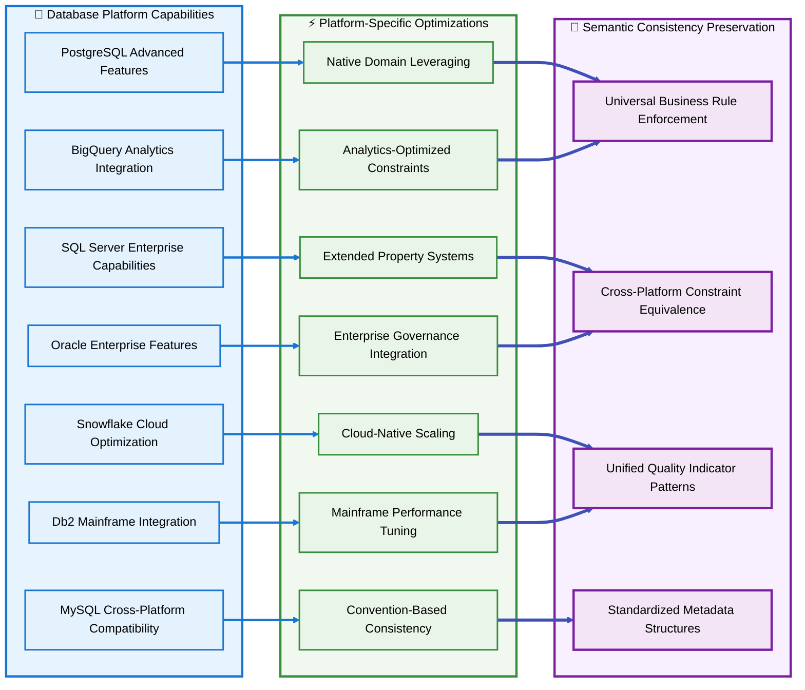

# Section 05: Cross-Platform Semantic Consistency

## Section Summary

### Section 05: Cross-Platform Semantic Consistency delivers:   
✅ Sub-section A: Universal FQD Compilation Patterns - Single source architecture with semantic parser, platform mapper, and constraint generator across all major database platforms  
✅ Sub-section B: Engine-Specific Implementation Guide - Detailed optimization strategies for PostgreSQL, SQL Server, Snowflake, MySQL, and BigQuery with platform-specific features and D4 integration  
✅ Sub-section C: FQTN (Fully Qualified Table Name) Conventions - Universal naming standards with platform-specific implementations and comprehensive governance framework  

### Key Technical Achievements  
- Universal Compilation Framework: Complete Business Domain Glossary (BDG) to multi-platform constraint generation with semantic equivalence preservation  
- Platform-Specific Optimizations: Detailed implementation patterns leveraging native capabilities while maintaining D4 consistency  
- Comprehensive FQTN Standards: Complete naming conventions across all platforms with governance, validation, and documentation frameworks  
- Three Detailed Mermaid Diagrams: Universal compilation architecture, platform optimization flow, and FQTN governance framework  

### Critical Cross-Platform Elements  
- Single Source Architecture: One BDG entry generates appropriate constraints for all target platforms  
- Platform Capability Mapping: Sophisticated handling of platform limitations through equivalent constraint patterns  
- Semantic Equivalence Testing: Validation framework ensuring identical business behavior across all databases   
- FQTN Consistency: Universal SchemaName.TableName patterns with platform-specific implementations  
- Migration Compatibility: Cross-platform utilities for moving between database systems while preserving D4 semantics  

> **Section 05 establishes the technical foundation for maintaining business rule consistency across heterogeneous database environments.**


[🏠 Home](section-01-table-of-contents--strategic-overview) | [📋 Table of Contents](section-01-table-of-contents--strategic-overview#table-of-contents) | [🔼 Back to TOC](#back-to-toc)

---

## A. Universal FQD Compilation Patterns

### Single Source, Multiple Target Architecture

D4 achieves cross-platform semantic consistency through a unified compilation framework where each Business Domain Glossary (BDG) entry generates appropriate constraints for every target database platform while preserving identical business meaning and enforcement behavior.

```mermaid
flowchart TB
    subgraph BDGSOURCE ["🎯    Business    Domain    Glossary    Source"]
        BDG1[Universal FQD Definition]
        BDG2[Business Rule Specification]
        BDG3[Default Value Assignment]
        BDG4[Governance Metadata]
    end
    
    subgraph COMPILER ["⚙️    Universal    FQD    Compiler"]
        COMP1[Semantic Parser]
        COMP2[Platform Capability Mapper]
        COMP3[Constraint Generator]
        COMP4[Validation Engine]
    end
    
    subgraph TARGETS ["🌐    Target    Database    Platforms"]
        TGT1[PostgreSQL Native Domains]
        TGT2[SQL Server Types + Constraints]
        TGT3[Snowflake Named Constraints]
        TGT4[MySQL Convention Patterns]
        TGT5[BigQuery Schema Validation]
        TGT6[Oracle Constraint Patterns]
        TGT7[Db2 Distinct Types]
    end
    
    subgraph VALIDATION ["✅    Cross-Platform    Validation"]
        VAL1[Semantic Equivalence Testing]
        VAL2[Constraint Behavior Verification]
        VAL3[Performance Impact Assessment]
        VAL4[Migration Compatibility Testing]
    end
    
    BDG1 --> COMP1
    BDG2 --> COMP2
    BDG3 --> COMP3
    BDG4 --> COMP4
    
    COMP1 --> TGT1
    COMP1 --> TGT2
    COMP2 --> TGT3
    COMP2 --> TGT4
    COMP3 --> TGT5
    COMP3 --> TGT6
    COMP4 --> TGT7
    
    TGT1 --> VAL1
    TGT2 --> VAL2
    TGT3 --> VAL3
    TGT4 --> VAL4
    TGT5 --> VAL1
    TGT6 --> VAL2
    TGT7 --> VAL3
    
    style BDGSOURCE fill:#f0fffe,stroke:#00695c,stroke-width:3px,color:#000
    style COMPILER fill:#f8f0ff,stroke:#7b1fa2,stroke-width:3px,color:#000
    style TARGETS fill:#e8f4fd,stroke:#1976d2,stroke-width:3px,color:#000
    style VALIDATION fill:#fff4e6,stroke:#f57c00,stroke-width:3px,color:#000
    
    linkStyle 0 stroke:#00695c,stroke-width:3px
    linkStyle 1 stroke:#00695c,stroke-width:3px
    linkStyle 2 stroke:#00695c,stroke-width:3px
    linkStyle 3 stroke:#00695c,stroke-width:3px
    
    linkStyle 4 stroke:#7b1fa2,stroke-width:3px
    linkStyle 5 stroke:#7b1fa2,stroke-width:3px
    linkStyle 6 stroke:#7b1fa2,stroke-width:3px
    linkStyle 7 stroke:#7b1fa2,stroke-width:3px
    linkStyle 8 stroke:#7b1fa2,stroke-width:3px
    linkStyle 9 stroke:#7b1fa2,stroke-width:3px
    linkStyle 10 stroke:#7b1fa2,stroke-width:3px
    
    linkStyle 11 stroke:#3f51b5,stroke-width:4px
    linkStyle 12 stroke:#3f51b5,stroke-width:4px
    linkStyle 13 stroke:#3f51b5,stroke-width:4px
    linkStyle 14 stroke:#3f51b5,stroke-width:4px
    linkStyle 15 stroke:#3f51b5,stroke-width:4px
    linkStyle 16 stroke:#3f51b5,stroke-width:4px
    linkStyle 17 stroke:#3f51b5,stroke-width:4px
    
    style BDG1 fill:#e0f2f1,stroke:#00695c,stroke-width:3px,color:#000
    style BDG2 fill:#e0f2f1,stroke:#00695c,stroke-width:2px,color:#000
    style BDG3 fill:#e0f2f1,stroke:#00695c,stroke-width:2px,color:#000
    style BDG4 fill:#e0f2f1,stroke:#00695c,stroke-width:2px,color:#000
    
    style COMP1 fill:#f3e5f5,stroke:#7b1fa2,stroke-width:2px,color:#000
    style COMP2 fill:#f3e5f5,stroke:#7b1fa2,stroke-width:2px,color:#000
    style COMP3 fill:#f3e5f5,stroke:#7b1fa2,stroke-width:2px,color:#000
    style COMP4 fill:#f3e5f5,stroke:#7b1fa2,stroke-width:2px,color:#000
    
    style TGT1 fill:#e3f2fd,stroke:#1976d2,stroke-width:2px,color:#000
    style TGT2 fill:#e3f2fd,stroke:#1976d2,stroke-width:2px,color:#000
    style TGT3 fill:#e3f2fd,stroke:#1976d2,stroke-width:2px,color:#000
    style TGT4 fill:#e3f2fd,stroke:#1976d2,stroke-width:2px,color:#000
    style TGT5 fill:#e3f2fd,stroke:#1976d2,stroke-width:2px,color:#000
    style TGT6 fill:#e3f2fd,stroke:#1976d2,stroke-width:2px,color:#000
    style TGT7 fill:#e3f2fd,stroke:#1976d2,stroke-width:2px,color:#000
    
    style VAL1 fill:#fff8e1,stroke:#f57c00,stroke-width:2px,color:#000
    style VAL2 fill:#fff8e1,stroke:#f57c00,stroke-width:2px,color:#000
    style VAL3 fill:#fff8e1,stroke:#f57c00,stroke-width:2px,color:#000
    style VAL4 fill:#fff8e1,stroke:#f57c00,stroke-width:2px,color:#000
```



### Universal FQD Compilation Framework

#### Semantic Parser Component

The semantic parser transforms Business Domain Glossary (BDG) entries into standardized semantic components that can be processed consistently across all target platforms.

**Parsing Structure**:
```json
{
  "fqd": {
    "schemaName": "Accounting",
    "domainName": "Amount",
    "businessDefinition": "Non-negative monetary amounts with standard currency precision",
    "dataTypeFamily": "DECIMAL",
    "precision": 12,
    "scale": 2,
    "defaultValue": "0.00",
    "constraints": [
      {
        "type": "CHECK",
        "predicate": "VALUE >= 0.00",
        "name": "NonNegative"
      },
      {
        "type": "NOT_NULL",
        "enforced": true
      }
    ],
    "qualityIndicator": {
      "flagName": "IsAmountMissing",
      "defaultMissingValue": true
    },
    "governance": {
      "owner": "Accounting Department",
      "steward": "CFO",
      "sensitivity": "Financial",
      "retentionYears": 7
    }
  }
}
```

#### Platform Capability Mapper

Maps semantic components to target platform capabilities, handling platform limitations through equivalent constraint patterns.

**Capability Matrix**:
```
PostgreSQL:
  - Native CREATE DOMAIN: YES
  - CHECK constraints in domain: YES
  - DEFAULT values in domain: YES
  - Comments on domain: YES

SQL Server:
  - Native CREATE DOMAIN: NO
  - CREATE TYPE alias: YES  
  - CHECK constraints on column: YES
  - DEFAULT constraints on column: YES
  - Extended properties: YES

Snowflake:
  - Native domains: NO
  - Named CHECK constraints: YES
  - Column DEFAULT: YES
  - Column COMMENT: YES
  - Schema-level organization: YES

MySQL:
  - Native domains: NO
  - CHECK constraints: YES (8.0.16+)
  - Column DEFAULT: YES
  - Column COMMENT: YES
  - Schema simulation: Convention-based

BigQuery:
  - Native domains: NO
  - CHECK constraints: LIMITED
  - Column DEFAULT: YES
  - Column description: YES (OPTIONS)
  - Validation: ETL/pipeline-based

Oracle:
  - Native CREATE DOMAIN: NO
  - CHECK constraints: YES
  - DEFAULT values: YES
  - Comments: YES
  - Distinct types: YES

Db2:
  - Native CREATE DOMAIN: NO
  - CREATE DISTINCT TYPE: YES
  - CHECK constraints: YES
  - DEFAULT values: YES
  - Comments: YES
```

#### Constraint Generator Patterns

Generates platform-specific constraint implementations while maintaining semantic equivalence.

**Pattern Templates**:

**PostgreSQL Pattern**:
```sql
-- Template: PostgreSQL Native Domain
CREATE SCHEMA IF NOT EXISTS {schemaName};

CREATE DOMAIN {schemaName}.{domainName}
AS {dataType}({precision},{scale})
DEFAULT {defaultValue}
CHECK ({predicate});

COMMENT ON DOMAIN {schemaName}.{domainName}
IS '{businessDefinition} | Owner: {owner} | Sensitivity: {sensitivity}';
```

**SQL Server Pattern**:
```sql
-- Template: SQL Server Type + Constraints
CREATE SCHEMA {schemaName};

CREATE TYPE {schemaName}.{domainName} FROM {dataType}({precision},{scale});

-- Usage pattern for any table column:
{columnName} {schemaName}.{domainName} NOT NULL
  CONSTRAINT DF_{schemaName}_{tableName}_{columnName} DEFAULT ({defaultValue})
  CONSTRAINT CHK_{schemaName}_{tableName}_{columnName}_{predicateName} CHECK ({predicate});
```

**Snowflake Pattern**:
```sql
-- Template: Snowflake Named Constraints
CREATE SCHEMA IF NOT EXISTS {schemaName};

-- Column implementation pattern:
{columnName} {dataType}({precision},{scale}) NOT NULL DEFAULT {defaultValue}
  CONSTRAINT CHK_{schemaName}_{tableName}_{columnName}_{predicateName} CHECK ({predicate});

-- Metadata attachment:
ALTER TABLE {schemaName}.{tableName}
  ALTER COLUMN {columnName} COMMENT = 'FQD: {schemaName}.{domainName} - {businessDefinition}';
```

### Cross-Platform FQD Example: Sales.CustomerID

#### Business Domain Glossary (BDG) Definition
```
SchemaName.DomainName: Sales.CustomerID

Business Definition: 
"Unique identifier for customers with positive integer values and referential integrity to master customer records."

Data Type Family: BIGINT

Default Value: 0

Constraint Predicate: VALUE > 0

Governance Metadata:
- Owner: Sales Department
- Steward: Sales Director  
- Sensitivity: Business
- Retention: 10 years
- Quality Indicator: IsCustomerIdMissing flag
- Foreign Key: References Master.Customer(CustomerId)
```

#### Universal Compilation Results

**PostgreSQL Implementation**:
```sql
CREATE SCHEMA IF NOT EXISTS Sales;

CREATE DOMAIN Sales.CustomerID
AS BIGINT
DEFAULT 0
CHECK (VALUE > 0);

COMMENT ON DOMAIN Sales.CustomerID
IS 'Unique customer identifier | Owner: Sales Department | Sensitivity: Business';

-- Usage in table
CREATE TABLE Sales.Order (
  OrderId BIGSERIAL,
  CustomerId Sales.CustomerID NOT NULL,
  IsCustomerIdMissing BOOLEAN NOT NULL DEFAULT FALSE,
  CONSTRAINT PK_Sales_Order PRIMARY KEY (OrderId),
  CONSTRAINT FK_Sales_Order_CustomerId FOREIGN KEY (CustomerId) REFERENCES Master.Customer(CustomerId)
);
```

**SQL Server Implementation**:
```sql
CREATE SCHEMA Sales;

CREATE TYPE Sales.CustomerID FROM BIGINT;

CREATE TABLE Sales.Order (
  OrderId BIGINT IDENTITY(1,1),
  CustomerId Sales.CustomerID NOT NULL
    CONSTRAINT DF_Sales_Order_CustomerId DEFAULT (0)
    CONSTRAINT CHK_Sales_Order_CustomerId_Positive CHECK (CustomerId > 0),
  IsCustomerIdMissing BIT NOT NULL DEFAULT 0,
  CONSTRAINT PK_Sales_Order PRIMARY KEY (OrderId),
  CONSTRAINT FK_Sales_Order_CustomerId FOREIGN KEY (CustomerId) REFERENCES Master.Customer(CustomerId)
);

EXEC sys.sp_addextendedproperty
  @name = N'MS_Description',
  @value = N'FQD: Sales.CustomerID - Unique customer identifier | Owner: Sales Department',
  @level0type = N'SCHEMA', @level0name = N'Sales',
  @level1type = N'TABLE', @level1name = N'Order',
  @level2type = N'COLUMN', @level2name = N'CustomerId';
```

**Snowflake Implementation**:
```sql
CREATE SCHEMA IF NOT EXISTS Sales;

CREATE TABLE Sales.Order (
  OrderId NUMBER(38,0) IDENTITY(1,1),
  CustomerId BIGINT NOT NULL DEFAULT 0
    CONSTRAINT CHK_Sales_Order_CustomerId_Positive CHECK (CustomerId > 0),
  IsCustomerIdMissing BOOLEAN NOT NULL DEFAULT FALSE,
  CONSTRAINT PK_Sales_Order PRIMARY KEY (OrderId),
  CONSTRAINT FK_Sales_Order_CustomerId FOREIGN KEY (CustomerId) REFERENCES Master.Customer(CustomerId)
);

ALTER TABLE Sales.Order
  ALTER COLUMN CustomerId COMMENT = 'FQD: Sales.CustomerID - Unique customer identifier | Owner: Sales Department';
```

**MySQL Implementation**:
```sql
CREATE DATABASE IF NOT EXISTS Enterprise;

CREATE TABLE Enterprise.Sales_Order (
  OrderId BIGINT NOT NULL AUTO_INCREMENT,
  CustomerId BIGINT NOT NULL DEFAULT 0,
  IsCustomerIdMissing BOOLEAN NOT NULL DEFAULT TRUE,
  PRIMARY KEY (OrderId),
  CONSTRAINT CHK_Sales_Order_CustomerId_Positive CHECK (CustomerId > 0),
  CONSTRAINT FK_Sales_Order_CustomerId FOREIGN KEY (CustomerId) REFERENCES Enterprise.Master_Customer(CustomerId)
) COMMENT='FQD: Sales.CustomerID - Unique customer identifier | Owner: Sales Department';
```

---

## B. Engine-Specific Implementation Guide

### Platform-Specific Optimization Strategies

Each database platform offers unique capabilities that can be leveraged to optimize D4 implementation while maintaining semantic consistency across the enterprise ecosystem.



### PostgreSQL Advanced Implementation

#### Native Domain Advantages

PostgreSQL's native CREATE DOMAIN support provides the most direct implementation of D4 FQD concepts, enabling sophisticated constraint patterns and inheritance behaviors.

**Advanced Domain Features**:
```sql
-- Schema with comprehensive domain definitions
CREATE SCHEMA IF NOT EXISTS Finance;

-- Complex domain with multiple constraints
CREATE DOMAIN Finance.AccountingPeriod
AS DATE
DEFAULT CURRENT_DATE
CHECK (VALUE >= '2020-01-01')
CHECK (EXTRACT(DAY FROM VALUE) = 1); -- First day of month only

-- Domain with custom validation function
CREATE OR REPLACE FUNCTION Finance.ValidateTaxRate(rate NUMERIC)
RETURNS BOOLEAN AS $$
BEGIN
  RETURN (rate >= 0.0000 AND rate <= 1.0000 AND 
          ROUND(rate, 4) = rate); -- Exactly 4 decimal places
END;
$$ LANGUAGE plpgsql;

CREATE DOMAIN Finance.TaxRate
AS NUMERIC(5,4)
DEFAULT 0.0000
CHECK (Finance.ValidateTaxRate(VALUE));

-- Domain inheritance and reuse
CREATE TABLE Finance.Invoice (
  InvoiceId BIGSERIAL,
  InvoiceDate Finance.AccountingPeriod NOT NULL,
  TaxRate Finance.TaxRate NOT NULL,
  IsInvoiceDateMissing BOOLEAN NOT NULL DEFAULT FALSE,
  IsTaxRateMissing BOOLEAN NOT NULL DEFAULT FALSE,
  CONSTRAINT PK_Finance_Invoice PRIMARY KEY (InvoiceId)
);

-- Automatic domain constraint inheritance
CREATE TABLE Finance.Payment (
  PaymentId BIGSERIAL,
  PaymentDate Finance.AccountingPeriod NOT NULL, -- Inherits all constraints
  TaxRate Finance.TaxRate NOT NULL,              -- Inherits validation
  CONSTRAINT PK_Finance_Payment PRIMARY KEY (PaymentId)
);
```

#### PostgreSQL-Specific Optimization Features

**Constraint Exclusion with Domains**:
```sql
-- Partitioned table using domain constraints for performance
CREATE TABLE Finance.TransactionHistory (
  TransactionId BIGSERIAL,
  TransactionDate Finance.AccountingPeriod NOT NULL,
  Amount Finance.Amount NOT NULL
) PARTITION BY RANGE (TransactionDate);

-- Partitions automatically inherit domain constraints
CREATE TABLE Finance.TransactionHistory_2024 
PARTITION OF Finance.TransactionHistory
FOR VALUES FROM ('2024-01-01') TO ('2025-01-01');

-- Domain constraints enable partition pruning
```

**Row Level Security with Domains**:
```sql
-- Domain-aware security policies
CREATE POLICY Finance_Invoice_AccessPolicy ON Finance.Invoice
FOR ALL TO finance_users
USING (
  -- Security based on domain values
  InvoiceDate >= CURRENT_DATE - INTERVAL '2 years' AND
  TaxRate <= 0.1000 -- High tax rates restricted
);

ALTER TABLE Finance.Invoice ENABLE ROW LEVEL SECURITY;
```

### SQL Server Enterprise Implementation

#### Extended Properties Integration

SQL Server's extended properties system provides comprehensive metadata storage for D4 governance requirements.

**Extended Property Framework**:
```sql
-- Schema with extended properties for governance
CREATE SCHEMA Compliance;

CREATE TYPE Compliance.RetentionPeriod FROM INT;

CREATE TABLE Compliance.Document (
  DocumentId BIGINT IDENTITY(1,1),
  RetentionYears Compliance.RetentionPeriod NOT NULL
    CONSTRAINT DF_Compliance_Document_RetentionYears DEFAULT (7)
    CONSTRAINT CHK_Compliance_Document_RetentionYears_Valid CHECK (RetentionYears BETWEEN 1 AND 50),
  CONSTRAINT PK_Compliance_Document PRIMARY KEY (DocumentId)
);

-- Comprehensive metadata through extended properties
EXEC sys.sp_addextendedproperty
  @name = N'FQD_Definition',
  @value = N'Compliance.RetentionPeriod',
  @level0type = N'SCHEMA', @level0name = N'Compliance',
  @level1type = N'TABLE', @level1name = N'Document',
  @level2type = N'COLUMN', @level2name = N'RetentionYears';

EXEC sys.sp_addextendedproperty
  @name = N'Business_Owner',
  @value = N'Compliance Department',
  @level0type = N'SCHEMA', @level0name = N'Compliance',
  @level1type = N'TABLE', @level1name = N'Document',
  @level2type = N'COLUMN', @level2name = N'RetentionYears';

EXEC sys.sp_addextendedproperty
  @name = N'Data_Steward',
  @value = N'Chief Compliance Officer',
  @level0type = N'SCHEMA', @level0name = N'Compliance',
  @level1type = N'TABLE', @level1name = N'Document',
  @level2type = N'COLUMN', @level2name = N'RetentionYears';

EXEC sys.sp_addextendedproperty
  @name = N'Sensitivity_Level',
  @value = N'Regulatory',
  @level0type = N'SCHEMA', @level0name = N'Compliance',
  @level1type = N'TABLE', @level1name = N'Document',
  @level2type = N'COLUMN', @level2name = N'RetentionYears';
```

#### Temporal Tables with D4 Integration

```sql
-- D4-compliant temporal table implementation
CREATE TABLE HR.Employee (
  EmployeeId BIGINT IDENTITY(1,1),
  EmployeeStatus VARCHAR(20) NOT NULL
    CONSTRAINT DF_HR_Employee_EmployeeStatus DEFAULT ('Active')
    CONSTRAINT CHK_HR_Employee_EmployeeStatus_Valid CHECK (
      EmployeeStatus IN ('Active', 'Inactive', 'Terminated')
    ),
  IsEmployeeStatusMissing BIT NOT NULL DEFAULT 0,
  
  -- Temporal columns required for SQL Server temporal tables
  SysStartTime DATETIME2 GENERATED ALWAYS AS ROW START HIDDEN,
  SysEndTime DATETIME2 GENERATED ALWAYS AS ROW END HIDDEN,
  PERIOD FOR SYSTEM_TIME (SysStartTime, SysEndTime),
  
  CONSTRAINT PK_HR_Employee PRIMARY KEY (EmployeeId)
) WITH (SYSTEM_VERSIONING = ON (HISTORY_TABLE = HR.EmployeeHistory));
```

### Snowflake Cloud-Native Implementation

#### Zero-Copy Cloning with D4 Constraints

Snowflake's zero-copy cloning preserves D4 constraint structures across environments.

```sql
-- Production schema with D4 constraints
CREATE SCHEMA Production.Sales;

CREATE TABLE Production.Sales.Customer (
  CustomerId NUMBER(38,0) IDENTITY(1,1),
  CustomerType VARCHAR(20) NOT NULL DEFAULT 'Individual'
    CONSTRAINT CHK_Production_Sales_Customer_CustomerType_Valid CHECK (
      CustomerType IN ('Individual', 'Business', 'Government', 'NonProfit')
    ),
  CreditLimit NUMBER(12,2) NOT NULL DEFAULT 0.00
    CONSTRAINT CHK_Production_Sales_Customer_CreditLimit_NonNegative CHECK (CreditLimit >= 0.00),
  CONSTRAINT PK_Production_Sales_Customer PRIMARY KEY (CustomerId)
);

-- Zero-copy clone preserves all D4 constraints
CREATE SCHEMA Development CLONE Production;

-- All constraints automatically preserved in development environment
-- Enables safe testing of D4 constraint modifications
```

#### Time Travel with D4 Quality Indicators

```sql
-- Query historical data quality using Snowflake time travel
SELECT 
  CustomerId,
  CustomerType,
  CreditLimit,
  -- D4 quality indicators preserved in time travel
  IsCustomerTypeMissing,
  IsCreditLimitMissing
FROM Production.Sales.Customer 
AT (TIMESTAMP => '2024-01-01 00:00:00')
WHERE IsCustomerTypeMissing = FALSE 
  AND IsCreditLimitMissing = FALSE;

-- Analyze quality improvement over time
SELECT 
  DATE_TRUNC('MONTH', TO_TIMESTAMP_NTZ(CURRENT_TIMESTAMP)) AS Month,
  COUNT(*) AS TotalRecords,
  COUNT(CASE WHEN IsCustomerTypeMissing = FALSE THEN 1 END) AS CompleteCustomerType,
  COUNT(CASE WHEN IsCreditLimitMissing = FALSE THEN 1 END) AS CompleteCreditLimit
FROM Production.Sales.Customer 
AT (TIMESTAMP => DATEADD(MONTH, -6, CURRENT_TIMESTAMP()))
GROUP BY DATE_TRUNC('MONTH', TO_TIMESTAMP_NTZ(CURRENT_TIMESTAMP))
ORDER BY Month;
```

### MySQL Convention-Based Implementation

#### D4 Standards with Cross-Platform Compatibility

MySQL implementation focuses on portability and convention-based consistency that can be easily migrated to other platforms.

```sql
-- Database setup following D4 conventions
CREATE DATABASE IF NOT EXISTS Enterprise;

-- Convention-based schema simulation
CREATE TABLE Enterprise.Sales_Customer (
  CustomerId BIGINT NOT NULL AUTO_INCREMENT,
  CustomerName VARCHAR(100) NOT NULL DEFAULT 'Unknown Customer',
  IsCustomerNameMissing BOOLEAN NOT NULL DEFAULT TRUE,
  
  CustomerType VARCHAR(20) NOT NULL DEFAULT 'Individual',
  IsCustomerTypeMissing BOOLEAN NOT NULL DEFAULT FALSE,
  
  Email VARCHAR(255) NOT NULL DEFAULT 'unknown@company.com',
  IsEmailMissing BOOLEAN NOT NULL DEFAULT TRUE,
  
  CreatedDate TIMESTAMP NOT NULL DEFAULT CURRENT_TIMESTAMP,
  ModifiedDate TIMESTAMP NOT NULL DEFAULT CURRENT_TIMESTAMP ON UPDATE CURRENT_TIMESTAMP,
  
  PRIMARY KEY (CustomerId),
  
  -- D4 constraint patterns
  CONSTRAINT CHK_Sales_Customer_CustomerName_NotEmpty CHECK (CHAR_LENGTH(TRIM(CustomerName)) > 0),
  CONSTRAINT CHK_Sales_Customer_CustomerType_Valid CHECK (
    CustomerType IN ('Individual', 'Business', 'Government', 'NonProfit')
  ),
  CONSTRAINT CHK_Sales_Customer_Email_Format CHECK (
    Email REGEXP '^[A-Za-z0-9._%+-]+@[A-Za-z0-9.-]+\.[A-Za-z]{2,}$'
  ),
  
  -- Quality management indexes for performance
  INDEX IDX_Sales_Customer_QualityFlags (IsCustomerNameMissing, IsEmailMissing)
  
) ENGINE=InnoDB 
  COMMENT='FQD Implementation: Sales.Customer with D4 quality indicators and constraints';

-- Trigger for automated quality flag management
DELIMITER //
CREATE TRIGGER TR_Sales_Customer_QualityManagement
  BEFORE INSERT ON Enterprise.Sales_Customer
  FOR EACH ROW
BEGIN
  -- Automatically manage quality flags based on values
  IF NEW.CustomerName != 'Unknown Customer' THEN
    SET NEW.IsCustomerNameMissing = FALSE;
  END IF
