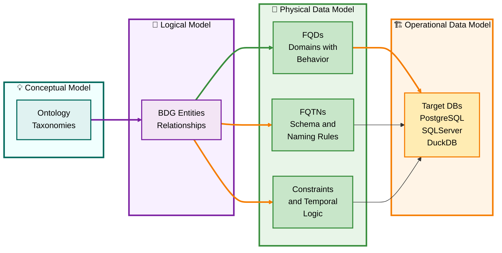
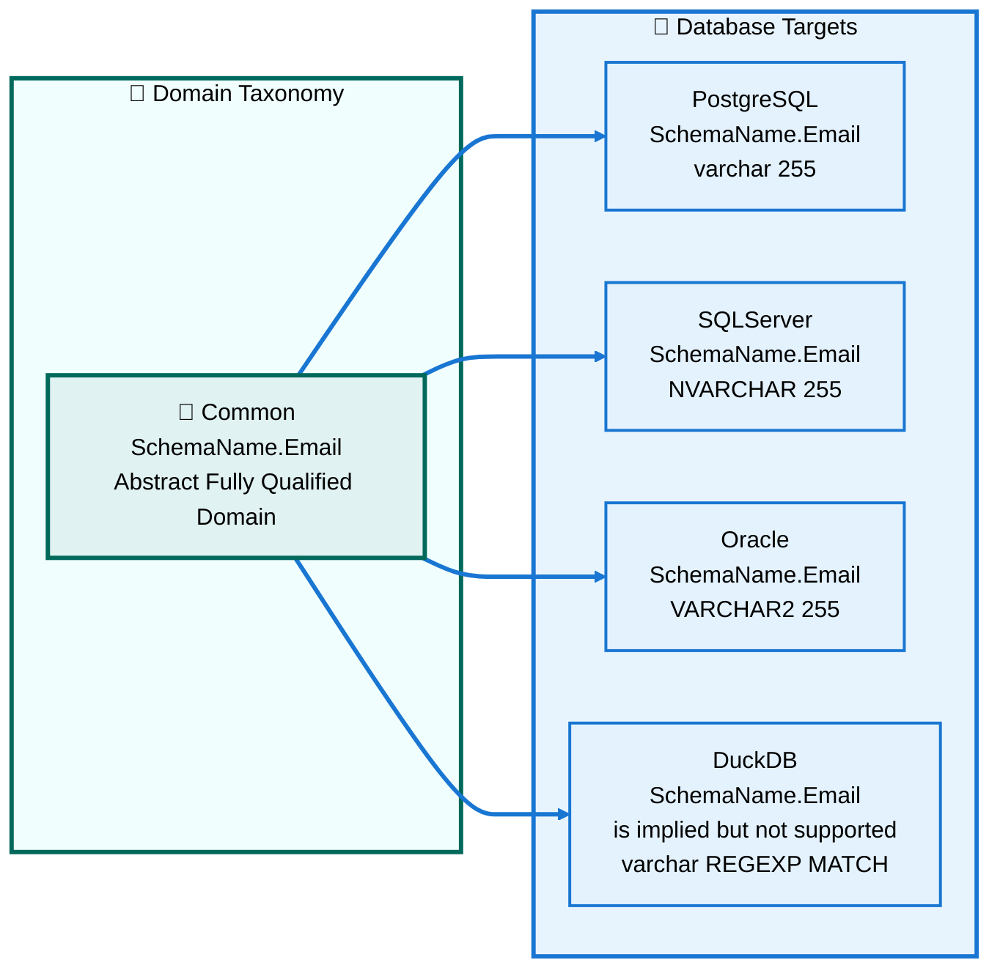

# 🧭 **D⁴TKG: D⁴ Domain-Driven Database Design (FQDs) + Taxonomies + Knowledge Graphs — Turning Text into Governance**
---

# 🧭 **D⁴TKG Framework**

### *D⁴ Domain-Driven Database Design (FQDs) + Taxonomies + Knowledge Graphs*

### **Turning Text into Governance**

---

## 📑 **Table of Contents**

1. [🔹 Executive Overview](#-executive-overview)
2. [📚 Section 1 | Semantic Source and Terminology](#-section1--semantic-source-and-terminology)
3. [🧱 Section 2A | The PDM as Execution Layer of Governance](#-section2a--the-pdm-as-execution-layer-of-governance)
4. [⚙️ Section 3 | Governance Enforcement Depth](#-section3--governance-enforcement-depth)
5. [🔗 Section 4 | Synergy with Microsoft Purview (Comparative)](#-section4--synergy-with-microsoft-purview-comparative)
6. [🌐 Section 5 | D⁴TKG Relationships (CDM→LDM→PDM→ODM)](#-section5--d⁴tkg-relationships-cdmlmdpdm-odm)
7. [🧩 Section 6 | Mermaid Diagram — D⁴TKG Data Governance Flow](#-section6--mermaid-diagram--d⁴tkg-data-governance-flow)
8. [📘 Summary Insights](#-summary-insights)
9. [🔙 Back to TOC](#-table-of-contents)

---

## 🔹 **Executive Overview**

**D⁴TKG** integrates three historically separate disciplines into a single, executable governance architecture:

* **D⁴ Domain-Driven Database Design (FQDs + FQTNs):**
  Physical-model governance through schema-qualified, reusable domains that enforce business semantics directly in the database engine.

* **Taxonomies (Bill Inmon – *Turning Text into Gold*):**
  Hierarchical classification systems that extract meaning from text and transform unstructured language into structured knowledge.

* **Knowledge Graphs:**
  Semantic relationship networks linking FQDs, tables, and glossary concepts across heterogeneous systems.

Together they **turn text into governance**—bridging **language → taxonomy → domain → executable schema → governed data products**.

---

## 📚 **Section 1 | Semantic Source and Terminology**

| Concept                              | **D⁴ TKG Definition**                                                                                                                                  | **Microsoft Purview Definition**                        | Key Difference                                                  |
| ------------------------------------ | ------------------------------------------------------------------------------------------------------------------------------------------------------ | ------------------------------------------------------- | --------------------------------------------------------------- |
| **FQD (Fully Qualified Domain)**     | ANSI SQL 1999 domain: schema-qualified, reusable data type encapsulating defaults + check logic; generated from the BDG rather than raw SQL datatypes. | No equivalent; Purview stores a glossary term only.     | D⁴ governs *in* the schema; Purview governs *about* the schema. |
| **FQTN (Fully Qualified TableName)** | Schema-qualified physical table name (e.g., `Sales.OrderHeader`), derived from BDG hierarchy.                                                          | Metadata entry in catalog lineage.                      | D⁴ enforces naming discipline and traceability.                 |
| **BDG (Business Domain Glossary)**   | Canonical semantic dictionary driving FQD/FQTN generation; links taxonomy terms to data structures.                                                    | Business glossary = manual tag repository.              | BDG *generates* structure; Purview *documents* it.              |
| **Domain**                           | *Technical domain* = ANSI SQL Domain with behavior.                                                                                                    | *Business domain* = organizational topic (Finance, HR). | Homonym—same word, different meaning.                           |
| **Data Product**                     | Logical bundle of FQDN-linked entities for reuse.                                                                                                      | Curated set of assets in a business domain.             | Purview’s object = inventory; D⁴’s = governed artifact.         |

> **D⁴ governs semantics through execution.**
> **Purview catalogs semantics through metadata.**

---

## 🧱 **Section 2A | The PDM as Execution Layer of Governance**

### *Where Fully Qualified Domains (FQDs) and Fully Qualified TableNames (FQTNs) Come to Life*

Only the **Physical Data Model (PDM)** expresses **executable behavior**.
CDM and LDM describe intent; **PDM executes it** via DDL.

| Layer   | Role                               | Behavior Expression                    | Artifact                                     |
| ------- | ---------------------------------- | -------------------------------------- | -------------------------------------------- |
| **CDM** | Defines ontology/taxonomy concepts | None (abstract)                        | Conceptual models                            |
| **LDM** | Describes structure/relationships  | Descriptive only                       | Logical ERDs                                 |
| **PDM** | Defines *how* objects behave       | ✅ Constraints, domains, temporal logic | DDL + Schema                                 |
| **ODM** | Instantiates PDM in targets        | ✅ Runtime enforcement                  | Actual DBs (PostgreSQL, SQL Server, DuckDB…) |

### **D⁴ Technical Domain ≠ DAMA Business Domain**

| Framework        | Meaning of “Domain”                                | Behavior       | Scope                                     |
| ---------------- | -------------------------------------------------- | -------------- | ----------------------------------------- |
| **DAMA/Purview** | Business area (ownership)                          | Descriptive    | Organizational                            |
| **D⁴ TKG**       | ANSI SQL Domain (FQD) = typed object with behavior | **Executable** | Horizontal reuse across heterogeneous DBs |

> In D⁴, *Domain = Type with Behavior*, not *Department of Ownership*.

### **Flow from Concept to Execution**

**Interpretation :**
All design layers culminate in the PDM; the ODM is its executed form.

### **Key Takeaways**

* PDM = Execution boundary of D⁴ TKG.
* FQDs and FQTNs exist meaningfully only from PDM → ODM.
* CDM/LDM cannot enforce behavior.
* Confusing technical vs business domains creates false governance confidence.
* D⁴ makes governance *executable*, not descriptive.

[🔙 Back to TOC](#-table-of-contents)

---

## ⚙️ **Section 3 | Governance Enforcement Depth**

| Dimension               | **D⁴ TKG**                                              | **Microsoft Purview**                                |
| ----------------------- | ------------------------------------------------------- | ---------------------------------------------------- |
| **Design-Time Control** | Naming standards, FQDs, temporal rules embedded in DDL. | Registers assets post-creation only.                 |
| **Run-Time Validation** | Constraints executed by DB engine (+ app logic).        | Policy-driven metadata access only.                  |
| **Change Mgmt**         | Versioned domains + impact analysis.                    | Tracks metadata object changes only.                 |
| **Temporal Governance** | Allen Interval Algebra for bitemporal consistency.      | Retention metadata only.                             |
| **Outcome**             | **Executable Governance → Schema enforces truth**       | **Descriptive Governance → Catalog documents truth** |

[🔙 Back to TOC](#-table-of-contents)

---

## 🔗 **Section 4 | Synergy with Microsoft Purview (Comparative)**

| Capability                 | **D⁴ TKG**                                          | **Microsoft Purview**                    |
| -------------------------- | --------------------------------------------------- | ---------------------------------------- |
| **Core Role**              | Executes governance at schema level.                | Catalogs and manages metadata.           |
| **Semantic Source**        | BDG + Taxonomies → FQDs/FQTNs.                      | Glossary + Domains + Data Products.      |
| **Relationships**          | Knowledge Graph links heterogeneous FQDN tables.    | Lineage shows ETL flow within Azure.     |
| **Governance Enforcement** | Schema + logic driven.                              | Policy + role access driven.             |
| **Integration Scope**      | Heterogeneous DBs (PostgreSQL, SQL Server, DuckDB). | Primarily Azure ecosystem.               |
| **Best Use**               | Architect data truth and reusability.               | Manage metadata + compliance visibility. |

> **D⁴TKG = Executable Semantics.**
> **Purview = Observable Metadata.**

[🔙 Back to TOC](#-table-of-contents)

---

## 🌐 **Section 5 | D⁴TKG Relationships (CDM→LDM→PDM→ODM)**

**Interpretation :**
A single abstract FQD can manifest as multiple physical types while retaining identical business semantics.

[🔙 Back to TOC](#-table-of-contents)

---

## 🧩 **Section 6 | Mermaid Diagram — D⁴TKG Data Governance Flow**

```mermaid
flowchart LR
    subgraph INPUT ["📥 Textual Ingestion Layer"]
        A1["📰 Raw Documents"]
        A2["💬 Business Notes"]
        A3["📄 Records"]
    end
    
    subgraph TAXONOMY ["🔷 Taxonomy BDG Alignment"]
        B1["🧭 Taxonomy Terms"]
        B2["📖 BDG Concepts"]
    end
    
    subgraph D4CORE ["🧠 D4 FQD Engineering"]
        C1["🧩 Map BDG to FQDs"]
        C2["🧱 Schema and Constraints"]
        C3["⏱ Temporal Rules"]
    end
    
    subgraph KG ["🌐 Knowledge Graph"]
        D1["🔗 Semantic Relationships"]
        D2["🕸 Cross-Domain Links"]
    end
    
    subgraph OUTPUT ["📤 Governance Delivery"]
        E1["📊 Certified Data Products"]
        E2["🏛 Policy and Lineage"]
    end
    
    A1-->B1
    A2-->B1
    A3-->B1
    B1-->B2
    B2-->C1
    C1-->C2
    C2-->C3
    C3-->D1
    D1-->D2
    D2-->E1
    E1-->E2
    
    style INPUT fill:#e8f4fd,stroke:#1976d2,stroke-width:3px,color:#000
    style TAXONOMY fill:#f0fffe,stroke:#00695c,stroke-width:3px,color:#000
    style D4CORE fill:#f8f0ff,stroke:#7b1fa2,stroke-width:3px,color:#000
    style KG fill:#e8f5e8,stroke:#388e3c,stroke-width:3px,color:#000
    style OUTPUT fill:#fff4e6,stroke:#f57c00,stroke-width:3px,color:#000
    
    style A1 fill:#bbdefb,stroke:#1976d2,stroke-width:2px,color:#000
    style A2 fill:#bbdefb,stroke:#1976d2,stroke-width:2px,color:#000
    style A3 fill:#bbdefb,stroke:#1976d2,stroke-width:2px,color:#000
    style B1 fill:#e0f2f1,stroke:#00695c,stroke-width:2px,color:#000
    style B2 fill:#e0f2f1,stroke:#00695c,stroke-width:2px,color:#000
    style C1 fill:#f3e5f5,stroke:#7b1fa2,stroke-width:2px,color:#000
    style C2 fill:#f3e5f5,stroke:#7b1fa2,stroke-width:2px,color:#000
    style C3 fill:#f3e5f5,stroke:#7b1fa2,stroke-width:2px,color:#000
    style D1 fill:#c8e6c9,stroke:#388e3c,stroke-width:2px,color:#000
    style D2 fill:#c8e6c9,stroke:#388e3c,stroke-width:2px,color:#000
    style E1 fill:#ffecb3,stroke:#f57c00,stroke-width:2px,color:#000
    style E2 fill:#ffecb3,stroke:#f57c00,stroke-width:2px,color:#000
    
    linkStyle 0,1,2 stroke:#00695c,stroke-width:2px
    linkStyle 3 stroke:#00695c,stroke-width:3px
    linkStyle 4,5,6 stroke:#7b1fa2,stroke-width:3px
    linkStyle 7,8 stroke:#388e3c,stroke-width:3px
    linkStyle 9,10 stroke:#f57c00,stroke-width:3px

```

**Flow Explanation:**
1️⃣ Text → Taxonomy → BDG.
2️⃣ BDG → FQDs → Schema (FQTN).
3️⃣ Schema → Knowledge Graph → Governed Output.

[🔙 Back to TOC](#-table-of-contents)

---

## 📘 **Summary Insights**

* **D⁴TKG** transforms *textual knowledge into executable data governance.*
* **FQDs/FQTNs** enforce meaning at the physical level across heterogeneous databases.
* **Taxonomies + Knowledge Graphs** preserve context and traceability back to business semantics.
* **PDM** is the true seat of power—where governance becomes *real*.
* **Microsoft Purview** complements this by cataloging lineage and policy, but without execution.
* **Together**, they complete the governance spectrum:

  * *Inmon’s textual semantics → D⁴’s physical semantics → Purview’s visibility.*

---

### 🧭 **In Summary**

> **D⁴TKG = Turning Text into Governance Through Executable Domains.**
> *From Taxonomy to Table — Semantics Enforced, Not Just Described.*

[🔙 Back to TOC](#-table-of-contents)

