# 🧩 **The Meta-Modeling Renaissance**

### *How D⁴ Bridges Elicitation, Governance, and Execution in the Age of AI*

**Author:** Peter Heller  
**Affiliation:** Adjunct Lecturer, Department of Computer Science, Queens College (CUNY)  
**Email:** [Me@MindOverMetadata.com](mailto:Me@MindOverMetadata.com)  
**Version:** 1.0  
**Date:** October 2025  
**License:** © 2025 Peter Heller — Creative Commons CC BY-SA 4.0  
---

## **Synopsis:**
1. **This white paper introduces the **Meta-Modeling Renaissance**, an evolution of data architecture enabled by **D⁴ Domain-Driven Database Design**. Instead of treating requirements, data models, and governance as disconnected steps, D⁴ unifies them into a single semantic continuum built upon **Business Glossary Domains (BGDs)**, **Fully Qualified Domain Names (FQDNs)**, and **Fully Qualified Table Names (FQTNs)**. By treating elicitation as *machine teaching*, organizations capture meaning once and propagate it consistently into database schemas, data validation, operational systems, and analytics platforms — with governance enforced as part of design rather than after-the-fact inspection.**    

1. **The approach results in **living, executable data governance**: domain rules become reusable, schemas become self-consistent across heterogeneous database engines, and the metadata repository becomes a continuously improving institutional memory. This creates a scalable, semantically aligned foundation for AI, automation, regulatory compliance, and cross-platform architecture — turning data strategy into a measurable, self-reinforcing execution system rather than a collection of documents or static diagrams.**  

---

## 🧾 **Abstract**

In *“A List of Use Cases Is Not a Strategy,”* Julia Bardmesser emphasizes that data strategy must be anchored in business outcomes — not in collections of unconnected use cases.
**D⁴ — Domain-Driven Database Design** provides the structural framework that makes this possible by aligning:

* **Business Glossary Domains (BGDs)** for meaning
* **Fully Qualified Domain Names (FQDNs)** for reusable behavioral enforcement
* **Fully Qualified Table Names (FQTNs)** for governed schema instantiation

The result is a **Meta-Modeling Renaissance** — a shift from static documentation to living, executable governance.

---

## 🗂 **Table of Contents**

1. **Executive Context**
2. **From Sequential to Convergent Thinking**
3. **The Meta-Modeling Renaissance**
4. **Elicitation as Machine Teaching**
5. **From Representation to Execution**
6. **Semantic–Structural Symbiosis — The BGD–FQDN–FQTN Triad**
7. **Governance Convergence and the Living Roadmap**
8. **Impact on the Data Community**
9. **Strategic Implications for Bardmesser’s Vision**
10. **From Modeling to Meta-Modeling**
11. **Conclusion**

---

## 1. **Executive Context** 🔍

Organizations often chase data use cases without establishing shared meaning or reusable structures.
This leads to:

* Fragmented semantics
* Duplicated logic
* Unscalable architecture

D⁴ addresses this by tethering modeling, governance, and execution to shared semantics defined only once.

---

## 2. **From Sequential to Convergent Thinking** 🔁

| Old Model                                 | D⁴ Model                                                    |
| ----------------------------------------- | ----------------------------------------------------------- |
| Business → Analyst → Architect → Engineer | Business, Architect, AI & Metadata work in co-creation loop |
| Sequential interpretation                 | Iterative elicitation + refinement                          |
| Knowledge stored in documents             | Knowledge embedded in executable metadata                   |

D⁴ collapses the separation between *design* and *execution.*

---

## 3. **The Meta-Modeling Renaissance** 🎨

Traditional modeling treats diagrams as artifacts.

D⁴ treats **metadata as the system’s memory**, and the modeling process as a form of *machine teaching*.

This reframes:

* **Meta-Modeling → Teaching semantics**
* **Governance → Enforcing meaning**
* **Execution → Provenance and validation**

This is the return of modeling as **strategic infrastructure**.

---

## 4. **Elicitation as Machine Teaching** 🎤

The corrected activity transformation table:

| Activity               | Old Outcome             | **D⁴ Outcome**                                               |
| ---------------------- | ----------------------- | ------------------------------------------------------------ |
| Requirements gathering | Word documents          | **Business Glossary Domains (BGDs) + initial FQDN patterns** |
| Data modeling          | ER diagrams             | **Physical Data Model (PDM) templates derived from domains** |
| Governance             | Stewardship policy PDFs | **Governance-as-Code (constraints, lineage, validation)**    |

This anchors model-building in business language that remains **machine-enforceable.**

---

## 5. **From Representation to Execution** 🔧

The shift is from **describing systems** to **constructing systems that enforce meaning.**

* **Business Glossary Domain (BGD)** → Defines meaning
* **Fully Qualified Domain Name (FQDN)** → Defines allowed behavior
* **Fully Qualified Table Name (FQTN)** → Applies domains consistently in schema

This produces predictable, scalable database designs across engines.

*(Diagram appears in Part II — Figure 1)*

---

## 6. **Semantic–Structural Symbiosis — The BGD–FQDN–FQTN Triad** 🔗

The triad maintains consistency across systems:

| Layer | Purpose                         | Dependency              |
| ----- | ------------------------------- | ----------------------- |
| BGD   | Semantic foundation             | Guides FQDN definitions |
| FQDN  | Behavioral constraints          | Embedded within FQTNs   |
| FQTN  | Structural schema instantiation | Constrained by FQDNs    |

*(Diagram appears in Part II — Triad Loop)*

---

## 7. **Governance Convergence and the Living Roadmap** 🧭

Governance becomes a **living, self-correcting system**:

* Metadata tracks usage
* Lineage detects drift
* Constraint failures feed refinement
* Templates evolve with operational truth

*(Diagram appears in Part II — Figure 2)*

---

## 8. **Impact on the Data Community** 👥

| Role               | New Function with D⁴                 |
| ------------------ | ------------------------------------ |
| Business Analyst   | Domain Elicitor (semantic discovery) |
| Data Architect     | Meta-Model Designer and Steward      |
| Data Steward       | Validator of Governance-as-Code      |
| Chief Data Officer | Orchestrator of semantic coherence   |

This enables **strategy → governance → execution** flow without translation loss.

---

## 9. **Strategic Implications for Bardmesser’s Vision** 🎯

D⁴ makes strategy **measurable** and **enforceable**:

* Business intent aligns directly to schema-level reality
* Use-case prioritization builds reusable capability incrementally
* The organization learns structurally over time

---

## 10. **From Modeling to Meta-Modeling** 🧠

Modeling stops being drawing.
Modeling becomes **teaching the system how to think about data.**

The metadata repository becomes the **memory of the business.**

---

## 11. **Conclusion** 🌱

> **D⁴ brings the data community full circle —**
> from static models
> to living, governed execution
> grounded in **Fully Qualified Domain-Driven Taxonomy Intelligence.**

---

## **Part II — Diagrams + Tables (Fully Corrected, Premium-Styled)**

*(This section contains **all visual and structural models**, formatted with your standardized mermaid styling rules and full acronym expansions.)*

---

### 5. **From Representation to Execution** 🔧

#### **Figure 1 — D⁴ Lifecycle & Horizontal Metadata Scaling**


**Interpretation:**
This diagram shows **continuous semantic refinement**, **governance enforcement**, and **horizontal scale-out across heterogeneous databases**.

---

### 6. **Semantic–Structural Symbiosis — The BGD–FQDN–FQTN Triad** 🔗

#### **Triadic Semantic Feedback Loop**

```mermaid
flowchart LR
A["📚 Business Glossary Domain (BGD)<br/>Defines Meaning & Semantics"]
  <--> 
B["🔑 Fully Qualified Domain Name (FQDN)<br/>Reusable Behavior, Validation, Constraints"]
  <--> 
C["📦 Fully Qualified Table Name (FQTN)<br/>Governed Schema Instantiation"]
  <--> 
A
```



**Key Insight:**
The **Business Glossary Domain (BGD)** ensures meaning.
The **Fully Qualified Domain Name (FQDN)** ensures behavioral correctness.
The **Fully Qualified Table Name (FQTN)** ensures structural alignment.
They form a **closed governance loop**.

---

### 7. **Governance Convergence and the Living Roadmap** 🧭

#### **Figure 2 — Cross-Engine Semantic Continuity**


**Key Insight:**
One semantic rule — expressed as an **FQDN** — can be realized consistently across **any database engine**, without semantic drift.

---

### 📋 Corrected Key Table (as requested)

| Activity               | Old Outcome             | **D⁴ Outcome**                                               |
| ---------------------- | ----------------------- | ------------------------------------------------------------ |
| Requirements gathering | Word documents          | **Business Glossary Domains (BGDs) + Initial FQDN Patterns** |
| Data modeling          | ER diagrams             | **Physical Data Model (PDM) Templates Derived from Domains** |
| Governance             | Stewardship policy PDFs | **Governance-as-Code (Constraints, Lineage, Validation)**    |

---

## **Part III — Implementation Roadmap + Premium Mermaid Templates**

*(Full step-by-step operational guide + reusable diagram frameworks.)*

---

# 🧭 **14. Phase-by-Phase Implementation Roadmap**

This section translates the D⁴ conceptual model into **execution steps**.
It is designed to guide **organizations**, **architects**, and **educators**.

---

### **Phase 1 — Establish Business Glossary Domains (BGDs)**

📚 *Define Meaning Before Designing Data*

| Task                                            | Outcome                                      | Tools / Roles                  |
| ----------------------------------------------- | -------------------------------------------- | ------------------------------ |
| Identify high-value recurring business concepts | Initial **Business Glossary Domains (BGDs)** | Business Analyst, Data Steward |
| Assign *stewardship ownership*                  | Clear data accountability                    | Data Governance Lead           |
| Conduct *elicitation workshops*                 | Shared semantic language                     | Domain Experts + Architect     |

#### Example BGDs (PascalCase)

```
Common.EmailAddress
Common.PersonName
Common.CustomerID
Finance.InvoiceAmount
```

---

### **Phase 2 — Author Fully Qualified Domain Names (FQDNs)**

🔑 *Define Behavior, Validation, and Constraints*

Each **FQDN** maps to:

| Attribute                                 | Description                             |
| ----------------------------------------- | --------------------------------------- |
| Data type (abstract, not engine-specific) | e.g., String, Integer, GUID             |
| Validation behavior                       | Regex, length, allowed values           |
| Default values (if applicable)            | e.g., created timestamp                 |
| Nullability rules                         | Strict/Nullable based on business rules |

#### Example:

```
FQDN: Common.EmailAddress
Behavior: must contain '@' and TLD
Example Validation: REGEXP '[A-Za-z0-9._%+-]+@[A-Za-z0-9.-]+\.[A-Za-z]{2,}'
```

---

### **Phase 3 — Generate Fully Qualified Table Names (FQTNs)**

📦 *Govern Physical Schema Instantiation*

| Component              | Example                                   |
| ---------------------- | ----------------------------------------- |
| Schema Prefix          | Sales, Finance, Common                    |
| Table Naming Standard  | PascalCase (e.g., Sales.Order)            |
| Column Domains         | Derived directly from FQDN registry       |
| Temporal / Audit Rules | CreatedAt, ModifiedAt, ValidFrom, ValidTo |

#### Example FQTN (before engine binding):

```
Sales.Order
 ├─ OrderID            → Common.Identifier
 ├─ CustomerID         → Common.CustomerID
 ├─ OrderDate          → Common.Timestamp
 ├─ OrderTotalAmount   → Finance.Amount
```

---

### **Phase 4 — Generate Physical Data Model (PDM)**

🧱 *Machine-Assisted Pattern Expansion*

The **PDM** is *generated*, not hand-drawn.

It incorporates:

* Primary & Foreign Keys
* Indexing Templates
* Referential Integrity Rules
* Length/Type Enforcement from FQDN Registry

---

### **Phase 5 — Produce Operational Data Model (ODM)**

🏗️ *Adapt PDM to Specific Database Engines*

| Engine     | Behavior                                                    |
| ---------- | ----------------------------------------------------------- |
| PostgreSQL | Use `DOMAIN` + `CHECK`                                      |
| SQL Server | Use `UDT` + constraint enforcement                          |
| Oracle     | Use `VARCHAR2` + triggers if needed to simulate constraints |
| DuckDB     | Emulate via `CHECK (REGEXP)`                                |

---

### **Phase 6 — Enable Runtime Metadata Feedback**

🔁 *Self-Correcting Governance Loop*

Operational signals returned:

| Feedback Source       | Insight Produced                    |
| --------------------- | ----------------------------------- |
| Constraint Violations | Domain validation needs refinement  |
| Schema Changes        | Identify governance bypasses        |
| Access Logs           | Identify system-of-truth candidates |
| Join Patterns         | Detect domain relationship patterns |

---

### **Phase 7 — Iterate and Scale**

🌱 *The Metadata Repository Becomes Living Memory*

* Expand BGD coverage
* Generalize FQDN rule templates
* Publish reusable modeling playbooks
* Train new contributors in **machine teaching**, not diagramming

---

# 🎨 **15. Premium Mermaid Diagram Template Library (Copy-Paste Ready)**

This is your **standardized diagram boilerplate** — matching all styling rules previously specified.

---

### **Template A — Elicitation → Metadata → PDM → ODM → Deployment**

```mermaid
flowchart LR

subgraph INPUT ["🧠    Elicitation    Zone"]
    A1["💬 Prompt / Interview Input"]
end

subgraph META ["🔷    Metadata    Repository"]
    B1["📚 Business Glossary Domain (BGD)"]
    B2["🔑 Fully Qualified Domain Name (FQDN)"]
    B3["📦 Fully Qualified Table Name (FQTN)"]
end

subgraph MODELS ["🧱    Model    Construction"]
    C1["PDM Template"]
    C2["ODM Engine Binding"]
end

subgraph OUTPUT ["🏛️    Deployment    Targets"]
    D1["🐘 PostgreSQL"]
    D2["🪟 SQL Server"]
    D3["🔥 Oracle"]
    D4["🦆 DuckDB"]
end

A1 --> B1
B1 --> B2
B2 --> B3
B3 --> C1
C1 --> C2
C2 --> D1
C2 --> D2
C2 --> D3
C2 --> D4

style INPUT fill:#e8f4fd,stroke:#1976d2,stroke-width:3px
style META fill:#f0fffe,stroke:#00695c,stroke-width:3px
style MODELS fill:#f8f0ff,stroke:#7b1fa2,stroke-width:3px
style OUTPUT fill:#fff4e6,stroke:#f57c00,stroke-width:3px

style A1 fill:#e3f2fd,stroke:#1976d2,stroke-width:2px
style B1 fill:#e0f2f1,stroke:#00695c,stroke-width:2px
style B2 fill:#e0f2f1,stroke:#00695c,stroke-width:2px
style B3 fill:#e0f2f1,stroke:#00695c,stroke-width:2px
style C1 fill:#f3e5f5,stroke:#7b1fa2,stroke-width:2px
style C2 fill:#f3e5f5,stroke:#7b1fa2,stroke-width:2px
style D1 fill:#fff8e1,stroke:#f57c00,stroke-width:2px
style D2 fill:#fff8e1,stroke:#f57c00,stroke-width:2px
style D3 fill:#fff8e1,stroke:#f57c00,stroke-width:2px
style D4 fill:#fff8e1,stroke:#f57c00,stroke-width:2px
```



---

### **Template B — Triadic BGD → FQDN → FQTN Loop**

```mermaid
flowchart LR
A["📚 Business Glossary Domain (BGD)"]
  <--> 
B["🔑 Fully Qualified Domain Name (FQDN)"]
  <--> 
C["📦 Fully Qualified Table Name (FQTN)"]
  <--> 
A
```




