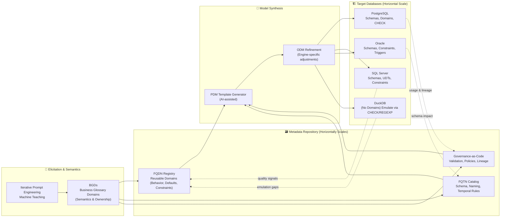
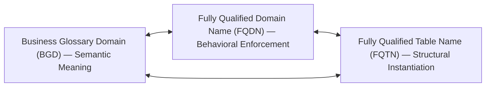
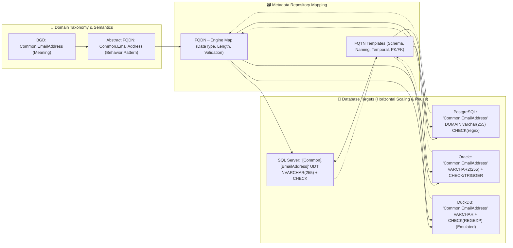

# 🧩 **The Meta-Modeling Renaissance**

### *How D⁴ Bridges Elicitation, Governance, and Execution in the Age of AI*

**Author:** Peter Heller  
**Affiliation:** Adjunct Lecturer, Department of Computer Science, Queens College (CUNY)  
**Email:** [Me@MindOverMetadata.com](mailto:Me@MindOverMetadata.com)  
**Version:** 1.0  
**Date:** October 2025  
**License:** © 2025 Peter Heller — Creative Commons CC BY-SA 4.0  

---

## 🧾 **Abstract**

- **In *“A List of Use Cases Is Not a Strategy,”* Julia Bardmesser argues that true data strategy must start with business outcomes, not a collection of use cases.**  
- **D⁴ Domain-Driven Database Design** extends this principle into what can be called the **Meta-Modeling Renaissance** — a framework where elicitation, governance, and execution converge into a single intelligent continuum.  
- D⁴ introduces a triadic foundation linking **Business Glossary Domains (BGDs)**, **Fully Qualified Domain Names (FQDNs)**, and **Fully Qualified Table Names (FQTNs)** in bi-directional semantic and structural symbiosis.  
## **Together they form a self-adapting governance fabric that transforms data modeling from static documentation into executable intelligence.**

---

## 🗂 **Table of Contents**

1. [Executive Context](#1-executive-context)
2. [From Sequential to Convergent Thinking](#2-from-sequential-to-convergent-thinking)
3. [The Meta-Modeling Renaissance](#3-the-meta-modeling-renaissance)
4. [Elicitation as Machine Teaching](#4-elicitation-as-machine-teaching)
5. [From Representation to Execution](#5-from-representation-to-execution)
6. [Semantic–Structural Symbiosis — The BGD–FQDN–FQTN Triad](#6-semanticstructural-symbiosis--the-bgdfqdnfqtn-triad)
7. [Governance Convergence and the Living Roadmap](#7-governance-convergence-and-the-living-roadmap)
8. [Impact on the Data Community](#8-impact-on-the-data-community)
9. [Strategic Implications for Bardmesser’s Vision](#9-strategic-implications-for-bardmessers-vision)
10. [From Modeling to Meta-Modeling: The Path Forward](#10-from-modeling-to-meta-modeling-the-path-forward)
11. [Conclusion](#11-conclusion)
12. [References](#12-references)
13. [License and Citation](#13-license-and-citation)

---

## 1. **Executive Context**

Julia Bardmesser urges organizations to transcend use-case lists and build strategies anchored in measurable outcomes and shared capabilities.

**D⁴ Domain-Driven Database Design** operationalizes this vision through AI-assisted elicitation that produces executable models composed of BGDs, FQDNs, and FQTNs — linking business intent, data behavior, and technical realization.

---

## 2. **From Sequential to Convergent Thinking**

Legacy data lifecycles follow a linear path — Business → Analyst → Architect → Engineer — creating delay and semantic drift.

D⁴ reimagines this as a **continuous loop**:

> *Elicitation produces templates; templates generate governance; governance enforces execution.*

Through iterative prompt engineering, human strategy and machine precision co-create **Physical Data Models (PDMs)** grounded in reusable FQDNs aligned to BGD semantics.

---

## 3. **The Meta-Modeling Renaissance**

| Classical Approach      | Meta-Modeling Renaissance                    |
| ----------------------- | -------------------------------------------- |
| CDM → LDM → PDM         | Elicitation → PDM Prototype → ODM Refinement |
| Sequential hand-offs    | AI-assisted co-creation                      |
| Abstract definitions    | Explicit semantics in BGDs                   |
| Governance as oversight | Governance-as-Code (FQDN/FQTN)               |
| Static models           | Living, versioned architectures              |

D⁴ elevates modeling from representation to continuous collaboration between humans and AI.

---

## 4. **Elicitation as Machine Teaching**

Elicitation becomes **machine teaching**.
Refined prompts generate templated PDMs anchored in FQDNs and FQTNs, while BGDs preserve semantic clarity between meaning and behavior.

| Activity     | Legacy Artifact     | D⁴ Output                   |
| ------------ | ------------------- | --------------------------- |
| Requirements | Narrative Docs      | AI-elicited FQDN patterns   |
| Modeling     | Logical ERDs        | Executable PDM templates    |
| Governance   | Stewardship manuals | Governance-as-Code metadata |

---

## 5. **From Representation to Execution**

Traditional governance ends at conceptual representation.
D⁴ extends it to **runtime execution** through:

* **FQDNs** — schema-bound, reusable data types with defaults and constraints.
* **FQTNs** — governed physical structures instantiating those domains.
* **BGDs** — semantic definitions of business meaning.

By separating **semantics (BGD)** from **implementation (FQDN/FQTN)**, D⁴ achieves cross-platform consistency without semantic contamination.

### **Figure 1 — Convergent Flow from Elicitation to Execution (Horizontal Scaling & Feedback)**

*The metadata repository horizontally scales across all target engines, ensuring that FQDNs and FQTNs are reused and governed uniformly while operational feedback continuously refines governance.*

---

## 6. **Semantic–Structural Symbiosis — The BGD–FQDN–FQTN Triad**

**FQDNs** and **FQTNs** operate in bi-directional harmony with **BGDs**, functioning like *Siamese twins* within D⁴.

| Component | Purpose                           | Dependency                         |
| --------- | --------------------------------- | ---------------------------------- |
| **BGD**   | Defines meaning and context       | ↔ Informs FQDN design              |
| **FQDN**  | Encodes behavior                  | ↔ Inherited within FQTNs           |
| **FQTN**  | Defines structure and persistence | ↔ Reflects semantic lineage to BGD |

### Closed Feedback Loop

*BGD → FQDN: semantics define behavior.*
*FQDN → FQTN: behavior governs structure.*
*FQTN → BGD: usage refines semantics.*

This triad forms a **living governance ecosystem** — continuous synchronization of meaning, behavior, and structure.

---

## 7. **Governance Convergence and the Living Roadmap**

| Strategic Requirement | D⁴ Implementation                             |
| --------------------- | --------------------------------------------- |
| Capability definition | FQDN registry linked to BGDs                  |
| Reuse & scalability   | FQDNs applied across FQTNs                    |
| Sequenced delivery    | Model Development Lifecycle (MDLC) automation |
| Sustained alignment   | Metadata propagation & impact lineage         |

### **Figure 2 — D⁴TKG Relationships Across Target Engines (Horizontal Reuse)**

*A single abstract FQDN, semantically anchored by a BGD, is realized across heterogeneous engines through the metadata repository’s mappings and templates, preserving meaning while adapting behavior.*

---

## 8. **Impact on the Data Community**

| Traditional Role   | Evolving Role in D⁴                              |
| ------------------ | ------------------------------------------------ |
| Business Analyst   | Prompt-based Domain Elicitor                     |
| Data Architect     | Meta-Model Curator & FQDN Designer               |
| Data Steward       | Custodian of Governance-as-Code                  |
| Chief Data Officer | Orchestrator of Metadata Flow & AI Collaboration |

D⁴ evolves roles from documenters to **designers of governance**. The human remains central — as the teacher of machines that model.

---

## 9. **Strategic Implications for Bardmesser’s Vision**

| Bardmesser Principle   | D⁴ Enablement                                                             |
| ---------------------- | ------------------------------------------------------------------------- |
| Outcome alignment      | BGD–FQDN–FQTN lineage from business term to schema                        |
| Capability assessment  | AI-derived metadata inventory and reuse analytics                         |
| Sequenced roadmap      | Automated MDLC checkpoints and progressive capability build-out           |
| Governance integration | Constraint inheritance, validation at design time, and continuous lineage |

Bardmesser’s strategic intent becomes **executable and auditable** through D⁴’s domain-driven metadata continuum.

---

## 10. **From Modeling to Meta-Modeling: The Path Forward**

D⁴ collapses abstraction layers into an AI-driven **metadata continuum**:

* **BGDs** define semantics.
* **FQDNs** govern behavior.
* **FQTNs** instantiate structure.

Together they create the **Governance Singularity** — where intent, semantics, and execution merge into a self-adapting framework governed by living metadata.

**Near-term adoption steps:**

1. Establish a seed **BGD** and **FQDN** registry for high-reuse concepts (e.g., EmailAddress, PhoneNumber, CustomerID).
2. Stand up the **metadata repository** with mappings to at least two target engines.
3. Generate a pilot **PDM → ODM** for one cross-functional use case; measure reuse and defect reduction.
4. Integrate **feedback signals** (lineage, constraint exceptions) to refine domains and templates.
5. Expand **FQTN templates** and automate MDLC gating on governance-as-code checks.

---

## 11. **Conclusion**

> **D⁴ brings the data community full circle —**
> from static blueprints to living architectures,
> from governance as oversight to governance as design,
> from documentation to **Fully Qualified Domain-Driven Taxonomy Intelligence**.

---

## 12. **References**

1. Bardmesser, Julia (2025). *A List of Use Cases Is Not a Strategy.*
2. Heller, Peter (2025). *D⁴ Domain-Driven Database Design Framework Notes*, MindOverMetadata.com.
3. DAMA International (2023). *DMBOK v2 — Data Management Body of Knowledge.*
4. Aiken, Peter (2023). *Data Strategy and Governance in Practice.*

---

## 13. **License and Citation**

This work is the intellectual property of **Peter Heller** ([Me@MindOverMetadata.com](mailto:Me@MindOverMetadata.com)) and is licensed under **Creative Commons Attribution-ShareAlike 4.0 International (CC BY-SA 4.0)**.

**Suggested Citation:**

> Heller, Peter (2025). *The Meta-Modeling Renaissance: How D⁴ Bridges Elicitation, Governance, and Execution in the Age of AI.* MindOverMetadata.com.
