# 🧩 *The Meta-Modeling Renaissance:*

### How D⁴ Bridges Elicitation, Governance, and Execution in the Age of AI

---

## 🎯 Executive Context

In *“A List of Use Cases Is Not a Strategy,”* Julia Bardmesser challenges organizations to move beyond use-case accumulation and toward genuine strategic alignment — a roadmap rooted in business outcomes, shared capabilities, and disciplined governance.

**D⁴ Domain-Driven Database Design** extends this idea into what can be called the **Meta-Modeling Renaissance** — where elicitation, governance, and execution converge into a single intelligent continuum.

Rather than discarding established frameworks, D⁴ **evolves them** through AI-assisted elicitation that produces executable architectures built on **Fully Qualified Domains (FQDNs)**, **Fully Qualified Table Names (FQTNs)**, and semantically anchored **Business Glossary Domains (BGDs)**.

---

## 🧭 1. From Sequential to Convergent Thinking

Traditional data strategy flows linearly — Business → Analyst → Architect → Engineer — introducing latency and semantic drift.

D⁴ reframes this into a **continuous loop of convergence**:

> *Elicitation produces templates; templates generate governance; governance enforces execution.*

Through iterative prompt engineering, human insight and machine precision co-create initial **Physical Data Models (PDMs)** whose reusable FQDNs express rules, constraints, and defaults aligned to their conceptual semantics in the BGD.

Governance shifts from post-implementation review to *real-time enforcement by design.*

---

## 🧩 2. The Meta-Modeling Renaissance

This new era turns modeling from documentation into an *interactive, generative dialogue* between strategist and system.

| Classical Approach              | Meta-Modeling Renaissance                    |
| ------------------------------- | -------------------------------------------- |
| CDM → LDM → PDM                 | Elicitation → PDM Prototype → ODM Refinement |
| Sequential hand-offs            | AI-assisted co-creation                      |
| Business definitions abstracted | Semantics preserved in BGDs                  |
| Governance as oversight         | Governance-as-Code in FQDN/FQTN              |
| Static models                   | Living, versioned architectures              |

---

## ⚙️ 3. Elicitation as Machine Teaching

Elicitation evolves from requirement gathering to **machine teaching**.
Refined prompts generate templated PDMs anchored in reusable FQDNs and FQTNs, while BGDs maintain semantic separation.

| Activity              | Legacy Artifact | D⁴ Output                                |
| --------------------- | --------------- | ---------------------------------------- |
| Requirement Gathering | Business Docs   | AI-elicited FQDN patterns                |
| Data Modeling         | ER Diagrams     | Executable PDM templates                 |
| Governance            | Policy Manuals  | Governance-as-Code metadata tied to BGDs |

---

## 🧱 4. From Representation to Execution

Most governance frameworks stop at representation; D⁴ extends it to **runtime execution**:

* **FQDNs (Fully Qualified Domain Names)** — reusable, schema-bound data types with defaults, constraints, and behaviors.
* **FQTNs (Fully Qualified Table Names)** — governed structures where those domains are instantiated.
* **BGDs (Business Glossary Domains)** — semantic definitions of business meaning.

By separating **semantics (BGD)** from **implementation (FQDN/FQTN)**, D⁴ achieves cross-platform consistency without semantic contamination.
🧠 *Governance becomes executable — meaning becomes measurable.*

---

## 🧩 4A. Semantic–Structural Symbiosis — The BGD–FQDN–FQTN Triad

**Fully Qualified Domain Names (FQDNs)** and **Fully Qualified Table Names (FQTNs)** operate in bi-directional harmony with **Business Glossary Domains (BGDs)** — functioning like *Siamese twins* within the D⁴ architecture.

Together they form a **semantic-structural symbiosis**:

| Component | Core Purpose                                           | Dependency                                                              |
| --------- | ------------------------------------------------------ | ----------------------------------------------------------------------- |
| **BGD**   | Defines *meaning* and business context                 | ↔ Informs FQDN design for behavioral realization                        |
| **FQDN**  | Encodes *behavior* — constraints, validation, defaults | ↔ Implemented and inherited within FQTNs                                |
| **FQTN**  | Defines *persistence and structure* for governed data  | ↔ Reflects semantic lineage to BGD and behavioral inheritance from FQDN |

This triad forms a **closed semantic feedback loop**:

```mermaid
flowchart LR
A["Business Glossary Domain (BGD) — Semantic Meaning"]
  <--> 
B["Fully Qualified Domain Name (FQDN) — Behavioral Enforcement"]
  <--> 
C["Fully Qualified Table Name (FQTN) — Structural Instantiation"]
  <--> 
A
```

* **BGD → FQDN:** semantics define behavior.
* **FQDN → FQTN:** behavior governs structure.
* **FQTN → BGD:** real-world usage refines semantics.

This bi-directional dependency creates a **living governance ecosystem** — ensuring that meaning, behavior, and structure remain synchronized.

---

## 🔄 5. Governance Convergence and the “Living Roadmap”

| Strategic Requirement | D⁴ Implementation                     |
| --------------------- | ------------------------------------- |
| Capability definition | FQDN registry linked to BGDs          |
| Reuse & scalability   | FQDNs applied across FQTNs            |
| Sequenced delivery    | MDLC automation                       |
| Sustained alignment   | Metadata propagation & impact lineage |

The result is a **living roadmap** — evolving as domains are refined, reused, and versioned.

---

## 💡 6. Impact on the Data Community

| Traditional Role | Emerging Role in D⁴                              |
| ---------------- | ------------------------------------------------ |
| Business Analyst | Prompt-based Domain Elicitor                     |
| Data Architect   | Meta-Model Curator & FQDN Designer               |
| Data Steward     | Custodian of Governance-as-Code                  |
| CDO              | Orchestrator of Metadata Flow & AI Collaboration |

D⁴ invites professionals to evolve — from documenting governance to *designing it natively*.

---

## 🌐 7. Strategic Implications for Bardmesser’s Vision

| Bardmesser Principle            | D⁴ Enablement                                  |
| ------------------------------- | ---------------------------------------------- |
| Clear line of sight to outcomes | BGDs linked through FQDN/FQTN lineage          |
| Honest capability assessment    | AI-derived metadata inventory                  |
| Sequenced roadmap               | MDLC checkpoints                               |
| Governance alignment            | Constraint inheritance and embedded validation |

Bardmesser’s strategic framework thus becomes *executable.*

---

## 🚀 8. The Path Forward: From Modeling to Meta-Modeling

D⁴ collapses abstraction layers into an AI-driven **metadata continuum**:

* **BGDs** define semantics.
* **FQDNs** govern behavior.
* **FQTNs** instantiate structure.

Together, they constitute the **Governance Singularity** — where human intent, data semantics, and execution merge into a self-adapting framework.

---

## 🧠 Conclusion

> **D⁴ brings the data community full circle —**
> from static blueprints to living architectures,
> from governance as oversight to governance as design,
> from documentation to **Fully Qualified Domain-Driven Taxonomy Intelligence.**

---

Would you like me to produce a **formal white-paper layout (Word or Markdown)** version next — complete with cover page, table of contents, section numbering, and embedded Mermaid diagrams — ready for publication or submission to an academic or industry venue?
