# 🏗️ Sub-Domain Glossary Integration Architecture
## Complete Package Summary with Mermaid Diagrams

**Date:** 2025-10-24  
**Status:** ✅ Architecture Defined  
**Recommendation:** Federation + Bounded Contexts

---

## 📚 Files in This Package

1. **This Document** - Complete architecture summary
2. **Mermaid Diagrams** - 12 comprehensive visualizations
3. **Implementation Guide** - Migration strategy

---

## 🚨 **PROBLEM: Deep Hierarchy Explosion**

### **Diagram 1: The Problem - Parent/Child Nesting (BAD)**


**Issues:**
- ❌ 6 levels deep
- ❌ 6 SQL joins for lineage query
- ❌ Performance degradation
- ❌ Unwieldy schema paths: `Industry.Energy.EnergyGlossary.FossilFuels.Coal.Anthracite`

---

## ✅ **SOLUTION: Federation Architecture (GOOD)**

### **Diagram 2: Federation Pattern - Peer Glossaries**


**Benefits:**
- ✅ Each glossary: 4 levels max (Glossary → BGD → Category → Term)
- ✅ 4 SQL joins per domain query
- ✅ Horizontal peer relationships
- ✅ Clean schema paths: `Energy.EnergyGlossary.FossilFuels.Coal.Anthracite`

---

## 🏛️ **ARCHITECTURE DETAILS**

### **Diagram 3: Bounded Context Pattern**


---

### **Diagram 4: Registry Catalog Structure**


---

### **Diagram 5: Cross-Domain Reference Mechanism**


---

### **Diagram 6: Data Model - Federation Fields**

```mermaid
classDiagram
    class GlossaryInfo {
        +string Id
        +string Name
        +string DomainNamespace ⭐NEW
        +RegistryMembership RegistryInfo ⭐NEW
        +HierarchyInfo Hierarchy
    }
    
    class RegistryMembership {
        +string RegistryId
        +string RelationshipType
        +string Domain
        +timestamp RegisteredDate
    }
    
    class CrossDomainRef {
        +string TermId
        +string TermName
        +string DomainNamespace
        +string GlossaryId
        +bool IsCrossDomain
        +string RelationshipType
    }
    
    class Term {
        +string Id
        +string Name
        +List~CrossDomainRef~ RelatedTerms ⭐ENHANCED
    }
    
    GlossaryInfo --> RegistryMembership
    Term --> CrossDomainRef
    
    style GlossaryInfo fill:#e7f5ff,stroke:#1971c2,stroke-width:2px
    style RegistryMembership fill:#fff3bf,stroke:#fab005,stroke-width:2px
    style CrossDomainRef fill:#f3f0ff,stroke:#7950f2,stroke-width:2px
    style Term fill:#e3fafc,stroke:#0b7285,stroke-width:2px
```



---

## 📊 **IMPLEMENTATION PATTERNS**

### **Diagram 7: Three Schema Layers**


**Critical Insight:** These three schemas remain **independent** in federation model. No forced parent/child relationships.

---

### **Diagram 8: Query Performance Comparison**


---

## 🚀 **IMPLEMENTATION PHASES**

### **Diagram 9: Migration Strategy**


---

### **Diagram 10: Decision Tree - Integration Strategy**


---

### **Diagram 11: Registry Deployment Options**

```mermaid
graph TB
    subgraph Option1[Option 1: Monorepo]
        O1R[Single Repository]
        O1R --> O1E[Energy Glossary]
        O1R --> O1M[Mfg Glossary]
        O1R --> O1H[Healthcare Glossary]
        O1R --> O1REG[Registry Catalog]
        
        O1PRO[✅ Pros:<br/>- Atomic updates<br/>- Easy refactoring<br/>- Shared tooling]
        O1CON[❌ Cons:<br/>- Tight coupling<br/>- Large codebase<br/>- Single deployment]
    end
    
    subgraph Option2[Option 2: Multirepo]
        O2E[Energy Repo<br/>Independent]
        O2M[Mfg Repo<br/>Independent]
        O2H[Healthcare Repo<br/>Independent]
        O2REG[Registry Repo<br/>Coordination]
        
        O2REG -.References.-> O2E
        O2REG -.References.-> O2M
        O2REG -.References.-> O2H
        
        O2PRO[✅ Pros:<br/>- Independent deploy<br/>- Team autonomy<br/>- Clear boundaries]
        O2CON[❌ Cons:<br/>- Version coordination<br/>- Update complexity<br/>- Duplicate tooling]
    end
    
    subgraph Option3[Option 3: Hybrid]
        O3CORE[Core Registry<br/>Monorepo]
        O3E[Energy Plugin]
        O3M[Mfg Plugin]
        O3H[Health Plugin]
        
        O3CORE -.Loads.-> O3E
        O3CORE -.Loads.-> O3M
        O3CORE -.Loads.-> O3H
        
        O3PRO[✅ Pros:<br/>- Best of both<br/>- Plugin system<br/>- Flexible deploy]
        O3CON[⚠️ Cons:<br/>- More complexity<br/>- Plugin versioning<br/>- API stability]
    end
    
    style Option1 fill:#e7f5ff,stroke:#1971c2,stroke-width:2px
    style Option2 fill:#fff3bf,stroke:#fab005,stroke-width:2px
    style Option3 fill:#d0ebff,stroke:#1971c2,stroke-width:2px,stroke-dasharray: 5 5
```



**Recommendation:** Start with **Option 1 (Monorepo)** for initial implementation, migrate to **Option 3 (Hybrid)** as scale increases.

---

### **Diagram 12: Evolution Path**


---

## 📋 **JSON SCHEMA EXAMPLES**

### **1. Enhanced GlossaryInfo (Federation Ready)**

```json
{
  "GlossaryInfo": {
    "Id": "sha256_energy_glossary_v3",
    "Name": "Energy Sector Business Glossary",
    "Version": "3.0",
    "DomainNamespace": "Energy",
    "RegistryMembership": {
      "RegistryId": "sha256_industry_registry",
      "RelationshipType": "RegisteredIn",
      "Domain": "Energy",
      "RegisteredDate": "2025-10-24T00:00:00Z"
    },
    "HierarchyInfo": {
      "Type": "4-Level",
      "Levels": [
        "Glossary (Level 0)",
        "Business Group Domain (Level 1)",
        "Category (Level 2)",
        "Term (Level 3)"
      ]
    }
  }
}
```

### **2. Industry Registry Catalog**

```json
{
  "IndustryRegistry": {
    "Id": "sha256_industry_registry",
    "Name": "Industry Master Registry",
    "Type": "Catalog",
    "Purpose": "Coordinates federated domain glossaries",
    "RegisteredGlossaries": [
      {
        "GlossaryId": "sha256_energy_glossary_v3",
        "DomainNamespace": "Energy",
        "Name": "Energy Sector Glossary",
        "Version": "3.0",
        "Status": "Active",
        "Owner": "Energy Domain Team",
        "LastUpdated": "2025-10-24",
        "ApiEndpoint": "https://api.company.com/glossaries/energy",
        "TermCount": 547
      },
      {
        "GlossaryId": "sha256_manufacturing_glossary_v1",
        "DomainNamespace": "Manufacturing",
        "Name": "Manufacturing Glossary",
        "Version": "1.0",
        "Status": "Active",
        "Owner": "Manufacturing Domain Team",
        "LastUpdated": "2025-11-01",
        "ApiEndpoint": "https://api.company.com/glossaries/manufacturing",
        "TermCount": 892
      },
      {
        "GlossaryId": "sha256_healthcare_glossary_v1",
        "DomainNamespace": "Healthcare",
        "Name": "Healthcare Glossary",
        "Version": "1.0",
        "Status": "Development",
        "Owner": "Healthcare Domain Team",
        "LastUpdated": "2025-11-05",
        "ApiEndpoint": "https://api.company.com/glossaries/healthcare",
        "TermCount": 1243
      }
    ],
    "Metadata": {
      "TotalGlossaries": 3,
      "TotalTerms": 2682,
      "LastSync": "2025-10-25T12:00:00Z"
    }
  }
}
```

### **3. Cross-Domain Reference in Term**

```json
{
  "Id": "sha256_anthracite_term",
  "Name": "Anthracite",
  "DomainNamespace": "Energy",
  "GlossaryId": "sha256_energy_glossary_v3",
  "ParentId": "sha256_coal_category",
  "Definition": "Highest rank of coal with 92-98% carbon content",
  "RelatedTerms": [
    {
      "TermId": "sha256_steel_grade_a",
      "TermName": "Steel Grade A",
      "DomainNamespace": "Manufacturing",
      "GlossaryId": "sha256_manufacturing_glossary_v1",
      "IsCrossDomainReference": true,
      "RelationshipType": "UsedIn",
      "Description": "Anthracite is primary fuel for Steel Grade A production"
    },
    {
      "TermId": "sha256_bituminous_coal",
      "TermName": "Bituminous Coal",
      "DomainNamespace": "Energy",
      "GlossaryId": "sha256_energy_glossary_v3",
      "IsCrossDomainReference": false,
      "RelationshipType": "RelatedTo",
      "Description": "Lower rank coal, 45-86% carbon"
    }
  ]
}
```

---

## 🎯 **KEY DESIGN PRINCIPLES**

### **1. Separation of Concerns**

| Layer | Responsibility | Independence Level |
|-------|----------------|-------------------|
| **Registry** | Catalog coordination | Fully independent |
| **Glossary** | Domain business terms | Bounded context |
| **BGD/Category** | Internal organization | Domain-specific |
| **Terms** | Actual definitions | Self-contained |

### **2. Relationship Types**

```json
{
  "RegistryToGlossary": "RegisteredIn",      // NOT ParentId!
  "GlossaryToBGD": "ParentId",               // Hierarchy within domain
  "BGDToCategory": "ParentId",               // Hierarchy within domain
  "CategoryToTerm": "ParentId",              // Hierarchy within domain
  "TermToTerm_CrossDomain": "CrossDomainRef" // Horizontal reference
}
```

### **3. Naming Conventions**

```
DomainNamespace.GlossaryName.BGD.Category.Term

Examples:
✅ Energy.EnergyGlossary.FossilFuels.Coal.Anthracite
✅ Manufacturing.MfgGlossary.Materials.Steel.GradeA
✅ Healthcare.HealthGlossary.Medical.Devices.Pacemaker

❌ Industry.Energy.EnergyGlossary.FossilFuels.Coal.Anthracite (too deep!)
```

---

## 📊 **PERFORMANCE BENCHMARKS**

### **Query Performance Goals**

| Query Type | Target | Method |
|------------|--------|--------|
| **Within-Domain Lineage** | <50ms | 4 joins, indexed ParentId |
| **Cross-Domain Lookup** | <100ms | Direct ID lookup + cache |
| **Full Hierarchy** | <200ms | Recursive CTE, cached results |
| **Registry List** | <20ms | Simple catalog query |

### **Scalability Limits**

| Metric | Single Domain | Federated |
|--------|--------------|-----------|
| **Max Depth** | 4 levels | 4 levels per domain |
| **Max Terms** | ~10,000 | Unlimited (per domain) |
| **Max Glossaries** | 1 | Unlimited |
| **Query Joins** | 4 | 4 per domain + ID lookup |

---

## 💡 **KEY INSIGHT**

> **The secret to avoiding deep hierarchies is to stop thinking vertically (parent/child) and start thinking horizontally (peer references with namespaces).**

### **Instead of:**
```
Industry → Energy → EnergyGlossary → BGD → Category → Term (6 levels)
```

### **Use:**
```
IndustryRegistry catalogs Energy.EnergyGlossary (catalog relationship)
Energy.EnergyGlossary internally: Glossary → BGD → Category → Term (4 levels)
```

### **Result:**
- ✅ 4 levels per domain (not 6+ globally)
- ✅ Horizontal scaling (add domains without depth increase)
- ✅ Independent evolution (domains change independently)
- ✅ Clear boundaries (bounded contexts)
- ✅ Performance (4 joins max per query)

---

## 🎬 **NEXT ACTIONS**

### **Immediate (Week 1)**
1. ✅ Review Mermaid diagrams
2. ⬜ Add `DomainNamespace` field to Energy Glossary v3.0
3. ⬜ Add `RegistryMembership` field to Energy Glossary v3.0
4. ⬜ Create `IndustryRegistry.json` catalog
5. ⬜ Test federation queries

### **Short-term (Weeks 2-3)**
1. ⬜ Design Manufacturing Glossary structure
2. ⬜ Implement Manufacturing Glossary with federation
3. ⬜ Create cross-domain references (Energy ↔ Manufacturing)
4. ⬜ Performance testing
5. ⬜ Document patterns

### **Medium-term (Month 2)**
1. ⬜ Add Healthcare Glossary
2. ⬜ Implement query optimization (caching, indexing)
3. ⬜ Build registry UI/API
4. ⬜ Create governance workflows
5. ⬜ Scale testing

### **Long-term (Months 3-6)**
1. ⬜ Add remaining domain glossaries
2. ⬜ Implement advanced features (versioning, audit trails)
3. ⬜ Build analytics dashboard
4. ⬜ Production deployment
5. ⬜ Training and adoption

---

## ✅ **BENEFITS SUMMARY**

### **Technical Benefits**
- ✅ **Scalability**: Add unlimited glossaries without depth explosion
- ✅ **Performance**: 4 joins max, regardless of number of glossaries
- ✅ **Maintainability**: Changes isolated to specific domain
- ✅ **Flexibility**: Domains evolve independently
- ✅ **Clarity**: Clear bounded contexts

### **Business Benefits**
- ✅ **Domain Ownership**: Clear responsibility per glossary
- ✅ **Governance**: Domain-specific rules and workflows
- ✅ **Agility**: Add domains without impacting existing ones
- ✅ **Integration**: Cross-domain references without coupling
- ✅ **Compliance**: Audit trails per domain

### **User Benefits**
- ✅ **Discoverability**: Registry provides central catalog
- ✅ **Navigation**: Clear domain boundaries
- ✅ **Performance**: Fast queries within and across domains
- ✅ **Consistency**: Same pattern across all domains
- ✅ **Reliability**: Independent domains = isolated failures

---

## 📚 **REFERENCE ARCHITECTURE**

### **Components**

```
Industry Master Registry (Catalog)
├── Energy Domain
│   └── EnergyGlossary v3.0
│       ├── Business Group Domains (Level 1)
│       ├── Categories (Level 2)
│       └── Terms (Level 3)
│
├── Manufacturing Domain
│   └── ManufacturingGlossary v1.0
│       ├── Business Group Domains (Level 1)
│       ├── Categories (Level 2)
│       └── Terms (Level 3)
│
└── Healthcare Domain
    └── HealthcareGlossary v1.0
        ├── Business Group Domains (Level 1)
        ├── Categories (Level 2)
        └── Terms (Level 3)
```

### **Technology Stack**

| Component | Technology Options |
|-----------|-------------------|
| **Registry** | JSON file, SQLite, or REST API |
| **Glossaries** | JSON files or PostgreSQL databases |
| **Cross-refs** | SHA-256 IDs with cache layer |
| **API** | REST or GraphQL |
| **UI** | React/Vue with Mermaid.js |
| **Deployment** | Monorepo or Multirepo |

---

## 🎸 **CONCLUSION**

**Status:** ✅ Architecture Defined  
**Pattern:** Federation + Bounded Contexts  
**Current:** Energy Glossary v3.0 (4 levels)  
**Next Step:** Add federation fields + Create registry  
**Goal:** Horizontal scalability without depth explosion

**Recommendation:** Implement federation pattern immediately. This provides the foundation for enterprise-scale glossary integration while maintaining performance and clarity.

**Rock On!** 🤘

---

## 📄 **DOCUMENT METADATA**

- **Version:** 1.0
- **Date:** 2025-10-24
- **Author:** System Architecture Team
- **Status:** Approved
- **Next Review:** 2025-11-24
- **Related Docs:**
  - Energy Glossary v3.0 Specification
  - Industry Registry API Documentation
  - Cross-Domain Integration Guide

---

**END OF DOCUMENT**
