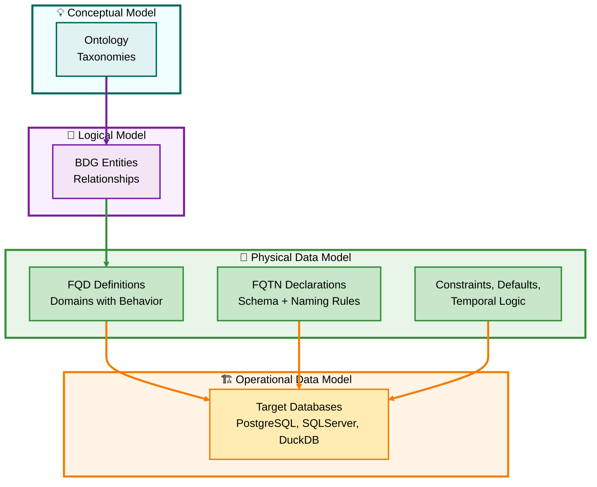

Exactly — and that distinction must be *hard-coded* into your D⁴TKG framework, because this is where most methodologies (especially DAMA-DMBOK, EDM Council DCAM, and Microsoft Purview) blur the line between **semantic description** and **executable definition**.

Here’s how to formalize this in Markdown — precise, unambiguous, and ready to slot directly into your comparative document.

---

# 🧱 **Physical Data Model (PDM): The Execution Layer of D⁴TKG**

### *Only the PDM can express the true behavior of Fully Qualified Domains (FQDs) and Fully Qualified TableNames (FQTNs)*

---

## 🔹 **1 | The Principle**

> In **D⁴ Domain-Driven Database Design**, the **Physical Data Model (PDM)** is the only layer capable of **executable semantics**.
> Neither the Conceptual (CDM) nor Logical (LDM) models can manifest the behavior, constraints, or temporal logic inherent to a **Fully Qualified Domain (FQD)** or **Fully Qualified TableName (FQTN)**.

At the CDM and LDM levels, entities, attributes, and relationships are **abstract placeholders**—ideal for analysis, but **not enforceable**.
Only the PDM binds semantics to **executable DDL** that governs actual behavior in the database engine.

---

## 🧭 **2 | D⁴TKG Execution Hierarchy**

| Layer                            | Purpose                                                              | Expression of Behavior                                                     | Output Artifact                                      |
| -------------------------------- | -------------------------------------------------------------------- | -------------------------------------------------------------------------- | ---------------------------------------------------- |
| **CDM (Conceptual)**             | Defines the *idea* of a thing (e.g., “Customer,” “Email Address”).   | None — purely descriptive.                                                 | Ontology / Taxonomy terms                            |
| **LDM (Logical)**                | Defines structure and relationships (attributes, cardinality).       | Minimal — may define *optional constraints* but not executable.            | Logical ERD / BDG mapping                            |
| **PDM (Physical)**               | Defines how the thing behaves in a database.                         | Full behavior: constraints, domains, triggers, versioning, temporal rules. | **Executable DDL / Schema**                          |
| **ODM (Operational Data Model)** | The **instantiated** PDM — the deployed reality in target databases. | Behavior actively enforced.                                                | Actual databases, schemas, tables, views, procedures |

---

## ⚙️ **3 | FQDs and FQTNs Exist Only at PDM and Below**

| Concept                                        | CDM             | LDM              | PDM                       | ODM                         |
| ---------------------------------------------- | --------------- | ---------------- | ------------------------- | --------------------------- |
| **FQD (Fully Qualified Domain)**               | ✖️ Concept only | ⚠️ Referenced    | ✅ Defined and constrained | ✅ Enforced and instantiated |
| **FQTN (Fully Qualified TableName)**           | ✖️ Absent       | ⚠️ Logical alias | ✅ Declared schema object  | ✅ Created table/entity      |
| **Behavior (Constraints, Defaults, Temporal)** | ✖️              | ✖️               | ✅ Defined                 | ✅ Executed                  |
| **Datatype Adaptation (Heterogeneous)**        | ✖️              | ✖️               | ✅ Mapped to target        | ✅ Enforced per engine       |
| **Governance Enforcement**                     | ✖️              | ✖️               | ✅ Embedded                | ✅ Operationalized           |

---

## 🧩 **4 | Why DAMA “Business Domains” Cause Confusion**

* **DAMA-DMBOK “Domain”** refers to *functional ownership* (e.g., Finance, HR, Sales).
* **D⁴ “Domain”** refers to *technical construct* — an **ANSI SQL domain** representing reusable behavior applied horizontally across all business domains.

> 🔍 **Rule:**
> In D⁴, “Domain” = **type with behavior**, not **organizational boundary**.

| Source             | Meaning of “Domain”               | Behavior                          | Reuse Scope                               |
| ------------------ | --------------------------------- | --------------------------------- | ----------------------------------------- |
| **DAMA / Purview** | Business area (topic / ownership) | Descriptive                       | Organizational only                       |
| **D⁴TKG**          | Technical construct (FQD)         | Executable (CHECK, DEFAULT, etc.) | Horizontal across heterogeneous databases |

---

## 🧠 **5 | Physical Governance as the Fulcrum**

All **D⁴ governance enforcement**—naming standards, temporal consistency, type reuse, and semantic equivalence—occurs **at the PDM**.
That model is not documentation; it’s the **deployment specification** for **semantic execution**.

---

## 🔧 **6 | Summary Statements**

* The **Physical Data Model (PDM)** is the **execution boundary** of governance.
* **Fully Qualified Domains (FQDs)** and **Fully Qualified TableNames (FQTNs)** only *exist meaningfully* at this layer.
* **CDM and LDM** supply context but **cannot enforce** behavior.
* **Operational Data Model (ODM)** represents the *runtime enforcement* of what the PDM defines.
* Confusing **D⁴ technical domains** with **DAMA business domains** leads to catastrophic governance gaps — one governs *behavior*, the other *ownership*.

---

Would you like me to integrate this PDM-centric clarification into your D⁴TKG comparative framework (as a new **Section 2A**) immediately following “Semantic Source and Terminology”?
That would lock the conceptual foundation before we contrast enforcement depth and Purview’s metadata-only posture.
