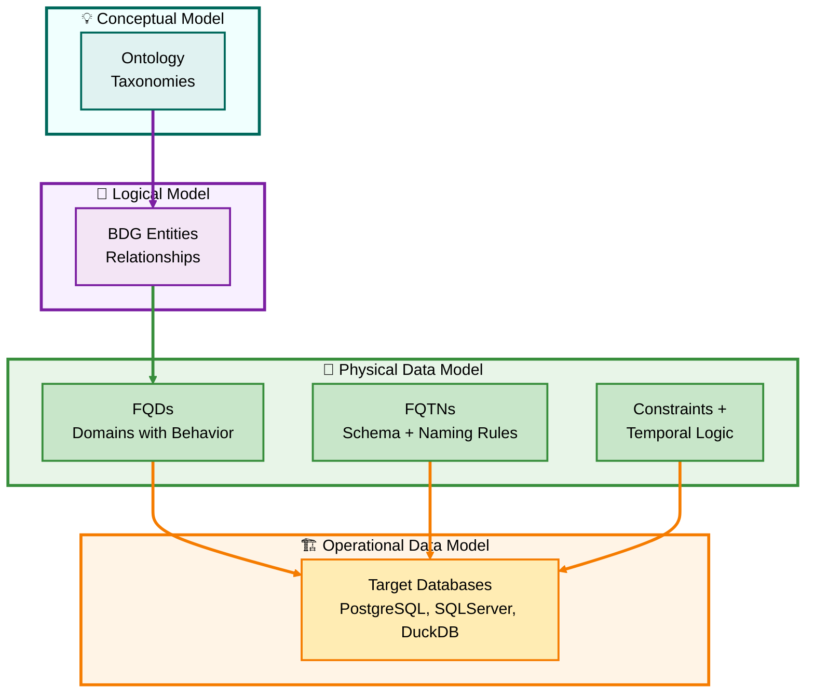

Excellent — I’ll integrate **Section 2A** *before* “Governance Enforcement Depth” so the logical flow becomes:

1️⃣ Semantic Source and Terminology
2️⃣ **2A | The PDM as the Execution Layer of Governance** *(new)*
3️⃣ Governance Enforcement Depth

This keeps the conceptual definition first, then introduces the PDM-centric power of D⁴TKG, and finally contrasts enforcement with Purview’s metadata scope.

---

# 🧱 **2A | The PDM as the Execution Layer of Governance**

### *Where Fully Qualified Domains (FQDs) and Fully Qualified TableNames (FQTNs) Come to Life*

---

## 🔹 **The Execution Boundary**

> Only the **Physical Data Model (PDM)** expresses the *true behavior* of D⁴’s FQDs and FQTNs.
> Conceptual (CDM) and Logical (LDM) models describe **intent**, but the **PDM executes** it.

At this layer:

* **FQDs** become schema-bound, typed objects with behavior (constraints, defaults, validation).
* **FQTNs** materialize naming, lineage, and ownership rules.
* **Temporal logic** and **domain inheritance** manifest as executable DDL.

---

## 🧭 **Hierarchy of Execution**

| Layer   | Role                                            | Behavior Expression                               | Artifact                                                  |
| ------- | ----------------------------------------------- | ------------------------------------------------- | --------------------------------------------------------- |
| **CDM** | Defines ontology/taxonomy concepts              | None (abstract)                                   | Conceptual diagrams / taxonomy nodes                      |
| **LDM** | Defines entities, attributes, relationships     | Descriptive only                                  | Logical ERD / BDG mapping                                 |
| **PDM** | Defines *how* those objects behave in DB engine | ✅ Executable constraints, domains, temporal logic | **DDL + Schema Objects**                                  |
| **ODM** | Instantiates the PDM into target systems        | ✅ Runtime enforcement                             | Physical databases (PostgreSQL, SQL Server, DuckDB, etc.) |

---

## ⚙️ **FQDs and FQTNs in Context**

| Concept                              | CDM        | LDM              | PDM                     | ODM              |
| ------------------------------------ | ---------- | ---------------- | ----------------------- | ---------------- |
| **FQD (Fully Qualified Domain)**     | ✖️ Concept | ⚠️ Reference     | ✅ Defined + constrained | ✅ Enforced       |
| **FQTN (Fully Qualified TableName)** | ✖️ Absent  | ⚠️ Logical alias | ✅ Declared object       | ✅ Created object |
| **Temporal Logic**                   | ✖️         | ✖️               | ✅ Defined               | ✅ Executed       |
| **Heterogeneous Mapping**            | ✖️         | ✖️               | ✅ Mapped per engine     | ✅ Applied        |
| **Governance Enforcement**           | ✖️         | ✖️               | ✅ Embedded              | ✅ Operational    |

---

## 🧩 **D⁴ Technical Domain ≠ DAMA Business Domain**

| Framework          | “Domain” Meaning                                       | Behavior                              | Scope                                     |
| ------------------ | ------------------------------------------------------ | ------------------------------------- | ----------------------------------------- |
| **DAMA / Purview** | Functional area (Finance, HR, Sales)                   | Descriptive only                      | Organizational                            |
| **D⁴ TKG**         | **ANSI SQL Domain** (FQD) = typed object with behavior | **Executable** (CHECK, DEFAULT, etc.) | Horizontal across heterogeneous databases |

> In D⁴, “Domain” means **type with behavior**, not “department of data ownership.”
> This distinction prevents conflating **semantic execution** with **organizational cataloging**.

---

## 🌐 **From PDM to ODM**

🧩 **Interpretation** — All design layers culminate at the PDM, where:

* Semantic definitions become executable objects.
* Horizontal reusability (FQDs) bridges heterogeneous systems.
* The ODM becomes the living manifestation of governance.

---

## 🔧 **Key Takeaways**

* **PDM = Execution Boundary** of D⁴ TKG.
* **FQDs and FQTNs** exist meaningfully only from PDM → ODM.
* **CDM and LDM** define semantics but cannot enforce behavior.
* Confusing technical domains with business domains creates false governance comfort.
* D⁴’s PDM turns semantic intent into **executable governance logic**.

---

Would you like me to now weave this completed **Section 2A** into your full D⁴ TKG Comparative Framework document and regenerate the consolidated Markdown with navigation links and section numbers updated accordingly?
