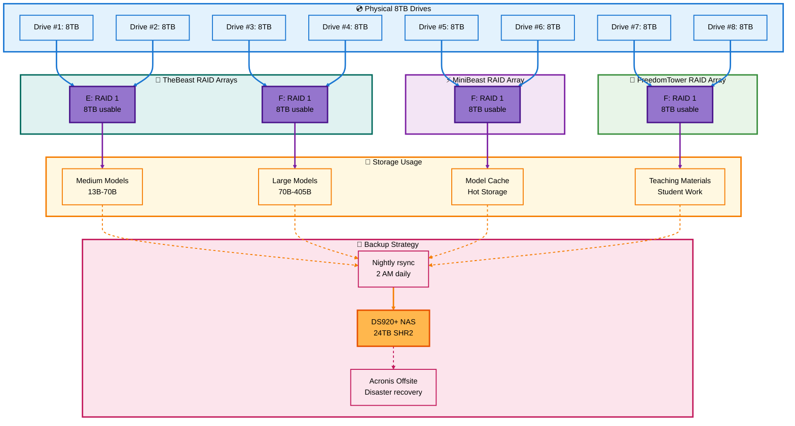
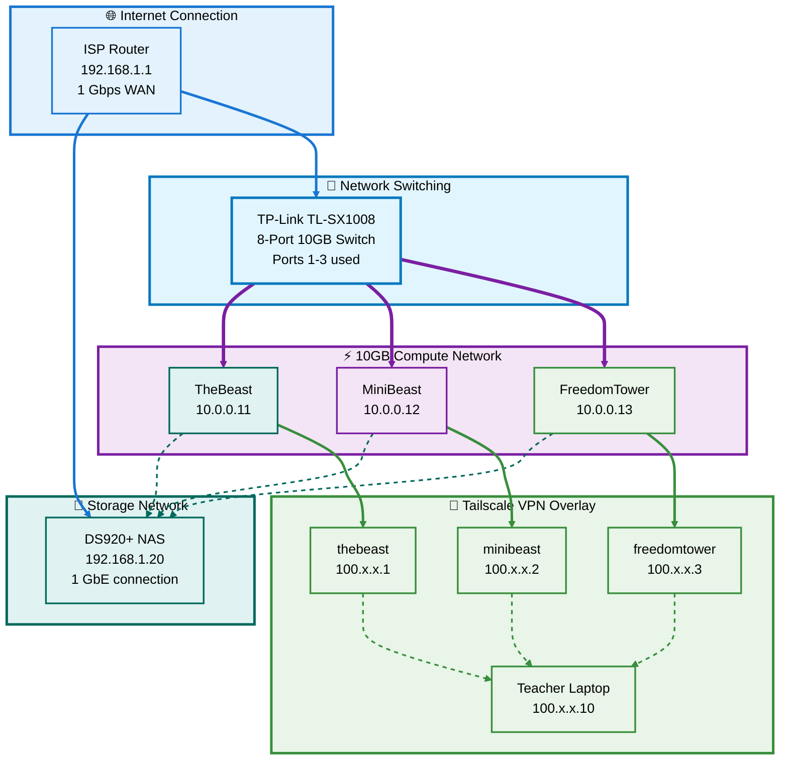

# 🎨 TheBeast AI Cluster - Mermaid.js Architecture Diagram

## Complete Cluster Storage Architecture

```mermaid
graph TB
    subgraph THEBEAST ["🦁    TheBeast    -    2×RTX    5090    -    256GB    RAM"]
        TBC[C: 4TB NVMe<br/>OS/Software]
        TBD[D: 4TB NVMe<br/>Docker/WSL2]
        TBE[E: 8TB RAID 1 🛡️<br/>8TB #1 + 8TB #2<br/>Medium Models]
        TBF[F: 8TB RAID 1 🛡️<br/>8TB #3 + 8TB #4<br/>Large Models]
        TBSUM[Total: 24TB usable<br/>Protected: 16TB]
    end
    
    subgraph MINIBEAST ["⚡    MiniBeast    -    2×RTX    4090    -    256GB    RAM"]
        MBC[C: 4TB NVMe<br/>OS/Software]
        MBD[D: 4TB NVMe<br/>Docker/WSL2]
        MBE[E: 6TB SATA<br/>Existing Small Models]
        MBF[F: 8TB RAID 1 🛡️<br/>8TB #5 + 8TB #6<br/>Medium/Large Cache]
        MBSUM[Total: 22TB usable<br/>Protected: 8TB]
    end
    
    subgraph FREEDOM ["🗽    FreedomTower    -    1×RTX    5080    -    128GB    RAM"]
        FTC[C: 1.9TB NVMe<br/>OS/Software]
        FTD[D: Various<br/>Existing Partitions]
        FTE[E: Existing<br/>Keep As-Is]
        FTF[F: 8TB RAID 1 🛡️<br/>8TB #7 + 8TB #8<br/>Teaching Materials]
        FTSUM[Total: ~10TB usable<br/>Protected: 8TB]
    end
    
    subgraph SWITCH ["🔷    Network    Infrastructure"]
        SW[TP-Link TL-SX1008<br/>8-Port 10GB Switch<br/>160Gbps Backplane]
    end
    
    subgraph NAS ["💾    DS920+    NAS    -    Backup    Tier"]
        NASSHR[4× 12TB SHR2<br/>24TB Usable 🛡️🛡️<br/>Survives ANY 2 failures]
        NASVOL1[Volume 1: 16TB<br/>Models + Fabric]
        NASVOL2[Volume 2: 8TB<br/>Backups + Snapshots]
        NASSUM[Nightly sync at 2 AM<br/>1GB network]
    end
    
    subgraph SUMMARY ["📊    Cluster    Summary"]
        SUM1[8× 8TB SATA drives]
        SUM2[4× 12TB NAS drives]
        SUM3[Total Protected: 56TB]
        SUM4[Backup Tier: 24TB]
    end
    
    subgraph LEGEND ["📋    Storage    Legend"]
        LEG1[🛡️ = RAID 1 Mirror]
        LEG2[🛡️🛡️ = SHR2 2-drive redundancy]
        LEG3[TheBeast: 4× 8TB drives]
        LEG4[MiniBeast: 2× 8TB drives]
        LEG5[FreedomTower: 2× 8TB drives]
    end
    
    %% Network connections - Blue (10GB primary)
    THEBEAST --> SW
    MINIBEAST --> SW
    FREEDOM --> SW
    
    %% Backup flows - Orange (dashed, 1GB)
    TBF -.-> NASSHR
    MBF -.-> NASSHR
    FTF -.-> NASSHR
    
    %% NAS internal - Teal
    NASSHR --> NASVOL1
    NASSHR --> NASVOL2
    
    %% Summary connections - Green
    THEBEAST --> SUM1
    MINIBEAST --> SUM1
    FREEDOM --> SUM1
    NAS --> SUM2
    SUM1 --> SUM3
    SUM2 --> SUM4
    
    linkStyle 0,1,2 stroke:#1976d2,stroke-width:4px
    linkStyle 3,4,5 stroke:#f57c00,stroke-width:2px,stroke-dasharray: 5 5
    linkStyle 6,7 stroke:#00695c,stroke-width:3px
    linkStyle 8,9,10,11,12,13 stroke:#388e3c,stroke-width:2px
    
    style THEBEAST fill:#e0f2f1,stroke:#00695c,stroke-width:3px,color:#000
    style MINIBEAST fill:#f3e5f5,stroke:#7b1fa2,stroke-width:3px,color:#000
    style FREEDOM fill:#e8f5e8,stroke:#388e3c,stroke-width:3px,color:#000
    style SWITCH fill:#e1f5fe,stroke:#0277bd,stroke-width:3px,color:#000
    style NAS fill:#fff8e1,stroke:#f57c00,stroke-width:3px,color:#000
    style SUMMARY fill:#e8eaf6,stroke:#3f51b5,stroke-width:3px,color:#000
    style LEGEND fill:#fafafa,stroke:#424242,stroke-width:2px,color:#000
    
    style TBC fill:#81c784,stroke:#2e7d32,stroke-width:2px,color:#000
    style TBD fill:#81c784,stroke:#2e7d32,stroke-width:2px,color:#000
    style TBE fill:#9575cd,stroke:#4a148c,stroke-width:3px,color:#000
    style TBF fill:#9575cd,stroke:#4a148c,stroke-width:3px,color:#000
    style TBSUM fill:#e0f2f1,stroke:#00695c,stroke-width:2px,color:#000
    
    style MBC fill:#ba68c8,stroke:#6a1b9a,stroke-width:2px,color:#000
    style MBD fill:#ba68c8,stroke:#6a1b9a,stroke-width:2px,color:#000
    style MBE fill:#ba68c8,stroke:#6a1b9a,stroke-width:2px,color:#000
    style MBF fill:#9575cd,stroke:#4a148c,stroke-width:3px,color:#000
    style MBSUM fill:#f3e5f5,stroke:#7b1fa2,stroke-width:2px,color:#000
    
    style FTC fill:#aed581,stroke:#558b2f,stroke-width:2px,color:#000
    style FTD fill:#aed581,stroke:#558b2f,stroke-width:2px,color:#000
    style FTE fill:#aed581,stroke:#558b2f,stroke-width:2px,color:#000
    style FTF fill:#9575cd,stroke:#4a148c,stroke-width:3px,color:#000
    style FTSUM fill:#e8f5e8,stroke:#388e3c,stroke-width:2px,color:#000
    
    style SW fill:#e1f5fe,stroke:#0277bd,stroke-width:3px,color:#000
    
    style NASSHR fill:#ffb74d,stroke:#e65100,stroke-width:3px,color:#000
    style NASVOL1 fill:#fff8e1,stroke:#f57c00,stroke-width:2px,color:#000
    style NASVOL2 fill:#fff8e1,stroke:#f57c00,stroke-width:2px,color:#000
    style NASSUM fill:#fff8e1,stroke:#f57c00,stroke-width:2px,color:#000
    
    style SUM1 fill:#e8eaf6,stroke:#3f51b5,stroke-width:2px,color:#000
    style SUM2 fill:#e8eaf6,stroke:#3f51b5,stroke-width:2px,color:#000
    style SUM3 fill:#81c784,stroke:#2e7d32,stroke-width:3px,color:#000
    style SUM4 fill:#ffb74d,stroke:#e65100,stroke-width:3px,color:#000
    
    style LEG1 fill:#fafafa,stroke:#424242,stroke-width:1px,color:#000
    style LEG2 fill:#fafafa,stroke:#424242,stroke-width:1px,color:#000
    style LEG3 fill:#fafafa,stroke:#424242,stroke-width:1px,color:#000
    style LEG4 fill:#fafafa,stroke:#424242,stroke-width:1px,color:#000
    style LEG5 fill:#fafafa,stroke:#424242,stroke-width:1px,color:#000
```

---

## 📊 Detailed Storage Flow Diagram

---

## 🌐 Network Topology Diagram

---

## 📋 Quick Reference Table

| Component | Quantity | Configuration | Protected Storage |
|-----------|----------|---------------|-------------------|
| **TheBeast** | 4× 8TB | 2× RAID 1 pairs (E: + F:) | 16TB |
| **MiniBeast** | 2× 8TB | 1× RAID 1 pair (F:) | 8TB |
| **FreedomTower** | 2× 8TB | 1× RAID 1 pair (F:) | 8TB |
| **DS920+ NAS** | 4× 12TB | SHR2 backup tier | 24TB |
| **Total** | 8× 8TB + 4× 12TB | Mixed RAID | 56TB protected |

---

**Save these Mermaid diagrams for all future reference!** 📊✅

Ready to write **Section 4: FreedomTower RAID 1 Setup** with 2× 8TB drives?
