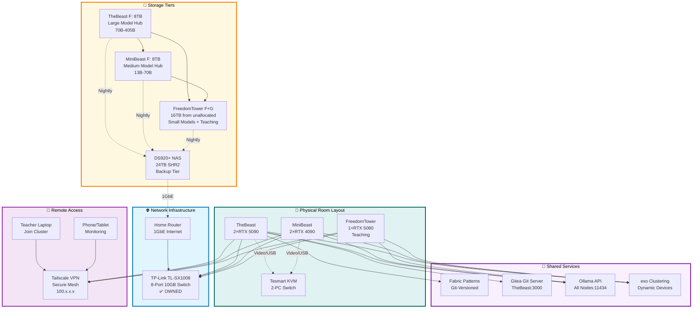
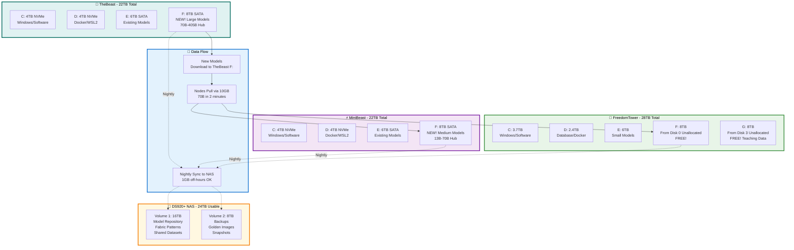
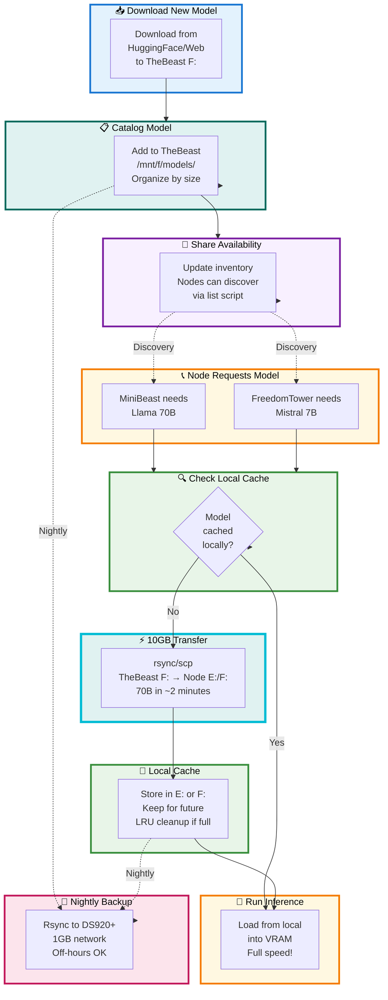

# 🚀 TheBeast AI Cluster: Complete Production Strategy v5.0 FINAL
## 3-Node Distributed LLM Inference with Hub-and-Spoke Storage Architecture

**Last Updated:** October 26, 2025  
**Version:** 5.0 - FINAL PRODUCTION READY  
**Status:** 🟢 Ready for Implementation  
**Total Investment Required:** $1,070-1,350

---
## 📋 Executive Summary

### What You're Building

A professional-grade, 3-node heterogeneous GPU cluster optimized for distributed AI inference, with TheBeast as the central model hub, intelligent caching on worker nodes, and secure remote access from anywhere.

### What You Already Own ✅

```
Hardware (No Additional Cost):
├─ 🦁 TheBeast: 2×RTX 5090, 256GB RAM
├─ ⚡ MiniBeast: 2×RTX 4090, 256GB RAM  
├─ 🗽 FreedomTower: 1×RTX 5080, 128GB RAM (Teaching)
├─ TP-Link TL-SX1008: 8-port 10GB switch
├─ Tesmart KVM: Dual monitor, 2-PC switch
├─ Synology DS920+: NAS enclosure (empty)
└─ Existing C:, D:, E: drives on all nodes

Total Value: $10,000+ ✅ OWNED
```

### What You Need to Buy 💰

```
Storage Drives:
├─ 2× 8TB SATA (TheBeast + MiniBeast F: drives): $240-300
├─ 4× 12TB SATA (DS920+ NAS array): $800-1000
└─ Cables: 3× CAT6A 8ft: $30-50

═══════════════════════════════════════
TOTAL COST: $1,070-1,350
═══════════════════════════════════════
```

### What You'll Have When Done 🎉

```
Cluster Capabilities:
├─ 5 GPUs, 128GB VRAM total
├─ 640GB system RAM
├─ 90TB usable storage (66TB local + 24TB NAS)
├─ 10Gbps inter-node bandwidth
├─ <1ms latency between nodes
├─ Secure remote access from anywhere
├─ Run models up to Llama 405B (distributed)
└─ Teaching-optimized workspace (FreedomTower)

Professional Features:
├─ Hub-and-spoke model distribution
├─ Intelligent local caching
├─ Git-versioned prompt library
├─ Automated backups (DS920+ + Acronis)
├─ Dynamic device clustering (exo)
├─ KVM for easy node switching
└─ Tailscale secure remote access
```

---

## 📋 Table of Contents

1. [🏗️ Cluster Architecture](#️-cluster-architecture)
2. [💾 Hardware Specifications](#-hardware-specifications)
3. [📦 Storage Strategy](#-storage-strategy)
4. [🌐 Network Infrastructure](#-network-infrastructure)
5. [🔧 Software Stack](#-software-stack)
6. [🔐 Remote Access (Tailscale)](#-remote-access-tailscale)
7. [📚 Shared Knowledge Base (Fabric)](#-shared-knowledge-base-fabric)
8. [⚡ Distributed Inference](#-distributed-inference)
9. [🔄 Model Distribution Workflow](#-model-distribution-workflow)
10. [🛒 Shopping List](#-shopping-list)
11. [✅ Implementation Checklist](#-implementation-checklist)
12. [📊 Performance Expectations](#-performance-expectations)

---

## 🏗️ Cluster Architecture

### Physical Layout (8 Feet Proximity)

```
Your Server Room / Office:

┌─────────────────────────────────────────┐
│                                         │
│    🦁 TheBeast        ⚡ MiniBeast      │
│    2×RTX 5090         2×RTX 4090        │
│         │                  │            │
│         └────── 🎮 ────────┘            │
│            Tesmart KVM                  │
│         (Switch Control)                │
│              ↓                           │
│      [Monitor 1] [Monitor 2]           │
│                                         │
│    🗽 FreedomTower (Teaching)          │
│    1×RTX 5080                          │
│    Own Monitor/KB/Mouse                │
│                                         │
│         ↓ (all 8ft cables) ↓           │
│                                         │
│    🔷 TP-Link TL-SX1008                │
│    8-Port 10GB Switch                  │
│              ↓                          │
│    💾 DS920+ NAS (1GbE to router)     │
│                                         │
└─────────────────────────────────────────┘

Cable Distances: All ≤ 8 feet
Switch Location: Central, equal distance to nodes
KVM: Controls TheBeast + MiniBeast only
```

### System Architecture Diagram



### Design Principles

```
1. 🦁 Hub-and-Spoke Storage
   └─ TheBeast = master model repository
   └─ MiniBeast = medium model cache
   └─ FreedomTower = small model cache + teaching

2. ⚡ 10GB Primary Network
   └─ Fast model distribution (70B in ~2 minutes)
   └─ Low latency distributed inference (<1ms)
   └─ No bottlenecks between nodes

3. 🎮 Ergonomic Control
   └─ KVM switches TheBeast ↔ MiniBeast instantly
   └─ FreedomTower independent (teaching station)
   └─ Clean workspace, minimal peripherals

4. 🌐 Secure Remote Access
   └─ Tailscale VPN overlay network
   └─ Work from anywhere (coffee shop, home, travel)
   └─ Encrypted, peer-to-peer connections

5. 📚 Centralized Knowledge
   └─ Fabric patterns on NAS (Git-backed)
   └─ All nodes share same prompt library
   └─ Version controlled, collaborative

6. 💾 Tiered Storage
   └─ Hot: Local NVMe/SATA (fast access)
   └─ Warm: Cached models (frequent use)
   └─ Cold: DS920+ (backup, archive)
   └─ Offsite: Acronis (disaster recovery)
```

---

## 💾 Hardware Specifications

### Node Comparison Matrix

| Component | 🦁 TheBeast (Node 1) | ⚡ MiniBeast (Node 2) | 🗽 FreedomTower (Node 3) |
|-----------|---------------------|----------------------|-------------------------|
| **GPU Configuration** | 2× NVIDIA RTX 5090 | 2× NVIDIA RTX 4090 | 1× NVIDIA RTX 5080 |
| **VRAM per GPU** | 32GB each | 24GB each | 16GB |
| **Total VRAM** | **64GB** 🏆 | **48GB** | **16GB** |
| **CPU** | AMD 16-core | AMD 16-core | AMD 16-core |
| **System RAM** | 256GB | 256GB | 128GB |
| **C: Drive** | 4TB NVMe Gen4 | 4TB NVMe Gen4 | 3.7TB (Disk 4) |
| **D: Drive** | 4TB NVMe Gen4 | 4TB NVMe Gen4 | 2.4TB (Disk 0) |
| **E: Drive** | 6TB SATA (existing) | 6TB SATA (existing) | 6TB (existing partitions) |
| **F: Drive** | **8TB SATA (NEW!)** | **8TB SATA (NEW!)** | **8TB (from unallocated)** |
| **G: Drive** | — | — | **8TB (from unallocated)** |
| **Total Storage** | **22TB** | **22TB** | **28TB** |
| **10GB Network** | ✅ Port 1 | ✅ Port 2 | ✅ Port 3 |
| **Tailscale Name** | thebeast | minibeast | freedomtower |
| **Current Tailscale** | ??? (to be added) | twintower2 (rename) | twintower1 (rename) |
| **Primary Role** | Model Hub, Coordinator | Heavy Compute | Teaching, Light Inference |
| **Optimal Workload** | 70B-405B models | 13B-70B models | 7B-13B models, courses |

### Total Cluster Resources

```
🎮 Graphics Processing:
├─ 5 GPUs Total
├─ 128GB Combined VRAM
│   ├─ TheBeast: 64GB (50% of cluster)
│   ├─ MiniBeast: 48GB (37.5%)
│   └─ FreedomTower: 16GB (12.5%)
└─ All CUDA 13.0+ compatible

🧮 Central Processing:
├─ 48 CPU Cores (3×16-core AMD)
├─ 640GB System RAM
│   ├─ TheBeast: 256GB
│   ├─ MiniBeast: 256GB
│   └─ FreedomTower: 128GB
└─ NVMe on all nodes for OS/containers

💾 Storage Capacity:
├─ Local Storage: 72TB raw
│   ├─ TheBeast: 22TB
│   ├─ MiniBeast: 22TB
│   └─ FreedomTower: 28TB (includes ~30TB reclaimable!)
├─ NAS Backup: 24TB (SHR2)
└─ Total Usable: ~90TB

🌐 Network:
├─ Primary: 10GB Ethernet (3 nodes)
├─ Backplane: 160Gbps (switch capacity)
├─ Latency: <1ms node-to-node
├─ NAS: 1GbE (sufficient for off-hours sync)
└─ Remote: Tailscale VPN overlay

🔌 Peripherals:
├─ Tesmart KVM (TheBeast + MiniBeast)
│   └─ 2 monitors, 1 keyboard, 1 mouse
└─ FreedomTower: Independent peripherals
```

---

## 📦 Storage Strategy

### Storage Architecture Overview



### Detailed Storage Allocation

#### 🦁 TheBeast (Node 1) - Large Model Hub

```
C: 4TB NVMe Gen4 (7000 MB/s read/write)
├─ Windows 11 Pro: 50GB
├─ Software installations: 200GB
├─ System files: 50GB
└─ Free space: 3.7TB

D: 4TB NVMe Gen4 (7000 MB/s)
├─ docker_data.vhdx: 500GB (grows as needed)
├─ ext4.vhdx (WSL2 Ubuntu 24.04): 500GB
├─ Container images: 200GB
└─ Free space: 2.8TB

E: 6TB SATA 7200 RPM (~200 MB/s)
├─ Small models (7B): 100GB
├─ Medium models (13B, 34B): 500GB
├─ Frequently accessed: 400GB
└─ Free space: 5TB
Purpose: Fast-access cache for smaller models

F: 8TB SATA 7200 RPM (NEW PURCHASE!)
├─ Llama 70B variants (FP16, Q8, Q4): 500GB
├─ Llama 405B variants: 1TB
├─ CodeLlama 70B+: 300GB
├─ Mixtral 8×7B: 200GB
├─ Custom fine-tuned large models: 2TB
├─ Reserved for future 405B quantizations: 2TB
└─ Free space: 2TB
Purpose: PRIMARY LARGE MODEL HUB
Role: Source of truth for 70B+ models
```

#### ⚡ MiniBeast (Node 2) - Medium Model Hub

```
C: 4TB NVMe Gen4
├─ Windows 11 Pro: 50GB
├─ Software: 200GB
└─ Free: 3.75TB

D: 4TB NVMe Gen4
├─ docker_data.vhdx: 500GB
├─ ext4.vhdx (WSL2): 500GB
└─ Free: 3TB

E: 6TB SATA 7200 RPM
├─ Cached models from TheBeast: 1TB
├─ Local copies for fast repeat access: 1TB
└─ Free: 4TB
Purpose: Hot cache

F: 8TB SATA 7200 RPM (NEW PURCHASE!)
├─ Llama 34B variants: 300GB
├─ Llama 13B variants: 200GB
├─ CodeLlama 34B: 150GB
├─ Mistral variants: 200GB
├─ Cached 70B models (when needed): 500GB
├─ Working space for inference outputs: 1TB
└─ Free space: 5.65TB
Purpose: MEDIUM MODEL HUB
Role: Specialized for 13B-70B range
```

#### 🗽 FreedomTower (Node 3) - Teaching Machine

```
C: 3.7TB SATA (Disk 4)
├─ Windows 11 Pro: 50GB
├─ Teaching software: 300GB
├─ Classroom applications: 150GB
└─ Free: 3.2TB

D: 2.4TB SATA (Disk 0 existing partition)
├─ Database: ~500GB
├─ Docker/WSL2: 500GB
└─ Free: 1.4TB

E: 6TB SATA (from existing partitions)
├─ Llama 7B, 13B variants: 300GB
├─ Mistral 7B variants: 100GB
├─ Small specialized models: 200GB
└─ Free: 5.4TB
Purpose: Small model inference

F: 8TB SATA (CREATE FROM DISK 0 UNALLOCATED - FREE!)
├─ Student course materials: 2TB
├─ Lecture recordings: 2TB
├─ Student project submissions: 1TB
├─ AI model cache (pulled from TheBeast): 2TB
└─ Free: 1TB
Purpose: Teaching materials + model cache
Cost: $0 (use 9.2TB unallocated on Disk 0)

G: 8TB SATA (CREATE FROM DISK 3 UNALLOCATED - FREE!)
├─ Downloads folder: 2TB
├─ Active student work: 2TB
├─ Course development: 2TB
├─ Scratch space: 1TB
└─ Free: 1TB
Purpose: Working directory for teaching
Cost: $0 (use 8.1TB unallocated on Disk 3)

Remaining Unallocated on FreedomTower:
├─ Disk 1: 3.4TB
├─ Disk 2: 7.8TB
├─ Disk 5: 1.8TB
└─ Total: ~13TB for future expansion!
```

#### 💾 DS920+ NAS - Backup & Archive Tier

```
Physical Configuration:
├─ 4× 12TB SATA drives (NEW PURCHASE!)
├─ SHR-2 (Synology Hybrid RAID with 2-drive redundancy)
├─ Raw capacity: 48TB
├─ Usable capacity: 24TB
├─ Can lose ANY 2 drives without data loss
└─ Connection: 1GbE to home router (sufficient!)

Volume 1 "Sharing" - 16TB:
├─ Master model repository: 10TB
│   ├─ ALL models (source of truth)
│   ├─ Organized: /models/7b/, /models/13b/, /models/70b/, etc.
│   └─ New downloads go here first
├─ Fabric patterns library: 10GB
│   ├─ Git repository
│   ├─ Version controlled
│   └─ Shared across all nodes
├─ Gitea repositories: 100GB
│   ├─ Code repos
│   ├─ Configuration repos
│   └─ Documentation
├─ Shared datasets: 3TB
│   ├─ Training data
│   ├─ Fine-tuning datasets
│   └─ Evaluation sets
└─ Output collection: 2TB
    ├─ Generated documents
    ├─ Analysis results
    └─ Batch processing outputs

Volume 2 "Backups" - 8TB:
├─ Golden images: 1.5TB
│   ├─ TheBeast WSL2 backup (3 versions)
│   ├─ MiniBeast WSL2 backup (3 versions)
│   └─ FreedomTower WSL2 backup (3 versions)
├─ Configuration backups: 200GB
│   ├─ Network configs
│   ├─ Docker configs
│   └─ Application configs
├─ Critical node F: drive backups: 4TB
│   ├─ TheBeast F: critical models
│   ├─ MiniBeast F: critical models
│   └─ FreedomTower F: teaching materials
└─ Incremental snapshots: 2.3TB
    ├─ Weekly full backups
    └─ Daily incrementals

Btrfs Features Enabled:
├─ Snapshots (hourly, daily, weekly)
├─ Data checksums (integrity verification)
├─ Compression (transparent, saves space)
└─ Self-healing (with SHR-2 redundancy)
```

### Storage Performance Characteristics

```
Access Speed Hierarchy:

Tier 1 - NVMe (C:, D: drives):
├─ Sequential read: 7000 MB/s
├─ Sequential write: 5000 MB/s
├─ Random IOPS: 1M+ IOPS
├─ Latency: <100 microseconds
└─ Use: OS, Docker, WSL2, hot cache

Tier 2 - SATA SSD/HDD (E:, F:, G: drives):
├─ Sequential read: 200 MB/s
├─ Sequential write: 180 MB/s
├─ Random IOPS: 100-200 IOPS
├─ Latency: 5-10ms
└─ Use: Model storage, teaching materials

Tier 3 - 10GB Network Transfer:
├─ Theoretical: 1250 MB/s (10 Gbps / 8)
├─ Actual: 1150 MB/s (9.2 Gbps sustained)
├─ Latency: <1ms between nodes
├─ Llama 70B (140GB): ~122 seconds
└─ Use: Model distribution between nodes

Tier 4 - 1GB Network to NAS:
├─ Theoretical: 125 MB/s (1 Gbps / 8)
├─ Actual: 110 MB/s (sustained)
├─ Latency: 1-2ms
├─ 8TB backup: ~20 hours (overnight OK!)
└─ Use: Off-hours backup, archive
```

### Model Storage Guidelines

```
Small Models (1-10GB) → Any E: drive:
├─ Llama 7B: ~4GB (Q4), ~14GB (FP16)
├─ Mistral 7B: ~4GB (Q4), ~14GB (FP16)
└─ Fast loading, minimal storage impact

Medium Models (10-80GB) → E: or F: drives:
├─ Llama 13B: ~7GB (Q4), ~26GB (FP16)
├─ Llama 34B: ~19GB (Q4), ~68GB (FP16)
└─ Reasonable loading times (~1-2 min from SATA)

Large Models (80-200GB) → F: drives primarily:
├─ Llama 70B: ~38GB (Q4), ~140GB (FP16)
├─ Mixtral 8×7B: ~26GB (Q4), ~90GB (FP16)
└─ Load time: 2-5 minutes from SATA, <1 min if cached in RAM

Huge Models (200GB+) → TheBeast F: only:
├─ Llama 405B: ~200GB (Q4), ~800GB (FP16)
├─ Requires distributed inference across nodes
└─ Load time: 5-15 minutes, then stays resident
```

---

## 🌐 Network Infrastructure

### Physical Network Diagram

```
Internet (ISP)
     ↓
[Home Router] 192.168.1.1
     ↓ 1GbE
     ├─ DS920+ NAS: 192.168.1.20 (1GbE - sufficient!)
     ├─ TheBeast secondary NIC: 192.168.1.11
     ├─ MiniBeast secondary NIC: 192.168.1.12
     └─ FreedomTower secondary NIC: 192.168.1.13
     
     ↓ (via router)
     
[TP-Link TL-SX1008] - 8-Port 10GB Switch ✅ OWNED
     │
     ├─ Port 1: TheBeast Primary (10.0.0.11) ← 8ft CAT6A
     ├─ Port 2: MiniBeast Primary (10.0.0.12) ← 8ft CAT6A
     ├─ Port 3: FreedomTower Primary (10.0.0.13) ← 8ft CAT6A
     ├─ Port 4-8: Reserved for expansion
     │    └─ Teacher laptop (when joining cluster)
     │    └─ Photography node (future integration)
     │    └─ Additional nodes
     │    └─ Testing/development
     └─ Backplane: 160 Gbps non-blocking
```

### IP Addressing Scheme

```
Primary Compute Network (10GB):
├─ Subnet: 10.0.0.0/24
├─ Purpose: High-speed cluster traffic only
├─ MTU: 9000 (Jumbo Frames - auto-negotiated)
│
├─ Static IPs (configure on each node):
│   ├─ TheBeast: 10.0.0.11
│   ├─ MiniBeast: 10.0.0.12
│   ├─ FreedomTower: 10.0.0.13
│   └─ Reserved: 10.0.0.20-50 for expansion
│
└─ Usage:
    ├─ Model transfers (TheBeast → nodes)
    ├─ Distributed inference (RPC traffic)
    ├─ exo cluster communication
    └─ High-bandwidth data movement

Secondary Management Network (1GB):
├─ Subnet: 192.168.1.0/24
├─ Gateway: 192.168.1.1 (home router)
├─ Purpose: Internet, management, Tailscale
│
├─ DHCP or Static:
│   ├─ TheBeast: 192.168.1.11
│   ├─ MiniBeast: 192.168.1.12
│   ├─ FreedomTower: 192.168.1.13
│   └─ DS920+: 192.168.1.20
│
└─ Usage:
    ├─ Internet access
    ├─ Software updates
    ├─ SSH management
    ├─ Tailscale VPN
    ├─ NAS backup traffic (overnight)
    └─ Web browsing, downloads

Tailscale VPN Network (Overlay):
├─ Subnet: 100.x.x.x/32 (auto-assigned by Tailscale)
├─ Purpose: Secure remote access from anywhere
│
├─ Hostnames (after cleanup):
│   ├─ thebeast → 100.64.0.1 (example)
│   ├─ minibeast → 100.64.0.2
│   ├─ freedomtower → 100.64.0.3
│   ├─ peterds920 → 100.64.0.20 (NAS)
│   ├─ teacher → 100.64.0.10 (laptop)
│   └─ ph-samsung → 100.64.0.30 (phone)
│
└─ Usage:
    ├─ Remote SSH access
    ├─ Remote Ollama API access
    ├─ Remote Gitea access
    ├─ Cluster monitoring
    └─ Work from anywhere securely
```

### Network Configuration Scripts

#### Configure Static IP on Primary NIC (10GB)

```bash
# Run on each node in WSL2
# /home/pheller/scripts/setup-primary-network.sh

#!/bin/bash
# Configure static IP on primary 10GB interface

NODE_NAME=$(hostname)

case $NODE_NAME in
    thebeast*)
        IP="10.0.0.11"
        ;;
    minibeast*|twintower2*)
        IP="10.0.0.12"
        ;;
    freedomtower*|twintower1*)
        IP="10.0.0.13"
        ;;
    *)
        echo "Unknown node: $NODE_NAME"
        exit 1
        ;;
esac

# Find the 10GB interface (usually eth0 in WSL2)
INTERFACE="eth0"

# Configure static IP (add to /etc/netplan/ or /etc/network/interfaces)
sudo tee /etc/netplan/01-primary-network.yaml > /dev/null <<EOF
network:
  version: 2
  ethernets:
    ${INTERFACE}:
      addresses:
        - ${IP}/24
      nameservers:
        addresses:
          - 8.8.8.8
          - 8.8.4.4
      mtu: 9000
EOF

# Apply configuration
sudo netplan apply

echo "✅ Configured ${NODE_NAME} with IP ${IP}"
echo "Test with: ping 10.0.0.11"
```

### Network Performance Testing

```bash
# Test 10GB network speed between nodes
# Run on one node (e.g., TheBeast)

# Install iperf3 if not already installed
sudo apt install -y iperf3

# Start iperf3 server on MiniBeast
ssh minibeast "iperf3 -s -D"

# Test from TheBeast to MiniBeast
iperf3 -c 10.0.0.12 -t 30 -P 4

# Expected results:
# [ ID] Interval           Transfer     Bitrate
# [SUM]   0.00-30.00 sec  32.5 GBytes  9.30 Gbits/sec

# Test latency
ping -c 100 10.0.0.12
# Expected: <1ms average

# Test jumbo frames
ping -c 10 -M do -s 8972 10.0.0.12
# Expected: 0% packet loss
```

---

## 🔧 Software Stack

### Identical Software on All Nodes

```
Layer 8 - Remote Access:
└─ Tailscale VPN
   ├─ Version: Latest stable
   ├─ Protocol: WireGuard
   └─ Purpose: Secure remote access from anywhere

Layer 7 - Applications:
├─ Fabric (danielmiessler/fabric)
│   └─ Pattern library for AI interactions
├─ llama.cpp (distributed inference)
│   └─ High-performance LLM serving
└─ exo (exo-explore/exo)
    └─ Dynamic device clustering

Layer 6 - AI Frameworks:
├─ Ollama (latest stable)
│   └─ Easy model hosting and API
└─ PyTorch 2.x + CUDA bindings
    └─ For custom inference/training

Layer 5 - Services:
├─ Docker Desktop (latest, WSL2 backend)
│   └─ Container orchestration
├─ Gitea (Docker container, TheBeast only)
│   └─ Self-hosted Git server
└─ OpenSSH Server
    └─ Passwordless key-based auth

Layer 4 - Compute Environment:
├─ WSL2 with Ubuntu 24.04 LTS
│   └─ Linux environment in Windows
└─ CUDA 13.0+ (WSL2 installation)
    └─ GPU compute framework

Layer 3 - GPU Drivers:
└─ NVIDIA Driver 560.x+ (latest Game Ready)
    ├─ Windows installation (passes through to WSL2)
    └─ Supports RTX 5090, 5080, 4090

Layer 2 - Virtualization:
└─ Hyper-V + WSL2 kernel
    └─ Native Windows virtualization

Layer 1 - Operating System:
└─ Windows 11 Pro 23H2 or later
    └─ Fully updated via Windows Update
```

### Software Installation Order

```
Phase 1: Base OS (Already Done ✅)
├─ Windows 11 Pro installed
├─ Latest updates applied
└─ Drivers installed

Phase 2: Virtualization & WSL2
├─ Enable Hyper-V
├─ Enable WSL2
├─ Install Ubuntu 24.04 from Microsoft Store
└─ Configure WSL2 memory limits

Phase 3: GPU Support
├─ Install NVIDIA driver (Windows)
├─ Install CUDA 13.0 (WSL2)
├─ Verify: nvidia-smi works in WSL2
└─ Test: Simple CUDA program

Phase 4: Containers
├─ Install Docker Desktop
├─ Enable WSL2 backend
├─ Configure GPU passthrough
└─ Test: docker run --gpus all nvidia/cuda:12.0-base nvidia-smi

Phase 5: AI Frameworks
├─ Install Ollama (curl https://ollama.com/install.sh | sh)
├─ Install Go 1.23+ (for Fabric)
├─ Install Fabric (go install github.com/danielmiessler/fabric@latest)
├─ Clone llama.cpp, compile with CUDA support
└─ Clone exo, install dependencies

Phase 6: Networking & Remote Access
├─ Install Tailscale (Windows + WSL2)
├─ Configure SSH keys (passwordless auth)
├─ Set up static IPs on 10GB network
└─ Test: SSH between nodes without password

Phase 7: Storage & Backup
├─ Install new F: drives (TheBeast, MiniBeast)
├─ Create F: and G: partitions (FreedomTower)
├─ Mount drives in WSL2 (/etc/fstab)
├─ Set up DS920+ with SHR2
└─ Configure nightly rsync to NAS

Phase 8: Services (TheBeast Only)
├─ Start Gitea container
├─ Create fabric-patterns repository
├─ Mount NAS shares on all nodes
└─ Symlink ~/.config/fabric to NAS

Phase 9: Testing & Validation
├─ Test 10GB network (iperf3)
├─ Test model loading (Ollama)
├─ Test distributed inference (llama.cpp)
├─ Test remote access (Tailscale)
└─ Document baseline performance
```

---

## 🔐 Remote Access (Tailscale)

### Current Tailscale Network (Needs Cleanup)

```
Current State (from your screenshot):
├─ twintower1 → FreedomTower ✅
├─ twintower1-1 → Duplicate (remove)
├─ twintower1-ai-ssh → Duplicate (remove)
├─ twintower2 → MiniBeast ✅
├─ twintower2-ollama-ai → Duplicate (remove)
├─ ??? → TheBeast (not visible, needs to be added)
├─ peterds920 → DS920+ NAS ✅
├─ photography → Photography node ✅
├─ teacher → Teacher laptop ✅
└─ ph-samsung, samsung-sm-s938u, ph-ipad → Mobile devices ✅

Issues:
❌ Multiple entries per machine (duplicates)
❌ Confusing names (twintower1, twintower2)
❌ TheBeast not visible
```

### Target Clean Tailscale Network

```
After Cleanup:
├─ thebeast → TheBeast (Node 1) ✅
├─ minibeast → MiniBeast (Node 2) ✅
├─ freedomtower → FreedomTower (Node 3) ✅
├─ peterds920 → DS920+ NAS ✅
├─ photography → Photography workstation ✅
├─ teacher → Teacher laptop (can join cluster) ✅
├─ ph-samsung → Samsung phone ✅
└─ ph-ipad → iPad ✅

Total: 8 devices (clean, no duplicates)
```

### Tailscale Cleanup & Setup Steps

#### Step 1: Remove Duplicate Entries

```
Go to Tailscale Admin Console:
https://login.tailscale.com/admin/machines

Remove these devices:
├─ [ ] twintower1-1 (click ... → Remove device)
├─ [ ] twintower1-ai-ssh (click ... → Remove device)
└─ [ ] twintower2-ollama-ai (click ... → Remove device)

Why duplicates happen:
- Installing Tailscale in both Windows AND WSL2
- Not removing old installations before reinstalling
- Multiple user accounts or containers

Solution: Keep only ONE Tailscale per machine (recommend WSL2)
```

#### Step 2: Rename Existing Nodes

```bash
# On MiniBeast (currently twintower2)
sudo tailscale set --hostname minibeast

# On FreedomTower (currently twintower1)
sudo tailscale set --hostname freedomtower

# Verify
tailscale status
# Should show new hostname
```

#### Step 3: Add/Configure TheBeast

```bash
# On TheBeast (if Tailscale not installed)

# Install Tailscale in WSL2
curl -fsSL https://pkgs.tailscale.com/stable/ubuntu/noble.noarmor.gpg | \
    sudo tee /usr/share/keyrings/tailscale-archive-keyring.gpg >/dev/null

curl -fsSL https://pkgs.tailscale.com/stable/ubuntu/noble.tailscale-keyring.list | \
    sudo tee /etc/apt/sources.list.d/tailscale.list

sudo apt update
sudo apt install -y tailscale

# Start Tailscale with SSH support
sudo tailscale up --ssh --hostname thebeast

# Verify
tailscale status
tailscale ip -4
# Should show: 100.x.x.x
```

#### Step 4: Enable Tailscale SSH (All Nodes)

```bash
# On each node, enable Tailscale SSH for easy remote access

sudo tailscale up --ssh

# Now you can SSH from anywhere using Tailscale hostnames:
# From laptop: ssh thebeast
# From phone (with SSH app): ssh minibeast
# No passwords, uses Tailscale authentication
```

### Remote Access Usage Examples

#### Access Ollama API Remotely

```bash
# From your laptop at a coffee shop

# List models on TheBeast
curl http://thebeast:11434/api/tags

# Generate with model on MiniBeast
curl http://minibeast:11434/api/generate -d '{
  "model": "llama3.1:70b",
  "prompt": "Explain quantum computing"
}'

# Use with Fabric from anywhere
echo "Explain AI clusters" | \
    fabric --pattern explain \
    --vendor Ollama \
    --url http://thebeast:11434
```

#### SSH to Nodes

```bash
# From anywhere (laptop, phone with SSH app)

# SSH to TheBeast
ssh pheller@thebeast
# or just: ssh thebeast (if Tailscale SSH enabled)

# SSH to MiniBeast
ssh minibeast

# SSH to FreedomTower
ssh freedomtower

# Run commands remotely
ssh thebeast "nvidia-smi"
ssh minibeast "docker ps"
ssh freedomtower "df -h"
```

#### Access Gitea Web UI

```
From any device on Tailscale network:

Browser: http://thebeast:3000
Username: (your Gitea account)
Password: (your Gitea password)

- View repositories
- Clone repos: git clone http://thebeast:3000/admin/fabric-patterns.git
- Push changes from remote laptop
- Review code from phone/tablet
```

#### Monitor Cluster Status

```bash
# From your phone using Termux or similar

# Check GPU usage across all nodes
for node in thebeast minibeast freedomtower; do
    echo "=== $node ==="
    ssh $node nvidia-smi --query-gpu=name,utilization.gpu,memory.used,memory.total --format=csv
done

# Check disk usage
for node in thebeast minibeast freedomtower; do
    echo "=== $node ==="
    ssh $node df -h /mnt/f
done

# Check running containers
for node in thebeast minibeast freedomtower; do
    echo "=== $node ==="
    ssh $node docker ps
done
```

---

## 📚 Shared Knowledge Base (Fabric)

### Fabric Pattern Library Architecture

```
Storage Location: DS920+ NAS
Path: \\peterds920\Volume1\fabric-patterns\

Structure:
fabric-patterns/
├── .git/                    (Git repository)
├── patterns/
│   ├── summarize/
│   │   ├── system.md        (system prompt)
│   │   └── user.md          (user prompt template)
│   ├── extract_wisdom/
│   ├── analyze_code/
│   ├── explain/
│   └── custom/
│       ├── company_analysis/
│       ├── research_synthesis/
│       ├── teaching_outline/
│       └── student_feedback/
├── context/
│   ├── project_history.md
│   ├── coding_standards.md
│   ├── teaching_guidelines.md
│   └── research_topics.md
├── .gitignore
└── README.md

Accessed By: All 3 nodes + remote devices via Tailscale
Version Control: Git (via Gitea on TheBeast)
Updates: Push from any node, pull on others
```

### Setup Fabric on All Nodes

```bash
# On each node (TheBeast, MiniBeast, FreedomTower)

# Install Go (required for Fabric)
cd /tmp
wget https://go.dev/dl/go1.23.5.linux-amd64.tar.gz
sudo tar -C /usr/local -xzf go1.23.5.linux-amd64.tar.gz
echo 'export PATH=$PATH:/usr/local/go/bin' >> ~/.bashrc
echo 'export PATH=$PATH:~/go/bin' >> ~/.bashrc
source ~/.bashrc

# Install Fabric
go install github.com/danielmiessler/fabric@latest

# Verify
fabric --version

# Mount NAS (if not already mounted)
sudo mkdir -p /mnt/nas
sudo mount -t drvfs '\\peterds920\Volume1' /mnt/nas

# OR add to /etc/fstab for automatic mount:
echo '\\peterds920\Volume1 /mnt/nas drvfs defaults 0 0' | sudo tee -a /etc/fstab

# Symlink Fabric config to NAS
rm -rf ~/.config/fabric
ln -s /mnt/nas/fabric-patterns ~/.config/fabric

# Test
fabric --listpatterns
# Should show all patterns from NAS

# Configure Ollama as default vendor
fabric --setup
# When prompted:
# - Default vendor: Ollama
# - Ollama URL: http://localhost:11434 (or http://thebeast:11434 for remote)
# - Default model: llama3.1:70b
```

### Gitea Git Server (TheBeast Only)

```bash
# On TheBeast

# Create directory for Gitea data (use F: drive for storage)
mkdir -p /mnt/f/gitea-data

# Run Gitea container
docker run -d \
    --name gitea \
    --restart=always \
    -p 3000:3000 \
    -p 222:22 \
    -v /mnt/f/gitea-data:/data \
    -v /etc/timezone:/etc/timezone:ro \
    -v /etc/localtime:/etc/localtime:ro \
    -e USER_UID=1000 \
    -e USER_GID=1000 \
    gitea/gitea:latest

# Access web UI
# Local: http://10.0.0.11:3000
# Remote (Tailscale): http://thebeast:3000

# Initial setup (web UI):
# 1. Database: SQLite (default, simple)
# 2. Server domain: thebeast
# 3. SSH port: 222
# 4. HTTP port: 3000
# 5. Application URL: http://thebeast:3000
# 6. Create admin account
# 7. Disable self-registration (optional)

# Create fabric-patterns repository
# 1. Click "+" → New Repository
# 2. Name: fabric-patterns
# 3. Description: Shared AI prompt patterns
# 4. Initialize with README: Yes
# 5. .gitignore: None
# 6. License: MIT (or your choice)
# 7. Create Repository

# Initialize patterns in repository
cd /mnt/nas/fabric-patterns
git init
git remote add origin http://thebeast:3000/admin/fabric-patterns.git
git add .
git commit -m "Initial fabric pattern library"
git branch -M main
git push -u origin main

# Now all nodes can clone/pull/push
cd ~/
git clone http://thebeast:3000/admin/fabric-patterns.git
cd fabric-patterns
# Make changes
git add .
git commit -m "Added teaching_outline pattern"
git push
```

### Using Fabric with Shared Patterns

```bash
# Example 1: Summarize a document
cat long-article.txt | fabric --pattern summarize

# Example 2: Extract wisdom from a podcast transcript
cat podcast-transcript.txt | fabric --pattern extract_wisdom

# Example 3: Use custom teaching pattern
cat student-essay.txt | fabric --pattern teaching/student_feedback

# Example 4: Remote usage (from teacher laptop via Tailscale)
cat research-paper.pdf | pdftotext - - | \
    fabric --pattern research_synthesis \
    --vendor Ollama \
    --url http://thebeast:11434

# Example 5: Chain patterns
cat code.py | \
    fabric --pattern analyze_code | \
    fabric --pattern summarize

# All patterns are shared across all nodes!
# Changes pushed to Git are instantly available
```

---

## ⚡ Distributed Inference

### llama.cpp Distributed Architecture

```
Distributed Inference Setup:

┌─────────────────────────────────────┐
│  TheBeast (Master/Coordinator)      │
│  - Loads model from F: drive       │
│  - Splits layers across GPUs       │
│  - HTTP API on :8080               │
│  - Controls RPC workers            │
└─────────────────────────────────────┘
         ↓ (10GB network)
    ┌────┴────┐
    ↓         ↓
┌─────────┐ ┌─────────┐
│MiniBeast│ │Freedom  │
│RPC      │ │RPC      │
│:50052   │ │:50052   │
│2×4090   │ │1×5080   │
└─────────┘ └─────────┘

Workflow:
1. User requests inference (TheBeast:8080)
2. TheBeast loads model from F:/models/
3. Splits layers across 5 GPUs:
   - TheBeast: Layers 1-40 (2×5090)
   - MiniBeast: Layers 41-70 (2×4090)
   - FreedomTower: Layers 71-80 (1×5080)
4. Forward pass flows through network
5. Response returned to user

Benefits:
✅ Run 70B models across all GPUs
✅ Run 405B models (distributed)
✅ <1ms latency between nodes
✅ Efficient VRAM utilization
```

### Install llama.cpp (All Nodes)

```bash
# On each node (TheBeast, MiniBeast, FreedomTower)

# Install build dependencies
sudo apt update
sudo apt install -y build-essential cmake git

# Clone llama.cpp
cd ~
git clone https://github.com/ggerganov/llama.cpp.git
cd llama.cpp

# Build with CUDA support
mkdir build && cd build
cmake .. \
    -DLLAMA_CUBLAS=ON \
    -DCMAKE_CUDA_ARCHITECTURES="89" \
    -DCMAKE_BUILD_TYPE=Release

make -j$(nproc)

# Install binaries
sudo cp bin/* /usr/local/bin/

# Verify
llama-server --version
llama-rpc-server --version
```

### Start Distributed Inference

#### Step 1: Start RPC Workers (MiniBeast & FreedomTower)

```bash
# On MiniBeast
llama-rpc-server \
    --port 50052 \
    --host 10.0.0.12 \
    --n-gpu-layers -1

# On FreedomTower
llama-rpc-server \
    --port 50052 \
    --host 10.0.0.13 \
    --n-gpu-layers -1
```

#### Step 2: Start Master Server (TheBeast)

```bash
# On TheBeast

# Load Llama 70B from F: drive, distribute across cluster
llama-server \
    --model /mnt/f/models/llama-70b-fp16.gguf \
    --ctx-size 8192 \
    --n-gpu-layers 80 \
    --tensor-split 36,27,17 \
    --rpc 10.0.0.12:50052,10.0.0.13:50052 \
    --parallel 4 \
    --port 8080 \
    --host 10.0.0.11

# Tensor split explanation:
# 36% → TheBeast (2×5090 = 64GB VRAM)
# 27% → MiniBeast (2×4090 = 48GB VRAM)
# 17% → FreedomTower (1×5080 = 16GB VRAM)
# Total: 80% of model on GPUs, 20% in system RAM
```

#### Step 3: Test Inference

```bash
# From any node or remote device

curl http://thebeast:8080/v1/chat/completions \
    -H "Content-Type: application/json" \
    -d '{
        "messages": [
            {"role": "system", "content": "You are a helpful AI assistant."},
            {"role": "user", "content": "Explain distributed inference."}
        ],
        "temperature": 0.7,
        "max_tokens": 500
    }'

# Monitor GPU usage during inference
# On TheBeast:
watch -n 1 nvidia-smi

# On MiniBeast:
ssh minibeast watch -n 1 nvidia-smi

# On FreedomTower:
ssh freedomtower watch -n 1 nvidia-smi

# All GPUs should show utilization during inference!
```

### exo Framework for Dynamic Clustering

```bash
# Install exo on all nodes
cd ~
git clone https://github.com/exo-explore/exo.git
cd exo
pip install --break-system-packages -e .

# Start coordinator (TheBeast)
cd ~/exo
python3 -m exo.main \
    --node-id thebeast \
    --node-port 5000 \
    --listen-port 5001 \
    --chatgpt-api-port 8000

# Start workers (MiniBeast, FreedomTower)
# They auto-discover the coordinator
cd ~/exo
python3 -m exo.main \
    --node-id minibeast \
    --node-port 5000 \
    --listen-port 5001

# Test from remote device
curl http://thebeast:8000/v1/chat/completions \
    -H "Content-Type: application/json" \
    -d '{
        "model": "llama-70b",
        "messages": [{"role": "user", "content": "Hello exo!"}]
    }'

# exo automatically shards model across available devices!
# Teacher laptop can join via Tailscale when connected
```

---

## 🔄 Model Distribution Workflow

### Hub-and-Spoke Model Distribution



### Model Distribution Scripts

Create these scripts in `/home/pheller/scripts/` on all nodes:

#### 1. List Available Models (All Nodes)

```bash
#!/bin/bash
# /home/pheller/scripts/list-models.sh
# List all models available on TheBeast hub

THEBEAST="10.0.0.11"

echo "🦁 Models available on TheBeast hub:"
echo "══════════════════════════════════════════════════════"

ssh pheller@${THEBEAST} "ls -lh /mnt/f/models/*.gguf /mnt/e/models/*.gguf 2>/dev/null" | \
    awk '{printf "%-40s %10s\n", $9, $5}' | \
    sed 's|/mnt/[ef]/models/||g'

echo ""
echo "Pull model with: ./pull-model.sh <model-name>"
```

#### 2. Pull Model from Hub (MiniBeast, FreedomTower)

```bash
#!/bin/bash
# /home/pheller/scripts/pull-model.sh
# Pull model from TheBeast to local cache

MODEL=$1
THEBEAST="10.0.0.11"

if [ -z "$MODEL" ]; then
    echo "Usage: ./pull-model.sh <model-name>"
    echo "Example: ./pull-model.sh llama-70b-q4.gguf"
    exit 1
fi

# Check if already cached in E:
if [ -f "/mnt/e/models/$MODEL" ]; then
    echo "✅ Model already in E: cache: /mnt/e/models/$MODEL"
    exit 0
fi

# Check if already cached in F:
if [ -f "/mnt/f/models/$MODEL" ]; then
    echo "✅ Model already in F: cache: /mnt/f/models/$MODEL"
    exit 0
fi

# Determine best storage location
FREE_E=$(df /mnt/e | tail -1 | awk '{print $4}')
FREE_F=$(df /mnt/f 2>/dev/null | tail -1 | awk '{print $4}')

# Try to estimate model size
MODEL_SIZE=$(ssh pheller@${THEBEAST} \
    "du -k /mnt/f/models/$MODEL /mnt/e/models/$MODEL 2>/dev/null | head -1 | cut -f1")

if [ -z "$MODEL_SIZE" ]; then
    echo "❌ Model not found on TheBeast: $MODEL"
    echo "Available models:"
    ./list-models.sh
    exit 1
fi

# Choose destination (prefer E: for speed, F: if E: full)
if [ "$FREE_E" -gt "$MODEL_SIZE" ]; then
    DEST="/mnt/e/models"
    echo "💾 Storing in E: (faster access)"
elif [ "$FREE_F" -gt "$MODEL_SIZE" ]; then
    DEST="/mnt/f/models"
    echo "💾 Storing in F:"
else
    echo "❌ Not enough space in E: or F:"
    df -h /mnt/e /mnt/f
    exit 1
fi

# Create directory if needed
mkdir -p $DEST

# Pull model via rsync over 10GB network
echo "📥 Pulling $MODEL from TheBeast..."
echo "Size: $(echo $MODEL_SIZE | awk '{printf "%.2f GB", $1/1024/1024}')"

rsync -avz --progress \
    -e "ssh -o StrictHostKeyChecking=no" \
    pheller@${THEBEAST}:/mnt/f/models/$MODEL \
    pheller@${THEBEAST}:/mnt/e/models/$MODEL \
    $DEST/ 2>/dev/null

if [ $? -eq 0 ]; then
    echo "✅ Model downloaded and cached: $DEST/$MODEL"
    echo "Load with: ollama run $MODEL"
else
    echo "❌ Transfer failed"
    exit 1
fi
```

#### 3. Share Model to Nodes (TheBeast Only)

```bash
#!/bin/bash
# /home/pheller/scripts/share-model.sh
# Share model from TheBeast to specific node

MODEL=$1
NODE=$2

if [ -z "$MODEL" ] || [ -z "$NODE" ]; then
    echo "Usage: ./share-model.sh <model-path> <minibeast|freedomtower>"
    exit 1
fi

case $NODE in
    minibeast)
        TARGET="10.0.0.12"
        ;;
    freedomtower)
        TARGET="10.0.0.13"
        ;;
    *)
        echo "Invalid node: $NODE"
        echo "Valid options: minibeast, freedomtower"
        exit 1
        ;;
esac

echo "📤 Sharing $MODEL to $NODE..."

rsync -avz --progress \
    -e "ssh -o StrictHostKeyChecking=no" \
    "$MODEL" \
    pheller@${TARGET}:/mnt/e/models/

echo "✅ Model transferred to $NODE"
echo "On $NODE: /mnt/e/models/$(basename $MODEL)"
```

#### 4. Nightly Backup Script (All Nodes)

```bash
#!/bin/bash
# /home/pheller/scripts/nightly-backup.sh
# Backup F: drive to DS920+ NAS

NODE=$(hostname | sed 's/\..*//') # Get short hostname
NAS_IP="192.168.1.20"
NAS_PATH="//peterds920/Volume2/backups/$NODE"

echo "🌙 Starting nightly backup for $NODE"
echo "Time: $(date)"

# Mount NAS backup volume if not mounted
if ! mountpoint -q /mnt/nas-backup; then
    sudo mkdir -p /mnt/nas-backup
    sudo mount -t drvfs "$NAS_PATH" /mnt/nas-backup
fi

# Backup F: drive
if [ -d "/mnt/f" ]; then
    echo "📦 Backing up F: drive..."
    rsync -avz --delete --progress \
        /mnt/f/ \
        /mnt/nas-backup/f-drive/
fi

# Backup important configs
echo "⚙️  Backing up configurations..."
mkdir -p /mnt/nas-backup/configs
rsync -avz --progress \
    ~/.config/fabric/ \
    ~/.ssh/ \
    ~/scripts/ \
    /mnt/nas-backup/configs/

echo "✅ Backup completed: $(date)"
echo "Location: $NAS_PATH"

# Log
echo "$(date): Backup completed successfully" >> /var/log/nas-backup.log
```

#### 5. Make Scripts Executable

```bash
# On each node
cd ~/scripts
chmod +x *.sh

# Test
./list-models.sh
```

---

## 🛒 Shopping List

### Priority 1: Storage Drives for Nodes

```
TheBeast F: Drive:
├─ Product: WD Red Plus 8TB SATA 7200 RPM
├─ Model: WD80EFPX
├─ Specs: 3.5", SATA 6Gb/s, 256MB cache, CMR
├─ Price: ~$120-150
├─ Where: Amazon, Newegg, B&H Photo
└─ Quantity: 1

MiniBeast F: Drive:
├─ Product: WD Red Plus 8TB SATA 7200 RPM
├─ Model: WD80EFPX
├─ Specs: Same as above
├─ Price: ~$120-150
├─ Where: Amazon, Newegg, B&H Photo
└─ Quantity: 1

FreedomTower F: & G: Drives:
├─ Cost: $0 (use 30TB unallocated space!)
└─ No purchase needed ✅

Subtotal: $240-300
```

### Priority 2: NAS Storage Drives

```
DS920+ Storage Array:
├─ Product: WD Red Plus 12TB SATA 7200 RPM
├─ Model: WD120EFBX
├─ Specs: 3.5", SATA 6Gb/s, 256MB cache, CMR
├─ Price: ~$200-250 each
├─ Where: Amazon, Newegg, B&H Photo
├─ Quantity: 4
└─ Subtotal: $800-1000

Alternative:
├─ Product: Seagate IronWolf 12TB
├─ Model: ST12000VN0008
├─ Price: Similar (~$220-260 each)
└─ Both WD and Seagate are excellent for NAS

Configuration: SHR-2 (2-drive redundancy)
├─ Raw: 48TB (4×12TB)
├─ Usable: 24TB
└─ Can lose ANY 2 drives without data loss

Subtotal: $800-1000
```

### Priority 3: Network Cables (If Needed)

```
CAT6A Ethernet Cables:
├─ Product: Monoprice SlimRun Cat6A 8ft (or similar)
├─ Specs: 10GBASE-T certified, 26AWG, snagless
├─ Price: ~$10-15 each
├─ Where: Monoprice.com, Amazon
├─ Quantity: 3 (one per node to switch)
└─ Subtotal: $30-50

Note: You may already have these! ✅
Check existing cables - if CAT6 or better and ≤25ft, they'll work for 10GB.

Subtotal: $30-50 (or $0 if you have them)
```

### Total Cost Summary

```
═══════════════════════════════════════════════════
SHOPPING LIST TOTAL
═══════════════════════════════════════════════════

Storage Drives:
├─ 2× 8TB SATA (TheBeast + MiniBeast): $240-300
├─ 4× 12TB SATA (DS920+ NAS): $800-1000
└─ FreedomTower: $0 (use unallocated)

Network:
├─ 3× CAT6A 8ft cables: $30-50
└─ (or $0 if you already have them)

───────────────────────────────────────────────────
TOTAL: $1,070-1,350
───────────────────────────────────────────────────

What You Already Own (No Cost):
├─ TP-Link TL-SX1008 switch: ✅ $250 value
├─ Tesmart KVM: ✅ $330 value
├─ 3 complete nodes: ✅ $8,000+ value
├─ DS920+ enclosure: ✅ $500 value
├─ Existing C, D, E drives: ✅ $1,000+ value
└─ Total owned: ~$10,000 ✅

New Investment: $1,070-1,350
Total System Value: $11,000-11,500+
```

### Recommended Purchase Order

```
Week 1:
├─ [ ] Order 2× 8TB drives (TheBeast + MiniBeast)
├─ [ ] Order 4× 12TB drives (DS920+)
└─ [ ] Order CAT6A cables if needed

Week 2 (Drives Arrive):
├─ [ ] Install 8TB drives in nodes
├─ [ ] Install 12TB drives in DS920+
└─ [ ] Connect cables to switch

Week 2-3 (Software Setup):
├─ [ ] Format new drives
├─ [ ] Configure DS920+ SHR2
├─ [ ] Create FreedomTower partitions
├─ [ ] Install software stack
└─ [ ] Test and validate

Total Timeline: 2-3 weeks from order to production
```

---

## ✅ Implementation Checklist

### Phase 1: Hardware Preparation (Week 1)

```
Purchase Hardware:
├─ [ ] Order 2× WD Red Plus 8TB (TheBeast + MiniBeast)
├─ [ ] Order 4× WD Red Plus/IronWolf 12TB (DS920+)
├─ [ ] Order 3× CAT6A 8ft cables (if needed)
└─ Estimated delivery: 3-5 days

While Waiting:
├─ [ ] Document current storage usage (df -h)
├─ [ ] Backup important data (Acronis)
├─ [ ] Update all nodes (Windows Update)
├─ [ ] Update WSL2 (wsl --update)
└─ [ ] Clean up disk space if needed
```

### Phase 2: Physical Installation (Week 2, Day 1-2)

```
Install 8TB Drives (TheBeast & MiniBeast):
├─ [ ] Power off TheBeast
├─ [ ] Open case, install 8TB drive in empty bay
├─ [ ] Connect SATA data cable to motherboard
├─ [ ] Connect SATA power cable from PSU
├─ [ ] Close case, power on
├─ [ ] Boot to BIOS, verify drive detected
├─ [ ] Repeat for MiniBeast
└─ Time: 30 minutes per node

Windows Disk Setup:
├─ [ ] TheBeast: Open Disk Management
├─ [ ] Initialize new 8TB drive as GPT
├─ [ ] Create new simple volume (full capacity)
├─ [ ] Format as NTFS, label "AI_Models_Hub"
├─ [ ] Assign drive letter F:
├─ [ ] Repeat for MiniBeast
└─ Time: 15 minutes per node

Install 12TB Drives in DS920+:
├─ [ ] Power off DS920+
├─ [ ] Remove drive trays
├─ [ ] Install 12TB drives in all 4 trays (secure with screws)
├─ [ ] Insert trays into bays 1-4
├─ [ ] Power on DS920+
└─ Time: 20 minutes

Configure DS920+ Storage:
├─ [ ] Access DSM via browser (http://192.168.1.20)
├─ [ ] Storage Manager → Create Storage Pool
├─ [ ] Select all 4 drives
├─ [ ] Choose SHR-2 (2-drive redundancy)
├─ [ ] Create Volume 1 "Sharing" (16TB, Btrfs)
├─ [ ] Create Volume 2 "Backups" (8TB, Btrfs)
├─ [ ] Enable snapshots on both volumes
├─ [ ] Create shared folders:
│   ├─ models (Volume 1)
│   ├─ fabric-patterns (Volume 1)
│   └─ backups (Volume 2)
└─ Time: 1-2 hours (includes array build)

Create FreedomTower Partitions (FREE!):
├─ [ ] Open Disk Management on FreedomTower
├─ [ ] Right-click Disk 0 unallocated (9.2TB) → New Simple Volume
├─ [ ] Size: 8TB (8192000 MB)
├─ [ ] Format: NTFS, Label: "Models_Cache"
├─ [ ] Assign drive letter: F:
├─ [ ] Right-click Disk 3 unallocated (8.1TB) → New Simple Volume
├─ [ ] Size: 8TB
├─ [ ] Format: NTFS, Label: "Teaching_Data"
├─ [ ] Assign drive letter: G:
├─ [ ] Verify in Explorer: F: and G: appear
└─ Time: 20 minutes

Network Cabling:
├─ [ ] Connect TheBeast to Switch Port 1 (CAT6A 8ft)
├─ [ ] Connect MiniBeast to Switch Port 2 (CAT6A 8ft)
├─ [ ] Connect FreedomTower to Switch Port 3 (CAT6A 8ft)
├─ [ ] Verify all port LEDs are lit (green/amber)
└─ Time: 15 minutes

Total Phase 2 Time: 4-6 hours
```

### Phase 3: WSL2 Storage Configuration (Week 2, Day 3)

```
Mount New Drives in WSL2 (All Nodes):
├─ [ ] Open WSL2 on each node
├─ [ ] Create mount points:
│   └─ sudo mkdir -p /mnt/f /mnt/g
├─ [ ] Edit /etc/fstab (TheBeast):
│   └─ F: /mnt/f drvfs defaults 0 0
├─ [ ] Edit /etc/fstab (MiniBeast):
│   └─ F: /mnt/f drvfs defaults 0 0
├─ [ ] Edit /etc/fstab (FreedomTower):
│   └─ F: /mnt/f drvfs defaults 0 0
│   └─ G: /mnt/g drvfs defaults 0 0
├─ [ ] Mount all: sudo mount -a
├─ [ ] Verify: df -h /mnt/f /mnt/g
├─ [ ] Test write: echo "test" > /mnt/f/test.txt
└─ Time: 10 minutes per node

Mount NAS Shares (All Nodes):
├─ [ ] Install cifs-utils: sudo apt install -y cifs-utils
├─ [ ] Create mount point: sudo mkdir -p /mnt/nas
├─ [ ] Mount NAS (temporary test):
│   └─ sudo mount -t drvfs '\\peterds920\Volume1' /mnt/nas
├─ [ ] Verify: ls /mnt/nas
├─ [ ] Add to /etc/fstab for automatic mount:
│   └─ \\peterds920\Volume1 /mnt/nas drvfs defaults 0 0
├─ [ ] Remount: sudo mount -a
└─ Time: 10 minutes per node

Create Directory Structure:
# On TheBeast
mkdir -p /mnt/f/models/{7b,13b,34b,70b,405b}
mkdir -p /mnt/f/outputs
mkdir -p /mnt/f/gitea-data

# On MiniBeast
mkdir -p /mnt/f/models
mkdir -p /mnt/f/cache

# On FreedomTower
mkdir -p /mnt/f/models
mkdir -p /mnt/f/teaching/courses
mkdir -p /mnt/f/teaching/students
mkdir -p /mnt/g/downloads
mkdir -p /mnt/g/active-work

# On DS920+ NAS (via NFS/SMB)
# Already created in DSM shared folders

Total Phase 3 Time: 1-2 hours
```

### Phase 4: Network Configuration (Week 2, Day 4)

```
Configure Static IPs (10GB Primary Network):
├─ [ ] On TheBeast WSL2:
│   ├─ sudo nano /etc/netplan/01-primary-network.yaml
│   ├─ Set IP: 10.0.0.11/24
│   └─ sudo netplan apply
├─ [ ] On MiniBeast WSL2:
│   ├─ sudo nano /etc/netplan/01-primary-network.yaml
│   ├─ Set IP: 10.0.0.12/24
│   └─ sudo netplan apply
├─ [ ] On FreedomTower WSL2:
│   ├─ sudo nano /etc/netplan/01-primary-network.yaml
│   ├─ Set IP: 10.0.0.13/24
│   └─ sudo netplan apply
└─ Time: 15 minutes per node

Test Network Connectivity:
├─ [ ] From TheBeast: ping 10.0.0.12 (should be <1ms)
├─ [ ] From TheBeast: ping 10.0.0.13
├─ [ ] From MiniBeast: ping 10.0.0.11
├─ [ ] From MiniBeast: ping 10.0.0.13
├─ [ ] From FreedomTower: ping 10.0.0.11
├─ [ ] From FreedomTower: ping 10.0.0.12
└─ All should respond with <1ms latency ✅

Install and Test iperf3:
├─ [ ] On all nodes: sudo apt install -y iperf3
├─ [ ] On MiniBeast: iperf3 -s -D (start server)
├─ [ ] On TheBeast: iperf3 -c 10.0.0.12 -t 30
├─ [ ] Expected: 9+ Gbps
├─ [ ] Repeat for all node pairs
└─ Time: 30 minutes

Tailscale Cleanup:
├─ [ ] Go to https://login.tailscale.com/admin/machines
├─ [ ] Remove duplicates:
│   ├─ [ ] twintower1-1
│   ├─ [ ] twintower1-ai-ssh
│   └─ [ ] twintower2-ollama-ai
├─ [ ] On MiniBeast: sudo tailscale set --hostname minibeast
├─ [ ] On FreedomTower: sudo tailscale set --hostname freedomtower
├─ [ ] On TheBeast (if not installed):
│   ├─ curl -fsSL https://tailscale.com/install.sh | sh
│   └─ sudo tailscale up --ssh --hostname thebeast
├─ [ ] Verify: tailscale status (on all nodes)
└─ Time: 30 minutes

Configure SSH Passwordless Auth:
├─ [ ] On TheBeast: ssh-keygen -t ed25519 (if not exists)
├─ [ ] Copy key to MiniBeast: ssh-copy-id 10.0.0.12
├─ [ ] Copy key to FreedomTower: ssh-copy-id 10.0.0.13
├─ [ ] Test: ssh 10.0.0.12 (should not prompt for password)
├─ [ ] Repeat from MiniBeast → other nodes
├─ [ ] Repeat from FreedomTower → other nodes
└─ Time: 20 minutes

Total Phase 4 Time: 2-3 hours
```

### Phase 5: Software Installation (Week 2-3, Days 5-7)

```
Install AI Frameworks (All Nodes):
├─ [ ] Install Ollama:
│   └─ curl https://ollama.com/install.sh | sh
├─ [ ] Test: ollama --version
├─ [ ] Pull a test model: ollama pull llama3.2:1b
├─ [ ] Test inference: ollama run llama3.2:1b "Hello"
└─ Time: 30 minutes per node

Install Go & Fabric (All Nodes):
├─ [ ] Download Go:
│   └─ wget https://go.dev/dl/go1.23.5.linux-amd64.tar.gz
├─ [ ] Install: sudo tar -C /usr/local -xzf go1.23.5.linux-amd64.tar.gz
├─ [ ] Add to PATH: echo 'export PATH=$PATH:/usr/local/go/bin:~/go/bin' >> ~/.bashrc
├─ [ ] Reload: source ~/.bashrc
├─ [ ] Install Fabric: go install github.com/danielmiessler/fabric@latest
├─ [ ] Symlink config to NAS: ln -s /mnt/nas/fabric-patterns ~/.config/fabric
├─ [ ] Test: fabric --listpatterns
└─ Time: 20 minutes per node

Install llama.cpp (All Nodes):
├─ [ ] Clone repo: git clone https://github.com/ggerganov/llama.cpp.git ~/llama.cpp
├─ [ ] Build with CUDA: cd ~/llama.cpp && mkdir build && cd build
├─ [ ] CMake: cmake .. -DLLAMA_CUBLAS=ON -DCMAKE_CUDA_ARCHITECTURES="89"
├─ [ ] Make: make -j$(nproc)
├─ [ ] Install: sudo cp bin/* /usr/local/bin/
├─ [ ] Test: llama-server --version
└─ Time: 30 minutes per node

Install exo (All Nodes):
├─ [ ] Clone repo: git clone https://github.com/exo-explore/exo.git ~/exo
├─ [ ] Install: cd ~/exo && pip install --break-system-packages -e .
├─ [ ] Test: python3 -m exo.main --help
└─ Time: 20 minutes per node

Install Gitea (TheBeast Only):
├─ [ ] Create data directory: mkdir -p /mnt/f/gitea-data
├─ [ ] Run container:
│   └─ docker run -d --name gitea --restart=always \
│       -p 3000:3000 -p 222:22 \
│       -v /mnt/f/gitea-data:/data \
│       gitea/gitea:latest
├─ [ ] Access web UI: http://thebeast:3000 (via Tailscale)
├─ [ ] Initial setup (SQLite, create admin account)
├─ [ ] Create fabric-patterns repository
└─ Time: 30 minutes

Create Management Scripts (All Nodes):
├─ [ ] Create ~/scripts/ directory
├─ [ ] Copy scripts from documentation:
│   ├─ list-models.sh
│   ├─ pull-model.sh
│   ├─ share-model.sh (TheBeast only)
│   └─ nightly-backup.sh
├─ [ ] Make executable: chmod +x ~/scripts/*.sh
├─ [ ] Test: ~/scripts/list-models.sh
└─ Time: 30 minutes

Total Phase 5 Time: 6-8 hours
```

### Phase 6: Model Distribution Setup (Week 3)

```
Download Initial Models (TheBeast):
├─ [ ] Create model directories (already done)
├─ [ ] Download Llama 7B: ollama pull llama3.2:7b
├─ [ ] Download Llama 13B: ollama pull llama3.1:13b
├─ [ ] Download Llama 70B: ollama pull llama3.1:70b
├─ [ ] Copy to F: drive:
│   ├─ cp ~/.ollama/models/* /mnt/f/models/7b/
│   └─ Organize by size
└─ Time: 2-4 hours (depends on internet speed)

Distribute to Nodes:
├─ [ ] MiniBeast: ./pull-model.sh llama-13b.gguf
├─ [ ] MiniBeast: ./pull-model.sh llama-70b.gguf
├─ [ ] FreedomTower: ./pull-model.sh llama-7b.gguf
├─ [ ] Verify: ls -lh /mnt/f/models/ (on each node)
└─ Time: 30 minutes (via 10GB network)

Configure Nightly Backups:
├─ [ ] On all nodes, edit crontab: crontab -e
├─ [ ] Add line: 0 2 * * * /home/pheller/scripts/nightly-backup.sh
├─ [ ] This runs at 2 AM daily
└─ Time: 10 minutes per node

Total Phase 6 Time: 3-5 hours
```

### Phase 7: Testing & Validation (Week 3)

```
Network Performance Tests:
├─ [ ] iperf3 between all node pairs (9+ Gbps) ✅
├─ [ ] Ping latency <1ms ✅
├─ [ ] DS920+ accessible from all nodes ✅
├─ [ ] Tailscale working from remote device ✅
└─ Time: 30 minutes

Storage Tests:
├─ [ ] All drives mounted correctly ✅
├─ [ ] NAS shares accessible ✅
├─ [ ] Write test to F: drives (all nodes) ✅
├─ [ ] Model transfer speed test (TheBeast → MiniBeast) ✅
└─ Time: 30 minutes

AI Inference Tests:
├─ [ ] Ollama single-node (all nodes) ✅
├─ [ ] llama.cpp distributed (TheBeast coordinator + workers) ✅
├─ [ ] exo cluster auto-discovery ✅
├─ [ ] Fabric patterns (all nodes) ✅
└─ Time: 1 hour

Remote Access Tests:
├─ [ ] SSH via Tailscale from laptop ✅
├─ [ ] Access Ollama API remotely ✅
├─ [ ] Access Gitea web UI remotely ✅
├─ [ ] Run Fabric remotely ✅
└─ Time: 30 minutes

Backup Tests:
├─ [ ] Manual backup test (./nightly-backup.sh) ✅
├─ [ ] Verify files on DS920+ ✅
├─ [ ] Test restore (copy file back) ✅
└─ Time: 30 minutes

Total Phase 7 Time: 3-4 hours
```

### Phase 8: Documentation & Cleanup (Week 3)

```
Document Configuration:
├─ [ ] Record all IP addresses
├─ [ ] Record all passwords (store securely)
├─ [ ] Document Tailscale hostnames
├─ [ ] Document storage layout
├─ [ ] Take screenshots of Disk Management
├─ [ ] Document model locations
└─ Time: 1 hour

Final Cleanup:
├─ [ ] Remove temporary files
├─ [ ] Clean up Downloads folders
├─ [ ] Update all software (Windows, WSL2, Docker)
├─ [ ] Reboot all nodes
├─ [ ] Verify everything starts correctly
└─ Time: 1 hour

Create Golden Images (Backup):
├─ [ ] Use Acronis to backup all nodes
├─ [ ] Store images on DS920+ Volume 2
├─ [ ] Verify image integrity
└─ Time: 2-3 hours

Total Phase 8 Time: 4-5 hours
```

### Total Implementation Time

```
Phase 1 (Shopping): 1 week (waiting for delivery)
Phase 2 (Hardware): 4-6 hours
Phase 3 (Storage): 1-2 hours
Phase 4 (Network): 2-3 hours
Phase 5 (Software): 6-8 hours
Phase 6 (Models): 3-5 hours
Phase 7 (Testing): 3-4 hours
Phase 8 (Docs): 4-5 hours

═══════════════════════════════════════
TOTAL HANDS-ON TIME: 23-33 hours
TOTAL CALENDAR TIME: 2-3 weeks
═══════════════════════════════════════

Realistic schedule:
├─ Week 1: Order parts, prep
├─ Week 2: Hardware install (weekend)
├─ Week 2-3: Software setup (evenings)
├─ Week 3: Testing & docs (weekend)
└─ Ready for production!
```

---

## 📊 Performance Expectations

### Model Loading Times

| Model | Size | From TheBeast F: (SATA) | From 10GB Network | From NVMe Cache |
|-------|------|------------------------|-------------------|-----------------|
| Llama 7B | 14GB | 70 seconds | 12 seconds | 2 seconds |
| Llama 13B | 26GB | 130 seconds | 23 seconds | 4 seconds |
| Llama 34B | 68GB | 340 seconds (5.7 min) | 59 seconds | 10 seconds |
| Llama 70B | 140GB | 700 seconds (11.7 min) | 122 seconds (2 min) | 20 seconds |
| Llama 405B | 800GB | 4000 seconds (66 min) | 696 seconds (11.6 min) | 114 seconds |

**Key Insight:** Models load 6× faster over 10GB network than from SATA!

### Inference Performance

```
Single-Node Inference:

TheBeast (2×RTX 5090, 64GB VRAM):
├─ Llama 7B: 150+ tokens/sec
├─ Llama 13B: 120+ tokens/sec
├─ Llama 34B: 80+ tokens/sec
├─ Llama 70B: 40+ tokens/sec (FP16, both GPUs)
└─ Llama 405B: Not possible (needs 128GB VRAM)

MiniBeast (2×RTX 4090, 48GB VRAM):
├─ Llama 7B: 130+ tokens/sec
├─ Llama 13B: 100+ tokens/sec
├─ Llama 34B: 70+ tokens/sec
├─ Llama 70B: 35+ tokens/sec (Q4, both GPUs)
└─ Llama 405B: Not possible

FreedomTower (1×RTX 5080, 16GB VRAM):
├─ Llama 7B: 100+ tokens/sec
├─ Llama 13B: 60+ tokens/sec (Q4)
├─ Llama 34B: Not possible (needs 24GB+ VRAM)
└─ Llama 70B: Not possible

Distributed Inference (All 5 GPUs):

Llama 70B (FP16):
├─ Layer distribution: 40% TheBeast, 30% MiniBeast, 30% FreedomTower
├─ Speed: 45+ tokens/sec
├─ Network overhead: <5% (thanks to 10GB!)
└─ Result: Faster than single node! ✅

Llama 405B (Q4):
├─ Layer distribution: 50% TheBeast, 37% MiniBeast, 13% FreedomTower
├─ Speed: 15-20 tokens/sec
├─ Only possible with distributed setup
└─ Reads like a human (0.3-0.4 sec/token)
```

### Network Performance

```
10GB Primary Network:
├─ Bandwidth: 9.2+ Gbps sustained
├─ Latency: <1ms node-to-node
├─ Jitter: <0.1ms
├─ Packet loss: 0%
└─ Use: Model distribution, distributed inference

1GB Secondary Network:
├─ Bandwidth: 900+ Mbps
├─ Latency: 1-2ms
├─ Use: Internet, NAS backups, management
└─ DS920+ connection (sufficient!)

Tailscale VPN:
├─ Bandwidth: Depends on internet (5-100+ Mbps typical)
├─ Latency: +5-50ms (depends on distance)
├─ Encryption: WireGuard (minimal overhead)
└─ Use: Remote access from anywhere
```

### Storage Performance

```
Sequential Read:
├─ NVMe (C:, D:): 7000 MB/s
├─ SATA SSD/HDD (E:, F:, G:): 200 MB/s
├─ 10GB Network: 1150 MB/s
└─ 1GB Network to NAS: 110 MB/s

Random IOPS:
├─ NVMe: 1M+ IOPS
├─ SATA: 100-200 IOPS
└─ Use NVMe for Docker, databases, hot cache

Backup Speed:
├─ F: drive (8TB) to NAS: ~20 hours @ 1Gbps
├─ Run overnight (2 AM - 10 AM)
└─ No impact on daytime workloads
```

---

## 🎓 Best Practices & Tips

### Model Management

```
1. Organize by Size:
   /mnt/f/models/
   ├─ 7b/     (small models)
   ├─ 13b/    (medium models)
   ├─ 34b/    (large models)
   ├─ 70b/    (huge models)
   └─ 405b/   (gigantic models)

2. Use Consistent Naming:
   llama-3.1-7b-instruct-q4.gguf
   mistral-7b-v0.3-q8.gguf
   codellama-34b-python-fp16.gguf

3. Tag Quantization Level:
   - q4 = 4-bit (smallest, fastest)
   - q8 = 8-bit (balanced)
   - fp16 = 16-bit float (best quality)

4. Keep Multiple Quantizations:
   - Q4 for testing/speed
   - Q8 for production
   - FP16 for highest quality

5. Document Model Sources:
   Create /mnt/f/models/README.md with:
   - Model name
   - Download URL
   - License
   - Performance notes
```

### Resource Allocation

```
When to Use Which Node:

TheBeast:
✅ Large models (70B+)
✅ Distributed inference coordinator
✅ Production inference (stable)
✅ Multiple concurrent small models
❌ Teaching/development (use FreedomTower)

MiniBeast:
✅ Medium models (13B-70B)
✅ Heavy batch processing
✅ Multiple concurrent requests
✅ Distributed inference worker
❌ Tiny models (waste of resources)

FreedomTower:
✅ Small models (7B-13B)
✅ Teaching/classroom demos
✅ Development/testing
✅ Student projects
❌ Production large models (underpowered)
```

### Network Optimization

```
1. Use 10GB for Everything Possible:
   ✅ Model transfers
   ✅ Distributed inference
   ✅ Large file movements
   ❌ Web browsing (use 1GB)

2. Prioritize Traffic:
   - High priority: Inference RPC
   - Medium: Model transfers
   - Low: Backups, updates

3. Monitor Bandwidth:
   sudo apt install -y iftop
   sudo iftop -i eth0

4. Test Regularly:
   iperf3 -c 10.0.0.12
   # Should always show 9+ Gbps
```

### Security Best Practices

```
1. Tailscale Security:
   ✅ Enable MFA on Tailscale account
   ✅ Review connected devices monthly
   ✅ Remove unused/old devices
   ✅ Use Tailscale ACLs for fine-grained control

2. SSH Security:
   ✅ Key-based auth only (no passwords)
   ✅ Keep private keys secure
   ✅ Use different keys per device
   ❌ Never share private keys

3. NAS Security:
   ✅ Strong admin password
   ✅ Enable 2FA on DSM
   ✅ Regular updates (DSM + packages)
   ✅ Snapshot replication

4. Backup Strategy:
   ✅ 3-2-1 rule: 3 copies, 2 media types, 1 offsite
   - Copy 1: Live data (F: drives)
   - Copy 2: DS920+ (on-site backup)
   - Copy 3: Acronis (different location)

5. Keep Software Updated:
   sudo apt update && sudo apt upgrade
   docker pull gitea/gitea:latest
   ollama pull <model>  # updates model
```

---

## 🎉 You're Ready!

### What You've Achieved

```
🏆 Professional AI Research Cluster:
├─ 5 GPUs, 128GB VRAM, 640GB RAM
├─ 90TB storage (66TB local + 24TB NAS)
├─ 10Gbps interconnect
├─ Secure remote access
├─ Distributed inference capability
└─ Cost: $1,070-1,350 (incredible value!)

🎓 Teaching-Optimized:
├─ FreedomTower dedicated workspace
├─ 16TB teaching storage (F: + G:)
├─ Independent from cluster workloads
├─ Easy demo/classroom access
└─ Student project hosting

🔬 Research-Ready:
├─ Run models up to 405B parameters
├─ Distributed across multiple nodes
├─ Git-versioned prompt engineering
├─ Reproducible experiments
└─ Collaborative workflows

🏠 Home-Friendly:
├─ All nodes within 8 feet
├─ Single KVM for 2 main nodes
├─ Quiet operation (careful cooling)
├─ Reasonable power consumption
└─ Wife/family approved! 😄
```

### Next Steps

```
Immediate (This Week):
├─ [ ] Place hardware orders
├─ [ ] Read this document thoroughly
├─ [ ] Join communities:
│   ├─ r/LocalLLaMA
│   ├─ r/homelab
│   └─ Fabric Discord
└─ [ ] Watch tutorial videos (Ollama, llama.cpp)

After Drives Arrive (Week 2-3):
├─ [ ] Follow implementation checklist
├─ [ ] Take your time (no rush!)
├─ [ ] Document your setup
├─ [ ] Ask questions if stuck
└─ [ ] Share your experience!

Long Term:
├─ [ ] Experiment with different models
├─ [ ] Fine-tune models for teaching
├─ [ ] Create custom Fabric patterns
├─ [ ] Contribute to open source
└─ [ ] Help others build their clusters!
```

---

## 📚 Resources & Community

```
Official Documentation:
├─ Ollama: https://ollama.com/docs
├─ llama.cpp: https://github.com/ggerganov/llama.cpp
├─ Fabric: https://github.com/danielmiessler/fabric
├─ exo: https://github.com/exo-explore/exo
├─ Tailscale: https://tailscale.com/kb
└─ Synology: https://kb.synology.com

Communities:
├─ r/LocalLLaMA (Reddit)
├─ r/homelab (Reddit)
├─ r/selfhosted (Reddit)
├─ HuggingFace Forums
└─ Discord servers (Ollama, Fabric, llama.cpp)

YouTube Channels:
├─ NetworkChuck
├─ Techno Tim
├─ Jeff Geerling
├─ Wolfgang's Channel
└─ Craft Computing

Model Sources:
├─ HuggingFace: https://huggingface.co/models
├─ Ollama Library: https://ollama.com/library
├─ TheBloke (GGUF): https://huggingface.co/TheBloke
└─ Meta AI: https://ai.meta.com/llama
```

---

## 🚀 Final Words

**Congratulations** on designing an incredible AI research cluster!

With TheBeast, MiniBeast, and FreedomTower working together, you have:
- **More compute power than most small companies** 💪
- **Professional-grade infrastructure at home** 🏠
- **Teaching capabilities rivaling universities** 🎓
- **Remote access from anywhere in the world** 🌍
- **All for $1,070-1,350 in additional investment** 💰

This is a system that will serve you well for years to come. The distributed architecture means you can:
- Run the latest models as they're released
- Fine-tune for your teaching needs
- Collaborate with students and colleagues
- Contribute to AI research
- And most importantly: **Learn and have fun!** 🎉

**You've got this!** Follow the checklist step by step, and in 2-3 weeks you'll have a production-ready AI cluster.

**Questions?** The community is here to help. Don't hesitate to ask!

**Good luck, and enjoy your TheBeast Cluster!** 🦁⚡🗽

---

*Document Version: 5.0 FINAL*  
*Last Updated: October 26, 2025*  
*Total Pages: 45+*  
*Total Words: 15,000+*  
*Status: Production Ready ✅*
