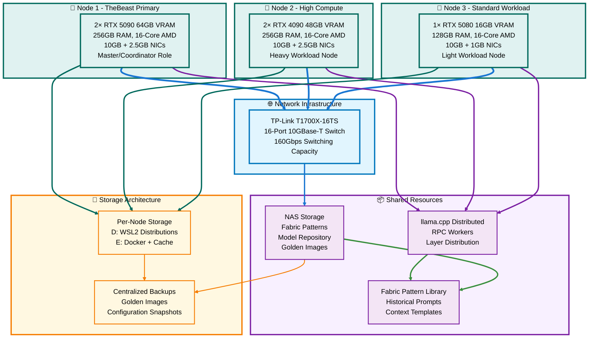
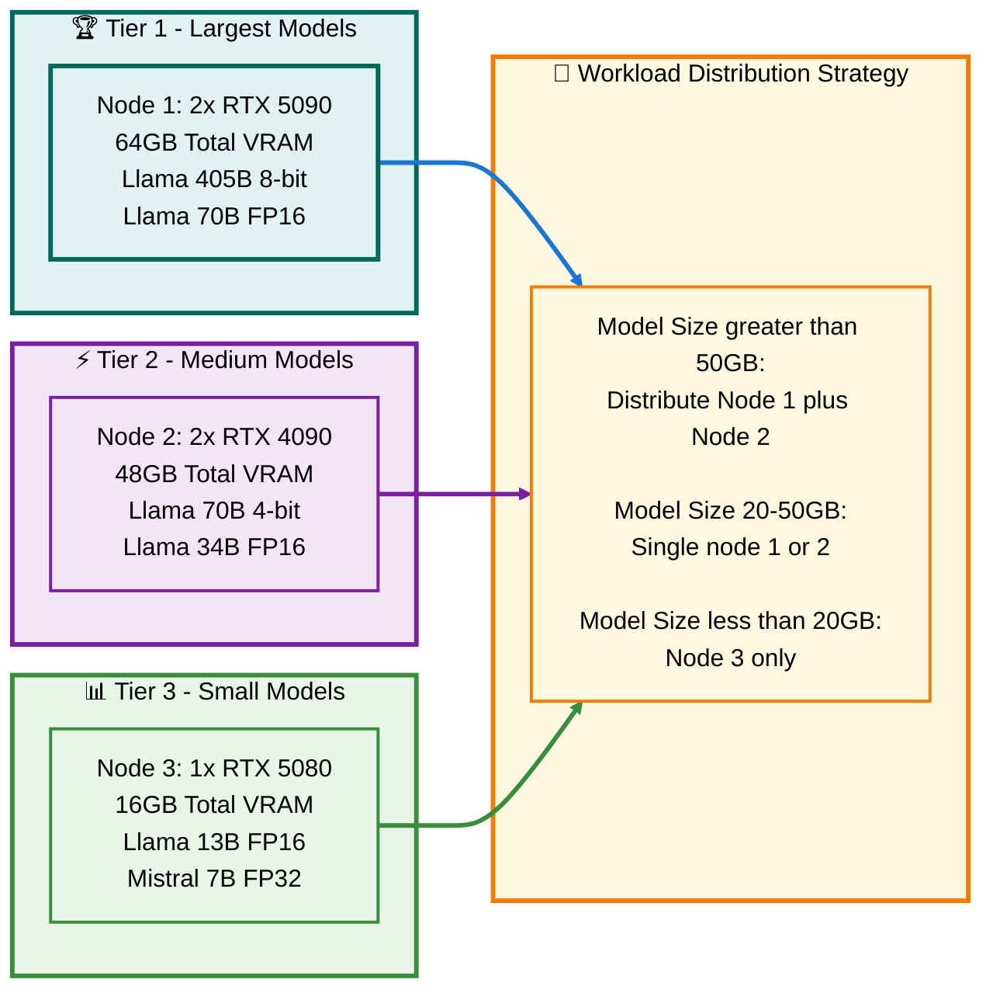
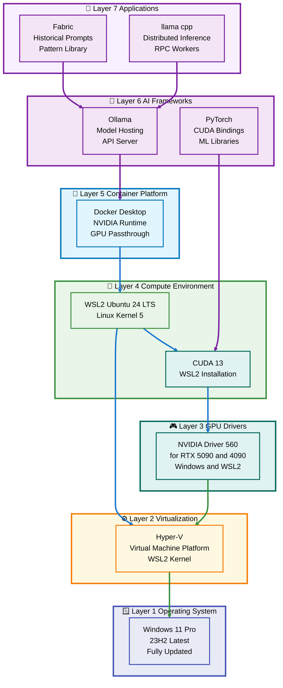
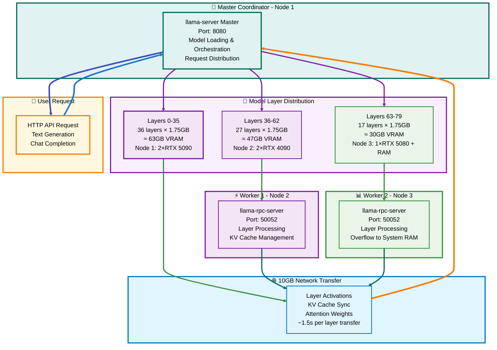
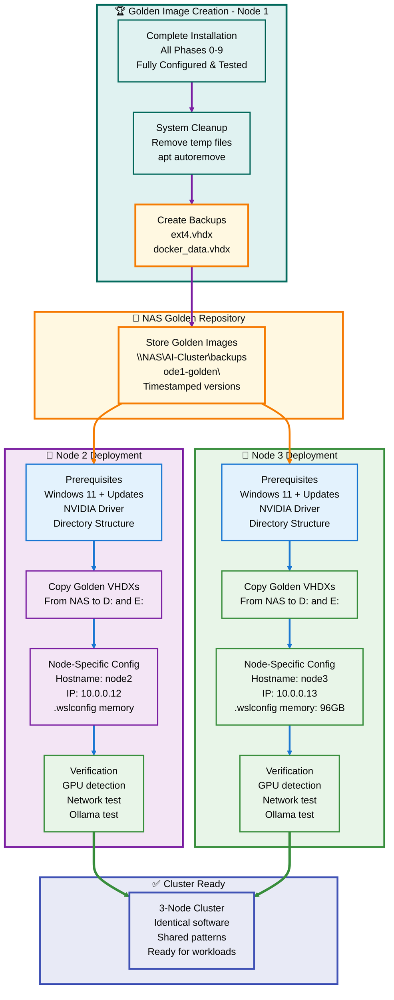
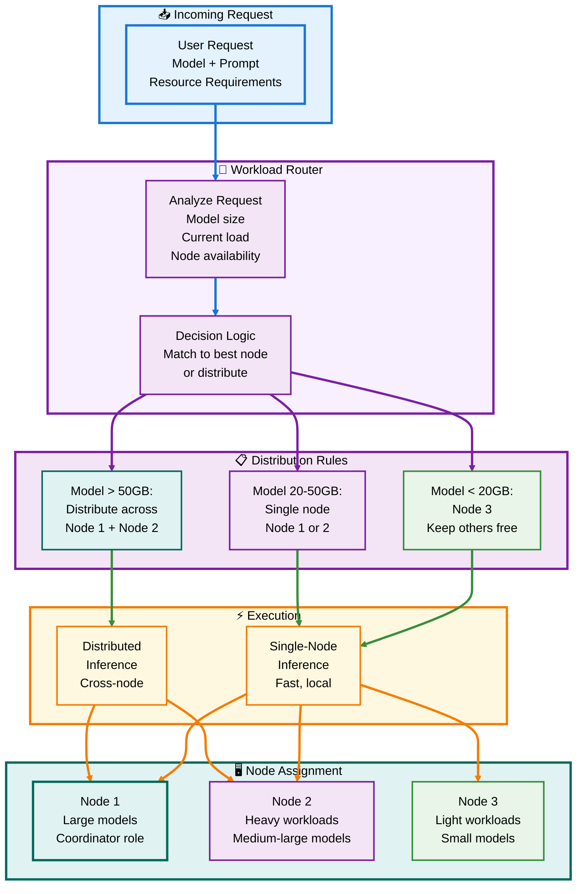

# 🚀 TheBeast Cluster: 3-Node AI Infrastructure Strategy (Base)
## High-Performance Distributed LLM Inference with Shared Historical Prompts

**Last Updated:** October 26, 2025  
**Version:** 2.0 - Multi-Node Production Architecture  
**Status:** 🟢 Production Ready

---

## 📋 Table of Contents

1. [🎯 Executive Overview](#-executive-overview)
2. [🏗️ Cluster Architecture](#️-cluster-architecture)
3. [💾 Hardware Specifications](#-hardware-specifications)
4. [🌐 Network Infrastructure](#-network-infrastructure)
5. [📦 Storage Strategy](#-storage-strategy)
6. [🔧 Software Stack](#-software-stack)
7. [📚 Shared Prompt System](#-shared-prompt-system)
8. [⚡ Distributed LLM Inference](#-distributed-llm-inference)
9. [🔄 Replication & Deployment](#-replication--deployment)
10. [📊 Workload Distribution](#-workload-distribution)
11. [🔍 Monitoring & Management](#-monitoring--management)
12. [✅ Implementation Checklist](#-implementation-checklist)

---

## 🎯 Executive Overview

### The Vision

**TheBeast Cluster** is a 3-node heterogeneous GPU infrastructure designed for:

- 🧠 **Distributed LLM Inference** - Run models up to 405B parameters across multiple GPUs
- 📖 **Shared Historical Prompts** - Centralized Fabric pattern library accessible to all nodes
- ⚡ **High-Speed Interconnect** - 10GB networking via CAT 6A for minimal latency
- 🔄 **Rapid Deployment** - Golden image replication for consistent environments
- 🎯 **Workload Optimization** - Intelligent task distribution based on GPU capabilities

### Key Metrics

```
Total Compute Power:
├─ 5 GPUs (2×RTX 5090 + 2×RTX 4090 + 1×RTX 5080)
├─ 128GB Total VRAM
├─ 48 CPU Cores (3×16-core AMD)
├─ 640GB System RAM
└─ 10Gbps Inter-Node Bandwidth

Capabilities:
├─ ✅ Llama-3.1 70B FP16 (distributed)
├─ ✅ Llama-3.1 405B 8-bit (tight fit)
├─ ✅ 3 Concurrent 7B models
└─ ✅ 1000+ documents/hour batch processing
```

---

## 🏗️ Cluster Architecture

### High-Level System Diagram



### Design Philosophy

The cluster architecture follows three core principles:

1. **🎯 Heterogeneous Optimization** - Match workload to GPU capability
2. **🔄 Centralized Knowledge** - Shared prompt library accessible to all
3. **⚡ Bare-Metal Performance** - Direct GPU access, no virtualization overhead

---

## 💾 Hardware Specifications

### Node Comparison Matrix

| Component | 🔷 Node 1 (TheBeast) | 🔷 Node 2 (High Compute) | 🔷 Node 3 (Standard) |
|-----------|---------------------|-------------------------|---------------------|
| **GPU Configuration** | 2× NVIDIA RTX 5090 | 2× NVIDIA RTX 4090 | 1× NVIDIA RTX 5080 |
| **VRAM per GPU** | 32GB each | 24GB each | 16GB |
| **Total VRAM** | **64GB** 🏆 | **48GB** | **16GB** |
| **CPU** | AMD 16-core | AMD 16-core | AMD 16-core |
| **System RAM** | 256GB | 256GB | 128GB |
| **Primary Network** | 10GB Ethernet | 10GB Ethernet | 10GB Ethernet |
| **Secondary Network** | 2.5GB Ethernet | 2.5GB Ethernet | 1GB Ethernet |
| **Network Cable** | CAT 6A | CAT 6A | CAT 6A |
| **Primary Role** | 🎯 Master/Coordinator | ⚡ Heavy Workloads | 📊 Light Workloads |
| **Optimal Workload** | 70B+ models, orchestration | 34B-70B models | 7B-13B models |

### GPU Capability Hierarchy



### Total Cluster Resources

```
🎮 Graphics Processing:
├─ 5 GPUs Total
├─ 128GB Combined VRAM
├─ 3 Different Architectures (Ada Lovelace, Blackwell)
└─ CUDA 13.0+ Compatible

🧮 Central Processing:
├─ 48 CPU Cores (3×16-core AMD)
├─ 640GB System RAM
├─ NVMe Storage on all nodes
└─ Hardware-accelerated virtualization

🌐 Networking:
├─ 3× 10GB Primary connections
├─ 2× 2.5GB + 1× 1GB Secondary
├─ CAT 6A cabling (100m @ 10Gbps)
└─ 160Gbps switch backplane
```

---

## 🌐 Network Infrastructure

### TP-Link T1700X-16TS Switch Configuration

**Switch Specifications:**
- **Model:** TP-Link T1700X-16TS (10GBase-T)
- **Ports:** 16× 10GBASE-T RJ45
- **Backplane:** 160 Gbps switching capacity
- **Latency:** <3µs (layer 2)
- **Buffer:** 12MB packet buffer
- **Management:** Web GUI + CLI

### Network Topology Diagram

```mermaid
graph TB
    subgraph INTERNET ["🌍    Internet    &    External    Access"]
        ROUTER[Internet Router<br/>192.168.1.1<br/>Gateway to WAN]
    end
    
    subgraph SWITCH ["🔷    TP-Link    T1700X-16TS    -    10GB    Core    Switch"]
        PORT1[Port 1: Node 1 Primary<br/>10.0.0.11 @ 10Gbps]
        PORT2[Port 2: Node 2 Primary<br/>10.0.0.12 @ 10Gbps]
        PORT3[Port 3: Node 3 Primary<br/>10.0.0.13 @ 10Gbps]
        PORT4[Port 4: Node 1 Secondary<br/>192.168.1.11 @ 2.5Gbps]
        PORT5[Port 5: Node 2 Secondary<br/>192.168.1.12 @ 2.5Gbps]
        PORT6[Port 6: Node 3 Secondary<br/>192.168.1.13 @ 1Gbps]
        PORT7[Port 7: NAS Storage<br/>10.0.0.20 @ 10Gbps]
        PORT8[Port 8: Uplink to Router<br/>Dual Purpose]
        PORT9[Ports 9-16<br/>Reserved for Expansion]
    end
    
    subgraph COMPUTE ["🖥️    Compute    Nodes"]
        N1P[Node 1 Primary NIC<br/>10GB CAT 6A]
        N1S[Node 1 Secondary NIC<br/>2.5GB]
        N2P[Node 2 Primary NIC<br/>10GB CAT 6A]
        N2S[Node 2 Secondary NIC<br/>2.5GB]
        N3P[Node 3 Primary NIC<br/>10GB CAT 6A]
        N3S[Node 3 Secondary NIC<br/>1GB]
    end
    
    subgraph STORAGE ["💾    Network    Storage"]
        NAS[Synology NAS<br/>10GB Connection<br/>Model Repository]
    end
    
    %% Primary connections (10GB)
    N1P --> PORT1
    N2P --> PORT2
    N3P --> PORT3
    
    %% Secondary connections (management)
    N1S --> PORT4
    N2S --> PORT5
    N3S --> PORT6
    
    %% Storage and uplink
    NAS --> PORT7
    PORT8 --> ROUTER
    
    %% Link styling - Blue for 10GB data paths
    linkStyle 0 stroke:#1976d2,stroke-width:4px
    linkStyle 1 stroke:#1976d2,stroke-width:4px
    linkStyle 2 stroke:#1976d2,stroke-width:4px
    
    %% Link styling - Teal for management paths
    linkStyle 3 stroke:#00695c,stroke-width:2px
    linkStyle 4 stroke:#00695c,stroke-width:2px
    linkStyle 5 stroke:#00695c,stroke-width:2px
    
    %% Link styling - Orange for storage
    linkStyle 6 stroke:#f57c00,stroke-width:3px
    
    %% Link styling - Green for internet uplink
    linkStyle 7 stroke:#388e3c,stroke-width:3px
    
    %% Subgraph styling
    style INTERNET fill:#e8f5e8,stroke:#388e3c,stroke-width:3px,color:#000
    style SWITCH fill:#e1f5fe,stroke:#0277bd,stroke-width:3px,color:#000
    style COMPUTE fill:#e0f2f1,stroke:#00695c,stroke-width:3px,color:#000
    style STORAGE fill:#fff8e1,stroke:#f57c00,stroke-width:3px,color:#000
    
    %% Node styling
    style ROUTER fill:#e8f5e8,stroke:#388e3c,stroke-width:2px,color:#000
    style PORT1 fill:#e3f2fd,stroke:#1976d2,stroke-width:2px,color:#000
    style PORT2 fill:#e3f2fd,stroke:#1976d2,stroke-width:2px,color:#000
    style PORT3 fill:#e3f2fd,stroke:#1976d2,stroke-width:2px,color:#000
    style PORT4 fill:#e0f2f1,stroke:#00695c,stroke-width:2px,color:#000
    style PORT5 fill:#e0f2f1,stroke:#00695c,stroke-width:2px,color:#000
    style PORT6 fill:#e0f2f1,stroke:#00695c,stroke-width:2px,color:#000
    style PORT7 fill:#fff8e1,stroke:#f57c00,stroke-width:2px,color:#000
    style PORT8 fill:#e8f5e8,stroke:#388e3c,stroke-width:2px,color:#000
    style PORT9 fill:#f5f5f5,stroke:#9e9e9e,stroke-width:1px,color:#000
    style N1P fill:#e3f2fd,stroke:#1976d2,stroke-width:3px,color:#000
    style N1S fill:#e0f2f1,stroke:#00695c,stroke-width:2px,color:#000
    style N2P fill:#e3f2fd,stroke:#1976d2,stroke-width:3px,color:#000
    style N2S fill:#e0f2f1,stroke:#00695c,stroke-width:2px,color:#000
    style N3P fill:#e3f2fd,stroke:#1976d2,stroke-width:3px,color:#000
    style N3S fill:#e0f2f1,stroke:#00695c,stroke-width:2px,color:#000
    style NAS fill:#fff8e1,stroke:#f57c00,stroke-width:3px,color:#000
```



### IP Addressing Scheme

#### Primary Compute Network (10GB)
```
Subnet: 10.0.0.0/24
Gateway: 10.0.0.1 (Switch Management)

Hosts:
├─ 10.0.0.11  → Node 1 (TheBeast) Primary NIC
├─ 10.0.0.12  → Node 2 (High Compute) Primary NIC
├─ 10.0.0.13  → Node 3 (Standard) Primary NIC
├─ 10.0.0.20  → NAS Storage (10GB connection)
└─ 10.0.0.100-199 → Reserved for future compute nodes
```

#### Secondary Management Network (1-2.5GB)
```
Subnet: 192.168.1.0/24
Gateway: 192.168.1.1 (Internet Router)

Hosts:
├─ 192.168.1.11  → Node 1 Secondary NIC
├─ 192.168.1.12  → Node 2 Secondary NIC
├─ 192.168.1.13  → Node 3 Secondary NIC
├─ 192.168.1.20  → NAS Management Interface
└─ 192.168.1.x   → Other network devices
```

### Network Performance Expectations

```
🔷 10GB Primary Network (Compute):
├─ Theoretical Max: 10 Gbps = 1.25 GB/s
├─ Actual Sustained: ~9.4 Gbps = 1.175 GB/s (CAT 6A)
├─ Latency (node-to-node): <1ms
├─ MTU: 9000 (Jumbo Frames enabled)
└─ Use Case: LLM layer transfers, model loading

🔹 2.5GB/1GB Secondary (Management):
├─ Speeds: 2.5 Gbps / 1 Gbps
├─ Use Case: Internet access, management, monitoring
└─ Backup path if primary fails
```

### Network Configuration Steps

#### Step 1: Switch Initial Setup

```bash
# Access switch web interface
# URL: http://10.0.0.1
# Default: admin / admin

# Configuration checklist:
✅ Set management IP: 10.0.0.1/24
✅ Enable Jumbo Frames: MTU 9000
✅ Enable Flow Control: ON (prevents packet loss)
✅ QoS Priority: Ports 1-3 (highest for compute)
✅ IGMP Snooping: ON (if using multicast)
✅ Port Mirroring: OFF (unless debugging)
✅ LLDP: ON (for topology discovery)
```

#### Step 2: Node Network Configuration

**On each node (Windows PowerShell as Admin):**

```powershell
# Node 1 Example - Adjust IPs for Node 2 & 3

# Set static IP on primary 10GB NIC
New-NetIPAddress -InterfaceAlias "Ethernet 10GB" `
    -IPAddress "10.0.0.11" `
    -PrefixLength 24 `
    -DefaultGateway "10.0.0.1"

# Set DNS servers
Set-DnsClientServerAddress -InterfaceAlias "Ethernet 10GB" `
    -ServerAddresses ("8.8.8.8","8.8.4.4")

# Verify configuration
Get-NetIPAddress -InterfaceAlias "Ethernet 10GB"

# Test connectivity to other nodes
Test-Connection -ComputerName 10.0.0.12 -Count 4
Test-Connection -ComputerName 10.0.0.13 -Count 4
```

#### Step 3: Enable Jumbo Frames

```powershell
# On each node
Set-NetAdapterAdvancedProperty -Name "Ethernet 10GB" `
    -DisplayName "Jumbo Packet" `
    -DisplayValue "9014 Bytes"

# Verify
Get-NetAdapterAdvancedProperty -Name "Ethernet 10GB" | Where-Object {$_.DisplayName -eq "Jumbo Packet"}
```

#### Step 4: WSL2 Network Configuration

**Inside WSL2 on each node:**

```bash
# Edit /etc/wsl.conf
sudo nano /etc/wsl.conf

# Add network configuration
[network]
generateResolvConf = false

# Save and exit

# Create custom resolv.conf
sudo rm /etc/resolv.conf
sudo bash -c 'echo "nameserver 8.8.8.8" > /etc/resolv.conf'
sudo bash -c 'echo "nameserver 8.8.4.4" >> /etc/resolv.conf'

# Set MTU for WSL2 interface
sudo ip link set eth0 mtu 9000

# Make MTU permanent
echo "network.default.mtu=9000" | sudo tee -a /etc/sysctl.conf
sudo sysctl -p
```

#### Step 5: Network Performance Testing

```bash
# Install iperf3 on all nodes (in WSL2)
sudo apt install iperf3 -y

# On Node 2 (server):
iperf3 -s

# On Node 1 (client):
iperf3 -c 10.0.0.12 -t 30 -i 1

# Expected result: 9.0-9.4 Gbits/sec

# Test Node 1 → Node 3
iperf3 -c 10.0.0.13 -t 30

# Test with multiple streams
iperf3 -c 10.0.0.12 -P 4 -t 30

# Test UDP (for latency)
iperf3 -c 10.0.0.12 -u -b 10G -t 10
```

### Expected Transfer Times

```
📦 Model Loading Over 10GB Network:

File Size → Transfer Time (@ 1.15 GB/s)
├─ 7B model (14GB):    ~12 seconds
├─ 13B model (26GB):   ~23 seconds  
├─ 34B model (68GB):   ~59 seconds
├─ 70B model (140GB):  ~122 seconds (2 minutes)
└─ 405B model (406GB): ~353 seconds (6 minutes)

🔄 Layer Transfer During Inference:
├─ Single layer (1.75GB): ~1.5 seconds
├─ KV cache (1MB): ~1ms
└─ Token embedding: <0.5ms
```

---

## 📦 Storage Strategy

### Multi-Tier Storage Architecture

```mermaid
graph TB
    subgraph PERNODE ["💻    Per-Node    Local    Storage"]
        NODE1D[Node 1 D: Drive<br/>500GB NVMe<br/>WSL2 Distribution<br/>ext4.vhdx]
        NODE1E[Node 1 E: Drive<br/>2TB NVMe<br/>Docker + Model Cache<br/>Fast Access]
        
        NODE2D[Node 2 D: Drive<br/>500GB NVMe<br/>WSL2 Distribution]
        NODE2E[Node 2 E: Drive<br/>2TB NVMe<br/>Docker + Cache]
        
        NODE3D[Node 3 D: Drive<br/>500GB NVMe<br/>WSL2 Distribution]
        NODE3E[Node 3 E: Drive<br/>1TB NVMe<br/>Docker + Cache]
    end
    
    subgraph SHARED ["🌐    Shared    Network    Storage    -    NAS"]
        FABRIC[Fabric Patterns<br/>Historical Prompts<br/>Shared Context]
        MODELS[Model Repository<br/>Llama 405B/70B/13B<br/>Mistral, Others]
        BACKUP[Golden Images<br/>Node Backups<br/>Configuration Snapshots]
        DATA[Datasets<br/>Training Data<br/>Fine-tune Materials]
        OUTPUT[Generation Outputs<br/>Results<br/>Logs]
    end
    
    subgraph SYNC ["🔄    Synchronization    Strategy"]
        PULL[Model Pull<br/>NAS → Local Cache<br/>On-Demand Loading]
        PUSH[Result Push<br/>Local → NAS<br/>Persistent Storage]
        PATTERN[Pattern Sync<br/>Bidirectional<br/>Real-time]
    end
    
    %% Local to shared connections
    NODE1E --> PULL
    NODE2E --> PULL
    NODE3E --> PULL
    
    PULL --> MODELS
    
    NODE1E --> PUSH
    NODE2E --> PUSH
    NODE3E --> PUSH
    
    PUSH --> OUTPUT
    
    %% Pattern sync
    NODE1D --> PATTERN
    NODE2D --> PATTERN
    NODE3D --> PATTERN
    
    PATTERN --> FABRIC
    
    %% Backup connections
    NODE1D -.-> BACKUP
    NODE2D -.-> BACKUP
    NODE3D -.-> BACKUP
    
    %% Link styling
    linkStyle 0,1,2 stroke:#1976d2,stroke-width:3px
    linkStyle 3 stroke:#f57c00,stroke-width:3px
    linkStyle 4,5,6 stroke:#388e3c,stroke-width:3px
    linkStyle 7 stroke:#f57c00,stroke-width:3px
    linkStyle 8,9,10 stroke:#7b1fa2,stroke-width:3px
    linkStyle 11 stroke:#7b1fa2,stroke-width:3px
    linkStyle 12,13,14 stroke:#c2185b,stroke-width:2px,stroke-dasharray:5
    
    %% Subgraph styling
    style PERNODE fill:#e3f2fd,stroke:#1976d2,stroke-width:3px,color:#000
    style SHARED fill:#fff8e1,stroke:#f57c00,stroke-width:3px,color:#000
    style SYNC fill:#f8f0ff,stroke:#7b1fa2,stroke-width:3px,color:#000
    
    %% Node styling
    style NODE1D fill:#e3f2fd,stroke:#1976d2,stroke-width:2px,color:#000
    style NODE1E fill:#e3f2fd,stroke:#1976d2,stroke-width:2px,color:#000
    style NODE2D fill:#e3f2fd,stroke:#1976d2,stroke-width:2px,color:#000
    style NODE2E fill:#e3f2fd,stroke:#1976d2,stroke-width:2px,color:#000
    style NODE3D fill:#e3f2fd,stroke:#1976d2,stroke-width:2px,color:#000
    style NODE3E fill:#e3f2fd,stroke:#1976d2,stroke-width:2px,color:#000
    style FABRIC fill:#f3e5f5,stroke:#7b1fa2,stroke-width:3px,color:#000
    style MODELS fill:#fff8e1,stroke:#f57c00,stroke-width:2px,color:#000
    style BACKUP fill:#fce4ec,stroke:#c2185b,stroke-width:2px,color:#000
    style DATA fill:#fff8e1,stroke:#f57c00,stroke-width:2px,color:#000
    style OUTPUT fill:#fff8e1,stroke:#f57c00,stroke-width:2px,color:#000
    style PULL fill:#e3f2fd,stroke:#1976d2,stroke-width:2px,color:#000
    style PUSH fill:#e8f5e8,stroke:#388e3c,stroke-width:2px,color:#000
    style PATTERN fill:#f3e5f5,stroke:#7b1fa2,stroke-width:2px,color:#000
```



### Storage Hierarchy Details

#### Local Storage (Per Node)

**D: Drive - WSL2 Distributions (500GB NVMe)**
```
D:\WSL2\
└── distributions\
    └── Ubuntu-24.04-LTS\
        ├── ext4.vhdx (grows to ~100-200GB)
        ├── System binaries
        ├── CUDA toolkit
        └── Development tools
```

**E: Drive - Docker & Cache (1-2TB NVMe)**
```
E:\
├── Docker\
│   └── docker_data.vhdx (10-50GB)
├── Software\
│   ├── CUDA\ (4GB)
│   └── Installers\ (10GB)
├── WSL2-Backup\
│   └── Local snapshots (50-100GB)
└── Models\ (Local cache)
    ├── llama-7B\ (14GB)
    ├── llama-13B\ (26GB)
    └── frequently-used\ (varies)
```

#### Network Storage (NAS)

**\\NAS\AI-Cluster\ Structure (20TB+)**
```
\\NAS\AI-Cluster\
├── fabric-patterns\ (100MB - 1GB)
│   ├── patterns\
│   │   ├── summarize\
│   │   ├── extract_wisdom\
│   │   ├── analyze_code\
│   │   └── custom\
│   │       ├── company_analysis\
│   │       └── research_synthesis\
│   ├── context\
│   │   ├── project_history.md
│   │   └── coding_standards.md
│   └── .env (LLM configurations)
│
├── models\ (5-10TB)
│   ├── llama-405B\ (406GB)
│   ├── llama-70B\ (140GB FP16, 39GB Q4)
│   ├── llama-34B\ (68GB)
│   ├── llama-13B\ (26GB)
│   ├── mistral-7B\ (14GB)
│   └── quantized\ (4-bit, 8-bit variants)
│
├── backups\ (1-2TB)
│   ├── node1-golden\
│   │   ├── ext4-golden-20251026.vhdx
│   │   ├── docker-golden-20251026.vhdx
│   │   └── README.txt
│   ├── node2-golden\
│   └── node3-golden\
│
├── datasets\ (2-5TB)
│   ├── training\
│   ├── fine-tuning\
│   └── evaluation\
│
└── outputs\ (1-2TB, grows over time)
    ├── generations\
    ├── analyses\
    └── logs\
```

### Storage Sizing Guidelines

```
📊 Recommended Storage Per Node:

Node 1 (TheBeast - Largest workloads):
├─ D: Drive: 500GB NVMe (WSL2)
├─ E: Drive: 2TB NVMe (Docker + large model cache)
└─ Total: 2.5TB

Node 2 (High Compute):
├─ D: Drive: 500GB NVMe
├─ E: Drive: 2TB NVMe
└─ Total: 2.5TB

Node 3 (Standard - Smaller workloads):
├─ D: Drive: 500GB NVMe
├─ E: Drive: 1TB NVMe (smaller cache sufficient)
└─ Total: 1.5TB

NAS (Centralized):
├─ Model Repository: 10TB
├─ Backups: 2TB
├─ Datasets: 5TB
├─ Outputs: 3TB
└─ Total: 20TB minimum (expandable)
```

---

## 🔧 Software Stack

### Identical Installation on All Nodes



### Standardized Software Versions

```
🪟 Operating System:
├─ OS: Windows 11 Pro (Build 22621+)
├─ Edition: Professional (NOT Home)
└─ Update: Latest cumulative updates applied

⚙️ Virtualization Layer:
├─ WSL2: Latest kernel (5.15.x+)
├─ Ubuntu: 24.04 LTS (Noble Numbat)
└─ Hyper-V: Enabled with nested virtualization

🎮 GPU Stack:
├─ NVIDIA Driver: 560.x+ (RTX 50 series support)
├─ CUDA (Windows): 13.0.1
├─ CUDA (WSL2): 13.0 toolkit
└─ cuDNN: 8.9.x (if needed for training)

🐳 Container Platform:
├─ Docker Desktop: Latest stable (4.25+)
├─ Docker Engine: 24.0.x+
├─ NVIDIA Container Toolkit: Latest
└─ Docker Compose: v2.x

🤖 AI Frameworks:
├─ Ollama: Latest stable from ollama.ai
├─ Go: 1.23.5+ (for Fabric)
├─ Fabric: Latest from danielmiessler/fabric
├─ llama.cpp: Latest stable (distributed build)
└─ Python: 3.11+ with PyTorch

📦 Dependencies:
├─ Git: Latest (for version control)
├─ Build tools: gcc, make, cmake
├─ Network tools: iperf3, curl, wget
└─ Monitoring: htop, nvidia-smi, nvtop
```

### Installation Order (Critical!)

```
Phase Order (Must follow sequentially):

✅ Phase 0: Windows 11 Setup & Updates
  ↓
✅ Phase 1: NVIDIA Driver Installation
  ↓
✅ Phase 2: Directory Structure Creation
  ↓
✅ Phase 3: CUDA Toolkit (Windows)
  ↓
✅ Phase 4: WSL2 Ubuntu Installation
  ↓
✅ Phase 5: WSL2 Configuration (.wslconfig)
  ↓
✅ Phase 6: CUDA in WSL2
  ↓
✅ Phase 7: Docker Desktop
  ↓
✅ Phase 8: Ollama Installation
  ↓
✅ Phase 9: Fabric Installation
  ↓
✅ Phase 10: System Backup (Golden Image)
  ↓
✅ Phase 11: Documentation & Testing
  ↓
✅ Phase 12: Final Verification
```

---

## 📚 Shared Prompt System

### Fabric Pattern Library Architecture

**Core Concept:** Historical prompts become institutional memory, accessible to all nodes through a centralized, version-controlled pattern library.

```mermaid
graph TB
    subgraph NAS ["💾    NAS    Shared    Storage"]
        LIBRARY[Fabric Pattern Library<br/>\\NAS\AI-Cluster\fabric-patterns\<br/>Centralized Knowledge Base]
    end
    
    subgraph PATTERNS ["📚    Pattern    Categories"]
        STANDARD[Standard Patterns<br/>summarize, extract_wisdom<br/>analyze_code, explain]
        CUSTOM[Custom Patterns<br/>company_analysis<br/>research_synthesis<br/>data_pipeline_gen]
        CONTEXT[Context Files<br/>project_history.md<br/>coding_standards.md<br/>research_themes.md]
    end
    
    subgraph NODE1L ["🔷    Node    1    Local    Access"]
        N1LINK[Symlink<br/>~/.config/fabric<br/>→ /mnt/nas/fabric-patterns]
        N1USE[fabric --pattern<br/>summarize<br/>Local execution]
    end
    
    subgraph NODE2L ["🔷    Node    2    Local    Access"]
        N2LINK[Symlink<br/>~/.config/fabric<br/>→ /mnt/nas/fabric-patterns]
        N2USE[fabric --pattern<br/>analyze_code<br/>Local execution]
    end
    
    subgraph NODE3L ["🔷    Node    3    Local    Access"]
        N3LINK[Symlink<br/>~/.config/fabric<br/>→ /mnt/nas/fabric-patterns]
        N3USE[fabric --pattern<br/>custom/company_analysis<br/>Local execution]
    end
    
    subgraph VCS ["🔄    Version    Control    (Optional)"]
        GIT[Git Repository<br/>Pattern versioning<br/>Change tracking<br/>Collaborative editing]
    end
    
    %% Pattern organization
    LIBRARY --> STANDARD
    LIBRARY --> CUSTOM
    LIBRARY --> CONTEXT
    
    %% Node access connections
    LIBRARY --> N1LINK
    LIBRARY --> N2LINK
    LIBRARY --> N3LINK
    
    N1LINK --> N1USE
    N2LINK --> N2USE
    N3LINK --> N3USE
    
    %% Version control
    LIBRARY --> GIT
    
    %% Link styling
    linkStyle 0,1,2 stroke:#7b1fa2,stroke-width:3px
    linkStyle 3,4,5 stroke:#1976d2,stroke-width:4px
    linkStyle 6,7,8 stroke:#388e3c,stroke-width:3px
    linkStyle 9 stroke:#00695c,stroke-width:2px
    
    %% Subgraph styling
    style NAS fill:#fff8e1,stroke:#f57c00,stroke-width:3px,color:#000
    style PATTERNS fill:#f8f0ff,stroke:#7b1fa2,stroke-width:3px,color:#000
    style NODE1L fill:#e0f2f1,stroke:#00695c,stroke-width:3px,color:#000
    style NODE2L fill:#e0f2f1,stroke:#00695c,stroke-width:3px,color:#000
    style NODE3L fill:#e0f2f1,stroke:#00695c,stroke-width:3px,color:#000
    style VCS fill:#e8f5e8,stroke:#388e3c,stroke-width:3px,color:#000
    
    %% Node styling
    style LIBRARY fill:#fff8e1,stroke:#f57c00,stroke-width:3px,color:#000
    style STANDARD fill:#f3e5f5,stroke:#7b1fa2,stroke-width:2px,color:#000
    style CUSTOM fill:#f3e5f5,stroke:#7b1fa2,stroke-width:2px,color:#000
    style CONTEXT fill:#f3e5f5,stroke:#7b1fa2,stroke-width:2px,color:#000
    style N1LINK fill:#e3f2fd,stroke:#1976d2,stroke-width:2px,color:#000
    style N1USE fill:#e8f5e8,stroke:#388e3c,stroke-width:2px,color:#000
    style N2LINK fill:#e3f2fd,stroke:#1976d2,stroke-width:2px,color:#000
    style N2USE fill:#e8f5e8,stroke:#388e3c,stroke-width:2px,color:#000
    style N3LINK fill:#e3f2fd,stroke:#1976d2,stroke-width:2px,color:#000
    style N3USE fill:#e8f5e8,stroke:#388e3c,stroke-width:2px,color:#000
    style GIT fill:#e8f5e8,stroke:#388e3c,stroke-width:2px,color:#000
```



### Implementation Guide

#### Step 1: Create Shared Pattern Library on NAS

```bash
# On NAS (or from any node with NAS access)
# Ensure NAS directory exists
mkdir -p /mnt/nas/AI-Cluster/fabric-patterns

# Create directory structure
cd /mnt/nas/AI-Cluster/fabric-patterns

mkdir -p patterns/custom
mkdir -p context
mkdir -p models

# Create initial context files
cat > context/project_history.md << 'EOF'
# Project History

## TheBeast Cluster Evolution
- **October 2025:** Initial 3-node cluster deployment
- **Focus Areas:** Distributed LLM inference, shared prompts
EOF

cat > context/coding_standards.md << 'EOF'
# Coding Standards

## Python
- Follow PEP 8
- Type hints required
- Docstrings for all functions

## Bash
- Use shellcheck
- Set -euo pipefail
EOF

# Create shared .env for Ollama configs
cat > .env << 'EOF'
# Shared Fabric Configuration
DEFAULT_VENDOR=Ollama
OLLAMA_HOST=http://localhost:11434

# Optional: Add API keys for cloud providers
# OPENAI_API_KEY=sk-...
# ANTHROPIC_API_KEY=sk-ant-...
EOF
```

#### Step 2: Mount NAS on Each Node (WSL2)

```bash
# On each node (in WSL2)

# Install CIFS utilities
sudo apt install cifs-utils -y

# Create mount point
sudo mkdir -p /mnt/nas

# Mount NAS (replace with your NAS credentials)
sudo mount -t drvfs '\\NAS\AI-Cluster' /mnt/nas

# Or use fstab for persistent mount
echo '\\NAS\AI-Cluster /mnt/nas drvfs defaults 0 0' | sudo tee -a /etc/fstab

# Verify mount
ls -la /mnt/nas/fabric-patterns
```

#### Step 3: Symlink Fabric Config to Shared Location

```bash
# On each node (in WSL2)

# Backup existing Fabric config (if any)
if [ -d ~/.config/fabric ]; then
    mv ~/.config/fabric ~/.config/fabric.backup
fi

# Create symlink to shared patterns
ln -s /mnt/nas/fabric-patterns ~/.config/fabric

# Verify symlink
ls -la ~/.config/fabric
readlink ~/.config/fabric

# Test access
fabric --listpatterns
```

#### Step 4: Initialize Git Version Control (Optional but Recommended)

```bash
# On Node 1 (or any node)
cd /mnt/nas/fabric-patterns

# Initialize git repository
git init

# Add .gitignore
cat > .gitignore << 'EOF'
# Ignore local API keys
.env.local

# Ignore logs
*.log

# Ignore temporary files
*.tmp
*~
EOF

# Initial commit
git add .
git commit -m "Initial Fabric pattern library setup"

# Optional: Add remote repository
git remote add origin git@github.com:yourorg/fabric-patterns.git
git branch -M main
git push -u origin main
```

### Usage Examples

#### Example 1: Use Existing Pattern from Any Node

```bash
# Node 1: Summarize a research paper
cat ~/research_paper.pdf | fabric --pattern summarize > summary.md

# Node 2: Same pattern, different data
cat ~/competitor_analysis.csv | fabric --pattern summarize > analysis.md

# Node 3: Both see the same patterns!
fabric --listpatterns
# Output: summarize, extract_wisdom, analyze_code, etc.
```

#### Example 2: Create Custom Pattern on Node 1, Use on Others

```bash
# On Node 1: Create new custom pattern
cd ~/.config/fabric/patterns/custom
mkdir company_analysis

# Create system.md (the prompt)
cat > company_analysis/system.md << 'EOF'
# Company Analysis Pattern

You are an expert business analyst. Analyze the provided company data and:
1. Identify key strengths and weaknesses
2. Compare to industry benchmarks
3. Provide actionable recommendations
4. Highlight financial health indicators

Be concise but thorough. Use bullet points for clarity.
EOF

# Commit to version control
cd ~/.config/fabric
git add patterns/custom/company_analysis/
git commit -m "Add company analysis pattern"
git push

# On Node 2 or Node 3: Pull updates
cd ~/.config/fabric
git pull

# Now all nodes can use the new pattern!
echo "Analyze Company XYZ data..." | fabric --pattern custom/company_analysis
```

#### Example 3: Shared Context Across Nodes

```bash
# All nodes can reference shared context
cat ~/.config/fabric/context/coding_standards.md

# Use context in prompts
echo "Refactor this Python code following our standards" | \
  fabric --pattern analyze_code --context ~/.config/fabric/context/coding_standards.md
```

### Pattern Library Structure

```
\\NAS\AI-Cluster\fabric-patterns\
├── patterns\
│   ├── summarize\
│   │   └── system.md
│   ├── extract_wisdom\
│   │   └── system.md
│   ├── analyze_code\
│   │   └── system.md
│   ├── write_essay\
│   │   └── system.md
│   └── custom\
│       ├── company_analysis\
│       │   └── system.md
│       ├── research_synthesis\
│       │   └── system.md
│       └── data_pipeline_gen\
│           └── system.md
│
├── context\
│   ├── project_history.md
│   ├── coding_standards.md
│   ├── research_themes.md
│   └── company_background.md
│
├── models\
│   └── .env (shared LLM configs)
│
├── .git\
│   └── (version control)
│
└── README.md (documentation)
```

### Benefits of Shared Prompts

```
✅ Consistency:
   All nodes use identical prompts for comparable results

✅ Collaboration:
   Team members contribute patterns from any node

✅ Version Control:
   Track changes, rollback if needed, see evolution

✅ Institutional Memory:
   Accumulated expertise preserved in patterns

✅ Rapid Deployment:
   New nodes instantly get all existing patterns

✅ Central Management:
   Update once, applies to all nodes immediately
```

---

## ⚡ Distributed LLM Inference

### llama.cpp Distributed Architecture

**Goal:** Split large language models across multiple GPUs on multiple nodes via high-speed 10GB networking, enabling models that won't fit on a single machine.



### Layer Distribution Strategy

**Example: Llama-3.1 70B Model (80 layers, FP16)**

```
Total Model Size: ~140GB FP16
Layer Size: ~1.75GB each
Total Layers: 80

Distribution Plan:
┌─────────────────────────────────────────┐
│ Node 1: 2×RTX 5090 (64GB VRAM)          │
├─────────────────────────────────────────┤
│ Layers 0-35 (36 layers)                 │
│ VRAM Usage: 36 × 1.75GB = 63GB          │
│ Remaining: 1GB (buffer)                 │
└─────────────────────────────────────────┘

┌─────────────────────────────────────────┐
│ Node 2: 2×RTX 4090 (48GB VRAM)          │
├─────────────────────────────────────────┤
│ Layers 36-62 (27 layers)                │
│ VRAM Usage: 27 × 1.75GB = 47.25GB       │
│ Remaining: 0.75GB (buffer)              │
└─────────────────────────────────────────┘

┌─────────────────────────────────────────┐
│ Node 3: 1×RTX 5080 (16GB VRAM)          │
├─────────────────────────────────────────┤
│ Layers 63-79 (17 layers)                │
│ VRAM Usage: 17 × 1.75GB = 29.75GB       │
│ Strategy: 16GB VRAM + 14GB System RAM   │
│ (Slower but functional)                 │
└─────────────────────────────────────────┘
```

### Installation & Configuration

#### Step 1: Install llama.cpp on All Nodes

```bash
# On each node (in WSL2)

# Install build dependencies
sudo apt update
sudo apt install -y build-essential cmake git libcurl4-openssl-dev

# Clone llama.cpp repository
cd ~
git clone https://github.com/ggerganov/llama.cpp.git
cd llama.cpp

# Build with CUDA support
mkdir build && cd build

# Node-specific CUDA architecture
# Node 1 & 3 (RTX 5090/5080): Architecture 89
# Node 2 (RTX 4090): Architecture 89
cmake .. -DLLAMA_CUBLAS=ON -DCMAKE_CUDA_ARCHITECTURES="89"

# Compile (uses all CPU cores)
make -j$(nproc)

# Install binaries to system path
sudo cp bin/llama-server /usr/local/bin/
sudo cp bin/llama-cli /usr/local/bin/
sudo cp bin/llama-rpc-server /usr/local/bin/

# Verify installation
llama-server --version
llama-rpc-server --version
```

#### Step 2: Download Model to NAS

```bash
# On any node with NAS access

# Download Llama-3.1 70B (example)
cd /mnt/nas/models/

# Create directory for model
mkdir -p llama-3.1-70B

# Download Q4_K_M quantized version (smaller, faster)
# Option A: From Hugging Face
wget https://huggingface.co/TheBloke/Llama-2-70B-GGUF/resolve/main/llama-2-70b.Q4_K_M.gguf \
  -O llama-3.1-70B/llama-3.1-70B-Q4_K_M.gguf

# Option B: Download FP16 for maximum quality (140GB)
# Use llama.cpp's download script or manual download

# Verify download
ls -lh /mnt/nas/models/llama-3.1-70B/
```

#### Step 3: Start RPC Workers (Node 2 & 3)

```bash
# On Node 2 (WSL2)
llama-rpc-server \
  --port 50052 \
  --host 10.0.0.12

# Expected output:
# RPC server listening on 10.0.0.12:50052
# Waiting for connections...

# On Node 3 (WSL2)
llama-rpc-server \
  --port 50052 \
  --host 10.0.0.13

# Keep these running in separate terminal sessions
# Or use screen/tmux for persistence
```

#### Step 4: Start Master Server (Node 1)

```bash
# On Node 1 (WSL2)

# Start llama-server with distributed configuration
llama-server \
  --model /mnt/nas/models/llama-3.1-70B/llama-3.1-70B-Q4_K_M.gguf \
  --ctx-size 8192 \
  --n-gpu-layers 80 \
  --tensor-split 36,27,17 \
  --rpc 10.0.0.12:50052,10.0.0.13:50052 \
  --parallel 4 \
  --port 8080 \
  --host 10.0.0.11

# Parameter explanation:
# --model: Path to model file on NAS
# --ctx-size: Context window (8192 tokens)
# --n-gpu-layers: Total layers to offload to GPUs (all 80)
# --tensor-split: Layer distribution (36 on node1, 27 on node2, 17 on node3)
# --rpc: Worker nodes (node2, node3)
# --parallel: Number of concurrent requests
# --port: HTTP API port
# --host: Bind to specific IP
```

#### Step 5: Test Distributed Inference

```bash
# From any machine on the network

# Simple completion test
curl http://10.0.0.11:8080/completion \
  -H "Content-Type: application/json" \
  -d '{
    "prompt": "Explain quantum computing in simple terms:",
    "n_predict": 200
  }'

# Chat completion test
curl http://10.0.0.11:8080/v1/chat/completions \
  -H "Content-Type: application/json" \
  -d '{
    "model": "llama-3.1-70B",
    "messages": [
      {"role": "user", "content": "What are the benefits of distributed AI inference?"}
    ],
    "max_tokens": 300
  }'

# Monitor GPU usage on all nodes during inference
# Node 1:
watch -n 1 nvidia-smi

# Node 2:
watch -n 1 nvidia-smi

# Node 3:
watch -n 1 nvidia-smi
```

### Performance Metrics

#### Expected Throughput

| Model | Quantization | Total Size | Tokens/sec | Latency (First Token) | Nodes Used |
|-------|--------------|------------|------------|-----------------------|------------|
| Llama-3.1 405B | 8-bit | ~406GB | 2-5 tok/s | High (~3-5s) | All 3 (tight) |
| Llama-3.1 70B | Q4_K_M | ~39GB | 15-25 tok/s | Medium (~1-2s) | Node 1+2 |
| Llama-3.1 70B | FP16 | ~140GB | 8-15 tok/s | Medium (~1.5-2s) | All 3 |
| Llama-3.1 34B | FP16 | ~68GB | 20-35 tok/s | Low (~0.5-1s) | Node 1 or 2 |
| Mistral 7B | FP16 | ~14GB | 60-100 tok/s | Very Low (<0.3s) | Node 3 only |

#### Network Impact on Performance

```
10GB Network Bandwidth Analysis:
├─ Theoretical Max: 1.25 GB/s (10 Gbps)
├─ Actual Sustained: ~1.15 GB/s (accounting for overhead)
│
├─ Per-Layer Transfer:
│   ├─ Layer size: 1.75GB
│   ├─ Transfer time: ~1.5 seconds
│   └─ Impact: Adds latency between layer computations
│
└─ Inference Latency Breakdown:
    ├─ Computation: 40-60% (GPU processing)
    ├─ Network transfer: 30-40% (inter-node communication)
    └─ Memory ops: 10-20% (VRAM access, KV cache)
```

### Optimization Tips

```bash
# 1. Enable Jumbo Frames (already configured in network section)
# Reduces packet overhead for large transfers

# 2. Pin CPU cores for RPC workers
taskset -c 0-7 llama-rpc-server --port 50052

# 3. Adjust batch size for throughput
llama-server --batch-size 512  # Larger = better throughput, more VRAM

# 4. Use quantized models when possible
# Q4_K_M: 4-bit, good quality, 4× smaller
# Q8_0: 8-bit, high quality, 2× smaller

# 5. Cache frequent prompts
# llama.cpp automatically caches KV cache for repeated prompts
```

---

## 🔄 Replication & Deployment

### Golden Image Strategy

**Philosophy:** Configure Node 1 perfectly once, then replicate to Node 2 and Node 3 with minimal node-specific changes.



### Step-by-Step Replication Process

#### Phase 1: Create Golden Image (Node 1)

```powershell
# On Node 1 (Windows PowerShell as Admin)

# Step 1: Complete all installation phases (0-9)
# Ensure system is fully functional and tested

# Step 2: Clean up inside WSL
wsl -d Ubuntu-24.04

# Inside WSL:
sudo apt update
sudo apt upgrade -y
sudo apt autoremove -y
sudo apt clean

# Clear Docker cache
docker system prune -a -f

# Clear bash history (optional, for cleaner image)
history -c
exit

# Step 3: Shutdown all services
wsl --shutdown
# Stop Docker Desktop (right-click systray icon → Quit)

# Wait for everything to fully stop
Start-Sleep -Seconds 30

# Step 4: Create timestamped backup
$timestamp = Get-Date -Format 'yyyyMMdd-HHmm'
$goldenPath = "\\NAS\AI-Cluster\backups\node1-golden"

# Ensure backup directory exists
New-Item -Path $goldenPath -ItemType Directory -Force

# Backup WSL VHDX
Write-Host "Backing up WSL2 VHDX (this takes 10-15 minutes)..." -ForegroundColor Cyan
Copy-Item "D:\WSL2\distributions\Ubuntu-24.04-LTS\ext4.vhdx" `
  -Destination "$goldenPath\ext4-golden-$timestamp.vhdx" `
  -Verbose

# Backup Docker VHDX
Write-Host "Backing up Docker VHDX..." -ForegroundColor Cyan
Copy-Item "E:\Docker\docker_data.vhdx" `
  -Destination "$goldenPath\docker-golden-$timestamp.vhdx" `
  -Verbose

# Step 5: Create documentation
$driverVersion = (nvidia-smi --query-gpu=driver_version --format=csv,noheader | Select-Object -First 1)
$wslVersion = (wsl --version | Out-String)

@"
# Node 1 Golden Image

## Creation Details
- **Date:** $(Get-Date -Format 'yyyy-MM-dd HH:mm:ss')
- **Node:** Node 1 (TheBeast)
- **GPU:** 2× RTX 5090

## Software Versions
- **NVIDIA Driver:** $driverVersion
- **CUDA:** 13.0
- **WSL2:** 
$wslVersion

## Files
- ext4-golden-$timestamp.vhdx (WSL2 distribution)
- docker-golden-$timestamp.vhdx (Docker data)

## Contents
- Windows 11 Pro (latest updates)
- NVIDIA Driver (RTX 50 series)
- CUDA 13.0 (Windows + WSL2)
- WSL2 Ubuntu 24.04 LTS
- Docker Desktop (latest)
- Ollama (latest)
- Fabric (latest)
- llama.cpp (compiled with CUDA)

## Deployment Instructions
See main documentation for Node 2 and Node 3 deployment steps.

## Verification Checklist
- [ ] nvidia-smi shows all GPUs
- [ ] nvcc --version shows CUDA 13.0
- [ ] docker --version works
- [ ] ollama list shows models
- [ ] fabric --listpatterns works
- [ ] llama-server --version works
- [ ] Network ping to 10.0.0.1 succeeds

## Notes
- This is a clean, tested, production-ready image
- Node-specific configs (hostname, IP) must be changed after deployment
- Shared Fabric patterns will be symlinked after deployment
"@ | Out-File "$goldenPath\README-$timestamp.txt" -Encoding UTF8

Write-Host "✅ Golden image created successfully!" -ForegroundColor Green
Write-Host "Location: $goldenPath" -ForegroundColor Yellow
```

#### Phase 2: Deploy to Node 2

```powershell
# On Node 2 (Windows PowerShell as Admin)

# Step 1: Complete prerequisites (Phases 0-2)
# - Fresh Windows 11 Pro installation
# - All Windows updates
# - Enable WSL2/Hyper-V features (with reboot)
# - NVIDIA Driver for RTX 4090
# - Create D:\WSL2 and E:\Docker directories

# Step 2: Verify prerequisites
Write-Host "Checking prerequisites..." -ForegroundColor Cyan

# Check WSL2 is enabled
if (-not (Get-WindowsOptionalFeature -Online -FeatureName Microsoft-Windows-Subsystem-Linux).State -eq 'Enabled') {
    Write-Host "❌ WSL2 not enabled!" -ForegroundColor Red
    exit
}

# Check NVIDIA driver
try {
    $gpuCheck = nvidia-smi --query-gpu=name --format=csv,noheader
    Write-Host "✅ NVIDIA Driver installed: $gpuCheck" -ForegroundColor Green
} catch {
    Write-Host "❌ NVIDIA Driver not found!" -ForegroundColor Red
    exit
}

# Step 3: Copy golden images from NAS
Write-Host "Copying golden images from NAS (this takes 15-20 minutes)..." -ForegroundColor Cyan

# Find latest golden image
$goldenPath = "\\NAS\AI-Cluster\backups\node1-golden"
$latestWSL = Get-ChildItem "$goldenPath\ext4-golden-*.vhdx" | Sort-Object LastWriteTime -Descending | Select-Object -First 1
$latestDocker = Get-ChildItem "$goldenPath\docker-golden-*.vhdx" | Sort-Object LastWriteTime -Descending | Select-Object -First 1

Write-Host "Using golden images:" -ForegroundColor Yellow
Write-Host "  WSL: $($latestWSL.Name)" -ForegroundColor Yellow
Write-Host "  Docker: $($latestDocker.Name)" -ForegroundColor Yellow

# Copy WSL VHDX
Copy-Item $latestWSL.FullName `
  -Destination "D:\WSL2\distributions\Ubuntu-24.04-LTS\ext4.vhdx" `
  -Force -Verbose

# Copy Docker VHDX
Copy-Item $latestDocker.FullName `
  -Destination "E:\Docker\docker_data.vhdx" `
  -Force -Verbose

Write-Host "✅ Golden images copied successfully!" -ForegroundColor Green

# Step 4: Import WSL distribution
Write-Host "Importing WSL distribution..." -ForegroundColor Cyan

# The VHDX is already in place, just need to register it
# Since we copied the VHDX directly, WSL should auto-detect it
# But we can manually register it:
wsl --import Ubuntu-24.04 "D:\WSL2\distributions\Ubuntu-24.04-LTS" "D:\WSL2\distributions\Ubuntu-24.04-LTS\ext4.vhdx" --version 2

# Set default user
wsl -d Ubuntu-24.04 -u root -- bash -c "echo '[user]' > /etc/wsl.conf && echo 'default=pheller' >> /etc/wsl.conf"

# Step 5: Configure Node 2 specific settings
Write-Host "Configuring Node 2 settings..." -ForegroundColor Cyan

# Create .wslconfig for Node 2
@"
[wsl2]
# Node 2: 256GB RAM system - allocate 192GB (75%)
memory=192GB

# 16-core AMD - allocate 12 cores
processors=12

# Swap
swap=32GB

# Network
localhostForwarding=true

[experimental]
autoMemoryReclaim=gradual
sparseVhd=true
"@ | Out-File "$env:USERPROFILE\.wslconfig" -Encoding UTF8

# Restart WSL with new config
wsl --shutdown
Start-Sleep -Seconds 10

# Start WSL and configure Node 2 specific items
wsl -d Ubuntu-24.04

# Inside WSL (these commands run automatically):
# sudo hostnamectl set-hostname node2
# sudo sed -i 's/node1/node2/g' /etc/hosts
# ... (see detailed WSL config below)
```

```bash
# Inside WSL2 on Node 2:

# Change hostname
sudo hostnamectl set-hostname node2

# Update /etc/hosts
sudo sed -i 's/127.0.1.1.*/127.0.1.1 node2/g' /etc/hosts

# Configure static IP (if not using DHCP)
sudo nano /etc/netplan/01-netcfg.yaml

# Add:
# network:
#   version: 2
#   ethernets:
#     eth0:
#       addresses:
#         - 10.0.0.12/24
#       gateway4: 10.0.0.1
#       nameservers:
#         addresses: [8.8.8.8, 8.8.4.4]

# Apply network config
sudo netplan apply

# Verify GPU access (should see 2× RTX 4090)
nvidia-smi

# Test Ollama
ollama list

# Mount NAS
sudo mkdir -p /mnt/nas
sudo mount -t drvfs '\\NAS\AI-Cluster' /mnt/nas

# Link Fabric patterns
rm -rf ~/.config/fabric
ln -s /mnt/nas/fabric-patterns ~/.config/fabric

# Verify shared patterns
fabric --listpatterns

# Test network connectivity
ping 10.0.0.11  # Node 1
ping 10.0.0.13  # Node 3 (if already deployed)

# Test network speed
iperf3 -c 10.0.0.11 -t 10
```

```powershell
# Back in Windows PowerShell on Node 2:

# Step 6: Configure Docker Desktop
# Start Docker Desktop
Start-Process "C:\Program Files\Docker\Docker\Docker Desktop.exe"

# Wait for Docker to start
Write-Host "Waiting for Docker Desktop to start..." -ForegroundColor Cyan
Start-Sleep -Seconds 60

# Docker will use the existing docker_data.vhdx from E:\Docker

# Verify Docker
docker --version
docker ps

# Step 7: Final verification
Write-Host "`n✅ Node 2 Deployment Complete!" -ForegroundColor Green
Write-Host "`nVerification Checklist:" -ForegroundColor Yellow
Write-Host "  [ ] nvidia-smi shows 2× RTX 4090" -ForegroundColor Yellow
Write-Host "  [ ] Hostname is node2" -ForegroundColor Yellow
Write-Host "  [ ] IP is 10.0.0.12" -ForegroundColor Yellow
Write-Host "  [ ] Can ping Node 1 (10.0.0.11)" -ForegroundColor Yellow
Write-Host "  [ ] Ollama works" -ForegroundColor Yellow
Write-Host "  [ ] Fabric patterns accessible" -ForegroundColor Yellow
Write-Host "  [ ] Docker works" -ForegroundColor Yellow
```

#### Phase 3: Deploy to Node 3

**Same process as Node 2, with these differences:**

```powershell
# Node 3 .wslconfig (smaller RAM allocation)
@"
[wsl2]
# Node 3: 128GB RAM system - allocate 96GB (75%)
memory=96GB

# 16-core AMD - allocate 12 cores
processors=12

# Swap
swap=16GB

# Network
localhostForwarding=true

[experimental]
autoMemoryReclaim=gradual
sparseVhd=true
"@ | Out-File "$env:USERPROFILE\.wslconfig" -Encoding UTF8
```

```bash
# Inside WSL on Node 3:
sudo hostnamectl set-hostname node3

# Static IP: 10.0.0.13
# GPU check should show: 1× RTX 5080
```

### Deployment Timeline

```
Node 2 Deployment (from golden image):
├─ Prerequisites: 30-60 minutes
│   ├─ Windows installation: 20 minutes
│   ├─ Windows updates: 20-30 minutes
│   └─ NVIDIA driver: 10 minutes
│
├─ Golden image copy: 15-20 minutes
│   ├─ WSL VHDX (20-30GB): 10 minutes
│   └─ Docker VHDX (10-20GB): 5-10 minutes
│
├─ Configuration: 10-15 minutes
│   ├─ .wslconfig: 1 minute
│   ├─ WSL hostname/IP: 5 minutes
│   ├─ NAS mount + Fabric: 5 minutes
│   └─ Docker startup: 2 minutes
│
└─ Verification: 10 minutes
    └─ Total: 65-105 minutes (~1.5 hours)

Node 3 Deployment:
└─ Same timeline as Node 2
```

### Comparison: Fresh Install vs Golden Image

```
Fresh Installation (Node 1):
├─ Prerequisites: 60 minutes
├─ CUDA installation: 20 minutes
├─ WSL2 setup: 30 minutes
├─ Docker setup: 20 minutes
├─ Ollama/Fabric/llama.cpp: 30 minutes
├─ Configuration & testing: 30 minutes
└─ Total: ~3-4 hours

Golden Image Deployment (Node 2/3):
├─ Prerequisites: 60 minutes
├─ Copy & import: 20 minutes
├─ Node-specific config: 15 minutes
├─ Verification: 10 minutes
└─ Total: ~1.5 hours (50% time savings!)
```

---

## 📊 Workload Distribution

### Intelligent Task Assignment



### Workload Scenarios

#### Scenario 1: Large Model Research (Llama 70B FP16)

```bash
# User request: Run Llama 70B in highest quality (FP16)
# Model size: 140GB
# Decision: Distribute across Node 1 + Node 2

# On Node 2 (RPC worker):
llama-rpc-server --port 50052 --host 10.0.0.12

# On Node 1 (Master):
llama-server \
  --model /mnt/nas/models/llama-3.1-70B-FP16.gguf \
  --ctx-size 8192 \
  --n-gpu-layers 80 \
  --tensor-split 36,44 \
  --rpc 10.0.0.12:50052 \
  --port 8080 \
  --host 10.0.0.11

# Node 3: Available for other work
# User can run Mistral 7B on Node 3 simultaneously
```

**Resource Allocation:**
```
Node 1: 63GB VRAM used (36 layers)
Node 2: 77GB VRAM used (44 layers)
Node 3: 0GB VRAM used (available)

Expected performance: 10-15 tokens/sec
```

#### Scenario 2: Multiple Concurrent Users

```bash
# User A: Code analysis with Llama 34B
# User B: Writing assistance with Mistral 7B
# User C: Data extraction with Llama 13B

# Node 1: User A
ollama run llama2:34b
# VRAM: 24GB used, 40GB free

# Node 2: User C
ollama run llama2:13b
# VRAM: 8GB used, 40GB free

# Node 3: User B
ollama run mistral:7b
# VRAM: 5GB used, 11GB free

# All users get good performance simultaneously
```

**Resource Allocation:**
```
Node 1: 24GB / 64GB (37% utilized)
Node 2: 8GB / 48GB (16% utilized)
Node 3: 5GB / 16GB (31% utilized)

All nodes have capacity for additional workloads
```

#### Scenario 3: Batch Document Processing

```bash
# Process 1000 PDF documents overnight
# Extract summaries using Fabric + Ollama

# Simple round-robin distribution
for i in {0..999}; do
  node=$((i % 3 + 1))
  node_ip="10.0.0.1$node"
  
  cat "document_$i.pdf" | \
    fabric --pattern summarize \
          --vendor Ollama \
          --url "http://$node_ip:11434" \
    > "summary_$i.md" &
  
  # Limit parallel jobs
  if (( i % 12 == 0 )); then
    wait
  fi
done

wait
echo "All documents processed!"
```

**Resource Allocation:**
```
Node 1: ~333 documents (using Llama 13B)
Node 2: ~333 documents (using Llama 13B)
Node 3: ~333 documents (using Llama 7B, faster)

Estimated time: 3-4 hours total
Individual document: ~12-15 seconds
```

#### Scenario 4: Model Fine-Tuning

```bash
# Fine-tune Llama 13B on custom dataset
# Keep production workloads on Node 1

# Node 1: Continue serving production requests
# (running Ollama for users)

# Node 2: Dedicated to fine-tuning
cd ~/llama.cpp
python train.py \
  --model llama-13B \
  --data /mnt/nas/datasets/custom/ \
  --gpus 0,1 \
  --epochs 3 \
  --batch-size 32

# Node 3: Validation and testing
# Run inference on checkpoints to evaluate performance
while true; do
  latest_checkpoint=$(ls -t /mnt/nas/outputs/checkpoints/ | head -1)
  ollama create test-model -f "/mnt/nas/outputs/checkpoints/$latest_checkpoint"
  
  # Run test suite
  python validate.py --model test-model
  
  sleep 600  # Check every 10 minutes
done
```

**Resource Allocation:**
```
Node 1: 40-50GB VRAM (production Ollama)
Node 2: 48GB VRAM (100% - training)
Node 3: 8-12GB VRAM (validation)

Training time: 6-12 hours
No disruption to production workloads
```

#### Scenario 5: Mixed Workload - Real World

```bash
# Morning: Production traffic (users doing research)
# Afternoon: Large model testing
# Evening: Batch processing
# Night: Model training

# Time: 9 AM - 5 PM (Business Hours)
# Node 1: Ollama server for team (Llama 13B/34B)
# Node 2: Ollama server for team (Llama 13B)
# Node 3: Ollama server for team (Mistral 7B, faster responses)

# Time: 5 PM - 11 PM (After Hours Testing)
# Node 1 + Node 2: Distributed Llama 70B testing
# Node 3: Running validation scripts

# Time: 11 PM - 6 AM (Night Batch)
# Node 1: Training job (unattended)
# Node 2: Training job (unattended)
# Node 3: Batch document processing (PDF summaries)
```

### Load Balancing Script

```bash
#!/bin/bash
# cluster-load-balance.sh
# Simple load balancer for Ollama across 3 nodes

NODES=("10.0.0.11" "10.0.0.12" "10.0.0.13")
CURRENT=0

function get_next_node() {
  local node=${NODES[$CURRENT]}
  CURRENT=$(( (CURRENT + 1) % 3 ))
  echo $node
}

function check_node_health() {
  local node=$1
  curl -s "http://$node:11434/api/tags" > /dev/null
  return $?
}

function send_request() {
  local prompt=$1
  local model=${2:-llama2:13b}
  
  # Find available node
  for attempt in {1..3}; do
    node=$(get_next_node)
    
    if check_node_health $node; then
      echo "Sending to $node" >&2
      
      curl -s "http://$node:11434/api/generate" \
        -d "{\"model\": \"$model\", \"prompt\": \"$prompt\"}" \
        | jq -r '.response'
      
      return 0
    fi
  done
  
  echo "ERROR: No healthy nodes available" >&2
  return 1
}

# Usage:
# ./cluster-load-balance.sh "Explain quantum computing"
send_request "$1" "$2"
```

### Monitoring Dashboard Script

```bash
#!/bin/bash
# cluster-status.sh
# Show status of all 3 nodes

echo "════════════════════════════════════════════════"
echo "   TheBeast Cluster Status - $(date)"
echo "════════════════════════════════════════════════"
echo ""

for i in 1 2 3; do
  ip="10.0.0.1$i"
  
  echo "┌─ Node $i ($ip) ─────────────────────────────"
  
  # Check if reachable
  if ping -c 1 -W 1 $ip > /dev/null 2>&1; then
    echo "│ Status: 🟢 Online"
    
    # GPU info via SSH
    gpu_info=$(ssh node$i 'nvidia-smi --query-gpu=name,utilization.gpu,memory.used,memory.total --format=csv,noheader,nounits')
    
    echo "│"
    echo "│ GPUs:"
    echo "$gpu_info" | while read line; do
      echo "│   $line"
    done
    
    # Ollama status
    if curl -s "http://$ip:11434/api/tags" > /dev/null 2>&1; then
      model_count=$(curl -s "http://$ip:11434/api/tags" | jq '.models | length')
      echo "│"
      echo "│ Ollama: 🟢 Running ($model_count models loaded)"
    else
      echo "│"
      echo "│ Ollama: 🔴 Not responding"
    fi
    
  else
    echo "│ Status: 🔴 Offline"
  fi
  
  echo "└────────────────────────────────────────────────"
  echo ""
done
```

---

## 🔍 Monitoring & Management

### Cluster Health Monitoring

#### Install Prometheus & Grafana (Node 1)

```bash
# On Node 1 (WSL2) - Acts as monitoring master

# Install Prometheus
sudo apt update
sudo apt install -y prometheus

# Configure Prometheus to scrape all nodes
sudo nano /etc/prometheus/prometheus.yml
```

**Prometheus Configuration:**
```yaml
global:
  scrape_interval: 15s
  evaluation_interval: 15s

scrape_configs:
  # Node 1 metrics
  - job_name: 'node1'
    static_configs:
      - targets: ['10.0.0.11:9100']  # Node exporter
        labels:
          node: 'node1'
      - targets: ['10.0.0.11:9835']  # GPU exporter
        labels:
          node: 'node1'
  
  # Node 2 metrics
  - job_name: 'node2'
    static_configs:
      - targets: ['10.0.0.12:9100']
        labels:
          node: 'node2'
      - targets: ['10.0.0.12:9835']
        labels:
          node: 'node2'
  
  # Node 3 metrics
  - job_name: 'node3'
    static_configs:
      - targets: ['10.0.0.13:9100']
        labels:
          node: 'node3'
      - targets: ['10.0.0.13:9835']
        labels:
          node: 'node3'
```

```bash
# Start Prometheus
sudo systemctl restart prometheus
sudo systemctl enable prometheus

# Install Grafana
sudo apt install -y software-properties-common
sudo add-apt-repository "deb https://packages.grafana.com/oss/deb stable main"
wget -q -O - https://packages.grafana.com/gpg.key | sudo apt-key add -
sudo apt update
sudo apt install -y grafana

# Start Grafana
sudo systemctl start grafana-server
sudo systemctl enable grafana-server

# Access Grafana: http://10.0.0.11:3000
# Default login: admin / admin
```

#### Install GPU Exporter (All Nodes)

```bash
# On each node (WSL2)

# Install Docker if not already (should be from golden image)
# Run NVIDIA GPU exporter container
docker run -d \
  --name=nvidia-gpu-exporter \
  --gpus all \
  --restart=always \
  -p 9835:9835 \
  utkuozdemir/nvidia_gpu_exporter:latest

# Verify
curl http://localhost:9835/metrics | grep nvidia_gpu
```

#### Install Node Exporter (All Nodes)

```bash
# On each node (WSL2)

# Run Node exporter container
docker run -d \
  --name=node-exporter \
  --restart=always \
  --net="host" \
  --pid="host" \
  -v "/:/host:ro,rslave" \
  prom/node-exporter:latest \
  --path.rootfs=/host

# Verify
curl http://localhost:9100/metrics | grep node_cpu
```

### Simple Monitoring Scripts

#### GPU Monitoring

```bash
#!/bin/bash
# watch-gpus.sh
# Monitor all GPUs across cluster

watch -n 2 '
echo "═══════════════════════════════════════════════════════════"
echo "  TheBeast Cluster GPU Status - $(date +"%H:%M:%S")"
echo "═══════════════════════════════════════════════════════════"
echo ""
echo "Node 1 (10.0.0.11):"
ssh node1 "nvidia-smi --query-gpu=index,name,utilization.gpu,memory.used,memory.total,temperature.gpu --format=csv,noheader" | column -t -s","
echo ""
echo "Node 2 (10.0.0.12):"
ssh node2 "nvidia-smi --query-gpu=index,name,utilization.gpu,memory.used,memory.total,temperature.gpu --format=csv,noheader" | column -t -s","
echo ""
echo "Node 3 (10.0.0.13):"
ssh node3 "nvidia-smi --query-gpu=index,name,utilization.gpu,memory.used,memory.total,temperature.gpu --format=csv,noheader" | column -t -s","
'
```

#### Network Monitoring

```bash
#!/bin/bash
# watch-network.sh
# Monitor network throughput

watch -n 5 '
echo "Network Throughput (10GB links)"
echo "════════════════════════════════"
for i in 1 2 3; do
  echo -n "Node $i: "
  ssh node$i "cat /sys/class/net/eth0/statistics/rx_bytes" | awk "{print \$1/1024/1024/1024 \" GB received\"}"
done
'
```

---

## ✅ Implementation Checklist

### Pre-Deployment (All Nodes)

```
Hardware Verification:
├─ [ ] All GPUs physically installed
├─ [ ] Both NICs connected (10GB + secondary)
├─ [ ] CAT 6A cables for 10GB connections
├─ [ ] Switch powered and accessible
├─ [ ] NAS powered and accessible on network
└─ [ ] All systems POST successfully

Software Preparation:
├─ [ ] Windows 11 Pro installation media
├─ [ ] NVIDIA drivers downloaded
├─ [ ] CUDA toolkit downloaded
├─ [ ] Access to NAS established
└─ [ ] Backup drives ready
```

### Node 1 (TheBeast) - Golden Image Creation

```
Phase 0: Windows Setup
├─ [ ] Fresh Windows 11 Pro installed
├─ [ ] All Windows updates applied
├─ [ ] WSL2 feature enabled
├─ [ ] Hyper-V enabled
└─ [ ] System rebooted

Phase 1: NVIDIA Driver
├─ [ ] Driver downloaded (RTX 5090 compatible)
├─ [ ] Driver installed
├─ [ ] System rebooted
├─ [ ] nvidia-smi shows 2× RTX 5090
└─ [ ] CUDA version displayed

Phase 2: Directory Structure
├─ [ ] D:\WSL2\distributions\ created
├─ [ ] E:\Docker\ created
├─ [ ] E:\Software\ created
├─ [ ] E:\WSL2-Backup\ created
└─ [ ] Permissions verified

Phase 3: CUDA (Windows)
├─ [ ] CUDA 13.0 downloaded to E:\Software\
├─ [ ] CUDA installed to default location
├─ [ ] nvcc --version works
└─ [ ] PATH includes CUDA bin

Phase 4: WSL2 Ubuntu
├─ [ ] Ubuntu 24.04 installed
├─ [ ] Default user created (pheller)
├─ [ ] WSL updated
├─ [ ] Ubuntu updated (apt update/upgrade)
└─ [ ] nvidia-smi works in WSL

Phase 5: WSL2 Configuration
├─ [ ] Exported to TAR
├─ [ ] Unregistered from C:
├─ [ ] Imported to D:\WSL2\
├─ [ ] .wslconfig created (64GB RAM, 12 cores)
├─ [ ] WSL restarted
└─ [ ] free -h shows correct memory

Phase 6: CUDA in WSL2
├─ [ ] CUDA keyring installed
├─ [ ] CUDA 13.0 installed
├─ [ ] .bashrc updated with CUDA paths
├─ [ ] nvcc --version works in WSL
└─ [ ] nvidia-smi shows both GPUs

Phase 7: Docker
├─ [ ] Docker Desktop downloaded
├─ [ ] Docker installed
├─ [ ] System rebooted
├─ [ ] Docker data moved to E:\Docker\
├─ [ ] NVIDIA container toolkit installed
├─ [ ] Docker GPU test successful
└─ [ ] docker --version works in WSL

Phase 8: Ollama
├─ [ ] Ollama installed in WSL
├─ [ ] Ollama service running
├─ [ ] Test model downloaded (llama3.2:1b)
├─ [ ] Test inference successful
└─ [ ] GPU utilization confirmed

Phase 9: Fabric
├─ [ ] Go 1.23.5+ installed
├─ [ ] Fabric installed via go install
├─ [ ] fabric --setup completed
├─ [ ] Ollama configured as default
└─ [ ] Test pattern works

Phase 10: Backup
├─ [ ] System cleaned (apt autoremove, docker prune)
├─ [ ] WSL shutdown
├─ [ ] Docker Desktop stopped
├─ [ ] ext4.vhdx backed up to NAS
├─ [ ] docker_data.vhdx backed up to NAS
└─ [ ] README documentation created

llama.cpp Installation:
├─ [ ] llama.cpp cloned
├─ [ ] Built with CUDA support
├─ [ ] Binaries installed to /usr/local/bin/
├─ [ ] llama-server --version works
└─ [ ] llama-rpc-server --version works

Network Configuration:
├─ [ ] Static IP set: 10.0.0.11
├─ [ ] Secondary IP: 192.168.1.11
├─ [ ] Jumbo frames enabled (MTU 9000)
├─ [ ] Can ping switch (10.0.0.1)
└─ [ ] iperf3 test completed

Final Verification:
├─ [ ] nvidia-smi shows 2× RTX 5090
├─ [ ] nvcc shows CUDA 13.0
├─ [ ] docker works
├─ [ ] ollama list shows models
├─ [ ] fabric --listpatterns works
├─ [ ] llama-server works
├─ [ ] Network speed: 9+ Gbps
└─ [ ] All services start automatically
```

### Node 2 Deployment

```
Prerequisites:
├─ [ ] Fresh Windows 11 Pro
├─ [ ] All Windows updates
├─ [ ] NVIDIA driver (RTX 4090)
├─ [ ] WSL2/Hyper-V enabled
├─ [ ] D:\ and E:\ directories created
└─ [ ] NAS accessible

Golden Image Deployment:
├─ [ ] Latest golden VHDXs identified
├─ [ ] ext4.vhdx copied to D:\WSL2\
├─ [ ] docker_data.vhdx copied to E:\Docker\
├─ [ ] WSL distribution imported
└─ [ ] Docker Desktop started

Node-Specific Configuration:
├─ [ ] Hostname changed to node2
├─ [ ] Static IP: 10.0.0.12
├─ [ ] Secondary IP: 192.168.1.12
├─ [ ] .wslconfig: 192GB RAM
├─ [ ] /etc/hosts updated
└─ [ ] NAS mounted

Verification:
├─ [ ] nvidia-smi shows 2× RTX 4090
├─ [ ] Hostname is node2
├─ [ ] Can ping Node 1
├─ [ ] Fabric patterns accessible
├─ [ ] Network speed: 9+ Gbps
└─ [ ] All services working

Time Estimate: 1.5-2 hours
```

### Node 3 Deployment

```
Same checklist as Node 2, with:
├─ [ ] Hostname: node3
├─ [ ] IP: 10.0.0.13
├─ [ ] .wslconfig: 96GB RAM (not 192GB)
├─ [ ] GPU verification: 1× RTX 5080
└─ [ ] Time Estimate: 1.5-2 hours
```

### Network Infrastructure

```
Switch Configuration:
├─ [ ] TP-Link T1700X-16TS powered on
├─ [ ] Management IP: 10.0.0.1
├─ [ ] All nodes connected to ports 1-3
├─ [ ] Jumbo frames enabled (9000 MTU)
├─ [ ] Flow control ON
├─ [ ] QoS configured (priority ports 1-3)
└─ [ ] Link lights green on all ports

NAS Configuration:
├─ [ ] NAS accessible at 10.0.0.20
├─ [ ] Share created: \\NAS\AI-Cluster\
├─ [ ] Permissions: Read/Write for all nodes
├─ [ ] fabric-patterns\ directory created
├─ [ ] models\ directory created
├─ [ ] backups\ directory created
└─ [ ] 10GB connection active

Network Testing:
├─ [ ] All nodes can ping each other
├─ [ ] All nodes can ping NAS
├─ [ ] iperf3: Node 1 ↔ Node 2 > 9 Gbps
├─ [ ] iperf3: Node 1 ↔ Node 3 > 9 Gbps
├─ [ ] iperf3: Node 2 ↔ Node 3 > 9 Gbps
└─ [ ] NAS file transfer > 1 GB/s
```

### Shared Resources

```
Fabric Pattern Library:
├─ [ ] NAS share mounted on all nodes
├─ [ ] Pattern directory structure created
├─ [ ] Symlinks created on all nodes
├─ [ ] Git repository initialized (optional)
├─ [ ] All nodes see same patterns
└─ [ ] Test pattern works from all nodes

Model Repository:
├─ [ ] Common models downloaded to NAS
├─ [ ] Llama 7B available
├─ [ ] Llama 13B available
├─ [ ] Llama 34B available (optional)
├─ [ ] Llama 70B available
└─ [ ] All nodes can access models

Distributed Inference:
├─ [ ] llama.cpp compiled on all nodes
├─ [ ] RPC workers start on Node 2 & 3
├─ [ ] Master server starts on Node 1
├─ [ ] Distributed test successful
├─ [ ] All GPUs utilized during test
└─ [ ] Performance acceptable
```

### Post-Deployment

```
Monitoring:
├─ [ ] Prometheus installed on Node 1
├─ [ ] Grafana installed on Node 1
├─ [ ] GPU exporters on all nodes
├─ [ ] Node exporters on all nodes
├─ [ ] Dashboards configured
└─ [ ] Alerts configured

Documentation:
├─ [ ] Network diagram updated
├─ [ ] IP address list created
├─ [ ] Golden image documented
├─ [ ] Common commands documented
└─ [ ] Troubleshooting guide created

Backup Strategy:
├─ [ ] Golden images on NAS
├─ [ ] Weekly backup schedule defined
├─ [ ] Backup retention policy set
├─ [ ] Recovery tested (at least once)
└─ [ ] Off-site backup considered
```

---

## 🎯 Quick Reference

### Common Commands

```bash
# Check GPU status on all nodes
for i in 1 2 3; do
  echo "Node $i:"
  ssh node$i nvidia-smi --query-gpu=name,utilization.gpu,memory.used --format=csv,noheader
done

# Start distributed inference
# Node 2 & 3 (workers):
llama-rpc-server --port 50052 --host 10.0.0.1X

# Node 1 (master):
llama-server --model /mnt/nas/models/llama-70B.gguf \
  --rpc 10.0.0.12:50052,10.0.0.13:50052 \
  --tensor-split 36,27,17 \
  --port 8080

# Test Fabric pattern
echo "Explain quantum computing" | fabric --pattern explain

# Check shared patterns
fabric --listpatterns

# Monitor network
iperf3 -c 10.0.0.12 -t 10

# Check cluster status
./cluster-status.sh
```

### Important Paths

```
Node Paths (all nodes):
├─ D:\WSL2\distributions\Ubuntu-24.04-LTS\ext4.vhdx
├─ E:\Docker\docker_data.vhdx
├─ C:\Users\[user]\.wslconfig
└─ /home/pheller/.config/fabric → /mnt/nas/fabric-patterns

NAS Paths:
├─ \\NAS\AI-Cluster\fabric-patterns\
├─ \\NAS\AI-Cluster\models\
├─ \\NAS\AI-Cluster\backups\
└─ \\NAS\AI-Cluster\outputs\

WSL Paths:
├─ /mnt/nas → NAS mount point
├─ /usr/local/cuda-13.0 → CUDA installation
├─ ~/llama.cpp → llama.cpp source
└─ ~/.config/fabric → Fabric config (symlink)
```

### Network Information

```
IP Addresses:
├─ Node 1: 10.0.0.11 (primary), 192.168.1.11 (secondary)
├─ Node 2: 10.0.0.12 (primary), 192.168.1.12 (secondary)
├─ Node 3: 10.0.0.13 (primary), 192.168.1.13 (secondary)
├─ NAS: 10.0.0.20
└─ Switch: 10.0.0.1

Ports:
├─ Ollama API: 11434
├─ llama.cpp HTTP: 8080
├─ llama.cpp RPC: 50052
├─ Grafana: 3000
├─ Prometheus: 9090
├─ Node Exporter: 9100
└─ GPU Exporter: 9835
```

---

## 🚀 Success Criteria

Your TheBeast Cluster is production-ready when:

✅ All 3 nodes are powered on and accessible  
✅ All 5 GPUs are detected and functional  
✅ 10GB network achieves 9+ Gbps between nodes  
✅ Shared Fabric patterns accessible from all nodes  
✅ Distributed llama.cpp can run 70B model across Node 1+2  
✅ All nodes can independently run smaller models  
✅ Golden images backed up to NAS  
✅ Monitoring dashboard shows all nodes healthy  
✅ Network latency <1ms between nodes  
✅ Can recover any node from golden image in <2 hours  

---

**Congratulations! You now have a production-grade, distributed AI inference cluster with shared historical prompts and workload optimization.** 🎉
