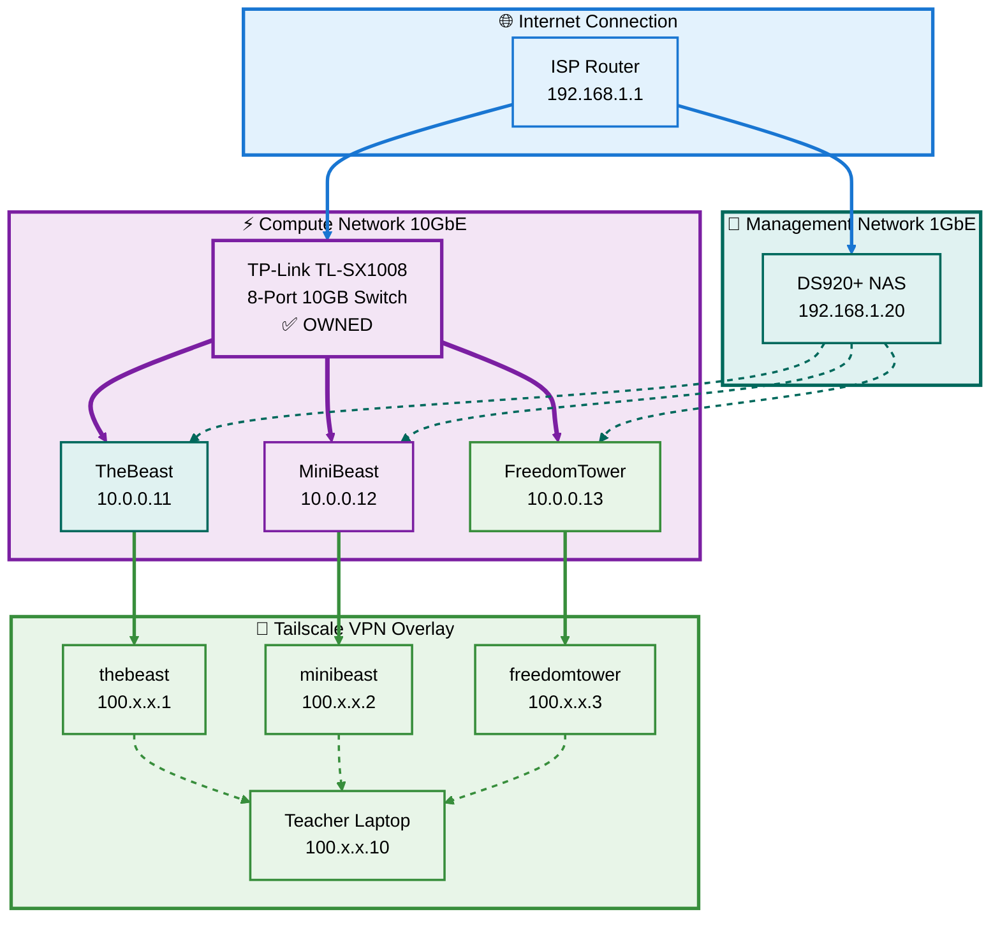

# 🏗️ TheBeast AI Cluster - Section 1: Architecture Overview

**Version:** 6.0 RAID Implementation  
**Last Updated:** October 30, 2025  
**Status:** 🟢 Ready to Build

---

## 📋 Table of Contents

- [🎯 What You're Building](#-what-youre-building)
- [💾 Storage Architecture](#-storage-architecture)
- [🌐 Network Topology](#-network-topology)
- [⚙️ Software Stack](#️-software-stack)
- [📊 Implementation Order](#-implementation-order)
- [✅ Success Criteria](#-success-criteria)

---

## 🎯 What You're Building

### The Cluster in 30 Seconds

**3-node heterogeneous GPU cluster** with enterprise RAID protection, 10GB networking, and distributed AI inference.

```
🦁 TheBeast:    2×RTX 5090, 256GB RAM, 16TB RAID5
⚡ MiniBeast:   2×RTX 4090, 256GB RAM, 8TB RAID1  
🗽 FreedomTower: 1×RTX 5080, 128GB RAM, 12TB RAID1
💾 DS920+ NAS:  4×12TB drives, 24TB SHR2 backup

Total: 5 GPUs, 128GB VRAM, 640GB RAM, 96TB storage
```

### Hardware You Already Own ✅

| Component | Status | Value |
|-----------|--------|-------|
| TP-Link TL-SX1008 (8-port 10GB switch) | ✅ Owned | $250 |
| Tesmart KVM (dual monitor) | ✅ Owned | $330 |
| 3× complete nodes with GPUs | ✅ Owned | $8,000+ |
| DS920+ NAS enclosure | ✅ Owned | $500 |
| 5× 8TB SATA drives | ✅ **Purchased** | $600-750 |
| 4× 12TB SATA drives | ✅ **Purchased** | $800-1,000 |
| 3× CAT6A 8ft cables | ✅ **Purchased** | $30-50 |

**Total Investment:** $1,430-1,800 (all purchased ✅)

[Back to TOC](#-table-of-contents)

---

## 💾 Storage Architecture

### RAID Configuration Overview

```mermaid
graph TB
    subgraph THEBEAST ["🦁    TheBeast    RAID    5"]
        TB1[Drive 1: 8TB]
        TB2[Drive 2: 8TB]
        TB3[Drive 3: 8TB]
        TBR[Windows Storage Spaces<br/>RAID 5 Parity<br/>16TB Usable<br/>🛡️ Survives 1 failure]
    end
    
    subgraph MINIBEAST ["⚡    MiniBeast    RAID    1"]
        MB1[Drive 1: 8TB]
        MB2[Drive 2: 8TB]
        MBR[Windows Storage Spaces<br/>RAID 1 Mirror<br/>8TB Usable<br/>🛡️ Survives 1 failure]
    end
    
    subgraph FREEDOM ["🗽    FreedomTower    RAID    1"]
        FT1[Drive 1: 12TB<br/>Repurposed]
        FT2[Drive 2: 12TB<br/>Repurposed]
        FTR[Windows Storage Spaces<br/>RAID 1 Mirror<br/>12TB Usable<br/>🛡️ Survives 1 failure]
    end
    
    subgraph NAS ["💾    DS920+    NAS    SHR2"]
        N1[Drive 1: 12TB]
        N2[Drive 2: 12TB]
        N3[Drive 3: 12TB]
        N4[Drive 4: 12TB]
        NR[Synology SHR2<br/>24TB Usable<br/>🛡️ Survives ANY 2 failures]
    end
    
    subgraph BACKUP ["🔄    Backup    Strategy"]
        B1[Nightly rsync to NAS]
        B2[Acronis offsite]
    end
    
    %% Data ingestion - Blue
    TB1 --> TBR
    TB2 --> TBR
    TB3 --> TBR
    
    %% Processing - Purple
    MB1 --> MBR
    MB2 --> MBR
    
    %% Distribution - Green
    FT1 --> FTR
    FT2 --> FTR
    
    %% Metadata - Teal
    N1 --> NR
    N2 --> NR
    N3 --> NR
    N4 --> NR
    
    %% Backup flows - Orange (dashed)
    TBR -.-> B1
    MBR -.-> B1
    FTR -.-> B1
    B1 --> NR
    NR -.-> B2
    
    linkStyle 0,1,2 stroke:#1976d2,stroke-width:3px
    linkStyle 3,4 stroke:#7b1fa2,stroke-width:3px
    linkStyle 5,6 stroke:#388e3c,stroke-width:3px
    linkStyle 7,8,9,10 stroke:#00695c,stroke-width:3px
    linkStyle 11,12,13 stroke:#f57c00,stroke-width:2px,stroke-dasharray: 5 5
    linkStyle 14 stroke:#f57c00,stroke-width:3px
    linkStyle 15 stroke:#f57c00,stroke-width:2px,stroke-dasharray: 5 5
    
    style THEBEAST fill:#e0f2f1,stroke:#00695c,stroke-width:3px,color:#000
    style MINIBEAST fill:#f3e5f5,stroke:#7b1fa2,stroke-width:3px,color:#000
    style FREEDOM fill:#e8f5e8,stroke:#388e3c,stroke-width:3px,color:#000
    style NAS fill:#fff8e1,stroke:#f57c00,stroke-width:3px,color:#000
    style BACKUP fill:#fce4ec,stroke:#c2185b,stroke-width:3px,color:#000
    
    style TB1 fill:#e0f2f1,stroke:#00695c,stroke-width:2px,color:#000
    style TB2 fill:#e0f2f1,stroke:#00695c,stroke-width:2px,color:#000
    style TB3 fill:#e0f2f1,stroke:#00695c,stroke-width:2px,color:#000
    style TBR fill:#81c784,stroke:#2e7d32,stroke-width:3px,color:#000
    
    style MB1 fill:#f3e5f5,stroke:#7b1fa2,stroke-width:2px,color:#000
    style MB2 fill:#f3e5f5,stroke:#7b1fa2,stroke-width:2px,color:#000
    style MBR fill:#9575cd,stroke:#4a148c,stroke-width:3px,color:#000
    
    style FT1 fill:#e8f5e8,stroke:#388e3c,stroke-width:2px,color:#000
    style FT2 fill:#e8f5e8,stroke:#388e3c,stroke-width:2px,color:#000
    style FTR fill:#aed581,stroke:#558b2f,stroke-width:3px,color:#000
    
    style N1 fill:#fff8e1,stroke:#f57c00,stroke-width:2px,color:#000
    style N2 fill:#fff8e1,stroke:#f57c00,stroke-width:2px,color:#000
    style N3 fill:#fff8e1,stroke:#f57c00,stroke-width:2px,color:#000
    style N4 fill:#fff8e1,stroke:#f57c00,stroke-width:2px,color:#000
    style NR fill:#ffb74d,stroke:#e65100,stroke-width:3px,color:#000
    
    style B1 fill:#fce4ec,stroke:#c2185b,stroke-width:2px,color:#000
    style B2 fill:#fce4ec,stroke:#c2185b,stroke-width:2px,color:#000
```



### Storage Summary Table

| Node | Drives | RAID Type | Usable | Protection | Purpose |
|------|--------|-----------|--------|------------|---------|
| 🦁 TheBeast | 3× 8TB | RAID 5 | 16TB | 1-drive failure | Large models (70B-405B) |
| ⚡ MiniBeast | 2× 8TB | RAID 1 | 8TB | 1-drive failure | Medium models (13B-70B) |
| 🗽 FreedomTower | 2× 12TB | RAID 1 | 12TB | 1-drive failure | Teaching materials |
| 💾 DS920+ | 4× 12TB | SHR2 | 24TB | 2-drive failure | Backup tier |
| **Total** | **11 drives** | **Mixed** | **60TB** | **🛡️ Protected** | **Enterprise-grade** |

[Back to TOC](#-table-of-contents)

---

## 🌐 Network Topology

### Physical Network Layout



### IP Addressing Scheme

| Network | Subnet | Purpose | Speed |
|---------|--------|---------|-------|
| **Primary Compute** | 10.0.0.0/24 | Model distribution, distributed inference | 10 Gbps |
| **Management** | 192.168.1.0/24 | Internet, updates, NAS backups | 1 Gbps |
| **Tailscale VPN** | 100.x.x.x/32 | Remote access from anywhere | Encrypted |

### Node Addresses

| Node | 10GB Primary | 1GB Secondary | Tailscale |
|------|--------------|---------------|-----------|
| 🦁 TheBeast | 10.0.0.11 | 192.168.1.11 | thebeast |
| ⚡ MiniBeast | 10.0.0.12 | 192.168.1.12 | minibeast |
| 🗽 FreedomTower | 10.0.0.13 | 192.168.1.13 | freedomtower |
| 💾 DS920+ | — | 192.168.1.20 | peterds920 |

[Back to TOC](#-table-of-contents)

---

## ⚙️ Software Stack

### Layer Architecture

```
Layer 8 - Remote Access
└─ Tailscale VPN (WireGuard)

Layer 7 - Applications  
├─ Fabric (pattern library)
├─ llama.cpp (distributed inference)
└─ exo (dynamic clustering)

Layer 6 - AI Frameworks
├─ Ollama (model hosting)
└─ PyTorch (ML libraries)

Layer 5 - Services
├─ Docker Desktop (containers)
├─ Gitea (Git server - TheBeast only)
└─ OpenSSH (remote access)

Layer 4 - Environment
├─ WSL2 Ubuntu 24.04
└─ CUDA 13.0+ (GPU compute)

Layer 3 - Drivers
└─ NVIDIA Driver 560.x+

Layer 2 - Virtualization
└─ Hyper-V + WSL2 kernel

Layer 1 - Operating System
└─ Windows 11 Pro 23H2+
```

### WSL2 Memory Limits (CORRECTED)

| Node | System RAM | WSL2 Allocation | Windows Host | Processors |
|------|------------|-----------------|--------------|------------|
| 🦁 TheBeast | 256GB | **128GB** (50%) | 128GB | 12 of 16 cores |
| ⚡ MiniBeast | 256GB | **128GB** (50%) | 128GB | 12 of 16 cores |
| 🗽 FreedomTower | 128GB | **64GB** (50%) | 64GB | 10 of 16 cores |

**Why not 100%?** Windows host needs RAM for UI, Docker Desktop, and smooth operation.

[Back to TOC](#-table-of-contents)

---

## 📊 Implementation Order

### Phase Overview

```
Week 1: Hardware Installation (Sections 2-5)
├─ Section 2: TheBeast RAID 5 (2 hours)
├─ Section 3: MiniBeast RAID 1 (1.5 hours)
├─ Section 4: FreedomTower RAID 1 (2 hours)
└─ Section 5: DS920+ NAS SHR2 (2 hours)
   Total: 7.5 hours

Week 2: Network & Software (Sections 6-8)
├─ Section 6: Network setup (1.5 hours)
├─ Section 7: WSL2 configuration (1 hour)
└─ Section 8: Software stack (3 hours)
   Total: 5.5 hours

Week 3: Production Ready (Sections 9-10)
├─ Section 9: Model distribution (2 hours)
└─ Section 10: Automated backups (1 hour)
   Total: 3 hours

GRAND TOTAL: 16 hours over 2-3 weeks
```

### Critical Path

**Must be done in order:**
1. Storage (Sections 2-5) → Can do in parallel per node
2. Network (Section 6) → Requires all nodes ready
3. WSL2 (Section 7) → Requires network working
4. Software (Section 8) → Requires WSL2 configured
5. Models (Section 9) → Requires software installed
6. Backups (Section 10) → Requires everything working

**Can be done in parallel:**
- TheBeast RAID (Section 2) + MiniBeast RAID (Section 3)
- FreedomTower RAID (Section 4) + DS920+ NAS (Section 5)

[Back to TOC](#-table-of-contents)

---

## ✅ Success Criteria

### After All Sections Complete

**Storage:**
- ✅ TheBeast F: 16TB RAID 5 (healthy)
- ✅ MiniBeast F: 8TB RAID 1 (healthy)
- ✅ FreedomTower F: 12TB RAID 1 (healthy)
- ✅ DS920+ 24TB SHR2 (healthy)
- ✅ All arrays survive single drive failure

**Network:**
- ✅ 10GB network: 9+ Gbps between nodes (iperf3)
- ✅ Latency: <1ms between nodes (ping)
- ✅ Tailscale: SSH works from laptop
- ✅ NAS: Accessible from all nodes

**Software:**
- ✅ WSL2: Correct RAM limits (128GB/64GB)
- ✅ Ollama: `ollama list` works on all nodes
- ✅ Fabric: Patterns library shared from NAS
- ✅ llama.cpp: Compiled with CUDA support
- ✅ Gitea: Web UI accessible at http://thebeast:3000

**Production:**
- ✅ Models: Llama 7B and 70B downloaded
- ✅ Distribution: Pull models between nodes works
- ✅ Inference: Run model on any node
- ✅ Backups: Nightly cron job runs at 2 AM
- ✅ Distributed: llama.cpp splits model across GPUs

### Quick Health Check Commands

```bash
# Storage health
Get-StoragePool | ft FriendlyName, HealthStatus
df -h /mnt/f

# Network speed
iperf3 -c 10.0.0.12 -t 10

# Software versions
ollama --version
fabric --version
llama-server --version

# GPU status
nvidia-smi
```

[Back to TOC](#-table-of-contents)

---

## 🚀 Next Steps

**You're ready to build!**

Request the next section:
- Type: **"Section 2"** for TheBeast RAID 5 setup
- Or batch: **"Sections 2-5"** for all storage at once

---

**Ready for Section 2?** 🦁

[Back to TOC](#-table-of-contents)
