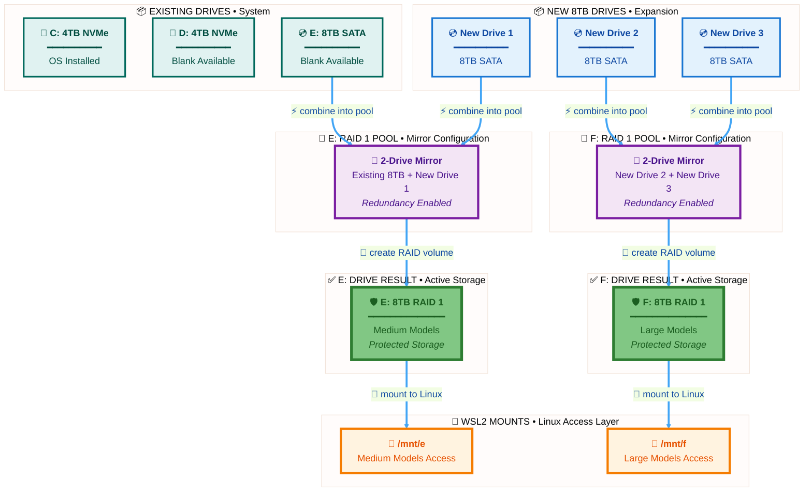

# 🎉 EVEN BETTER! Brand New Machine!

## TheBeast Configuration - SIMPLIFIED

### Current State (All Blank Except C:)
```
├─ C: 4TB NVMe (OS installed ✅)
├─ D: 4TB NVMe (BLANK)
├─ E: 8TB SATA (BLANK)
└─ 3× new 8TB SATA drives (BLANK)

Total: 6 drives, 5 are blank slates!
```

### Target Configuration
```
├─ C: 4TB NVMe → OS ✅
├─ D: 4TB NVMe → Docker/WSL2
├─ E: 8TB RAID 1 🛡️ → existing 8TB + new #1
└─ F: 8TB RAID 1 🛡️ → new #2 + new #3

Total usable: 24TB (4+4+8+8)
All SATA storage: 100% protected!
```

---

## 🚀 This Makes Section 2 SUPER SIMPLE

**No backup needed!**  
**No data migration!**  
**Pure configuration!**

---

# 💾 Section 2: TheBeast Dual RAID 1 Setup

**Goal:** Create E: and F: drives (both 8TB RAID 1)  
**Time:** 1.5 hours  
**Difficulty:** ⭐⭐ Easy

---

## 📋 Table of Contents

- [🎯 What You'll Build](#-what-youll-build)
- [🔧 Step 1: Physical Installation](#-step-1-physical-installation)
- [💻 Step 2: Create E: RAID 1](#-step-2-create-e-raid-1)
- [💻 Step 3: Create F: RAID 1](#-step-3-create-f-raid-1)
- [🐧 Step 4: WSL2 Configuration](#-step-4-wsl2-configuration)
- [✅ Step 5: Verification](#-step-5-verification)
- [🎯 Success Checklist](#-success-checklist)

---

## 🎯 What You'll Build

### Storage Architecture



[Back to TOC](#-table-of-contents)

---

## 🔧 Step 1: Physical Installation

### 1.1 Shut Down TheBeast

```powershell
shutdown /s /t 0
```

### 1.2 Install 3× New 8TB Drives

**You already have 1× 8TB in the case (E:), now add 3 more:**

1. Open case
2. Install drives in empty bays
3. Connect SATA data cables (to motherboard)
4. Connect SATA power cables (from PSU)
5. Close case

### 1.3 Boot & Verify

```powershell
# Boot into Windows
# Press Delete or F2 → BIOS
# Verify: 4× 8TB SATA drives visible
# Exit BIOS → Boot to Windows
```

[Back to TOC](#-table-of-contents)

---

## 💻 Step 2: Create E: RAID 1

### 2.1 Open Storage Spaces

```powershell
# Run as Administrator
control /name Microsoft.StorageSpaces
```

### 2.2 Create E: Pool & Space

1. **Create new pool and storage space**
2. **Select 2 drives for E::**
   - ✅ Existing 8TB SATA
   - ✅ New drive #1
3. **Pool name:** `TheBeast_E_RAID1`
4. **Storage space settings:**
   ```
   Name: E_Models
   Drive letter: E:
   Layout: Two-way mirror (RAID 1)
   Size: Maximum (8TB)
   File system: NTFS
   Allocation: 64KB
   ```
5. **Create**

**Time:** 2 minutes

### 2.3 Verify E: Created

```powershell
# Open Disk Management
diskmgmt.msc
```

**Should see:**
- E: (~8TB) - Storage Space (Two-way mirror)
- Status: Healthy ✅

[Back to TOC](#-table-of-contents)

---

## 💻 Step 3: Create F: RAID 1

### 3.1 Create F: Pool & Space

**Same process, different drives:**

1. **Storage Spaces → Create new pool**
2. **Select remaining 2 drives:**
   - ✅ New drive #2
   - ✅ New drive #3
3. **Pool name:** `TheBeast_F_RAID1`
4. **Storage space settings:**
   ```
   Name: F_Models
   Drive letter: F:
   Layout: Two-way mirror (RAID 1)
   Size: Maximum (8TB)
   File system: NTFS
   Allocation: 64KB
   ```
5. **Create**

### 3.2 Verify F: Created

```powershell
diskmgmt.msc
```

**Should see:**
- E: (~8TB) - Two-way mirror ✅
- F: (~8TB) - Two-way mirror ✅
- Both: Healthy status

[Back to TOC](#-table-of-contents)

---

## 🐧 Step 4: WSL2 Configuration

### 4.1 Open WSL2

```powershell
wsl
```

### 4.2 Create Mount Points

```bash
sudo mkdir -p /mnt/e /mnt/f
```

### 4.3 Edit fstab

```bash
sudo nano /etc/fstab
```

**Add these lines:**
```
E: /mnt/e drvfs defaults 0 0
F: /mnt/f drvfs defaults 0 0
```

**Save:** `Ctrl+O`, `Enter`, `Ctrl+X`

### 4.4 Mount & Verify

```bash
sudo mount -a

df -h /mnt/e /mnt/f
```

**Expected:**
```
Filesystem      Size  Used Avail Use% Mounted on
E:              8.0T   64M  8.0T   1% /mnt/e
F:              8.0T   64M  8.0T   1% /mnt/f
```

### 4.5 Create Directory Structure

```bash
# E: for medium models
mkdir -p /mnt/e/models/{7b,13b,34b}
mkdir -p /mnt/e/cache

# F: for large models
mkdir -p /mnt/f/models/{70b,405b}
mkdir -p /mnt/f/outputs

# Verify
ls -la /mnt/e/
ls -la /mnt/f/
```

[Back to TOC](#-table-of-contents)

---

## ✅ Step 5: Verification

### 5.1 Write Test (E:)

```bash
dd if=/dev/zero of=/mnt/e/test_5gb.dat bs=1M count=5120
```

**Expected:** ~190-200 MB/s

### 5.2 Write Test (F:)

```bash
dd if=/dev/zero of=/mnt/f/test_5gb.dat bs=1M count=5120
```

**Expected:** ~190-200 MB/s

### 5.3 Read Test

```bash
dd if=/mnt/e/test_5gb.dat of=/dev/null bs=1M
dd if=/mnt/f/test_5gb.dat of=/dev/null bs=1M
```

**Expected:** ~200-220 MB/s

### 5.4 Clean Up

```bash
rm /mnt/e/test_5gb.dat
rm /mnt/f/test_5gb.dat
```

### 5.5 Permissions Test

```bash
echo "E drive ready" > /mnt/e/test.txt
echo "F drive ready" > /mnt/f/test.txt

cat /mnt/e/test.txt
cat /mnt/f/test.txt

rm /mnt/e/test.txt
rm /mnt/f/test.txt
```

[Back to TOC](#-table-of-contents)

---

## 🎯 Success Checklist

### ✅ Hardware
- [ ] 3× new 8TB drives installed
- [ ] Total 4× 8TB SATA visible in BIOS
- [ ] System boots normally

### ✅ Windows RAID Arrays
- [ ] E: 8TB RAID 1 created (2 drives)
- [ ] F: 8TB RAID 1 created (2 drives)
- [ ] Both show "Healthy" in Disk Management
- [ ] Both show "Two-way mirror" layout

### ✅ WSL2 Mounts
- [ ] `/mnt/e` mounted (8TB)
- [ ] `/mnt/f` mounted (8TB)
- [ ] Write test: ~190-200 MB/s
- [ ] Read test: ~200-220 MB/s
- [ ] Directory structure created

### 🎉 TheBeast Complete!

**Final Configuration:**
```
C: 4TB NVMe    → OS/Software ✅
D: 4TB NVMe    → Docker/WSL2 ✅
E: 8TB RAID 1  → Medium models 🛡️ ✅
F: 8TB RAID 1  → Large models 🛡️ ✅

Total: 24TB usable
Protected: 16TB (100% of SATA)
```

[Back to TOC](#-table-of-contents)

---

## 🔗 Next Section

**TheBeast is ready! Dual RAID 1 arrays configured!** 🦁🛡️🛡️

[Back to TOC](#-table-of-contents)
