# 🐍 Python Descriptors Guide

## ✨ Section 5: Best Practices & Patterns

---

## 📑 Table of Contents - Section 5

- [When to Use Descriptors](#when-to-use-descriptors)
  - [Decision Framework](#decision-framework)
  - [Descriptors vs Alternatives](#descriptors-vs-alternatives)
- [Common Pitfalls](#common-pitfalls)
  - [Instance vs Class Variables](#instance-vs-class-variables)
  - [Shared State Issues](#shared-state-issues)
  - [Name Collisions](#name-collisions)
  - [Performance Traps](#performance-traps)
- [Performance Considerations](#performance-considerations)
  - [Overhead Analysis](#overhead-analysis)
  - [Optimization Strategies](#optimization-strategies)
- [Advanced Design Patterns](#advanced-design-patterns)
  - [Descriptor Composition](#descriptor-composition)
  - [Descriptor Chaining](#descriptor-chaining)
  - [Context-Aware Descriptors](#context-aware-descriptors)
- [Testing Descriptors](#testing-descriptors)
- [Documentation Best Practices](#documentation-best-practices)
- [Real-World Architecture](#real-world-architecture)
- [Complete Guide Summary](#complete-guide-summary)

---

<a id="when-to-use-descriptors"></a>
## 🎯 When to Use Descriptors

Understanding when descriptors are the right tool is crucial for writing clean, maintainable code.

<a id="decision-framework"></a>
### 🧭 Decision Framework

```mermaid
graph TB
    subgraph QUESTION ["❓    Key    Questions"]
        A1["Need to intercept<br/>attribute access?"]
        A2["Reusable across<br/>multiple attributes?"]
        A3["Complex validation<br/>or computation?"]
    end
    
    subgraph SIMPLE ["🟢    Simple    Solutions"]
        B1["Single attribute?<br/>→ Use @property"]
        B2["No reuse needed?<br/>→ Use @property"]
        B3["Simple validation?<br/>→ Use @property"]
    end
    
    subgraph DESCRIPTOR ["🔵    Descriptor    Solution"]
        C1["Multiple attributes?<br/>→ Custom descriptor"]
        C2["Reusable pattern?<br/>→ Custom descriptor"]
        C3["Complex logic?<br/>→ Custom descriptor"]
    end
    
    subgraph RESULT ["✅    Best    Choice"]
        D1["Choose simplest<br/>solution first"]
        D2["Graduate to descriptors<br/>when needed"]
    end
    
    %% Connections
    A1 -->|Yes| A2
    A1 -->|No| B1
    A2 -->|No| B2
    A2 -->|Yes| C1
    A3 -->|Simple| B3
    A3 -->|Complex| C2
    C1 --> C3
    B1 --> D1
    B2 --> D1
    B3 --> D1
    C3 --> D2
    
    %% Styling connections
    linkStyle 0,1,2,3,4,5,6 stroke:#1976d2,stroke-width:3px
    linkStyle 7,8,9 stroke:#388e3c,stroke-width:3px
    linkStyle 10 stroke:#3f51b5,stroke-width:4px
    
    %% Styling subgraphs
    style QUESTION fill:#e8f4fd,stroke:#1976d2,stroke-width:3px,color:#000
    style SIMPLE fill:#f0f8f0,stroke:#388e3c,stroke-width:3px,color:#000
    style DESCRIPTOR fill:#f8f0ff,stroke:#7b1fa2,stroke-width:3px,color:#000
    style RESULT fill:#fff4e6,stroke:#f57c00,stroke-width:3px,color:#000
    
    %% Styling nodes
    style A1 fill:#e3f2fd,stroke:#1976d2,stroke-width:2px,color:#000
    style A2 fill:#e3f2fd,stroke:#1976d2,stroke-width:2px,color:#000
    style A3 fill:#e3f2fd,stroke:#1976d2,stroke-width:2px,color:#000
    style B1 fill:#e8f5e8,stroke:#388e3c,stroke-width:2px,color:#000
    style B2 fill:#e8f5e8,stroke:#388e3c,stroke-width:2px,color:#000
    style B3 fill:#e8f5e8,stroke:#388e3c,stroke-width:2px,color:#000
    style C1 fill:#f3e5f5,stroke:#7b1fa2,stroke-width:2px,color:#000
    style C2 fill:#f3e5f5,stroke:#7b1fa2,stroke-width:2px,color:#000
    style C3 fill:#f3e5f5,stroke:#7b1fa2,stroke-width:3px,color:#000
    style D1 fill:#fff8e1,stroke:#f57c00,stroke-width:2px,color:#000
    style D2 fill:#fff8e1,stroke:#f57c00,stroke-width:3px,color:#000
```



[↑ Back to TOC](#-table-of-contents---section-5)

---

<a id="descriptors-vs-alternatives"></a>
### ⚖️ Descriptors vs Alternatives

Choose the right tool for the job:

```python
# Scenario 1: Single computed attribute
# ❌ Overkill - Custom descriptor
class AreaDescriptor:
    def __get__(self, obj, objtype=None):
        if obj is None:
            return self
        return obj.width * obj.height

class Rectangle:
    area = AreaDescriptor()
    def __init__(self, width, height):
        self.width = width
        self.height = height

# ✅ Better - Use @property
class Rectangle:
    def __init__(self, width, height):
        self.width = width
        self.height = height
    
    @property
    def area(self):
        return self.width * self.height

# Scenario 2: Reusable validation across multiple classes
# ❌ Repetitive - Multiple properties
class Product:
    def __init__(self, name, price, quantity):
        self._name = name
        self._price = price
        self._quantity = quantity
    
    @property
    def price(self):
        return self._price
    
    @price.setter
    def price(self, value):
        if value < 0:
            raise ValueError("Price cannot be negative")
        self._price = value
    
    @property
    def quantity(self):
        return self._quantity
    
    @quantity.setter
    def quantity(self, value):
        if value < 0:
            raise ValueError("Quantity cannot be negative")
        self._quantity = value

# ✅ Better - Reusable descriptor
class PositiveNumber:
    def __set_name__(self, owner, name):
        self.name = name
        self.private_name = '_' + name
    
    def __get__(self, obj, objtype=None):
        if obj is None:
            return self
        return getattr(obj, self.private_name)
    
    def __set__(self, obj, value):
        if value < 0:
            raise ValueError(f"{self.name} cannot be negative")
        setattr(obj, self.private_name, value)

class Product:
    price = PositiveNumber()
    quantity = PositiveNumber()
    discount = PositiveNumber()
    
    def __init__(self, name, price, quantity, discount=0):
        self.name = name
        self.price = price
        self.quantity = quantity
        self.discount = discount
```

### 📊 Comparison Table

| Scenario | Use Property | Use Descriptor | Why |
|----------|--------------|----------------|-----|
| **Single attribute** | ✅ Yes | ❌ No | Less code, simpler |
| **2-3 similar attributes** | ✅ Yes | 🤔 Maybe | Judgment call |
| **4+ similar attributes** | ❌ No | ✅ Yes | Avoid repetition |
| **Cross-class reuse** | ❌ No | ✅ Yes | Descriptors are reusable |
| **Complex validation** | 🤔 Maybe | ✅ Yes | Encapsulate complexity |
| **Framework building** | ❌ No | ✅ Yes | Descriptors more powerful |

[↑ Back to TOC](#-table-of-contents---section-5)

---

<a id="common-pitfalls"></a>
## ⚠️ Common Pitfalls

Avoid these common mistakes when working with descriptors.

<a id="instance-vs-class-variables"></a>
### 🎭 Instance vs Class Variables

**Problem:** Forgetting that descriptors must be class variables.

```python
# ❌ WRONG - Descriptor as instance variable (won't work!)
class Broken:
    def __init__(self):
        self.descriptor = SomeDescriptor()  # Won't work!

# ✅ CORRECT - Descriptor as class variable
class Working:
    descriptor = SomeDescriptor()  # Works!
    
    def __init__(self):
        pass
```

<a id="shared-state-issues"></a>
### 🔄 Shared State Issues

**Problem:** Storing data in the descriptor instead of the instance.

```python
# ❌ WRONG - Data stored in descriptor (shared across instances!)
class BadDescriptor:
    def __init__(self):
        self.value = None  # Shared across ALL instances!
    
    def __get__(self, obj, objtype=None):
        return self.value
    
    def __set__(self, obj, value):
        self.value = value  # BAD: All instances share this!

class MyClass:
    attr = BadDescriptor()

# Problem demonstration
obj1 = MyClass()
obj2 = MyClass()

obj1.attr = "first"
obj2.attr = "second"

print(obj1.attr)  # Output: "second" (NOT "first" - shared state!)

# ✅ CORRECT - Data stored in instance
class GoodDescriptor:
    def __set_name__(self, owner, name):
        self.private_name = '_' + name
    
    def __get__(self, obj, objtype=None):
        if obj is None:
            return self
        return getattr(obj, self.private_name)
    
    def __set__(self, obj, value):
        setattr(obj, self.private_name, value)  # Stored in instance!

class MyClass:
    attr = GoodDescriptor()

# Now it works correctly
obj1 = MyClass()
obj2 = MyClass()

obj1.attr = "first"
obj2.attr = "second"

print(obj1.attr)  # Output: "first" ✅
print(obj2.attr)  # Output: "second" ✅
```

### 🔍 Shared State Visualization

```mermaid
graph TB
    subgraph WRONG ["❌    Wrong    Pattern"]
        A1["Descriptor instance"]
        A2["self.value = X"]
        A3["obj1.attr"]
        A4["obj2.attr"]
    end
    
    subgraph PROBLEM ["⚠️    Problem"]
        B1["Both instances<br/>share same data"]
        B2["Last write wins"]
        B3["Data corruption"]
    end
    
    subgraph RIGHT ["✅    Correct    Pattern"]
        C1["Descriptor instance"]
        C2["obj1.__dict__['_attr']"]
        C3["obj2.__dict__['_attr']"]
    end
    
    subgraph SOLUTION ["💚    Solution"]
        D1["Each instance<br/>has own data"]
        D2["No interference"]
        D3["Data integrity"]
    end
    
    %% Wrong pattern flow
    A3 --> A2
    A4 --> A2
    A2 --> A1
    A1 --> B1
    B1 --> B2
    B2 --> B3
    
    %% Right pattern flow
    C1 --> C2
    C1 --> C3
    C2 --> D1
    C3 --> D1
    D1 --> D2
    D2 --> D3
    
    %% Styling connections
    linkStyle 0,1,2,3,4,5 stroke:#c2185b,stroke-width:3px
    linkStyle 6,7,8,9,10,11 stroke:#388e3c,stroke-width:3px
    
    %% Styling subgraphs
    style WRONG fill:#fef7f7,stroke:#c2185b,stroke-width:3px,color:#000
    style PROBLEM fill:#fef7f7,stroke:#c2185b,stroke-width:3px,color:#000
    style RIGHT fill:#f0f8f0,stroke:#388e3c,stroke-width:3px,color:#000
    style SOLUTION fill:#f0f8f0,stroke:#388e3c,stroke-width:3px,color:#000
    
    %% Styling nodes
    style A1 fill:#fce4ec,stroke:#c2185b,stroke-width:2px,color:#000
    style A2 fill:#fce4ec,stroke:#c2185b,stroke-width:3px,color:#000
    style A3 fill:#fce4ec,stroke:#c2185b,stroke-width:2px,color:#000
    style A4 fill:#fce4ec,stroke:#c2185b,stroke-width:2px,color:#000
    style B1 fill:#fce4ec,stroke:#c2185b,stroke-width:2px,color:#000
    style B2 fill:#fce4ec,stroke:#c2185b,stroke-width:2px,color:#000
    style B3 fill:#fce4ec,stroke:#c2185b,stroke-width:3px,color:#000
    style C1 fill:#e8f5e8,stroke:#388e3c,stroke-width:2px,color:#000
    style C2 fill:#e8f5e8,stroke:#388e3c,stroke-width:2px,color:#000
    style C3 fill:#e8f5e8,stroke:#388e3c,stroke-width:2px,color:#000
    style D1 fill:#e8f5e8,stroke:#388e3c,stroke-width:2px,color:#000
    style D2 fill:#e8f5e8,stroke:#388e3c,stroke-width:2px,color:#000
    style D3 fill:#e8f5e8,stroke:#388e3c,stroke-width:3px,color:#000
```



[↑ Back to TOC](#-table-of-contents---section-5)

---

<a id="name-collisions"></a>
### 🏷️ Name Collisions

**Problem:** Private attribute names colliding with other attributes.

```python
# ❌ RISKY - Hardcoded private name
class Descriptor:
    def __get__(self, obj, objtype=None):
        return obj._value  # What if multiple descriptors use _value?
    
    def __set__(self, obj, value):
        obj._value = value

# ✅ BETTER - Use __set_name__ for unique names
class Descriptor:
    def __set_name__(self, owner, name):
        self.private_name = '_' + name  # Unique per attribute
    
    def __get__(self, obj, objtype=None):
        if obj is None:
            return self
        return getattr(obj, self.private_name)
    
    def __set__(self, obj, value):
        setattr(obj, self.private_name, value)

# ✅ EVEN BETTER - Use WeakKeyDictionary for complete isolation
from weakref import WeakKeyDictionary

class Descriptor:
    def __init__(self):
        self.data = WeakKeyDictionary()
    
    def __get__(self, obj, objtype=None):
        if obj is None:
            return self
        return self.data.get(obj)
    
    def __set__(self, obj, value):
        self.data[obj] = value
```

<a id="performance-traps"></a>
### ⚡ Performance Traps

**Problem:** Excessive descriptor overhead for simple cases.

```python
# ❌ OVERKILL - Descriptor for simple storage
class SimpleStorage:
    def __set_name__(self, owner, name):
        self.name = '_' + name
    
    def __get__(self, obj, objtype=None):
        if obj is None:
            return self
        return getattr(obj, self.name)
    
    def __set__(self, obj, value):
        setattr(obj, self.name, value)

# ✅ BETTER - Just use a regular attribute!
class MyClass:
    def __init__(self, value):
        self.value = value  # No descriptor needed!
```

### 📋 Pitfall Checklist

| Pitfall | Check | Solution |
|---------|-------|----------|
| ☑️ Descriptor in `__init__` | Must be class variable | Move to class body |
| ☑️ Data in descriptor | Use instance storage | Use `__set_name__` + `setattr` |
| ☑️ Name collisions | Private names unique? | Use `__set_name__` |
| ☑️ Forgot `obj is None` | Handle class access? | Check and return `self` |
| ☑️ Over-engineering | Really need descriptor? | Consider `@property` |

[↑ Back to TOC](#-table-of-contents---section-5)

---

<a id="performance-considerations"></a>
## 🚀 Performance Considerations

Understanding the performance characteristics of descriptors helps you use them effectively.

<a id="overhead-analysis"></a>
### 📊 Overhead Analysis

```python
import timeit

# Test setup
class RegularAttribute:
    def __init__(self, value):
        self.value = value

class PropertyAttribute:
    def __init__(self, value):
        self._value = value
    
    @property
    def value(self):
        return self._value
    
    @value.setter
    def value(self, val):
        self._value = val

class DescriptorAttribute:
    class Descriptor:
        def __set_name__(self, owner, name):
            self.name = '_' + name
        
        def __get__(self, obj, objtype=None):
            if obj is None:
                return self
            return getattr(obj, self.name)
        
        def __set__(self, obj, value):
            setattr(obj, self.name, value)
    
    value = Descriptor()
    
    def __init__(self, value):
        self.value = value

# Performance comparison
regular = RegularAttribute(42)
prop = PropertyAttribute(42)
desc = DescriptorAttribute(42)

# Read performance
print("Read performance:")
print(f"Regular:    {timeit.timeit(lambda: regular.value, number=1000000):.4f}s")
print(f"Property:   {timeit.timeit(lambda: prop.value, number=1000000):.4f}s")
print(f"Descriptor: {timeit.timeit(lambda: desc.value, number=1000000):.4f}s")

# Write performance
print("\nWrite performance:")
print(f"Regular:    {timeit.timeit(lambda: setattr(regular, 'value', 42), number=1000000):.4f}s")
print(f"Property:   {timeit.timeit(lambda: setattr(prop, 'value', 42), number=1000000):.4f}s")
print(f"Descriptor: {timeit.timeit(lambda: setattr(desc, 'value', 42), number=1000000):.4f}s")

# Typical results:
# Regular attribute:    ~100% (baseline)
# Property:             ~150-200%
# Descriptor:           ~150-200%
```

### 📈 Performance Comparison

```mermaid
graph TB
    subgraph REGULAR ["⚡    Regular    Attribute"]
        A1["Direct access"]
        A2["No overhead"]
        A3["100% speed<br/>(baseline)"]
    end
    
    subgraph PROPERTY ["🎛️    Property"]
        B1["Function call"]
        B2["Small overhead"]
        B3["~150-200% time"]
    end
    
    subgraph DESCRIPTOR ["🎨    Descriptor"]
        C1["Protocol lookup"]
        C2["Method call"]
        C3["~150-200% time"]
    end
    
    subgraph ADVICE ["💡    When    Overhead    Matters"]
        D1["Hot loops:<br/>Consider cost"]
        D2["Normal code:<br/>Negligible impact"]
        D3["Readability ><br/>Micro-optimization"]
    end
    
    %% Connections
    A1 --> A2
    A2 --> A3
    B1 --> B2
    B2 --> B3
    C1 --> C2
    C2 --> C3
    A3 --> D1
    B3 --> D2
    C3 --> D3
    
    %% Styling connections
    linkStyle 0,1 stroke:#388e3c,stroke-width:3px
    linkStyle 2,3 stroke:#1976d2,stroke-width:3px
    linkStyle 4,5 stroke:#7b1fa2,stroke-width:3px
    linkStyle 6,7,8 stroke:#f57c00,stroke-width:3px
    
    %% Styling subgraphs
    style REGULAR fill:#f0f8f0,stroke:#388e3c,stroke-width:3px,color:#000
    style PROPERTY fill:#e8f4fd,stroke:#1976d2,stroke-width:3px,color:#000
    style DESCRIPTOR fill:#f8f0ff,stroke:#7b1fa2,stroke-width:3px,color:#000
    style ADVICE fill:#fff4e6,stroke:#f57c00,stroke-width:3px,color:#000
    
    %% Styling nodes
    style A1 fill:#e8f5e8,stroke:#388e3c,stroke-width:2px,color:#000
    style A2 fill:#e8f5e8,stroke:#388e3c,stroke-width:2px,color:#000
    style A3 fill:#e8f5e8,stroke:#388e3c,stroke-width:3px,color:#000
    style B1 fill:#e3f2fd,stroke:#1976d2,stroke-width:2px,color:#000
    style B2 fill:#e3f2fd,stroke:#1976d2,stroke-width:2px,color:#000
    style B3 fill:#e3f2fd,stroke:#1976d2,stroke-width:2px,color:#000
    style C1 fill:#f3e5f5,stroke:#7b1fa2,stroke-width:2px,color:#000
    style C2 fill:#f3e5f5,stroke:#7b1fa2,stroke-width:2px,color:#000
    style C3 fill:#f3e5f5,stroke:#7b1fa2,stroke-width:2px,color:#000
    style D1 fill:#fff8e1,stroke:#f57c00,stroke-width:2px,color:#000
    style D2 fill:#fff8e1,stroke:#f57c00,stroke-width:2px,color:#000
    style D3 fill:#fff8e1,stroke:#f57c00,stroke-width:3px,color:#000
```



[↑ Back to TOC](#-table-of-contents---section-5)

---

<a id="optimization-strategies"></a>
### 🎯 Optimization Strategies

**Strategy 1: Cache expensive computations**

```python
class CachedDescriptor:
    def __init__(self, func):
        self.func = func
        self.cache_name = '_cache_' + func.__name__
    
    def __get__(self, obj, objtype=None):
        if obj is None:
            return self
        
        # Check cache first
        cached = getattr(obj, self.cache_name, None)
        if cached is not None:
            return cached
        
        # Compute and cache
        value = self.func(obj)
        setattr(obj, self.cache_name, value)
        return value
```

**Strategy 2: Use `__slots__` with descriptors for memory**

```python
class OptimizedClass:
    __slots__ = ('_value',)
    
    class ValueDescriptor:
        def __get__(self, obj, objtype=None):
            if obj is None:
                return self
            return obj._value
        
        def __set__(self, obj, value):
            obj._value = value
    
    value = ValueDescriptor()
```

**Strategy 3: Minimize lookups**

```python
# ❌ SLOW - Multiple attribute lookups
class Slow:
    def __get__(self, obj, objtype=None):
        if obj is None:
            return self
        return getattr(obj, self.name, None)

# ✅ FASTER - Direct dict access when possible
class Faster:
    def __get__(self, obj, objtype=None):
        if obj is None:
            return self
        return obj.__dict__.get(self.name)
```

[↑ Back to TOC](#-table-of-contents---section-5)

---

<a id="advanced-design-patterns"></a>
## 🏗️ Advanced Design Patterns

Powerful patterns for sophisticated descriptor usage.

<a id="descriptor-composition"></a>
### 🔗 Descriptor Composition

Combine multiple validators for complex rules:

```python
class ComposedValidator:
    """Compose multiple validators"""
    
    def __init__(self, *validators):
        self.validators = validators
    
    def __set_name__(self, owner, name):
        self.name = name
        self.private_name = '_' + name
        # Propagate to child validators
        for validator in self.validators:
            if hasattr(validator, '__set_name__'):
                validator.__set_name__(owner, name)
    
    def __get__(self, obj, objtype=None):
        if obj is None:
            return self
        return getattr(obj, self.private_name)
    
    def __set__(self, obj, value):
        # Run all validators
        for validator in self.validators:
            validator.validate(value)
        # All passed, store value
        setattr(obj, self.private_name, value)

# Individual validators
class TypeValidator:
    def __init__(self, expected_type):
        self.expected_type = expected_type
    
    def validate(self, value):
        if not isinstance(value, self.expected_type):
            raise TypeError(f"Expected {self.expected_type.__name__}")

class RangeValidator:
    def __init__(self, min_val, max_val):
        self.min_val = min_val
        self.max_val = max_val
    
    def validate(self, value):
        if not (self.min_val <= value <= self.max_val):
            raise ValueError(f"Value must be between {self.min_val} and {self.max_val}")

class EvenValidator:
    def validate(self, value):
        if value % 2 != 0:
            raise ValueError("Value must be even")

# Compose validators
class GameScore:
    # Must be int, between 0-100, and even
    score = ComposedValidator(
        TypeValidator(int),
        RangeValidator(0, 100),
        EvenValidator()
    )
    
    def __init__(self, score):
        self.score = score

# Usage
game = GameScore(50)  # ✅ Valid: int, in range, even
print(game.score)

try:
    game.score = 75  # ❌ Odd number
except ValueError as e:
    print(e)

try:
    game.score = 150  # ❌ Out of range
except ValueError as e:
    print(e)
```

<a id="descriptor-chaining"></a>
### ⛓️ Descriptor Chaining

Chain transformations on values:

```python
class ChainedDescriptor:
    """Chain multiple transformations"""
    
    def __init__(self, *transforms):
        self.transforms = transforms
    
    def __set_name__(self, owner, name):
        self.name = name
        self.private_name = '_' + name
    
    def __get__(self, obj, objtype=None):
        if obj is None:
            return self
        value = getattr(obj, self.private_name)
        # Apply transforms on read
        for transform in self.transforms:
            if hasattr(transform, 'on_get'):
                value = transform.on_get(value)
        return value
    
    def __set__(self, obj, value):
        # Apply transforms on write
        for transform in self.transforms:
            if hasattr(transform, 'on_set'):
                value = transform.on_set(value)
        setattr(obj, self.private_name, value)

# Transformation classes
class Strip:
    """Remove whitespace"""
    def on_set(self, value):
        return value.strip() if isinstance(value, str) else value

class Lowercase:
    """Convert to lowercase"""
    def on_set(self, value):
        return value.lower() if isinstance(value, str) else value

class Truncate:
    """Truncate to max length"""
    def __init__(self, max_length):
        self.max_length = max_length
    
    def on_set(self, value):
        if isinstance(value, str) and len(value) > self.max_length:
            return value[:self.max_length]
        return value

# Usage
class User:
    # Chain transformations: strip → lowercase → truncate
    username = ChainedDescriptor(
        Strip(),
        Lowercase(),
        Truncate(20)
    )
    
    def __init__(self, username):
        self.username = username

user = User("  ALICE_WONDERLAND_2024  ")
print(user.username)  # Output: alice_wonderland_20
```

<a id="context-aware-descriptors"></a>
### 🎭 Context-Aware Descriptors

Descriptors that behave differently based on context:

```python
class ContextAware:
    """Descriptor that tracks access context"""
    
    def __set_name__(self, owner, name):
        self.name = name
        self.private_name = '_' + name
        self.access_count = 0
    
    def __get__(self, obj, objtype=None):
        if obj is None:
            # Class access - return metadata
            return {
                'name': self.name,
                'access_count': self.access_count,
                'descriptor': self
            }
        
        # Instance access - return value and track
        self.access_count += 1
        return getattr(obj, self.private_name, None)
    
    def __set__(self, obj, value):
        setattr(obj, self.private_name, value)

class Analytics:
    score = ContextAware()
    rating = ContextAware()
    
    def __init__(self, score, rating):
        self.score = score
        self.rating = rating

# Usage
obj = Analytics(95, 4.5)

# Instance access
print(obj.score)   # Output: 95
print(obj.score)   # Output: 95
print(obj.rating)  # Output: 4.5

# Class access - get metadata
print(Analytics.score)
# Output: {'name': 'score', 'access_count': 2, 'descriptor': <...>}
```

### 🎨 Pattern Composition Flow

```mermaid
graph TB
    subgraph INPUT ["📥    Input    Value"]
        A1["User input:<br/>'  HELLO  '"]
    end
    
    subgraph CHAIN ["⛓️    Transform    Chain"]
        B1["Strip()<br/>→ 'HELLO'"]
        B2["Lowercase()<br/>→ 'hello'"]
        B3["Truncate(3)<br/>→ 'hel'"]
    end
    
    subgraph VALIDATE ["✅    Validation    Chain"]
        C1["TypeValidator<br/>Check type"]
        C2["RangeValidator<br/>Check range"]
        C3["CustomValidator<br/>Business rules"]
    end
    
    subgraph STORE ["💾    Store    Value"]
        D1["All validations<br/>passed"]
        D2["Store in<br/>instance"]
    end
    
    subgraph OUTPUT ["📤    Final    Value"]
        E1["Transformed &<br/>validated value"]
    end
    
    %% Flow
    A1 --> B1
    B1 --> B2
    B2 --> B3
    B3 --> C1
    C1 --> C2
    C2 --> C3
    C3 --> D1
    D1 --> D2
    D2 --> E1
    
    %% Styling connections
    linkStyle 0,1,2 stroke:#1976d2,stroke-width:3px
    linkStyle 3,4,5 stroke:#7b1fa2,stroke-width:3px
    linkStyle 6,7 stroke:#388e3c,stroke-width:3px
    linkStyle 8 stroke:#3f51b5,stroke-width:4px
    
    %% Styling subgraphs
    style INPUT fill:#e8f4fd,stroke:#1976d2,stroke-width:3px,color:#000
    style CHAIN fill:#f8f0ff,stroke:#7b1fa2,stroke-width:3px,color:#000
    style VALIDATE fill:#f0f8f0,stroke:#388e3c,stroke-width:3px,color:#000
    style STORE fill:#f0fffe,stroke:#00695c,stroke-width:3px,color:#000
    style OUTPUT fill:#fff4e6,stroke:#f57c00,stroke-width:3px,color:#000
    
    %% Styling nodes
    style A1 fill:#e3f2fd,stroke:#1976d2,stroke-width:3px,color:#000
    style B1 fill:#f3e5f5,stroke:#7b1fa2,stroke-width:2px,color:#000
    style B2 fill:#f3e5f5,stroke:#7b1fa2,stroke-width:2px,color:#000
    style B3 fill:#f3e5f5,stroke:#7b1fa2,stroke-width:2px,color:#000
    style C1 fill:#e8f5e8,stroke:#388e3c,stroke-width:2px,color:#000
    style C2 fill:#e8f5e8,stroke:#388e3c,stroke-width:2px,color:#000
    style C3 fill:#e8f5e8,stroke:#388e3c,stroke-width:2px,color:#000
    style D1 fill:#e0f2f1,stroke:#00695c,stroke-width:2px,color:#000
    style D2 fill:#e0f2f1,stroke:#00695c,stroke-width:2px,color:#000
    style E1 fill:#fff8e1,stroke:#f57c00,stroke-width:3px,color:#000
```



[↑ Back to TOC](#-table-of-contents---section-5)

---

<a id="testing-descriptors"></a>
## 🧪 Testing Descriptors

Comprehensive testing strategies for descriptors.

```python
import unittest

class TestDescriptor(unittest.TestCase):
    """Test suite for descriptor validation"""
    
    def setUp(self):
        """Create test descriptor"""
        class PositiveNumber:
            def __set_name__(self, owner, name):
                self.name = '_' + name
            
            def __get__(self, obj, objtype=None):
                if obj is None:
                    return self
                return getattr(obj, self.name)
            
            def __set__(self, obj, value):
                if value < 0:
                    raise ValueError("Must be positive")
                setattr(obj, self.name, value)
        
        class Account:
            balance = PositiveNumber()
            
            def __init__(self, balance):
                self.balance = balance
        
        self.Account = Account
    
    def test_valid_value(self):
        """Test descriptor accepts valid values"""
        account = self.Account(100)
        self.assertEqual(account.balance, 100)
    
    def test_invalid_value(self):
        """Test descriptor rejects invalid values"""
        with self.assertRaises(ValueError):
            self.Account(-50)
    
    def test_value_update(self):
        """Test descriptor allows valid updates"""
        account = self.Account(100)
        account.balance = 200
        self.assertEqual(account.balance, 200)
    
    def test_invalid_update(self):
        """Test descriptor rejects invalid updates"""
        account = self.Account(100)
        with self.assertRaises(ValueError):
            account.balance = -50
    
    def test_class_access(self):
        """Test descriptor accessed via class"""
        descriptor = self.Account.balance
        self.assertIsNotNone(descriptor)
    
    def test_multiple_instances(self):
        """Test descriptor isolates instance data"""
        acc1 = self.Account(100)
        acc2 = self.Account(200)
        
        self.assertEqual(acc1.balance, 100)
        self.assertEqual(acc2.balance, 200)
        
        acc1.balance = 150
        self.assertEqual(acc1.balance, 150)
        self.assertEqual(acc2.balance, 200)  # Unchanged

# Run tests
if __name__ == '__main__':
    unittest.main()
```

### 📋 Testing Checklist

| Test | What to Verify | Example |
|------|----------------|---------|
| ☑️ **Valid values** | Accepts correct input | `obj.attr = 10` works |
| ☑️ **Invalid values** | Rejects incorrect input | `obj.attr = -5` raises error |
| ☑️ **Instance isolation** | No data sharing | Two instances independent |
| ☑️ **Class access** | Returns descriptor | `Class.attr` works |
| ☑️ **Edge cases** | Boundary values | Zero, None, empty string |
| ☑️ **Type handling** | Correct type errors | Wrong type raises TypeError |
| ☑️ **Updates** | Modification works | Can change value after init |
| ☑️ **Deletion** | Delete if supported | `del obj.attr` behaves correctly |

[↑ Back to TOC](#-table-of-contents---section-5)

---

<a id="documentation-best-practices"></a>
## 📖 Documentation Best Practices

Well-documented descriptors are easier to use and maintain.

```python
class ValidatedAttribute:
    """
    Descriptor for validated attribute storage.
    
    This descriptor provides automatic validation of attribute values
    before storage. It ensures data integrity by rejecting invalid
    values at assignment time.
    
    Attributes:
        validator (callable): Function that validates values.
            Should raise ValueError or TypeError for invalid input.
        private_name (str): Name of the private storage attribute.
            Set automatically by __set_name__.
    
    Example:
        >>> def positive_validator(value):
        ...     if value <= 0:
        ...         raise ValueError("Must be positive")
        
        >>> class Product:
        ...     price = ValidatedAttribute(positive_validator)
        ...     
        ...     def __init__(self, price):
        ...         self.price = price
        
        >>> p = Product(10.99)  # Valid
        >>> p.price = -5  # Raises ValueError
    
    Notes:
        - The descriptor must be defined as a class variable
        - Data is stored in the instance, not the descriptor
        - Works correctly with inheritance
    """
    
    def __init__(self, validator):
        """
        Initialize the descriptor.
        
        Args:
            validator (callable): Function to validate values.
                Signature: validator(value) -> None
                Should raise exception for invalid values.
        """
        self.validator = validator
        self.private_name = None
    
    def __set_name__(self, owner, name):
        """
        Called when descriptor is assigned to class attribute.
        
        Args:
            owner (type): The class containing this descriptor.
            name (str): The name of the class variable.
        """
        self.private_name = '_' + name
    
    def __get__(self, obj, objtype=None):
        """
        Get the attribute value.
        
        Args:
            obj: The instance accessing the attribute (or None for class).
            objtype: The type of the instance.
        
        Returns:
            The stored value if accessed from instance.
            The descriptor itself if accessed from class.
        """
        if obj is None:
            return self
        return getattr(obj, self.private_name)
    
    def __set__(self, obj, value):
        """
        Set the attribute value with validation.
        
        Args:
            obj: The instance setting the attribute.
            value: The value to store.
        
        Raises:
            ValueError: If validator rejects the value.
            TypeError: If value is wrong type.
        """
        self.validator(value)
        setattr(obj, self.private_name, value)
```

### 📝 Documentation Guidelines

| Element | Include | Example |
|---------|---------|---------|
| **Class docstring** | Purpose, usage example | See above |
| **`__init__`** | Parameter descriptions | All constructor args |
| **`__get__`** | Return values, behaviors | When returns self vs value |
| **`__set__`** | Validation rules | What raises what exception |
| **`__delete__`** | Deletion behavior | Side effects |
| **Notes section** | Gotchas, requirements | Must be class variable |

[↑ Back to TOC](#-table-of-contents---section-5)

---

<a id="real-world-architecture"></a>
## 🏛️ Real-World Architecture

Example of a complete descriptor-based system:

```python
"""
ORM-style model system using descriptors.
Demonstrates professional architecture with descriptors.
"""

from abc import ABC, abstractmethod
from typing import Any, Optional

# Base field descriptor
class Field(ABC):
    """Abstract base for all field types"""
    
    def __init__(self, *, required=True, default=None):
        self.required = required
        self.default = default
        self.name = None
        self.private_name = None
    
    def __set_name__(self, owner, name):
        self.name = name
        self.private_name = '_' + name
    
    def __get__(self, obj, objtype=None):
        if obj is None:
            return self
        
        value = getattr(obj, self.private_name, None)
        if value is None and self.default is not None:
            return self.default
        return value
    
    def __set__(self, obj, value):
        if value is None:
            if self.required:
                raise ValueError(f"{self.name} is required")
            setattr(obj, self.private_name, None)
            return
        
        self.validate(value)
        setattr(obj, self.private_name, value)
    
    @abstractmethod
    def validate(self, value):
        """Validate the value"""
        pass

# Concrete field types
class StringField(Field):
    """String field with length validation"""
    
    def __init__(self, *, min_length=0, max_length=None, **kwargs):
        super().__init__(**kwargs)
        self.min_length = min_length
        self.max_length = max_length
    
    def validate(self, value):
        if not isinstance(value, str):
            raise TypeError(f"{self.name} must be a string")
        
        if len(value) < self.min_length:
            raise ValueError(
                f"{self.name} must be at least {self.min_length} characters"
            )
        
        if self.max_length and len(value) > self.max_length:
            raise ValueError(
                f"{self.name} must be at most {self.max_length} characters"
            )

class IntegerField(Field):
    """Integer field with range validation"""
    
    def __init__(self, *, min_value=None, max_value=None, **kwargs):
        super().__init__(**kwargs)
        self.min_value = min_value
        self.max_value = max_value
    
    def validate(self, value):
        if not isinstance(value, int):
            raise TypeError(f"{self.name} must be an integer")
        
        if self.min_value is not None and value < self.min_value:
            raise ValueError(f"{self.name} must be >= {self.min_value}")
        
        if self.max_value is not None and value > self.max_value:
            raise ValueError(f"{self.name} must be <= {self.max_value}")

class EmailField(StringField):
    """Email field with format validation"""
    
    def __init__(self, **kwargs):
        super().__init__(min_length=5, **kwargs)
    
    def validate(self, value):
        super().validate(value)
        if '@' not in value or '.' not in value.split('@')[1]:
            raise ValueError(f"{self.name} must be a valid email")

# Model base class
class Model:
    """Base class for models using field descriptors"""
    
    def __init__(self, **kwargs):
        # Set all fields from kwargs
        for key, value in kwargs.items():
            setattr(self, key, value)
    
    def to_dict(self):
        """Convert model to dictionary"""
        result = {}
        for key in dir(self.__class__):
            attr = getattr(self.__class__, key)
            if isinstance(attr, Field):
                result[key] = getattr(self, key)
        return result
    
    def __repr__(self):
        fields = ', '.join(
            f"{k}={v!r}"
            for k, v in self.to_dict().items()
        )
        return f"{self.__class__.__name__}({fields})"

# Example models
class User(Model):
    """User model with validated fields"""
    
    username = StringField(min_length=3, max_length=20)
    email = EmailField()
    age = IntegerField(min_value=0, max_value=150)
    bio = StringField(required=False, default="No bio")

class Product(Model):
    """Product model"""
    
    name = StringField(min_length=1, max_length=100)
    price = IntegerField(min_value=0)
    stock = IntegerField(min_value=0, default=0)

# Usage
user = User(
    username="alice",
    email="alice@example.com",
    age=30
)

print(user)
# Output: User(username='alice', email='alice@example.com', age=30, bio='No bio')

print(user.to_dict())
# Output: {'username': 'alice', 'email': 'alice@example.com', 'age': 30, 'bio': 'No bio'}

# Validation in action
try:
    invalid_user = User(
        username="al",  # Too short!
        email="invalid",  # Not an email!
        age=-5  # Negative age!
    )
except ValueError as e:
    print(f"Validation failed: {e}")
```

[↑ Back to TOC](#-table-of-contents---section-5)

---

<a id="complete-guide-summary"></a>
## 🎓 Complete Guide Summary

### 🌟 The Complete Descriptor Journey

```mermaid
graph TB
    subgraph BASICS ["📚    Fundamentals"]
        A1["What descriptors are"]
        A2["The protocol"]
        A3["When invoked"]
    end
    
    subgraph PROTOCOL ["🔬    Deep    Dive"]
        B1["__get__/__set__/__delete__"]
        B2["__set_name__"]
        B3["Data vs non-data"]
        B4["Lookup chain"]
    end
    
    subgraph PRACTICAL ["💼    Applications"]
        C1["Validation"]
        C2["Logging"]
        C3["Lazy evaluation"]
        C4["Type safety"]
    end
    
    subgraph BUILTIN ["🏗️    Built-ins"]
        D1["@property"]
        D2["Functions → methods"]
        D3["@staticmethod"]
        D4["@classmethod"]
        D5["__slots__"]
    end
    
    subgraph MASTERY ["✨    Mastery"]
        E1["Best practices"]
        E2["Avoid pitfalls"]
        E3["Design patterns"]
        E4["Performance"]
    end
    
    subgraph CENTER ["🎯    Descriptor    Mastery"]
        F1["Complete<br/>Understanding"]
    end
    
    %% Connections
    A1 --> F1
    A2 --> F1
    A3 --> F1
    B1 --> F1
    B2 --> F1
    B3 --> F1
    B4 --> F1
    C1 --> F1
    C2 --> F1
    C3 --> F1
    C4 --> F1
    D1 --> F1
    D2 --> F1
    D3 --> F1
    D4 --> F1
    D5 --> F1
    E1 --> F1
    E2 --> F1
    E3 --> F1
    E4 --> F1
    
    %% Styling connections
    linkStyle 0,1,2 stroke:#1976d2,stroke-width:3px
    linkStyle 3,4,5,6 stroke:#7b1fa2,stroke-width:3px
    linkStyle 7,8,9,10 stroke:#388e3c,stroke-width:3px
    linkStyle 11,12,13,14,15 stroke:#f57c00,stroke-width:3px
    linkStyle 16,17,18,19 stroke:#00695c,stroke-width:3px
    
    %% Styling subgraphs
    style BASICS fill:#e8f4fd,stroke:#1976d2,stroke-width:3px,color:#000
    style PROTOCOL fill:#f8f0ff,stroke:#7b1fa2,stroke-width:3px,color:#000
    style PRACTICAL fill:#f0f8f0,stroke:#388e3c,stroke-width:3px,color:#000
    style BUILTIN fill:#fff4e6,stroke:#f57c00,stroke-width:3px,color:#000
    style MASTERY fill:#f0fffe,stroke:#00695c,stroke-width:3px,color:#000
    style CENTER fill:#e8eaf6,stroke:#3f51b5,stroke-width:4px,color:#000
    
    %% Styling nodes
    style A1 fill:#e3f2fd,stroke:#1976d2,stroke-width:2px,color:#000
    style A2 fill:#e3f2fd,stroke:#1976d2,stroke-width:2px,color:#000
    style A3 fill:#e3f2fd,stroke:#1976d2,stroke-width:2px,color:#000
    style B1 fill:#f3e5f5,stroke:#7b1fa2,stroke-width:2px,color:#000
    style B2 fill:#f3e5f5,stroke:#7b1fa2,stroke-width:2px,color:#000
    style B3 fill:#f3e5f5,stroke:#7b1fa2,stroke-width:2px,color:#000
    style B4 fill:#f3e5f5,stroke:#7b1fa2,stroke-width:2px,color:#000
    style C1 fill:#e8f5e8,stroke:#388e3c,stroke-width:2px,color:#000
    style C2 fill:#e8f5e8,stroke:#388e3c,stroke-width:2px,color:#000
    style C3 fill:#e8f5e8,stroke:#388e3c,stroke-width:2px,color:#000
    style C4 fill:#e8f5e8,stroke:#388e3c,stroke-width:2px,color:#000
    style D1 fill:#fff8e1,stroke:#f57c00,stroke-width:2px,color:#000
    style D2 fill:#fff8e1,stroke:#f57c00,stroke-width:2px,color:#000
    style D3 fill:#fff8e1,stroke:#f57c00,stroke-width:2px,color:#000
    style D4 fill:#fff8e1,stroke:#f57c00,stroke-width:2px,color:#000
    style D5 fill:#fff8e1,stroke:#f57c00,stroke-width:2px,color:#000
    style E1 fill:#e0f2f1,stroke:#00695c,stroke-width:2px,color:#000
    style E2 fill:#e0f2f1,stroke:#00695c,stroke-width:2px,color:#000
    style E3 fill:#e0f2f1,stroke:#00695c,stroke-width:2px,color:#000
    style E4 fill:#e0f2f1,stroke:#00695c,stroke-width:2px,color:#000
    style F1 fill:#e8eaf6,stroke:#3f51b5,stroke-width:4px,color:#000
```



### 📊 Key Takeaways Table

| Category | Key Lessons |
|----------|-------------|
| **Fundamentals** | Descriptors control attribute access via `__get__`, `__set__`, `__delete__` |
| **Protocol** | Data descriptors override instance dict; non-data don't |
| **Practical** | Validation, logging, caching, type safety - all via descriptors |
| **Built-ins** | Properties, methods, staticmethod, classmethod use descriptors |
| **Best Practices** | Choose simplest solution; avoid shared state; test thoroughly |

### ✅ Master Checklist

**Understanding:**
- ✅ Know when descriptors are invoked
- ✅ Understand data vs non-data precedence
- ✅ Recognize built-in descriptor usage

**Implementation:**
- ✅ Use `__set_name__` for auto-configuration
- ✅ Store data in instances, not descriptors
- ✅ Handle `obj is None` for class access

**Best Practices:**
- ✅ Start with `@property`, graduate to descriptors
- ✅ Write comprehensive tests
- ✅ Document thoroughly
- ✅ Consider performance for hot paths

**Advanced:**
- ✅ Compose validators for complex rules
- ✅ Chain transformations
- ✅ Build reusable descriptor libraries

### 🎯 When to Use What

```python
# Simple computed value → @property
@property
def area(self):
    return self.width * self.height

# Reusable validation → Custom descriptor
class PositiveNumber:
    def __set__(self, obj, value):
        if value < 0:
            raise ValueError("Must be positive")
        ...

# No special behavior → Regular attribute
def __init__(self, value):
    self.value = value  # Just a normal attribute!
```

### 🏆 Final Wisdom

| Principle | Guidance |
|-----------|----------|
| **Simplicity First** | Start simple, add complexity only when needed |
| **Reusability** | Extract reusable patterns into descriptors |
| **Clarity** | Code is read more than written - be clear |
| **Testing** | Descriptors are infrastructure - test well |
| **Performance** | Measure before optimizing |
| **Documentation** | Future you will thank present you |

---

## 🎉 Congratulations!

You've completed the comprehensive Python Descriptors Guide! You now understand:

✨ **What descriptors are** and how they work  
✨ **The complete protocol** and lookup chain  
✨ **Practical applications** for real-world problems  
✨ **Built-in implementations** powering Python itself  
✨ **Best practices** for effective descriptor usage  

### 🚀 Next Steps

1. **Practice**: Implement descriptors in your own projects
2. **Experiment**: Try the advanced patterns
3. **Share**: Teach others what you've learned
4. **Explore**: Look at descriptor usage in popular frameworks (Django, SQLAlchemy)
5. **Build**: Create your own descriptor library

### 📚 Additional Resources

- Python Official Docs: Descriptor HowTo Guide
- PEP 487: Simpler customization of class creation
- Real Python: Python Descriptors Tutorial
- Framework source code: Django models, SQLAlchemy

---

**📖 End of Complete Guide**

*Thank you for learning about Python descriptors! May your code be elegant, your attributes be managed, and your validation be thorough.* 🐍✨
