# 🐍 Python Descriptors Guide

## 📎 Addendum: Descriptors with Pydantic V2

---

## 📑 Table of Contents - Addendum

- [Pydantic V2 Overview](#pydantic-v2-overview)
- [Descriptors in Pydantic Models](#descriptors-in-pydantic-models)
- [Encapsulating JSON Data](#encapsulating-json-data)
- [Exposing JSON with model_dump_json](#exposing-json-with-model_dump_json)
- [Practical Examples](#practical-examples)
- [Best Practices](#best-practices)

---

<a id="pydantic-v2-overview"></a>
## 🎯 Pydantic V2 Overview

Pydantic V2 uses descriptors internally for field validation and provides powerful JSON serialization through `model_dump_json()`.

### 🔑 Key Features

- **Automatic Validation**: Fields are validated on assignment
- **JSON Serialization**: `model_dump_json()` converts models to JSON
- **Type Safety**: Runtime type checking
- **Descriptors Under Hood**: Pydantic uses descriptors for fields

---

<a id="descriptors-in-pydantic-models"></a>
## 🎛️ Descriptors in Pydantic Models

Pydantic V2 fields are implemented as descriptors, allowing custom validation and transformation.

### 💻 Basic Pydantic Model

```python
from pydantic import BaseModel, Field, field_validator

class User(BaseModel):
    """Simple Pydantic model"""
    username: str = Field(min_length=3, max_length=20)
    email: str
    age: int = Field(ge=0, le=150)
    
    @field_validator('email')
    @classmethod
    def validate_email(cls, v):
        if '@' not in v:
            raise ValueError('Invalid email')
        return v

# Usage
user = User(username="alice", email="alice@example.com", age=30)
print(user.username)  # Output: alice

# Validation happens automatically
try:
    invalid = User(username="al", email="invalid", age=-5)
except Exception as e:
    print(f"Validation failed: {e}")
```

### 🔄 How Pydantic Uses Descriptors

```mermaid
graph TB
    subgraph INPUT ["📥    Input    Data"]
        A1["User(username='alice')"]
    end
    
    subgraph PYDANTIC ["🎛️    Pydantic    Field    Descriptor"]
        B1["Field descriptor<br/>intercepts assignment"]
        B2["Run validators"]
        B3["Type coercion"]
    end
    
    subgraph STORAGE ["💾    Storage"]
        C1["Store validated<br/>data in instance"]
    end
    
    subgraph ACCESS ["📖    Access"]
        D1["user.username"]
        D2["Descriptor __get__<br/>returns value"]
    end
    
    %% Connections
    A1 --> B1
    B1 --> B2
    B2 --> B3
    B3 --> C1
    D1 --> D2
    C1 --> D2
    
    %% Styling
    linkStyle 0,1,2,3 stroke:#1976d2,stroke-width:3px
    linkStyle 4,5 stroke:#7b1fa2,stroke-width:3px
    
    style INPUT fill:#e8f4fd,stroke:#1976d2,stroke-width:3px,color:#000
    style PYDANTIC fill:#f8f0ff,stroke:#7b1fa2,stroke-width:3px,color:#000
    style STORAGE fill:#f0f8f0,stroke:#388e3c,stroke-width:3px,color:#000
    style ACCESS fill:#fff4e6,stroke:#f57c00,stroke-width:3px,color:#000
    
    style A1 fill:#e3f2fd,stroke:#1976d2,stroke-width:3px,color:#000
    style B1 fill:#f3e5f5,stroke:#7b1fa2,stroke-width:2px,color:#000
    style B2 fill:#f3e5f5,stroke:#7b1fa2,stroke-width:2px,color:#000
    style B3 fill:#f3e5f5,stroke:#7b1fa2,stroke-width:2px,color:#000
    style C1 fill:#e8f5e8,stroke:#388e3c,stroke-width:3px,color:#000
    style D1 fill:#fff8e1,stroke:#f57c00,stroke-width:2px,color:#000
    style D2 fill:#fff8e1,stroke:#f57c00,stroke-width:3px,color:#000
```



[↑ Back to TOC](#-table-of-contents---addendum)

---

<a id="encapsulating-json-data"></a>
## 🔒 Encapsulating JSON Data

Use Pydantic models to encapsulate JSON data with validation, keeping internal representation separate from external JSON.

### 💻 JSON Encapsulation Pattern

```python
from pydantic import BaseModel, Field
from typing import Optional
from datetime import datetime

class Product(BaseModel):
    """Product with encapsulated JSON data"""
    
    # Public fields
    id: int
    name: str = Field(min_length=1, max_length=100)
    price: float = Field(gt=0)
    stock: int = Field(ge=0, default=0)
    
    # Private internal field (excluded from JSON)
    _created_at: datetime = Field(default_factory=datetime.now, exclude=True)
    _updated_at: Optional[datetime] = Field(default=None, exclude=True)
    
    class Config:
        # Allow private attributes
        underscore_attrs_are_private = True
    
    def update_price(self, new_price: float):
        """Update price and track modification time"""
        self.price = new_price
        self._updated_at = datetime.now()
    
    @property
    def is_in_stock(self) -> bool:
        """Computed property not in JSON"""
        return self.stock > 0

# Usage
product = Product(id=1, name="Widget", price=29.99, stock=100)

# Access fields normally
print(product.name)        # Output: Widget
print(product.is_in_stock) # Output: True

# Internal fields are encapsulated
print(product._created_at) # Works, but excluded from JSON

# Update and track changes
product.update_price(34.99)
print(product._updated_at) # Tracks when price was updated
```

### 🎯 Encapsulation Benefits

| Benefit | Description |
|---------|-------------|
| **Validation** | All data validated on creation |
| **Type Safety** | Runtime type checking |
| **Privacy** | Internal fields excluded from JSON |
| **Computed Properties** | Derive values without storing them |

[↑ Back to TOC](#-table-of-contents---addendum)

---

<a id="exposing-json-with-model_dump_json"></a>
## 📤 Exposing JSON with model_dump_json

Use `model_dump_json()` to serialize models to JSON, controlling what gets exposed.

### 💻 Basic JSON Serialization

```python
from pydantic import BaseModel, Field

class User(BaseModel):
    username: str
    email: str
    password: str = Field(exclude=True)  # Never in JSON
    age: int
    
    class Config:
        # JSON serialization settings
        json_encoders = {
            # Custom encoders if needed
        }

# Create user
user = User(
    username="alice",
    email="alice@example.com",
    password="secret123",
    age=30
)

# Expose as JSON - password excluded
json_str = user.model_dump_json()
print(json_str)
# Output: {"username":"alice","email":"alice@example.com","age":30}

# Can also get dict
user_dict = user.model_dump()
print(user_dict)
# Output: {'username': 'alice', 'email': 'alice@example.com', 'age': 30}

# Include private fields if needed
json_with_password = user.model_dump_json(exclude_none=False)
```

### 🔄 JSON Flow

```mermaid
graph TB
    subgraph MODEL ["🎛️    Pydantic    Model"]
        A1["User instance<br/>with all fields"]
        A2["password: 'secret'<br/>(excluded)"]
        A3["username: 'alice'"]
        A4["email: 'alice@...'"]
    end
    
    subgraph DUMP ["📤    model_dump_json()"]
        B1["Serialize to JSON"]
        B2["Exclude marked fields"]
        B3["Apply transformations"]
    end
    
    subgraph JSON ["📄    JSON    Output"]
        C1["Clean JSON string"]
        C2["Only public fields"]
        C3["Ready for API"]
    end
    
    %% Connections
    A1 --> B1
    A2 --> B2
    A3 --> B1
    A4 --> B1
    B1 --> B2
    B2 --> B3
    B3 --> C1
    C1 --> C2
    C2 --> C3
    
    %% Styling
    linkStyle 0,1,2,3,4,5,6,7,8 stroke:#1976d2,stroke-width:3px
    
    style MODEL fill:#e8f4fd,stroke:#1976d2,stroke-width:3px,color:#000
    style DUMP fill:#f8f0ff,stroke:#7b1fa2,stroke-width:3px,color:#000
    style JSON fill:#fff4e6,stroke:#f57c00,stroke-width:3px,color:#000
    
    style A1 fill:#e3f2fd,stroke:#1976d2,stroke-width:2px,color:#000
    style A2 fill:#fce4ec,stroke:#c2185b,stroke-width:2px,color:#000
    style A3 fill:#e3f2fd,stroke:#1976d2,stroke-width:2px,color:#000
    style A4 fill:#e3f2fd,stroke:#1976d2,stroke-width:2px,color:#000
    style B1 fill:#f3e5f5,stroke:#7b1fa2,stroke-width:2px,color:#000
    style B2 fill:#f3e5f5,stroke:#7b1fa2,stroke-width:2px,color:#000
    style B3 fill:#f3e5f5,stroke:#7b1fa2,stroke-width:2px,color:#000
    style C1 fill:#fff8e1,stroke:#f57c00,stroke-width:2px,color:#000
    style C2 fill:#fff8e1,stroke:#f57c00,stroke-width:2px,color:#000
    style C3 fill:#fff8e1,stroke:#f57c00,stroke-width:3px,color:#000
```



[↑ Back to TOC](#-table-of-contents---addendum)

---

<a id="practical-examples"></a>
## 💼 Practical Examples

### 🔐 Example 1: API Response Model

```python
from pydantic import BaseModel, Field, computed_field
from typing import Optional
from datetime import datetime

class APIResponse(BaseModel):
    """API response with internal tracking"""
    
    # Public API fields
    user_id: int
    username: str
    email: str
    status: str = Field(pattern="^(active|inactive|suspended)$")
    
    # Internal tracking (excluded from JSON)
    _db_id: Optional[int] = Field(default=None, exclude=True)
    _last_access: datetime = Field(default_factory=datetime.now, exclude=True)
    
    # Computed field (included in JSON but not stored)
    @computed_field
    @property
    def display_name(self) -> str:
        return f"@{self.username}"
    
    class Config:
        underscore_attrs_are_private = True

# Create response
response = APIResponse(
    user_id=123,
    username="alice",
    email="alice@example.com",
    status="active",
    _db_id=999  # Internal only
)

# Export to JSON - clean API response
json_output = response.model_dump_json(indent=2)
print(json_output)
# Output:
# {
#   "user_id": 123,
#   "username": "alice",
#   "email": "alice@example.com",
#   "status": "active",
#   "display_name": "@alice"
# }
# Note: _db_id and _last_access excluded
```

### 🛒 Example 2: E-commerce Order

```python
from pydantic import BaseModel, Field, field_validator
from typing import List
from decimal import Decimal

class OrderItem(BaseModel):
    """Individual order item"""
    product_id: int
    name: str
    price: Decimal = Field(gt=0, decimal_places=2)
    quantity: int = Field(gt=0)
    
    @computed_field
    @property
    def total(self) -> Decimal:
        return self.price * self.quantity

class Order(BaseModel):
    """Order with automatic calculations"""
    
    order_id: int
    customer_email: str
    items: List[OrderItem]
    
    # Internal fields
    _processing_time: Optional[datetime] = Field(default=None, exclude=True)
    _internal_notes: str = Field(default="", exclude=True)
    
    @computed_field
    @property
    def subtotal(self) -> Decimal:
        return sum(item.total for item in self.items)
    
    @computed_field
    @property
    def tax(self) -> Decimal:
        return self.subtotal * Decimal("0.08")
    
    @computed_field
    @property
    def total(self) -> Decimal:
        return self.subtotal + self.tax

# Create order
order = Order(
    order_id=1001,
    customer_email="customer@example.com",
    items=[
        OrderItem(product_id=1, name="Widget", price=Decimal("29.99"), quantity=2),
        OrderItem(product_id=2, name="Gadget", price=Decimal("49.99"), quantity=1)
    ],
    _internal_notes="VIP customer"
)

# Export clean JSON for customer
customer_json = order.model_dump_json(indent=2)
print(customer_json)
# Output includes computed totals, excludes internal notes

# Access internal data in code
print(order._internal_notes)  # "VIP customer"
```

### 🔄 Example 3: Custom Descriptor with Pydantic

```python
from pydantic import BaseModel, Field
from typing import Any

class UpperCaseDescriptor:
    """Custom descriptor that uppercases strings"""
    
    def __set_name__(self, owner, name):
        self.private_name = f'_{name}'
    
    def __get__(self, obj, objtype=None):
        if obj is None:
            return self
        return getattr(obj, self.private_name, None)
    
    def __set__(self, obj, value):
        if isinstance(value, str):
            value = value.upper()
        setattr(obj, self.private_name, value)

class Product(BaseModel):
    """Product with custom descriptor"""
    
    id: int
    name: str
    sku: str  # We'll add descriptor to this
    
    def __init__(self, **data):
        super().__init__(**data)
        # Apply custom behavior after Pydantic validation
        if hasattr(self, 'sku'):
            self.sku = self.sku.upper()

# Usage
product = Product(id=1, name="Widget", sku="wdg-123")
print(product.sku)  # Output: WDG-123

# JSON output
print(product.model_dump_json())
# Output: {"id":1,"name":"Widget","sku":"WDG-123"}
```

[↑ Back to TOC](#-table-of-contents---addendum)

---

<a id="best-practices"></a>
## ✨ Best Practices

### 📋 Key Guidelines

```mermaid
graph TB
    subgraph ENCAPSULATE ["🔒    Encapsulation"]
        A1["Mark private fields<br/>with underscore"]
        A2["Use exclude=True<br/>for sensitive data"]
        A3["Computed fields for<br/>derived values"]
    end
    
    subgraph EXPOSE ["📤    Exposure"]
        B1["model_dump_json()<br/>for clean output"]
        B2["Include only<br/>public fields"]
        B3["Transform before<br/>serialization"]
    end
    
    subgraph VALIDATE ["✅    Validation"]
        C1["Field validators<br/>for complex rules"]
        C2["Type hints for<br/>automatic validation"]
        C3["Custom validators<br/>when needed"]
    end
    
    subgraph RESULT ["🎯    Result"]
        D1["Clean API"]
        D2["Type-safe"]
        D3["Well-encapsulated"]
    end
    
    %% Connections
    A1 --> D1
    A2 --> D1
    A3 --> D1
    B1 --> D1
    B2 --> D1
    B3 --> D1
    C1 --> D2
    C2 --> D2
    C3 --> D2
    D1 --> D3
    D2 --> D3
    
    %% Styling
    linkStyle 0,1,2,3,4,5,6,7,8,9,10 stroke:#1976d2,stroke-width:3px
    
    style ENCAPSULATE fill:#e8f4fd,stroke:#1976d2,stroke-width:3px,color:#000
    style EXPOSE fill:#f8f0ff,stroke:#7b1fa2,stroke-width:3px,color:#000
    style VALIDATE fill:#f0f8f0,stroke:#388e3c,stroke-width:3px,color:#000
    style RESULT fill:#fff4e6,stroke:#f57c00,stroke-width:3px,color:#000
    
    style A1 fill:#e3f2fd,stroke:#1976d2,stroke-width:2px,color:#000
    style A2 fill:#e3f2fd,stroke:#1976d2,stroke-width:2px,color:#000
    style A3 fill:#e3f2fd,stroke:#1976d2,stroke-width:2px,color:#000
    style B1 fill:#f3e5f5,stroke:#7b1fa2,stroke-width:2px,color:#000
    style B2 fill:#f3e5f5,stroke:#7b1fa2,stroke-width:2px,color:#000
    style B3 fill:#f3e5f5,stroke:#7b1fa2,stroke-width:2px,color:#000
    style C1 fill:#e8f5e8,stroke:#388e3c,stroke-width:2px,color:#000
    style C2 fill:#e8f5e8,stroke:#388e3c,stroke-width:2px,color:#000
    style C3 fill:#e8f5e8,stroke:#388e3c,stroke-width:2px,color:#000
    style D1 fill:#fff8e1,stroke:#f57c00,stroke-width:2px,color:#000
    style D2 fill:#fff8e1,stroke:#f57c00,stroke-width:2px,color:#000
    style D3 fill:#fff8e1,stroke:#f57c00,stroke-width:3px,color:#000
```



### ✅ Do's and Don'ts

| ✅ DO | ❌ DON'T |
|-------|----------|
| Use `exclude=True` for sensitive fields | Expose passwords or secrets in JSON |
| Use `@computed_field` for derived values | Store computed values |
| Leverage Pydantic's built-in validation | Reinvent validation logic |
| Use `model_dump_json()` for serialization | Manually build JSON strings |
| Keep internal state with `_` prefix | Mix internal and public fields |
| Use type hints for automatic validation | Skip type annotations |

### 🎯 Quick Reference

```python
# ✅ GOOD: Clean encapsulation
class User(BaseModel):
    username: str
    email: str
    password: str = Field(exclude=True)  # Never in JSON
    
    @computed_field
    @property
    def display_name(self) -> str:
        return f"@{self.username}"

# Export clean JSON
json_str = user.model_dump_json()

# ❌ BAD: Exposing everything
class User:
    def __init__(self, username, email, password):
        self.username = username
        self.email = email
        self.password = password  # Might end up in JSON!
    
    def to_json(self):
        return json.dumps(self.__dict__)  # Exposes password!
```

### 📊 Summary Table

| Pattern | Use Case | Example |
|---------|----------|---------|
| **exclude=True** | Hide sensitive data | Passwords, tokens |
| **@computed_field** | Derived values | Full name from first+last |
| **_prefix** | Internal tracking | _created_at, _db_id |
| **model_dump_json()** | API responses | JSON for HTTP responses |
| **field_validator** | Complex validation | Email format, business rules |

---

## 🎓 Key Takeaways

1. **Pydantic uses descriptors internally** for field validation
2. **Encapsulate** internal data with `_` prefix and `exclude=True`
3. **Expose** clean JSON with `model_dump_json()`
4. **Validate** automatically with type hints and validators
5. **Compute** derived fields without storing them

### 💡 Remember

- Keep internal state private (`_field`, `exclude=True`)
- Use `@computed_field` for values you don't need to store
- Let Pydantic handle validation (it uses descriptors!)
- Use `model_dump_json()` for clean, safe JSON output
- Type hints + Pydantic = automatic validation via descriptors

---

**📖 End of Addendum**

*Pydantic V2 leverages descriptors to provide powerful validation and clean JSON serialization!* 🐍✨
