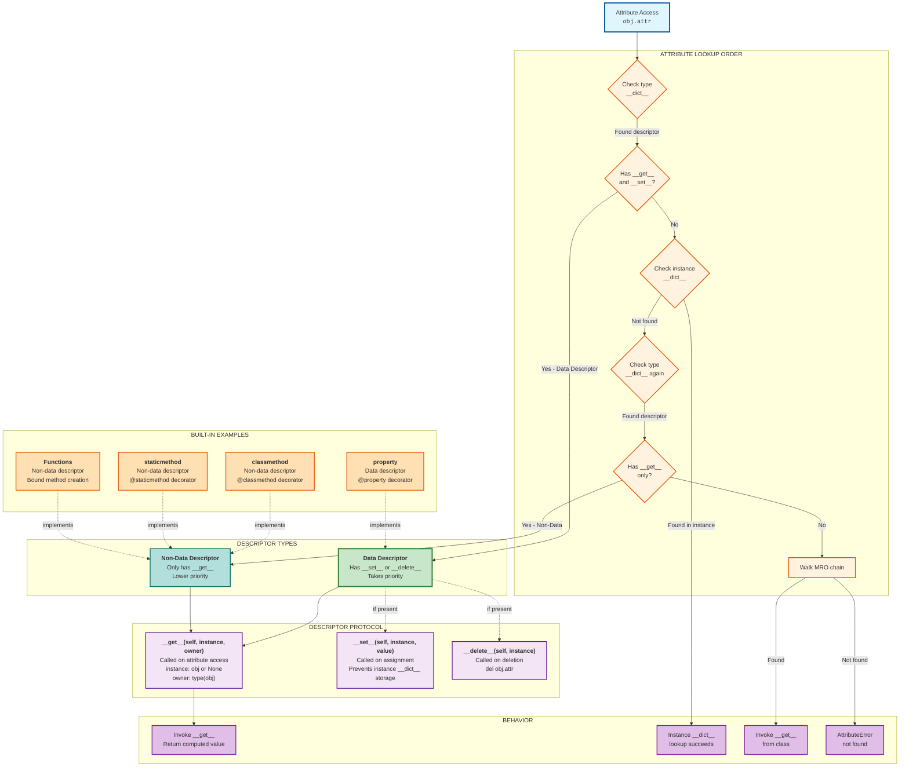
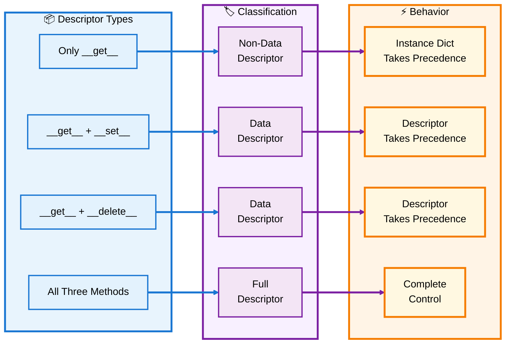
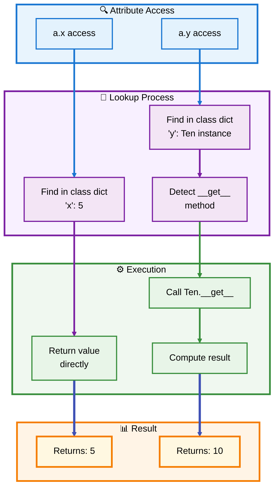
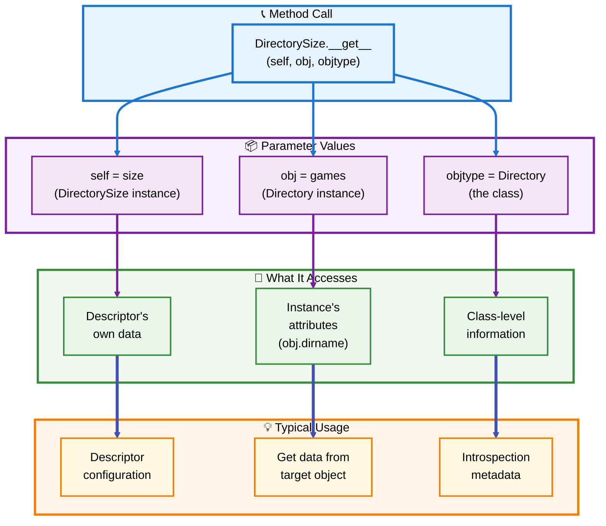
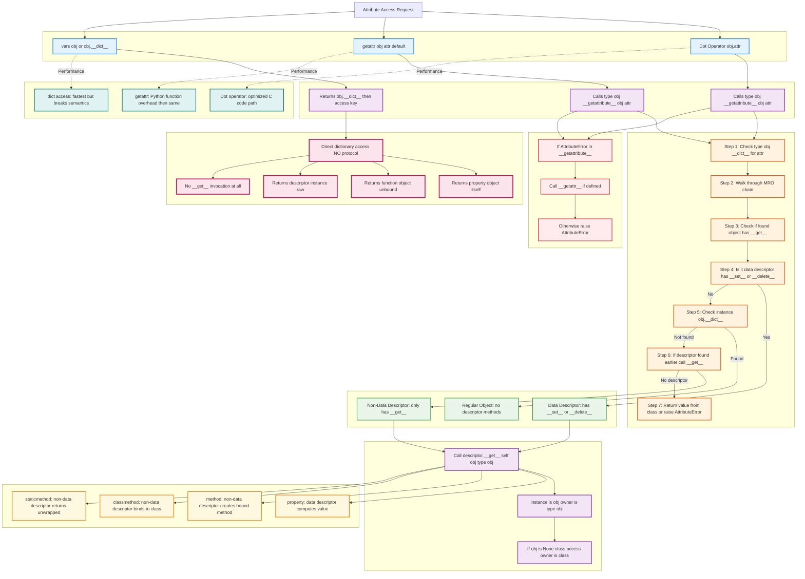

# 🐍 Python Descriptors Guide

## 📖 Complete Guide to Understanding and Using Descriptors

---

## 📑 Table of Contents

### **Section 1: Introduction & Fundamentals** 🎯 *(Current)*
- [What Are Descriptors?](#what-are-descriptors)
- [Why Use Descriptors?](#why-use-descriptors)
- [The Descriptor Protocol](#the-descriptor-protocol)
- [Simple Example: Constant Descriptor](#simple-example-constant-descriptor)
- [Dynamic Lookups](#dynamic-lookups)
- [When Descriptors Are Invoked](#when-descriptors-are-invoked)
- [Key Concepts Summary](#key-concepts-summary)

### **Section 2: Descriptor Protocol Deep Dive** 🔬 *(Coming)*
### **Section 3: Practical Applications** 💼 *(Coming)*
### **Section 4: Built-in Descriptors Explained** 🏗️ *(Coming)*
### **Section 5: Best Practices & Patterns** ✨ *(Coming)*

---

<a id="what-are-descriptors"></a>
## 🎯 What Are Descriptors?

**Descriptors** are a powerful Python feature that allows objects to customize **attribute lookup**, **storage**, and **deletion**. They provide a way to add managed attributes to classes with custom behavior.

### 🔑 Core Definition

A descriptor is any object that defines **one or more** of these special methods:

- `__get__(self, obj, objtype=None)` - Called to get an attribute
- `__set__(self, obj, value)` - Called to set an attribute  
- `__delete__(self, obj)` - Called to delete an attribute

### 📊 Descriptor Architecture Overview



[↑ Back to TOC](#-table-of-contents)

---

<a id="why-use-descriptors"></a>
## 💡 Why Use Descriptors?

Descriptors provide several powerful capabilities that make Python code more elegant and maintainable:

### ✨ Key Benefits

| Benefit | Description | Example Use Case |
|---------|-------------|------------------|
| 🔒 **Attribute Control** | Intercept attribute access to add custom logic | Validation, logging, computed values |
| 🎭 **Encapsulation** | Hide implementation details behind clean interfaces | Private attributes with public access |
| ♻️ **Reusability** | Create reusable attribute behaviors | Type checking across multiple classes |
| 🧹 **DRY Principle** | Avoid repeating attribute management code | Single validator for many attributes |
| 🏗️ **Framework Building** | Foundation for properties, methods, ORM tools | Django models, SQLAlchemy |

### 🌟 Real-World Applications

Descriptors are used throughout Python itself for:

- ✅ **Properties** - The `@property` decorator
- ✅ **Methods** - How functions become bound methods
- ✅ **Static/Class Methods** - `@staticmethod` and `@classmethod`
- ✅ **Cached Properties** - `@functools.cached_property`
- ✅ **ORM Systems** - Database field definitions
- ✅ **Type Validation** - Runtime type checking

[↑ Back to TOC](#-table-of-contents)

---

<a id="the-descriptor-protocol"></a>
## 🔌 The Descriptor Protocol

The descriptor protocol consists of three optional methods that control attribute access:

### 📋 Protocol Methods

```python
class Descriptor:
    def __get__(self, obj, objtype=None):
        """Called when the descriptor is accessed
        
        Args:
            self: The descriptor instance
            obj: The instance accessing the descriptor (or None for class access)
            objtype: The type of the instance (the class)
        
        Returns:
            The value to return for the attribute access
        """
        pass
    
    def __set__(self, obj, value):
        """Called when the descriptor is set
        
        Args:
            self: The descriptor instance
            obj: The instance setting the descriptor
            value: The value being assigned
        """
        pass
    
    def __delete__(self, obj):
        """Called when the descriptor is deleted
        
        Args:
            self: The descriptor instance
            obj: The instance deleting the descriptor
        """
        pass
```

### 🎨 Method Combinations



### 🔍 Data vs Non-Data Descriptors

| Type | Definition | Precedence | Common Uses |
|------|------------|------------|-------------|
| **Non-Data** | Only `__get__()` | Instance dict wins | Functions, methods |
| **Data** | Has `__set__()` or `__delete__()` | Descriptor wins | Properties, validators |

[↑ Back to TOC](#-table-of-contents)

---

<a id="simple-example-constant-descriptor"></a>
## 🎲 Simple Example: Constant Descriptor

Let's start with the simplest possible descriptor that always returns a constant value:

### 💻 Code Example

```python
class Ten:
    """A descriptor that always returns 10"""
    
    def __get__(self, obj, objtype=None):
        return 10

class A:
    x = 5        # Regular class attribute
    y = Ten()    # Descriptor instance

# Usage
a = A()
print(a.x)  # Output: 5 (normal attribute lookup)
print(a.y)  # Output: 10 (descriptor lookup)
```

### 🔄 How It Works



### 📝 Key Insights

- ✅ The value `10` is **not stored** in any dictionary
- ✅ The value is **computed on demand** by calling `__get__()`
- ✅ The descriptor must be a **class variable**, not an instance variable
- ✅ This is a **non-data descriptor** (only has `__get__()`)

[↑ Back to TOC](#-table-of-contents)

---

<a id="dynamic-lookups"></a>
## 🔄 Dynamic Lookups

Descriptors become truly useful when they compute values dynamically instead of returning constants:

### 💻 Directory Size Example

```python
import os

class DirectorySize:
    """A descriptor that computes directory size on access"""
    
    def __get__(self, obj, objtype=None):
        return len(os.listdir(obj.dirname))

class Directory:
    size = DirectorySize()  # Descriptor instance
    
    def __init__(self, dirname):
        self.dirname = dirname  # Regular instance attribute

# Usage
songs = Directory('songs')
games = Directory('games')

print(songs.size)  # Output: 20 (computed dynamically)
print(games.size)  # Output: 3 (computed dynamically)

# Delete a file
os.remove('games/chess')
print(games.size)  # Output: 2 (automatically updated!)
```

### 🎯 Parameter Roles

Understanding what the `__get__` parameters represent:



### 🌟 Why This Is Powerful

| Aspect | Benefit |
|--------|---------|
| 🔄 **Dynamic** | Values computed fresh each time |
| 🎯 **Targeted** | Different result for each instance |
| 🧩 **Reusable** | Same descriptor for multiple classes |
| 🔍 **Transparent** | Looks like normal attribute access |

[↑ Back to TOC](#-table-of-contents)

---

<a id="when-descriptors-are-invoked"></a>
## ⚡ When Descriptors Are Invoked

Descriptors are automatically invoked during the **dot operator** attribute access, but not through direct dictionary access:

### 🎭 Invocation Scenarios

```python
class MyDescriptor:
    def __get__(self, obj, objtype=None):
        print("__get__ called!")
        return 42

class MyClass:
    attr = MyDescriptor()

obj = MyClass()

# INVOKES descriptor
value = obj.attr  # Prints: __get__ called!

# DOES NOT INVOKE descriptor (returns descriptor instance)
descriptor_obj = vars(MyClass)['attr']
print(type(descriptor_obj))  # Output: <class 'MyDescriptor'>
```

### 🚦 Invocation Flow



### ⚠️ Critical Rules

| Rule | Description |
|------|-------------|
| 📍 **Class Variable Only** | Descriptors must be stored as class attributes, not instance attributes |
| 🔵 **Dot Operator** | Descriptors are invoked by dot notation (`obj.attr`) |
| 🚫 **Dict Bypass** | Direct dictionary access returns the descriptor object itself |
| 🎯 **Instance Lookup** | `obj.attr` calls `descriptor.__get__(obj, type(obj))` |
| 🏛️ **Class Lookup** | `Class.attr` calls `descriptor.__get__(None, Class)` |

[↑ Back to TOC](#-table-of-contents)

---

<a id="key-concepts-summary"></a>
## 📚 Key Concepts Summary

### 🎯 Essential Takeaways

```mermaid
graph TB
    subgraph WHAT ["❓    What    Descriptors    Are"]
        A1[Objects with<br/>__get__, __set__,<br/>or __delete__]
        A2[Stored as<br/>class variables]
        A3[Control attribute<br/>access behavior]
    end
    
    subgraph WHY ["💡    Why    Use    Them"]
        B1[Add custom logic<br/>to attributes]
        B2[Reusable attribute<br/>behaviors]
        B3[Foundation for<br/>properties & methods]
    end
    
    subgraph HOW ["⚙️    How    They    Work"]
        C1[Invoked by<br/>dot operator]
        C2[Receive obj & type<br/>as parameters]
        C3[Can compute values<br/>dynamically]
    end
    
    subgraph TYPES ["🏷️    Descriptor    Types"]
        D1[Non-Data:<br/>Only __get__]
        D2[Data:<br/>Has __set__/__delete__]
    end
    
    subgraph CENTER ["🎯    Python    Descriptors"]
        E1[Core Feature]
    end
    
    %% Connections to center
    A1 --> E1
    A2 --> E1
    A3 --> E1
    B1 --> E1
    B2 --> E1
    B3 --> E1
    C1 --> E1
    C2 --> E1
    C3 --> E1
    D1 --> E1
    D2 --> E1
    
    %% Styling connections
    linkStyle 0,1,2 stroke:#1976d2,stroke-width:3px
    linkStyle 3,4,5 stroke:#7b1fa2,stroke-width:3px
    linkStyle 6,7,8 stroke:#388e3c,stroke-width:3px
    linkStyle 9,10 stroke:#f57c00,stroke-width:3px
    
    %% Styling subgraphs
    style WHAT fill:#e8f4fd,stroke:#1976d2,stroke-width:3px,color:#000
    style WHY fill:#f8f0ff,stroke:#7b1fa2,stroke-width:3px,color:#000
    style HOW fill:#f0f8f0,stroke:#388e3c,stroke-width:3px,color:#000
    style TYPES fill:#fff4e6,stroke:#f57c00,stroke-width:3px,color:#000
    style CENTER fill:#e8eaf6,stroke:#3f51b5,stroke-width:4px,color:#000
    
    %% Styling nodes
    style A1 fill:#e3f2fd,stroke:#1976d2,stroke-width:2px,color:#000
    style A2 fill:#e3f2fd,stroke:#1976d2,stroke-width:2px,color:#000
    style A3 fill:#e3f2fd,stroke:#1976d2,stroke-width:2px,color:#000
    style B1 fill:#f3e5f5,stroke:#7b1fa2,stroke-width:2px,color:#000
    style B2 fill:#f3e5f5,stroke:#7b1fa2,stroke-width:2px,color:#000
    style B3 fill:#f3e5f5,stroke:#7b1fa2,stroke-width:2px,color:#000
    style C1 fill:#e8f5e8,stroke:#388e3c,stroke-width:2px,color:#000
    style C2 fill:#e8f5e8,stroke:#388e3c,stroke-width:2px,color:#000
    style C3 fill:#e8f5e8,stroke:#388e3c,stroke-width:2px,color:#000
    style D1 fill:#fff8e1,stroke:#f57c00,stroke-width:2px,color:#000
    style D2 fill:#fff8e1,stroke:#f57c00,stroke-width:2px,color:#000
    style E1 fill:#e8eaf6,stroke:#3f51b5,stroke-width:4px,color:#000
```



### 📋 Quick Reference Card

| Concept | Definition | Example |
|---------|------------|---------|
| **Descriptor** | Object with `__get__`, `__set__`, or `__delete__` | `class MyDescriptor: def __get__(...): ...` |
| **Data Descriptor** | Has `__set__` or `__delete__` | Properties, validators |
| **Non-Data Descriptor** | Only has `__get__` | Functions, methods |
| **Invocation** | Via dot operator on class variables | `obj.attr` triggers `__get__` |
| **Parameters** | `(self, obj, objtype)` | Access descriptor, instance, class |

### 🎓 What You've Learned

✅ **Descriptors** are objects that customize attribute access  
✅ They use special methods: `__get__`, `__set__`, `__delete__`  
✅ They must be **class variables** to work  
✅ **Dynamic lookups** compute values on-demand  
✅ The **dot operator** invokes descriptors automatically  
✅ **Data descriptors** override instance dictionaries  
✅ **Non-data descriptors** are overridden by instance attributes  

[↑ Back to TOC](#-table-of-contents)

---

## 🎯 Next Steps

Ready to dive deeper? In **Section 2: Descriptor Protocol Deep Dive**, we'll explore:

- 🔬 The complete attribute lookup chain
- 🎛️ Detailed mechanics of `__get__`, `__set__`, and `__delete__`
- 🔄 How data vs non-data descriptors differ in practice
- 🏗️ The `__set_name__` method for automatic configuration
- 🔍 Instance vs class vs super() invocation patterns

---

**📖 End of Section 1**

*Continue to Section 2 for advanced descriptor mechanics and implementation details.*
