# 🐍 Python Descriptors Guide

## 🏗️ Section 4: Built-in Descriptors Explained

---

## 📑 Table of Contents - Section 4

- [Properties in Depth](#properties-in-depth)
  - [The @property Decorator](#the-property-decorator)
  - [Pure Python Property Implementation](#pure-python-property-implementation)
  - [Property Use Cases](#property-use-cases)
- [Functions and Methods](#functions-and-methods)
  - [How Functions Become Methods](#how-functions-become-methods)
  - [Method Type Implementation](#method-type-implementation)
  - [Bound vs Unbound Methods](#bound-vs-unbound-methods)
- [Static Methods](#static-methods)
  - [What Are Static Methods](#what-are-static-methods)
  - [Pure Python StaticMethod](#pure-python-staticmethod)
  - [When to Use Static Methods](#when-to-use-static-methods)
- [Class Methods](#class-methods)
  - [Understanding Class Methods](#understanding-class-methods)
  - [Pure Python ClassMethod](#pure-python-classmethod)
  - [Class Method Patterns](#class-method-patterns)
- [Slots and Member Objects](#slots-and-member-objects)
  - [What Are __slots__](#what-are-__slots__)
  - [Member Descriptor Implementation](#member-descriptor-implementation)
  - [Slots Benefits and Limitations](#slots-benefits-and-limitations)
- [Built-in Descriptors Summary](#built-in-descriptors-summary)

---

<a id="properties-in-depth"></a>
## 🎛️ Properties in Depth

Properties are one of the most commonly used descriptors in Python, providing a clean way to add getter/setter logic to attributes.

<a id="the-property-decorator"></a>
### 🎨 The @property Decorator

Properties allow you to add computed or managed attributes with the same syntax as regular attributes:

```python
class Circle:
    """Circle with computed properties"""
    
    def __init__(self, radius):
        self._radius = radius
    
    @property
    def radius(self):
        """Get the radius"""
        return self._radius
    
    @radius.setter
    def radius(self, value):
        """Set the radius with validation"""
        if value < 0:
            raise ValueError("Radius cannot be negative")
        self._radius = value
    
    @property
    def diameter(self):
        """Computed property - no setter"""
        return self._radius * 2
    
    @property
    def area(self):
        """Another computed property"""
        return 3.14159 * self._radius ** 2

# Usage
circle = Circle(5)
print(circle.radius)    # Output: 5
print(circle.diameter)  # Output: 10
print(circle.area)      # Output: 78.53975

circle.radius = 7
print(circle.area)      # Output: 153.93804

# Try invalid value
try:
    circle.radius = -3  # ❌ Raises ValueError
except ValueError as e:
    print(e)  # Output: Radius cannot be negative

# Try to set read-only property
try:
    circle.diameter = 20  # ❌ Raises AttributeError
except AttributeError as e:
    print(e)  # Output: property 'diameter' of 'Circle' object has no setter
```

### 🔄 Property Access Flow

```mermaid
graph TB
    subgraph READ ["📖    Read    Access"]
        A1["circle.radius"]
        A2["Call property<br/>fget method"]
        A3["Return<br/>self._radius"]
    end
    
    subgraph WRITE ["✏️    Write    Access"]
        B1["circle.radius = 7"]
        B2["Call property<br/>fset method"]
        B3["Validate value"]
        B4["Store value"]
    end
    
    subgraph COMPUTED ["🧮    Computed    Property"]
        C1["circle.area"]
        C2["Call property<br/>fget method"]
        C3["Calculate:<br/>π * r²"]
        C4["Return result"]
    end
    
    subgraph READONLY ["🔒    Read-Only"]
        D1["circle.diameter = 20"]
        D2["No fset method"]
        D3["Raise<br/>AttributeError"]
    end
    
    %% Connections
    A1 --> A2
    A2 --> A3
    B1 --> B2
    B2 --> B3
    B3 --> B4
    C1 --> C2
    C2 --> C3
    C3 --> C4
    D1 --> D2
    D2 --> D3
    
    %% Styling connections
    linkStyle 0,1 stroke:#1976d2,stroke-width:3px
    linkStyle 2,3,4 stroke:#7b1fa2,stroke-width:3px
    linkStyle 5,6,7 stroke:#388e3c,stroke-width:3px
    linkStyle 8,9 stroke:#c2185b,stroke-width:3px
    
    %% Styling subgraphs
    style READ fill:#e8f4fd,stroke:#1976d2,stroke-width:3px,color:#000
    style WRITE fill:#f8f0ff,stroke:#7b1fa2,stroke-width:3px,color:#000
    style COMPUTED fill:#f0f8f0,stroke:#388e3c,stroke-width:3px,color:#000
    style READONLY fill:#fef7f7,stroke:#c2185b,stroke-width:3px,color:#000
    
    %% Styling nodes
    style A1 fill:#e3f2fd,stroke:#1976d2,stroke-width:2px,color:#000
    style A2 fill:#e3f2fd,stroke:#1976d2,stroke-width:2px,color:#000
    style A3 fill:#e3f2fd,stroke:#1976d2,stroke-width:3px,color:#000
    style B1 fill:#f3e5f5,stroke:#7b1fa2,stroke-width:2px,color:#000
    style B2 fill:#f3e5f5,stroke:#7b1fa2,stroke-width:2px,color:#000
    style B3 fill:#f3e5f5,stroke:#7b1fa2,stroke-width:2px,color:#000
    style B4 fill:#f3e5f5,stroke:#7b1fa2,stroke-width:3px,color:#000
    style C1 fill:#e8f5e8,stroke:#388e3c,stroke-width:2px,color:#000
    style C2 fill:#e8f5e8,stroke:#388e3c,stroke-width:2px,color:#000
    style C3 fill:#e8f5e8,stroke:#388e3c,stroke-width:2px,color:#000
    style C4 fill:#e8f5e8,stroke:#388e3c,stroke-width:3px,color:#000
    style D1 fill:#fce4ec,stroke:#c2185b,stroke-width:2px,color:#000
    style D2 fill:#fce4ec,stroke:#c2185b,stroke-width:2px,color:#000
    style D3 fill:#fce4ec,stroke:#c2185b,stroke-width:3px,color:#000
```



[↑ Back to TOC](#-table-of-contents---section-4)

---

<a id="pure-python-property-implementation"></a>
### 🐍 Pure Python Property Implementation

Here's how `property` is implemented using descriptors:

```python
class Property:
    """Pure Python implementation of property()"""
    
    def __init__(self, fget=None, fset=None, fdel=None, doc=None):
        self.fget = fget
        self.fset = fset
        self.fdel = fdel
        # Use fget's docstring if no doc provided
        if doc is None and fget is not None:
            doc = fget.__doc__
        self.__doc__ = doc
    
    def __set_name__(self, owner, name):
        self.__name__ = name
    
    def __get__(self, obj, objtype=None):
        if obj is None:
            return self  # Class access returns descriptor itself
        if self.fget is None:
            raise AttributeError("property has no getter")
        return self.fget(obj)
    
    def __set__(self, obj, value):
        if self.fset is None:
            raise AttributeError(
                f"property '{self.__name__}' of '{type(obj).__name__}' "
                f"object has no setter"
            )
        self.fset(obj, value)
    
    def __delete__(self, obj):
        if self.fdel is None:
            raise AttributeError("property has no deleter")
        self.fdel(obj)
    
    def getter(self, fget):
        """Create new property with different getter"""
        return type(self)(fget, self.fset, self.fdel, self.__doc__)
    
    def setter(self, fset):
        """Create new property with different setter"""
        return type(self)(self.fget, fset, self.fdel, self.__doc__)
    
    def deleter(self, fdel):
        """Create new property with different deleter"""
        return type(self)(self.fget, self.fset, fdel, self.__doc__)

# Test the implementation
class Temperature:
    def __init__(self, celsius):
        self._celsius = celsius
    
    @Property
    def celsius(self):
        """Temperature in Celsius"""
        return self._celsius
    
    @celsius.setter
    def celsius(self, value):
        if value < -273.15:
            raise ValueError("Temperature below absolute zero!")
        self._celsius = value
    
    @Property
    def fahrenheit(self):
        """Temperature in Fahrenheit"""
        return self._celsius * 9/5 + 32

# Usage
temp = Temperature(25)
print(temp.celsius)      # Output: 25
print(temp.fahrenheit)   # Output: 77.0

temp.celsius = 30
print(temp.celsius)      # Output: 30
print(temp.fahrenheit)   # Output: 86.0
```

[↑ Back to TOC](#-table-of-contents---section-4)

---

<a id="property-use-cases"></a>
### 💡 Property Use Cases

| Use Case | Example | Benefit |
|----------|---------|---------|
| **Computed Values** | `area` from `width * height` | No storage needed |
| **Validation** | Check range before setting | Data integrity |
| **Lazy Loading** | Load data on first access | Performance |
| **Backwards Compatibility** | Add logic without breaking API | Smooth migration |
| **Derived Attributes** | Convert units (C° to F°) | Clean interface |

[↑ Back to TOC](#-table-of-contents---section-4)

---

<a id="functions-and-methods"></a>
## 🔗 Functions and Methods

One of the most elegant uses of descriptors in Python is how regular functions automatically become bound methods.

<a id="how-functions-become-methods"></a>
### 🎭 How Functions Become Methods

When you define a function in a class, it becomes a method through the descriptor protocol:

```python
class MyClass:
    def method(self, x):
        """Regular instance method"""
        return f"Called with {self} and {x}"

# When accessed through the class, it's just a function
print(type(MyClass.method))  # Output: <class 'function'>

# When accessed through an instance, it becomes a bound method
obj = MyClass()
print(type(obj.method))      # Output: <class 'method'>

# The bound method has the instance stored
bound = obj.method
print(bound.__self__)        # Output: <__main__.MyClass object at 0x...>
print(bound.__func__)        # Output: <function MyClass.method at 0x...>

# Calling the bound method automatically passes the instance
print(bound(42))             # Output: Called with <__main__.MyClass...> and 42
```

### 🔄 Method Binding Process

```mermaid
graph TB
    subgraph DEFINE ["📝    Function    Definition"]
        A1["def method(self, x):<br/>    return x * 2"]
        A2["Stored as<br/>function object"]
    end
    
    subgraph CLASS_ACCESS ["🏛️    Class    Access"]
        B1["MyClass.method"]
        B2["__get__(None, MyClass)"]
        B3["Returns function<br/>unchanged"]
    end
    
    subgraph INSTANCE_ACCESS ["📦    Instance    Access"]
        C1["obj.method"]
        C2["__get__(obj, MyClass)"]
        C3["Create MethodType"]
        C4["Return bound<br/>method"]
    end
    
    subgraph BOUND ["🔗    Bound    Method"]
        D1["__self__ = obj"]
        D2["__func__ = method"]
        D3["Call automatically<br/>passes obj"]
    end
    
    %% Connections
    A1 --> A2
    A2 --> B1
    A2 --> C1
    B1 --> B2
    B2 --> B3
    C1 --> C2
    C2 --> C3
    C3 --> C4
    C4 --> D1
    C4 --> D2
    C4 --> D3
    
    %% Styling connections
    linkStyle 0,1,2 stroke:#1976d2,stroke-width:3px
    linkStyle 3,4 stroke:#7b1fa2,stroke-width:3px
    linkStyle 5,6,7 stroke:#388e3c,stroke-width:3px
    linkStyle 8,9,10 stroke:#3f51b5,stroke-width:4px
    
    %% Styling subgraphs
    style DEFINE fill:#e8f4fd,stroke:#1976d2,stroke-width:3px,color:#000
    style CLASS_ACCESS fill:#f8f0ff,stroke:#7b1fa2,stroke-width:3px,color:#000
    style INSTANCE_ACCESS fill:#f0f8f0,stroke:#388e3c,stroke-width:3px,color:#000
    style BOUND fill:#fff4e6,stroke:#f57c00,stroke-width:3px,color:#000
    
    %% Styling nodes
    style A1 fill:#e3f2fd,stroke:#1976d2,stroke-width:2px,color:#000
    style A2 fill:#e3f2fd,stroke:#1976d2,stroke-width:2px,color:#000
    style B1 fill:#f3e5f5,stroke:#7b1fa2,stroke-width:2px,color:#000
    style B2 fill:#f3e5f5,stroke:#7b1fa2,stroke-width:2px,color:#000
    style B3 fill:#f3e5f5,stroke:#7b1fa2,stroke-width:2px,color:#000
    style C1 fill:#e8f5e8,stroke:#388e3c,stroke-width:2px,color:#000
    style C2 fill:#e8f5e8,stroke:#388e3c,stroke-width:2px,color:#000
    style C3 fill:#e8f5e8,stroke:#388e3c,stroke-width:2px,color:#000
    style C4 fill:#e8f5e8,stroke:#388e3c,stroke-width:3px,color:#000
    style D1 fill:#fff8e1,stroke:#f57c00,stroke-width:2px,color:#000
    style D2 fill:#fff8e1,stroke:#f57c00,stroke-width:2px,color:#000
    style D3 fill:#fff8e1,stroke:#f57c00,stroke-width:3px,color:#000
```



[↑ Back to TOC](#-table-of-contents---section-4)

---

<a id="method-type-implementation"></a>
### 🐍 Method Type Implementation

Here's how methods are implemented using descriptors:

```python
class MethodType:
    """Pure Python implementation of method type"""
    
    def __init__(self, func, obj):
        self.__func__ = func
        self.__self__ = obj
    
    def __call__(self, *args, **kwargs):
        """When the method is called, prepend the instance"""
        func = self.__func__
        obj = self.__self__
        return func(obj, *args, **kwargs)
    
    def __getattribute__(self, name):
        """Provide access to __doc__ from the function"""
        if name == '__doc__':
            return self.__func__.__doc__
        return object.__getattribute__(self, name)
    
    def __getattr__(self, name):
        """Forward other attributes to the function"""
        return getattr(self.__func__, name)
    
    def __get__(self, obj, objtype=None):
        """Methods are non-data descriptors"""
        return self

class Function:
    """Simplified function descriptor behavior"""
    
    def __init__(self, func):
        self.func = func
    
    def __get__(self, obj, objtype=None):
        """Convert function to method when accessed via instance"""
        if obj is None:
            # Class access: return function unchanged
            return self.func
        # Instance access: return bound method
        return MethodType(self.func, obj)
    
    def __call__(self, *args, **kwargs):
        """Direct call on function"""
        return self.func(*args, **kwargs)

# Demonstration
def demo_function(self, x):
    """Demo function"""
    return f"self={self}, x={x}"

# Simulate function descriptor behavior
class Demo:
    method = Function(demo_function)

obj = Demo()

# Class access returns function
print(Demo.method)  # Function object

# Instance access returns bound method
bound = obj.method
print(type(bound).__name__)  # MethodType
print(bound(42))  # Output: self=<__main__.Demo...>, x=42
```

[↑ Back to TOC](#-table-of-contents---section-4)

---

<a id="bound-vs-unbound-methods"></a>
### 🎯 Bound vs Unbound Methods

```mermaid
graph TB
    subgraph UNBOUND ["🔓    Unbound    (Class    Access)"]
        A1["Class.method"]
        A2["Just a function"]
        A3["Must pass instance<br/>manually"]
        A4["Class.method(obj, x)"]
    end
    
    subgraph BOUND ["🔗    Bound    (Instance    Access)"]
        B1["obj.method"]
        B2["Method object"]
        B3["Instance automatically<br/>prepended"]
        B4["obj.method(x)"]
    end
    
    subgraph COMPARISON ["⚖️    Key    Differences"]
        C1["Unbound:<br/>func(obj, args)"]
        C2["Bound:<br/>func(args)<br/>obj implicit"]
    end
    
    %% Connections
    A1 --> A2
    A2 --> A3
    A3 --> A4
    B1 --> B2
    B2 --> B3
    B3 --> B4
    A4 --> C1
    B4 --> C2
    
    %% Styling connections
    linkStyle 0,1,2 stroke:#1976d2,stroke-width:3px
    linkStyle 3,4,5 stroke:#7b1fa2,stroke-width:3px
    linkStyle 6,7 stroke:#3f51b5,stroke-width:4px
    
    %% Styling subgraphs
    style UNBOUND fill:#e8f4fd,stroke:#1976d2,stroke-width:3px,color:#000
    style BOUND fill:#f8f0ff,stroke:#7b1fa2,stroke-width:3px,color:#000
    style COMPARISON fill:#fff4e6,stroke:#f57c00,stroke-width:3px,color:#000
    
    %% Styling nodes
    style A1 fill:#e3f2fd,stroke:#1976d2,stroke-width:2px,color:#000
    style A2 fill:#e3f2fd,stroke:#1976d2,stroke-width:2px,color:#000
    style A3 fill:#e3f2fd,stroke:#1976d2,stroke-width:2px,color:#000
    style A4 fill:#e3f2fd,stroke:#1976d2,stroke-width:3px,color:#000
    style B1 fill:#f3e5f5,stroke:#7b1fa2,stroke-width:2px,color:#000
    style B2 fill:#f3e5f5,stroke:#7b1fa2,stroke-width:2px,color:#000
    style B3 fill:#f3e5f5,stroke:#7b1fa2,stroke-width:2px,color:#000
    style B4 fill:#f3e5f5,stroke:#7b1fa2,stroke-width:3px,color:#000
    style C1 fill:#fff8e1,stroke:#f57c00,stroke-width:2px,color:#000
    style C2 fill:#fff8e1,stroke:#f57c00,stroke-width:3px,color:#000
```



[↑ Back to TOC](#-table-of-contents---section-4)

---

<a id="static-methods"></a>
## 📌 Static Methods

Static methods are functions that belong to a class but don't receive the instance or class as the first argument.

<a id="what-are-static-methods"></a>
### 🎯 What Are Static Methods

Static methods are useful for utility functions that are logically grouped with a class but don't need access to instance or class data:

```python
class MathUtils:
    """Utility class with static methods"""
    
    @staticmethod
    def add(x, y):
        """Add two numbers"""
        return x + y
    
    @staticmethod
    def multiply(x, y):
        """Multiply two numbers"""
        return x * y
    
    @staticmethod
    def is_prime(n):
        """Check if number is prime"""
        if n < 2:
            return False
        for i in range(2, int(n ** 0.5) + 1):
            if n % i == 0:
                return False
        return True

# Can call from class
print(MathUtils.add(5, 3))        # Output: 8
print(MathUtils.is_prime(17))     # Output: True

# Can also call from instance (though unusual)
utils = MathUtils()
print(utils.multiply(4, 7))       # Output: 28
```

<a id="pure-python-staticmethod"></a>
### 🐍 Pure Python StaticMethod

Here's how `@staticmethod` is implemented:

```python
import functools

class StaticMethod:
    """Pure Python implementation of staticmethod()"""
    
    def __init__(self, func):
        self.func = func
        # Copy function metadata
        functools.update_wrapper(self, func)
    
    def __get__(self, obj, objtype=None):
        """Return the function unchanged"""
        return self.func
    
    def __call__(self, *args, **kwargs):
        """Allow direct call on the descriptor"""
        return self.func(*args, **kwargs)
    
    @property
    def __annotations__(self):
        """Forward annotations from wrapped function"""
        return self.func.__annotations__

# Test the implementation
class Calculator:
    @StaticMethod
    def add(x: int, y: int) -> int:
        """Add two numbers"""
        return x + y
    
    @StaticMethod
    def subtract(x: int, y: int) -> int:
        """Subtract two numbers"""
        return x - y

# Both class and instance access work identically
print(Calculator.add(10, 5))      # Output: 15

calc = Calculator()
print(calc.subtract(10, 5))       # Output: 5

# Check that metadata was preserved
print(Calculator.add.__doc__)     # Output: Add two numbers
print(Calculator.add.__annotations__)  # Output: {'x': <class 'int'>, ...}
```

### 🔄 Static Method Flow

```mermaid
graph TB
    subgraph ACCESS ["🔍    Access    Pattern"]
        A1["Class.static_method()"]
        A2["obj.static_method()"]
    end
    
    subgraph DESCRIPTOR ["🎛️    Descriptor    __get__"]
        B1["Called with<br/>obj=None (class)"]
        B2["Called with<br/>obj=instance"]
    end
    
    subgraph RETURN ["📤    Return    Value"]
        C1["Return func<br/>unchanged"]
        C2["Return func<br/>unchanged"]
    end
    
    subgraph EXECUTE ["⚡    Execution"]
        D1["Call function<br/>NO self/cls"]
        D2["Call function<br/>NO self/cls"]
    end
    
    subgraph RESULT ["✅    Same    Result"]
        E1["Both behave<br/>identically"]
    end
    
    %% Connections
    A1 --> B1
    A2 --> B2
    B1 --> C1
    B2 --> C2
    C1 --> D1
    C2 --> D2
    D1 --> E1
    D2 --> E1
    
    %% Styling connections
    linkStyle 0,1 stroke:#1976d2,stroke-width:3px
    linkStyle 2,3 stroke:#7b1fa2,stroke-width:3px
    linkStyle 4,5 stroke:#388e3c,stroke-width:3px
    linkStyle 6,7 stroke:#3f51b5,stroke-width:4px
    
    %% Styling subgraphs
    style ACCESS fill:#e8f4fd,stroke:#1976d2,stroke-width:3px,color:#000
    style DESCRIPTOR fill:#f8f0ff,stroke:#7b1fa2,stroke-width:3px,color:#000
    style RETURN fill:#f0f8f0,stroke:#388e3c,stroke-width:3px,color:#000
    style EXECUTE fill:#fff4e6,stroke:#f57c00,stroke-width:3px,color:#000
    style RESULT fill:#e8eaf6,stroke:#3f51b5,stroke-width:3px,color:#000
    
    %% Styling nodes
    style A1 fill:#e3f2fd,stroke:#1976d2,stroke-width:2px,color:#000
    style A2 fill:#e3f2fd,stroke:#1976d2,stroke-width:2px,color:#000
    style B1 fill:#f3e5f5,stroke:#7b1fa2,stroke-width:2px,color:#000
    style B2 fill:#f3e5f5,stroke:#7b1fa2,stroke-width:2px,color:#000
    style C1 fill:#e8f5e8,stroke:#388e3c,stroke-width:2px,color:#000
    style C2 fill:#e8f5e8,stroke:#388e3c,stroke-width:2px,color:#000
    style D1 fill:#fff8e1,stroke:#f57c00,stroke-width:2px,color:#000
    style D2 fill:#fff8e1,stroke:#f57c00,stroke-width:2px,color:#000
    style E1 fill:#e8eaf6,stroke:#3f51b5,stroke-width:3px,color:#000
```



[↑ Back to TOC](#-table-of-contents---section-4)

---

<a id="when-to-use-static-methods"></a>
### 💡 When to Use Static Methods

| Use Case | Example | Why Static? |
|----------|---------|-------------|
| **Utility Functions** | `Math.gcd(a, b)` | Grouped with class logically |
| **Factory Helpers** | `Color.from_hex('#FF0000')` | Helper for construction |
| **Validators** | `Email.is_valid(address)` | Pure function, no state |
| **Converters** | `Temperature.celsius_to_fahrenheit(c)` | Stateless conversion |
| **Constants Computation** | `Physics.speed_of_light()` | Related to class concept |

[↑ Back to TOC](#-table-of-contents---section-4)

---

<a id="class-methods"></a>
## 🏛️ Class Methods

Class methods receive the class as the first argument instead of the instance, making them perfect for alternative constructors and class-level operations.

<a id="understanding-class-methods"></a>
### 🎯 Understanding Class Methods

Class methods are called with the class as the first argument, named `cls` by convention:

```python
class Date:
    """Date class with class method constructors"""
    
    def __init__(self, year, month, day):
        self.year = year
        self.month = month
        self.day = day
    
    @classmethod
    def from_string(cls, date_string):
        """Alternative constructor from string 'YYYY-MM-DD'"""
        year, month, day = map(int, date_string.split('-'))
        return cls(year, month, day)
    
    @classmethod
    def today(cls):
        """Alternative constructor for today's date"""
        import datetime
        today = datetime.date.today()
        return cls(today.year, today.month, today.day)
    
    def __repr__(self):
        return f'Date({self.year}, {self.month}, {self.day})'

# Regular constructor
date1 = Date(2024, 10, 16)
print(date1)  # Output: Date(2024, 10, 16)

# Class method constructor
date2 = Date.from_string('2024-12-25')
print(date2)  # Output: Date(2024, 12, 25)

# Another class method constructor
date3 = Date.today()
print(date3)  # Output: Date(2024, 10, 16) [current date]

# Works with inheritance!
class EuropeanDate(Date):
    @classmethod
    def from_string(cls, date_string):
        """European format: DD-MM-YYYY"""
        day, month, year = map(int, date_string.split('-'))
        return cls(year, month, day)

euro_date = EuropeanDate.from_string('25-12-2024')
print(euro_date)  # Output: Date(2024, 12, 25)
print(type(euro_date).__name__)  # Output: EuropeanDate
```

<a id="pure-python-classmethod"></a>
### 🐍 Pure Python ClassMethod

Here's how `@classmethod` is implemented:

```python
import functools

class ClassMethod:
    """Pure Python implementation of classmethod()"""
    
    def __init__(self, func):
        self.func = func
        functools.update_wrapper(self, func)
    
    def __get__(self, obj, cls=None):
        """Return a bound method with class as first argument"""
        if cls is None:
            cls = type(obj)
        
        # Create a bound method with the class
        def bound_method(*args, **kwargs):
            return self.func(cls, *args, **kwargs)
        
        return bound_method

# Test the implementation
class Counter:
    count = 0
    
    def __init__(self):
        Counter.count += 1
    
    @ClassMethod
    def get_count(cls):
        """Get the current count"""
        return cls.count
    
    @ClassMethod
    def reset(cls):
        """Reset the counter"""
        cls.count = 0

# Usage
c1 = Counter()
c2 = Counter()
c3 = Counter()

print(Counter.get_count())  # Output: 3

Counter.reset()
print(Counter.get_count())  # Output: 0

# Also works from instance
c4 = Counter()
print(c4.get_count())      # Output: 1
```

### 🔄 Class Method Flow

```mermaid
graph TB
    subgraph ACCESS ["🔍    Access    Methods"]
        A1["Class.method()"]
        A2["obj.method()"]
    end
    
    subgraph DESCRIPTOR ["🎛️    Descriptor    __get__"]
        B1["cls = Class"]
        B2["cls = type(obj)"]
    end
    
    subgraph BIND ["🔗    Create    Bound    Method"]
        C1["Bind func<br/>with Class"]
        C2["Bind func<br/>with type(obj)"]
    end
    
    subgraph EXECUTE ["⚡    Function    Call"]
        D1["func(Class, args)"]
        D2["func(type(obj), args)"]
    end
    
    subgraph RESULT ["📊    Result"]
        E1["Class receives<br/>class as first arg"]
    end
    
    %% Connections
    A1 --> B1
    A2 --> B2
    B1 --> C1
    B2 --> C2
    C1 --> D1
    C2 --> D2
    D1 --> E1
    D2 --> E1
    
    %% Styling connections
    linkStyle 0,1 stroke:#1976d2,stroke-width:3px
    linkStyle 2,3 stroke:#7b1fa2,stroke-width:3px
    linkStyle 4,5 stroke:#388e3c,stroke-width:3px
    linkStyle 6,7 stroke:#3f51b5,stroke-width:4px
    
    %% Styling subgraphs
    style ACCESS fill:#e8f4fd,stroke:#1976d2,stroke-width:3px,color:#000
    style DESCRIPTOR fill:#f8f0ff,stroke:#7b1fa2,stroke-width:3px,color:#000
    style BIND fill:#f0f8f0,stroke:#388e3c,stroke-width:3px,color:#000
    style EXECUTE fill:#fff4e6,stroke:#f57c00,stroke-width:3px,color:#000
    style RESULT fill:#e8eaf6,stroke:#3f51b5,stroke-width:3px,color:#000
    
    %% Styling nodes
    style A1 fill:#e3f2fd,stroke:#1976d2,stroke-width:2px,color:#000
    style A2 fill:#e3f2fd,stroke:#1976d2,stroke-width:2px,color:#000
    style B1 fill:#f3e5f5,stroke:#7b1fa2,stroke-width:2px,color:#000
    style B2 fill:#f3e5f5,stroke:#7b1fa2,stroke-width:2px,color:#000
    style C1 fill:#e8f5e8,stroke:#388e3c,stroke-width:2px,color:#000
    style C2 fill:#e8f5e8,stroke:#388e3c,stroke-width:2px,color:#000
    style D1 fill:#fff8e1,stroke:#f57c00,stroke-width:2px,color:#000
    style D2 fill:#fff8e1,stroke:#f57c00,stroke-width:2px,color:#000
    style E1 fill:#e8eaf6,stroke:#3f51b5,stroke-width:3px,color:#000
```



[↑ Back to TOC](#-table-of-contents---section-4)

---

<a id="class-method-patterns"></a>
### 🎨 Class Method Patterns

```python
# Pattern 1: Alternative Constructors
class Person:
    def __init__(self, name, age):
        self.name = name
        self.age = age
    
    @classmethod
    def from_birth_year(cls, name, birth_year):
        """Create from birth year"""
        import datetime
        age = datetime.date.today().year - birth_year
        return cls(name, age)

# Pattern 2: Factory Method
class Pizza:
    def __init__(self, ingredients):
        self.ingredients = ingredients
    
    @classmethod
    def margherita(cls):
        """Factory for margherita pizza"""
        return cls(['mozzarella', 'tomatoes', 'basil'])
    
    @classmethod
    def pepperoni(cls):
        """Factory for pepperoni pizza"""
        return cls(['mozzarella', 'tomatoes', 'pepperoni'])

# Pattern 3: Class Configuration
class Database:
    connection_string = ""
    
    @classmethod
    def configure(cls, host, port, database):
        """Configure database connection"""
        cls.connection_string = f"{host}:{port}/{database}"
    
    @classmethod
    def get_connection(cls):
        """Get configured connection"""
        return cls.connection_string

# Usage examples
person = Person.from_birth_year("Alice", 1990)
pizza = Pizza.margherita()
Database.configure("localhost", 5432, "mydb")
```

| Pattern | Use Case | Example |
|---------|----------|---------|
| **Alternative Constructor** | Multiple ways to create objects | `Date.from_string()` |
| **Factory Method** | Pre-configured instances | `Pizza.margherita()` |
| **Class Configuration** | Set class-level settings | `Database.configure()` |
| **Inheritance-Aware** | Works with subclasses correctly | `cls()` returns correct subclass |

[↑ Back to TOC](#-table-of-contents---section-4)

---

<a id="slots-and-member-objects"></a>
## 💾 Slots and Member Objects

`__slots__` is a powerful feature that uses descriptors to create memory-efficient classes.

<a id="what-are-__slots__"></a>
### 🎯 What Are __slots__

`__slots__` replaces the instance dictionary with a fixed-size array, providing several benefits:

```python
# Without __slots__ - uses instance dictionary
class RegularPoint:
    def __init__(self, x, y):
        self.x = x
        self.y = y

# With __slots__ - uses fixed array
class SlottedPoint:
    __slots__ = ('x', 'y')
    
    def __init__(self, x, y):
        self.x = x
        self.y = y

# Compare memory usage
import sys

regular = RegularPoint(10, 20)
slotted = SlottedPoint(10, 20)

print(f"Regular: {sys.getsizeof(regular)} bytes")  # ~152 bytes
print(f"Slotted: {sys.getsizeof(slotted)} bytes")  # ~48 bytes

# Check internal structure
print(vars(regular))     # Output: {'x': 10, 'y': 20}
# print(vars(slotted))   # Would raise TypeError: no __dict__

# Slots prevent dynamic attributes
try:
    slotted.z = 30  # ❌ Raises AttributeError
except AttributeError as e:
    print(e)  # Output: 'SlottedPoint' object has no attribute 'z'
```

<a id="member-descriptor-implementation"></a>
### 🐍 Member Descriptor Implementation

Here's a simplified implementation of how `__slots__` works:

```python
null = object()  # Sentinel for unset slots

class Member:
    """Descriptor for slot access"""
    
    def __init__(self, name, clsname, offset):
        self.name = name
        self.clsname = clsname
        self.offset = offset
    
    def __get__(self, obj, objtype=None):
        if obj is None:
            return self
        
        # Access the slot value
        value = obj._slotvalues[self.offset]
        if value is null:
            raise AttributeError(self.name)
        return value
    
    def __set__(self, obj, value):
        # Set the slot value
        obj._slotvalues[self.offset] = value
    
    def __delete__(self, obj):
        # Delete the slot value
        value = obj._slotvalues[self.offset]
        if value is null:
            raise AttributeError(self.name)
        obj._slotvalues[self.offset] = null
    
    def __repr__(self):
        return f'<Member {self.name!r} of {self.clsname!r}>'

# Metaclass to add member descriptors
class SlotType(type):
    """Metaclass that adds member descriptors for slots"""
    
    def __new__(mcls, clsname, bases, mapping, **kwargs):
        # Add member descriptors for each slot
        slot_names = mapping.get('slot_names', [])
        for offset, name in enumerate(slot_names):
            mapping[name] = Member(name, clsname, offset)
        
        return type.__new__(mcls, clsname, bases, mapping, **kwargs)

# Base class that allocates slot storage
class SlotObject:
    """Base class for objects with slots"""
    
    def __new__(cls, *args, **kwargs):
        inst = super().__new__(cls)
        if hasattr(cls, 'slot_names'):
            # Allocate slot storage
            empty_slots = [null] * len(cls.slot_names)
            object.__setattr__(inst, '_slotvalues', empty_slots)
        return inst
    
    def __setattr__(self, name, value):
        cls = type(self)
        if hasattr(cls, 'slot_names') and name not in cls.slot_names:
            raise AttributeError(
                f"'{cls.__name__}' object has no attribute '{name}'"
            )
        super().__setattr__(name, value)

# Usage example
class Point(SlotObject, metaclass=SlotType):
    """Point with slot-based storage"""
    slot_names = ['x', 'y']
    
    def __init__(self, x, y):
        self.x = x
        self.y = y
    
    def __repr__(self):
        return f'Point({self.x}, {self.y})'

# Test
point = Point(10, 20)
print(point)           # Output: Point(10, 20)
print(vars(point))     # Output: {'_slotvalues': [10, 20]}

# Verify member descriptors exist
print(vars(Point)['x'])  # Output: <Member 'x' of 'Point'>
print(vars(Point)['y'])  # Output: <Member 'y' of 'Point'>
```

### 🔄 Slots vs Dict Storage

```mermaid
graph TB
    subgraph DICT ["📖    Dictionary    Storage"]
        A1["Instance __dict__"]
        A2["Hash table"]
        A3["Dynamic attributes"]
        A4["More memory"]
        A5["Slower access"]
    end
    
    subgraph SLOTS ["💾    Slots    Storage"]
        B1["Fixed array"]
        B2["Direct indexing"]
        B3["Fixed attributes"]
        B4["Less memory"]
        B5["Faster access"]
    end
    
    subgraph TRADE ["⚖️    Trade-offs"]
        C1["Dict: Flexible<br/>Slots: Efficient"]
        C2["Dict: Dynamic<br/>Slots: Fixed"]
        C3["Choose based<br/>on needs"]
    end
    
    %% Connections
    A1 --> A2
    A2 --> A3
    A3 --> A4
    A4 --> A5
    B1 --> B2
    B2 --> B3
    B3 --> B4
    B4 --> B5
    A5 --> C1
    B5 --> C1
    A3 --> C2
    B3 --> C2
    C1 --> C3
    C2 --> C3
    
    %% Styling connections
    linkStyle 0,1,2,3 stroke:#1976d2,stroke-width:3px
    linkStyle 4,5,6,7 stroke:#7b1fa2,stroke-width:3px
    linkStyle 8,9,10,11,12,13 stroke:#3f51b5,stroke-width:3px
    
    %% Styling subgraphs
    style DICT fill:#e8f4fd,stroke:#1976d2,stroke-width:3px,color:#000
    style SLOTS fill:#f8f0ff,stroke:#7b1fa2,stroke-width:3px,color:#000
    style TRADE fill:#fff4e6,stroke:#f57c00,stroke-width:3px,color:#000
    
    %% Styling nodes
    style A1 fill:#e3f2fd,stroke:#1976d2,stroke-width:2px,color:#000
    style A2 fill:#e3f2fd,stroke:#1976d2,stroke-width:2px,color:#000
    style A3 fill:#e3f2fd,stroke:#1976d2,stroke-width:2px,color:#000
    style A4 fill:#e3f2fd,stroke:#1976d2,stroke-width:2px,color:#000
    style A5 fill:#e3f2fd,stroke:#1976d2,stroke-width:2px,color:#000
    style B1 fill:#f3e5f5,stroke:#7b1fa2,stroke-width:2px,color:#000
    style B2 fill:#f3e5f5,stroke:#7b1fa2,stroke-width:2px,color:#000
    style B3 fill:#f3e5f5,stroke:#7b1fa2,stroke-width:2px,color:#000
    style B4 fill:#f3e5f5,stroke:#7b1fa2,stroke-width:2px,color:#000
    style B5 fill:#f3e5f5,stroke:#7b1fa2,stroke-width:2px,color:#000
    style C1 fill:#fff8e1,stroke:#f57c00,stroke-width:2px,color:#000
    style C2 fill:#fff8e1,stroke:#f57c00,stroke-width:2px,color:#000
    style C3 fill:#fff8e1,stroke:#f57c00,stroke-width:3px,color:#000
```



[↑ Back to TOC](#-table-of-contents---section-4)

---

<a id="slots-benefits-and-limitations"></a>
### 📊 Slots Benefits and Limitations

**Benefits:**
- ✅ **Memory Efficiency**: ~3x less memory per instance
- ✅ **Faster Access**: ~35% faster attribute access
- ✅ **Typo Detection**: Misspelled attributes caught immediately
- ✅ **Immutability**: Prevents dynamic attribute addition

**Limitations:**
- ❌ **No `__dict__`**: Can't use features requiring instance dict
- ❌ **No Dynamic Attributes**: Can't add new attributes at runtime
- ❌ **Inheritance Complexity**: Careful with multiple inheritance
- ❌ **No `cached_property`**: Requires `__dict__` to work

```python
# Example: Slots with read-only properties
class ImmutablePerson:
    __slots__ = ('_name', '_age')
    
    def __init__(self, name, age):
        object.__setattr__(self, '_name', name)
        object.__setattr__(self, '_age', age)
    
    @property
    def name(self):
        return self._name
    
    @property
    def age(self):
        return self._age

person = ImmutablePerson('Alice', 30)
print(person.name)  # Output: Alice

# Can't modify
try:
    person.name = 'Bob'  # ❌ No setter
except AttributeError as e:
    print("Cannot modify")

# Can't add attributes
try:
    person.email = 'alice@example.com'  # ❌ Not in __slots__
except AttributeError as e:
    print("Cannot add attributes")
```

[↑ Back to TOC](#-table-of-contents---section-4)

---

<a id="built-in-descriptors-summary"></a>
## 📚 Built-in Descriptors Summary

### 🎯 Descriptor Comparison

```mermaid
graph TB
    subgraph PROPERTY ["🎛️    @property"]
        A1["Computed attributes"]
        A2["Getter/setter/deleter"]
        A3["Data descriptor"]
    end
    
    subgraph METHODS ["🔗    Functions    →    Methods"]
        B1["Auto-binding"]
        B2["self prepended"]
        B3["Non-data descriptor"]
    end
    
    subgraph STATIC ["📌    @staticmethod"]
        C1["No self/cls"]
        C2["Utility functions"]
        C3["Non-data descriptor"]
    end
    
    subgraph CLASS ["🏛️    @classmethod"]
        D1["Receives cls"]
        D2["Alternative constructors"]
        D3["Non-data descriptor"]
    end
    
    subgraph SLOTS ["💾    __slots__"]
        E1["Memory efficient"]
        E2["Fixed attributes"]
        E3["Member descriptors"]
    end
    
    subgraph CENTER ["🐍    Python's    Built-in    Descriptors"]
        F1["Power the<br/>language itself"]
    end
    
    %% Connections
    A1 --> F1
    A2 --> F1
    A3 --> F1
    B1 --> F1
    B2 --> F1
    B3 --> F1
    C1 --> F1
    C2 --> F1
    C3 --> F1
    D1 --> F1
    D2 --> F1
    D3 --> F1
    E1 --> F1
    E2 --> F1
    E3 --> F1
    
    %% Styling connections
    linkStyle 0,1,2 stroke:#1976d2,stroke-width:3px
    linkStyle 3,4,5 stroke:#7b1fa2,stroke-width:3px
    linkStyle 6,7,8 stroke:#388e3c,stroke-width:3px
    linkStyle 9,10,11 stroke:#f57c00,stroke-width:3px
    linkStyle 12,13,14 stroke:#00695c,stroke-width:3px
    
    %% Styling subgraphs
    style PROPERTY fill:#e8f4fd,stroke:#1976d2,stroke-width:3px,color:#000
    style METHODS fill:#f8f0ff,stroke:#7b1fa2,stroke-width:3px,color:#000
    style STATIC fill:#f0f8f0,stroke:#388e3c,stroke-width:3px,color:#000
    style CLASS fill:#fff4e6,stroke:#f57c00,stroke-width:3px,color:#000
    style SLOTS fill:#f0fffe,stroke:#00695c,stroke-width:3px,color:#000
    style CENTER fill:#e8eaf6,stroke:#3f51b5,stroke-width:4px,color:#000
    
    %% Styling nodes
    style A1 fill:#e3f2fd,stroke:#1976d2,stroke-width:2px,color:#000
    style A2 fill:#e3f2fd,stroke:#1976d2,stroke-width:2px,color:#000
    style A3 fill:#e3f2fd,stroke:#1976d2,stroke-width:2px,color:#000
    style B1 fill:#f3e5f5,stroke:#7b1fa2,stroke-width:2px,color:#000
    style B2 fill:#f3e5f5,stroke:#7b1fa2,stroke-width:2px,color:#000
    style B3 fill:#f3e5f5,stroke:#7b1fa2,stroke-width:2px,color:#000
    style C1 fill:#e8f5e8,stroke:#388e3c,stroke-width:2px,color:#000
    style C2 fill:#e8f5e8,stroke:#388e3c,stroke-width:2px,color:#000
    style C3 fill:#e8f5e8,stroke:#388e3c,stroke-width:2px,color:#000
    style D1 fill:#fff8e1,stroke:#f57c00,stroke-width:2px,color:#000
    style D2 fill:#fff8e1,stroke:#f57c00,stroke-width:2px,color:#000
    style D3 fill:#fff8e1,stroke:#f57c00,stroke-width:2px,color:#000
    style E1 fill:#e0f2f1,stroke:#00695c,stroke-width:2px,color:#000
    style E2 fill:#e0f2f1,stroke:#00695c,stroke-width:2px,color:#000
    style E3 fill:#e0f2f1,stroke:#00695c,stroke-width:2px,color:#000
    style F1 fill:#e8eaf6,stroke:#3f51b5,stroke-width:4px,color:#000
```



### 📊 Quick Reference Table

| Built-in | Type | First Arg | Purpose | Common Use |
|----------|------|-----------|---------|------------|
| **@property** | Data | `self` | Managed attributes | Computed values, validation |
| **function** | Non-data | `self` | Methods | All instance methods |
| **@staticmethod** | Non-data | None | Utilities | Helper functions |
| **@classmethod** | Non-data | `cls` | Class operations | Alternative constructors |
| **__slots__** | Data (members) | N/A | Memory optimization | Large number of instances |

### ✅ What You've Learned

**Properties:**
- ✅ How `@property` implements getter/setter/deleter
- ✅ Pure Python implementation using descriptors
- ✅ Computed properties and validation patterns

**Functions & Methods:**
- ✅ How functions automatically become bound methods
- ✅ The difference between bound and unbound methods
- ✅ `MethodType` implementation

**Static Methods:**
- ✅ Functions that don't receive self or cls
- ✅ How `@staticmethod` works internally
- ✅ When to use static methods

**Class Methods:**
- ✅ Methods that receive the class as first argument
- ✅ Alternative constructor pattern
- ✅ How `@classmethod` enables inheritance

**Slots:**
- ✅ Memory-efficient attribute storage
- ✅ How member descriptors work
- ✅ Benefits and limitations of `__slots__`

### 🎓 Key Insights

| Concept | Insight |
|---------|---------|
| **Everything is a descriptor** | Functions, properties, methods - all use descriptors |
| **Automatic binding** | Python automatically converts functions to methods |
| **Memory optimization** | `__slots__` uses descriptors for efficiency |
| **Framework foundation** | Understanding these enables building powerful tools |
| **Design patterns** | Class methods perfect for alternative constructors |

---

## 🎯 Next Steps

Ready for best practices? In **Section 5: Best Practices & Patterns**, we'll explore:

- ✨ When to use descriptors vs alternatives
- ⚠️ Common pitfalls and how to avoid them
- 🚀 Performance considerations
- 🏗️ Advanced design patterns
- 📖 Real-world architectural examples

---

**📖 End of Section 4**

*Continue to Section 5 to learn best practices and advanced patterns for using descriptors effectively.*
