# 🐍 Python Descriptors Guide

## 🔬 Section 2: Descriptor Protocol Deep Dive

---

## 📑 Table of Contents - Section 2

- [The Three Magic Methods](#the-three-magic-methods)
  - [__get__ Method Deep Dive](#__get__-method-deep-dive)
  - [__set__ Method Deep Dive](#__set__-method-deep-dive)
  - [__delete__ Method Deep Dive](#__delete__-method-deep-dive)
- [The __set_name__ Callback](#the-__set_name__-callback)
- [Data vs Non-Data Descriptors](#data-vs-non-data-descriptors)
- [Attribute Lookup Chain](#attribute-lookup-chain)
- [Invocation Contexts](#invocation-contexts)
  - [Instance Invocation](#instance-invocation)
  - [Class Invocation](#class-invocation)
  - [Super Invocation](#super-invocation)
- [Precedence Rules](#precedence-rules)
- [Pure Python Implementation](#pure-python-implementation)
- [Section Summary](#section-summary)

---

<a id="the-three-magic-methods"></a>
## 🎛️ The Three Magic Methods

The descriptor protocol consists of three special methods that control attribute behavior. Understanding each method's parameters, return values, and use cases is crucial for mastering descriptors.

### 📊 Protocol Methods Overview


[↑ Back to TOC](#-table-of-contents---section-2)

---

<a id="__get__-method-deep-dive"></a>
## 🔍 __get__ Method Deep Dive

The `__get__` method is called when a descriptor is accessed as an attribute. It's the most commonly implemented descriptor method.

### 📋 Method Signature

```python
def __get__(self, obj, objtype=None):
    """
    Parameters:
        self: The descriptor instance itself
        obj: The instance that owns the descriptor (None if accessed via class)
        objtype: The type (class) of the instance
    
    Returns:
        The value to return for the attribute access
    """
    pass
```

### 🎯 Parameter Scenarios

```mermaid
graph TB
    subgraph ACCESS ["🔍    Access    Pattern"]
        A1["instance.attr<br/>(instance access)"]
        A2["Class.attr<br/>(class access)"]
    end
    
    subgraph PARAMS ["📦    Parameter    Values"]
        B1["obj = instance<br/>objtype = Class"]
        B2["obj = None<br/>objtype = Class"]
    end
    
    subgraph TYPICAL ["💡    Typical    Return"]
        C1["Computed value<br/>from instance data"]
        C2["Return self<br/>(the descriptor)"]
    end
    
    subgraph EXAMPLE ["📝    Example    Code"]
        D1["return obj._value"]
        D2["return self"]
    end
    
    %% Connections
    A1 --> B1
    A2 --> B2
    B1 --> C1
    B2 --> C2
    C1 --> D1
    C2 --> D2
    
    %% Styling connections
    linkStyle 0 stroke:#1976d2,stroke-width:3px
    linkStyle 1 stroke:#1976d2,stroke-width:3px
    linkStyle 2 stroke:#7b1fa2,stroke-width:3px
    linkStyle 3 stroke:#7b1fa2,stroke-width:3px
    linkStyle 4 stroke:#3f51b5,stroke-width:4px
    linkStyle 5 stroke:#3f51b5,stroke-width:4px
    
    %% Styling subgraphs
    style ACCESS fill:#e8f4fd,stroke:#1976d2,stroke-width:3px,color:#000
    style PARAMS fill:#f8f0ff,stroke:#7b1fa2,stroke-width:3px,color:#000
    style TYPICAL fill:#f0f8f0,stroke:#388e3c,stroke-width:3px,color:#000
    style EXAMPLE fill:#fff4e6,stroke:#f57c00,stroke-width:3px,color:#000
    
    %% Styling nodes
    style A1 fill:#e3f2fd,stroke:#1976d2,stroke-width:2px,color:#000
    style A2 fill:#e3f2fd,stroke:#1976d2,stroke-width:2px,color:#000
    style B1 fill:#f3e5f5,stroke:#7b1fa2,stroke-width:2px,color:#000
    style B2 fill:#f3e5f5,stroke:#7b1fa2,stroke-width:2px,color:#000
    style C1 fill:#e8f5e8,stroke:#388e3c,stroke-width:2px,color:#000
    style C2 fill:#e8f5e8,stroke:#388e3c,stroke-width:2px,color:#000
    style D1 fill:#fff8e1,stroke:#f57c00,stroke-width:3px,color:#000
    style D2 fill:#fff8e1,stroke:#f57c00,stroke-width:3px,color:#000
```



### 💻 Complete Example

```python
class Descriptor:
    def __get__(self, obj, objtype=None):
        # Handle class-level access
        if obj is None:
            print(f"Accessed from class {objtype.__name__}")
            return self
        
        # Handle instance-level access
        print(f"Accessed from instance of {objtype.__name__}")
        return f"Value for {obj}"

class MyClass:
    attr = Descriptor()

# Usage
obj = MyClass()

# Instance access: obj is the instance, objtype is MyClass
result = obj.attr
# Output: Accessed from instance of MyClass

# Class access: obj is None, objtype is MyClass
result = MyClass.attr
# Output: Accessed from class MyClass
```

### 📊 Common Patterns

| Pattern | When obj is | When to Use | Example |
|---------|-------------|-------------|---------|
| **Return self** | `None` | Class-level access needs descriptor | `return self` |
| **Compute value** | Instance | Calculate from instance data | `return obj._value * 2` |
| **Retrieve stored** | Instance | Get from private attribute | `return getattr(obj, self.private_name)` |
| **Raise error** | `None` | Prevent class-level access | `raise AttributeError(...)` |

[↑ Back to TOC](#-table-of-contents---section-2)

---

<a id="__set__-method-deep-dive"></a>
## ✏️ __set__ Method Deep Dive

The `__set__` method is called when a descriptor attribute is assigned a value. Defining this method makes the descriptor a **data descriptor**.

### 📋 Method Signature

```python
def __set__(self, obj, value):
    """
    Parameters:
        self: The descriptor instance itself
        obj: The instance that owns the descriptor
        value: The value being assigned
    
    Returns:
        None (return value is ignored)
    """
    pass
```

### 🔄 Assignment Flow

```mermaid
graph TB
    subgraph ASSIGN ["✏️    Assignment    Operation"]
        A1["obj.attr = value"]
    end
    
    subgraph DETECT ["🔍    Descriptor    Detection"]
        B1["Find 'attr' in<br/>class __dict__"]
        B2["Check if it has<br/>__set__ method"]
    end
    
    subgraph VALIDATE ["✅    Validation    Phase"]
        C1["Type checking"]
        C2["Range checking"]
        C3["Business rules"]
    end
    
    subgraph STORE ["💾    Storage    Phase"]
        D1["Store in<br/>obj.__dict__"]
        D2["Store in<br/>external system"]
        D3["Update<br/>computed state"]
    end
    
    subgraph RESULT ["📊    Result"]
        E1["Assignment<br/>complete"]
    end
    
    %% Connections
    A1 --> B1
    B1 --> B2
    B2 --> C1
    C1 --> C2
    C2 --> C3
    C3 --> D1
    C3 --> D2
    C3 --> D3
    D1 --> E1
    D2 --> E1
    D3 --> E1
    
    %% Styling connections
    linkStyle 0,1 stroke:#1976d2,stroke-width:3px
    linkStyle 2,3,4 stroke:#7b1fa2,stroke-width:3px
    linkStyle 5,6,7 stroke:#388e3c,stroke-width:3px
    linkStyle 8,9,10 stroke:#3f51b5,stroke-width:4px
    
    %% Styling subgraphs
    style ASSIGN fill:#e8f4fd,stroke:#1976d2,stroke-width:3px,color:#000
    style DETECT fill:#f8f0ff,stroke:#7b1fa2,stroke-width:3px,color:#000
    style VALIDATE fill:#f0f8f0,stroke:#388e3c,stroke-width:3px,color:#000
    style STORE fill:#f0fffe,stroke:#00695c,stroke-width:3px,color:#000
    style RESULT fill:#fff4e6,stroke:#f57c00,stroke-width:3px,color:#000
    
    %% Styling nodes
    style A1 fill:#e3f2fd,stroke:#1976d2,stroke-width:3px,color:#000
    style B1 fill:#f3e5f5,stroke:#7b1fa2,stroke-width:2px,color:#000
    style B2 fill:#f3e5f5,stroke:#7b1fa2,stroke-width:2px,color:#000
    style C1 fill:#e8f5e8,stroke:#388e3c,stroke-width:2px,color:#000
    style C2 fill:#e8f5e8,stroke:#388e3c,stroke-width:2px,color:#000
    style C3 fill:#e8f5e8,stroke:#388e3c,stroke-width:2px,color:#000
    style D1 fill:#e0f2f1,stroke:#00695c,stroke-width:2px,color:#000
    style D2 fill:#e0f2f1,stroke:#00695c,stroke-width:2px,color:#000
    style D3 fill:#e0f2f1,stroke:#00695c,stroke-width:2px,color:#000
    style E1 fill:#fff8e1,stroke:#f57c00,stroke-width:3px,color:#000
```



### 💻 Complete Example

```python
class ValidatedAttribute:
    def __init__(self, min_value=None, max_value=None):
        self.min_value = min_value
        self.max_value = max_value
        self.private_name = None
    
    def __set_name__(self, owner, name):
        self.private_name = '_' + name
    
    def __get__(self, obj, objtype=None):
        if obj is None:
            return self
        return getattr(obj, self.private_name)
    
    def __set__(self, obj, value):
        # Validation
        if not isinstance(value, (int, float)):
            raise TypeError(f"Expected number, got {type(value).__name__}")
        
        if self.min_value is not None and value < self.min_value:
            raise ValueError(f"Value {value} below minimum {self.min_value}")
        
        if self.max_value is not None and value > self.max_value:
            raise ValueError(f"Value {value} above maximum {self.max_value}")
        
        # Storage
        setattr(obj, self.private_name, value)

class Product:
    price = ValidatedAttribute(min_value=0, max_value=10000)
    quantity = ValidatedAttribute(min_value=0)
    
    def __init__(self, price, quantity):
        self.price = price
        self.quantity = quantity

# Usage
product = Product(99.99, 50)
print(product.price)  # Output: 99.99

product.price = 149.99  # ✅ Valid
# product.price = -10   # ❌ Raises ValueError
# product.price = "cheap"  # ❌ Raises TypeError
```

### 🎯 Key Use Cases

| Use Case | Description | Benefit |
|----------|-------------|---------|
| **Validation** | Check type, range, format before storing | Prevent invalid data |
| **Type Coercion** | Convert value to appropriate type | Ensure consistency |
| **Logging** | Record all changes to attribute | Audit trail |
| **Computed Updates** | Update related attributes | Maintain invariants |
| **Read-Only** | Raise AttributeError on set | Immutable attributes |

[↑ Back to TOC](#-table-of-contents---section-2)

---

<a id="__delete__-method-deep-dive"></a>
## 🗑️ __delete__ Method Deep Dive

The `__delete__` method is called when a descriptor attribute is deleted using the `del` statement.

### 📋 Method Signature

```python
def __delete__(self, obj):
    """
    Parameters:
        self: The descriptor instance itself
        obj: The instance that owns the descriptor
    
    Returns:
        None (return value is ignored)
    """
    pass
```

### 💻 Complete Example

```python
class ManagedAttribute:
    def __init__(self):
        self.private_name = None
    
    def __set_name__(self, owner, name):
        self.private_name = '_' + name
    
    def __get__(self, obj, objtype=None):
        if obj is None:
            return self
        value = getattr(obj, self.private_name, None)
        if value is None:
            raise AttributeError(f"{self.private_name[1:]} has not been set")
        return value
    
    def __set__(self, obj, value):
        setattr(obj, self.private_name, value)
    
    def __delete__(self, obj):
        # Check if attribute exists
        if not hasattr(obj, self.private_name):
            raise AttributeError(f"Attribute not set")
        
        # Cleanup logic
        print(f"Deleting {self.private_name[1:]}")
        delattr(obj, self.private_name)

class Resource:
    data = ManagedAttribute()
    
    def __init__(self, data):
        self.data = data

# Usage
res = Resource("important data")
print(res.data)  # Output: important data

del res.data  # Output: Deleting data
# print(res.data)  # Would raise AttributeError
```

### 🔄 Deletion Flow


[↑ Back to TOC](#-table-of-contents---section-2)

---

<a id="the-__set_name__-callback"></a>
## 🏷️ The __set_name__ Callback

The `__set_name__` method is a special callback that's automatically invoked when a descriptor is assigned to a class attribute. This allows descriptors to know their own name and the class they belong to.

### 📋 Method Signature

```python
def __set_name__(self, owner, name):
    """
    Called automatically when the class is created
    
    Parameters:
        self: The descriptor instance
        owner: The class that contains the descriptor
        name: The name of the class variable the descriptor is assigned to
    """
    pass
```

### 🔄 Automatic Name Notification Flow

```mermaid
graph TB
    subgraph DEFINE ["📝    Class    Definition"]
        A1["class MyClass:<br/>    attr = Descriptor()"]
    end
    
    subgraph METACLASS ["🏗️    Type    Metaclass"]
        B1["type.__new__<br/>creates class"]
        B2["Scan class<br/>__dict__"]
        B3["Find descriptors"]
    end
    
    subgraph CALLBACK ["📞    Callback    Invocation"]
        C1["Call __set_name__<br/>on each descriptor"]
        C2["Pass owner=MyClass<br/>name='attr'"]
    end
    
    subgraph DESCRIPTOR ["🎛️    Descriptor    Setup"]
        D1["Store attribute<br/>name"]
        D2["Create private<br/>name"]
        D3["Configure<br/>behavior"]
    end
    
    subgraph READY ["✅    Ready    to    Use"]
        E1["Descriptor fully<br/>initialized"]
    end
    
    %% Connections
    A1 --> B1
    B1 --> B2
    B2 --> B3
    B3 --> C1
    C1 --> C2
    C2 --> D1
    D1 --> D2
    D2 --> D3
    D3 --> E1
    
    %% Styling connections
    linkStyle 0,1,2 stroke:#1976d2,stroke-width:3px
    linkStyle 3,4 stroke:#7b1fa2,stroke-width:3px
    linkStyle 5,6,7 stroke:#388e3c,stroke-width:3px
    linkStyle 8 stroke:#3f51b5,stroke-width:4px
    
    %% Styling subgraphs
    style DEFINE fill:#e8f4fd,stroke:#1976d2,stroke-width:3px,color:#000
    style METACLASS fill:#f8f0ff,stroke:#7b1fa2,stroke-width:3px,color:#000
    style CALLBACK fill:#f0f8f0,stroke:#388e3c,stroke-width:3px,color:#000
    style DESCRIPTOR fill:#f0fffe,stroke:#00695c,stroke-width:3px,color:#000
    style READY fill:#fff4e6,stroke:#f57c00,stroke-width:3px,color:#000
    
    %% Styling nodes
    style A1 fill:#e3f2fd,stroke:#1976d2,stroke-width:2px,color:#000
    style B1 fill:#f3e5f5,stroke:#7b1fa2,stroke-width:2px,color:#000
    style B2 fill:#f3e5f5,stroke:#7b1fa2,stroke-width:2px,color:#000
    style B3 fill:#f3e5f5,stroke:#7b1fa2,stroke-width:2px,color:#000
    style C1 fill:#e8f5e8,stroke:#388e3c,stroke-width:2px,color:#000
    style C2 fill:#e8f5e8,stroke:#388e3c,stroke-width:2px,color:#000
    style D1 fill:#e0f2f1,stroke:#00695c,stroke-width:2px,color:#000
    style D2 fill:#e0f2f1,stroke:#00695c,stroke-width:2px,color:#000
    style D3 fill:#e0f2f1,stroke:#00695c,stroke-width:2px,color:#000
    style E1 fill:#fff8e1,stroke:#f57c00,stroke-width:3px,color:#000
```



### 💻 Complete Example

```python
class LoggedAccess:
    """Descriptor that logs access to any attribute"""
    
    def __set_name__(self, owner, name):
        # Called automatically: owner=Person, name='name' (or 'age')
        self.public_name = name
        self.private_name = '_' + name
        print(f"Descriptor for '{name}' initialized in {owner.__name__}")
    
    def __get__(self, obj, objtype=None):
        if obj is None:
            return self
        value = getattr(obj, self.private_name)
        print(f"Accessing '{self.public_name}': {value}")
        return value
    
    def __set__(self, obj, value):
        print(f"Setting '{self.public_name}' to: {value}")
        setattr(obj, self.private_name, value)

class Person:
    name = LoggedAccess()  # __set_name__ called: name='name'
    age = LoggedAccess()   # __set_name__ called: name='age'
    
    def __init__(self, name, age):
        self.name = name  # Triggers __set__
        self.age = age    # Triggers __set__

# Output during class definition:
# Descriptor for 'name' initialized in Person
# Descriptor for 'age' initialized in Person

# Usage
person = Person("Alice", 30)
# Output:
# Setting 'name' to: Alice
# Setting 'age' to: 30

print(person.name)
# Output:
# Accessing 'name': Alice
# Alice
```

### 🎯 Benefits of __set_name__

| Benefit | Description | Example |
|---------|-------------|---------|
| **Auto-configuration** | No manual name passing needed | Descriptor knows its name automatically |
| **DRY Principle** | Avoid repeating attribute names | `name = LoggedAccess()` not `name = LoggedAccess('name')` |
| **Private attributes** | Automatically create storage names | `public_name='age'` → `private_name='_age'` |
| **Introspection** | Descriptors know their context | Can generate better error messages |

[↑ Back to TOC](#-table-of-contents---section-2)

---

<a id="data-vs-non-data-descriptors"></a>
## ⚖️ Data vs Non-Data Descriptors

The distinction between data and non-data descriptors is crucial because it determines **precedence** in attribute lookup.

### 🏷️ Classification Rules


### 💻 Precedence Example

```python
class NonDataDescriptor:
    """Only has __get__ - instance dict wins"""
    def __get__(self, obj, objtype=None):
        return "descriptor value"

class DataDescriptor:
    """Has __set__ - descriptor always wins"""
    def __get__(self, obj, objtype=None):
        return getattr(obj, '_value', 'descriptor value')
    
    def __set__(self, obj, value):
        obj._value = value

class Demo:
    non_data = NonDataDescriptor()
    data = DataDescriptor()

obj = Demo()

# Non-data descriptor: instance dict can override
print(obj.non_data)  # Output: descriptor value
obj.__dict__['non_data'] = "instance value"
print(obj.non_data)  # Output: instance value (instance wins!)

# Data descriptor: always uses descriptor
print(obj.data)  # Output: descriptor value
obj.__dict__['data'] = "instance value"
print(obj.data)  # Output: descriptor value (descriptor wins!)
```

### 📊 Comparison Table

| Aspect | Non-Data Descriptor | Data Descriptor |
|--------|---------------------|-----------------|
| **Methods** | Only `__get__()` | Has `__set__()` and/or `__delete__()` |
| **Instance Dict** | Overrides descriptor | Descriptor overrides instance dict |
| **Use Cases** | Functions, methods, class/static methods | Properties, validators, managed attributes |
| **Read-Only?** | No special handling | Can implement by raising AttributeError in `__set__` |
| **Common in** | Language internals | User code, frameworks |

[↑ Back to TOC](#-table-of-contents---section-2)

---

<a id="attribute-lookup-chain"></a>
## 🔗 Attribute Lookup Chain

Understanding the complete attribute lookup chain is essential for mastering descriptors. The order of lookup determines which value is returned.

### 🎯 Complete Lookup Order

```mermaid
graph TB
    subgraph START ["🎬 Start"]
        A1["obj.attr"]
    end
    
    subgraph STEP1 ["1️⃣ Data Descriptors"]
        B1["Search class<br/>hierarchy"]
        B2["Found descriptor<br/>with set method?"]
        B3["✅ Return from<br/>get method"]
    end
    
    subgraph STEP2 ["2️⃣ Instance Dictionary"]
        C1["Check<br/>obj dict"]
        C2["Key attr<br/>exists?"]
        C3["✅ Return<br/>obj dict value"]
    end
    
    subgraph STEP3 ["3️⃣ Non-Data Descriptors"]
        D1["Found descriptor<br/>with get only?"]
        D2["✅ Return from<br/>get method"]
    end
    
    subgraph STEP4 ["4️⃣ Class Variables"]
        E1["Found in<br/>class dict?"]
        E2["✅ Return<br/>class variable"]
    end
    
    subgraph STEP5 ["5️⃣ getattr Hook"]
        F1["Has getattr<br/>method?"]
        F2["✅ Return from<br/>getattr"]
    end
    
    subgraph END ["⚠️ Error"]
        G1["❌ Raise<br/>AttributeError"]
    end
    
    %% Flow
    A1 --> B1
    B1 --> B2
    B2 -->|Yes| B3
    B2 -->|No| C1
    
    C1 --> C2
    C2 -->|Yes| C3
    C2 -->|No| D1
    
    D1 -->|Yes| D2
    D1 -->|No| E1
    
    E1 -->|Yes| E2
    E1 -->|No| F1
    
    F1 -->|Yes| F2
    F1 -->|No| G1
    
    %% Styling connections
    linkStyle 0 stroke:#1976d2,stroke-width:3px
    linkStyle 1,2,3 stroke:#7b1fa2,stroke-width:3px
    linkStyle 4,5,6 stroke:#388e3c,stroke-width:3px
    linkStyle 7,8 stroke:#f57c00,stroke-width:3px
    linkStyle 9,10 stroke:#00695c,stroke-width:3px
    linkStyle 11,12 stroke:#c2185b,stroke-width:3px
    
    %% Styling subgraphs
    style START fill:#e8f4fd,stroke:#1976d2,stroke-width:3px,color:#000
    style STEP1 fill:#f8f0ff,stroke:#7b1fa2,stroke-width:3px,color:#000
    style STEP2 fill:#f0f8f0,stroke:#388e3c,stroke-width:3px,color:#000
    style STEP3 fill:#fff4e6,stroke:#f57c00,stroke-width:3px,color:#000
    style STEP4 fill:#f0fffe,stroke:#00695c,stroke-width:3px,color:#000
    style STEP5 fill:#fef7f7,stroke:#c2185b,stroke-width:3px,color:#000
    style END fill:#ffebee,stroke:#c62828,stroke-width:3px,color:#000
    
    %% Styling nodes
    style A1 fill:#e3f2fd,stroke:#1976d2,stroke-width:3px,color:#000
    style B1 fill:#f3e5f5,stroke:#7b1fa2,stroke-width:2px,color:#000
    style B2 fill:#f3e5f5,stroke:#7b1fa2,stroke-width:2px,color:#000
    style B3 fill:#c8e6c9,stroke:#2e7d32,stroke-width:3px,color:#000
    style C1 fill:#e8f5e8,stroke:#388e3c,stroke-width:2px,color:#000
    style C2 fill:#e8f5e8,stroke:#388e3c,stroke-width:2px,color:#000
    style C3 fill:#c8e6c9,stroke:#2e7d32,stroke-width:3px,color:#000
    style D1 fill:#fff8e1,stroke:#f57c00,stroke-width:2px,color:#000
    style D2 fill:#c8e6c9,stroke:#2e7d32,stroke-width:3px,color:#000
    style E1 fill:#e0f2f1,stroke:#00695c,stroke-width:2px,color:#000
    style E2 fill:#c8e6c9,stroke:#2e7d32,stroke-width:3px,color:#000
    style F1 fill:#fce4ec,stroke:#c2185b,stroke-width:2px,color:#000
    style F2 fill:#c8e6c9,stroke:#2e7d32,stroke-width:3px,color:#000
    style G1 fill:#ffcdd2,stroke:#c62828,stroke-width:3px,color:#000

```



### 📝 Priority Summary

| Priority | What's Checked | Wins When | Example |
|----------|----------------|-----------|---------|
| **1st** | Data descriptors | Has `__set__` or `__delete__` | `@property`, validators |
| **2nd** | Instance `__dict__` | Key exists in instance | `obj.x = 5` |
| **3rd** | Non-data descriptors | Has only `__get__` | Functions, methods |
| **4th** | Class variables | Found in class dict | Class attributes |
| **5th** | `__getattr__()` | Method defined | Fallback handler |
| **Last** | AttributeError | Nothing found | Exception raised |

[↑ Back to TOC](#-table-of-contents---section-2)

---

<a id="invocation-contexts"></a>
## 🎭 Invocation Contexts

Descriptors behave differently depending on whether they're accessed from an instance, a class, or through `super()`.

<a id="instance-invocation"></a>
### 📦 Instance Invocation

When accessing a descriptor through an instance (`obj.attr`), the descriptor receives the instance as a parameter.

```python
# Example setup
class Descriptor:
    def __get__(self, obj, objtype=None):
        print(f"obj: {obj}")
        print(f"objtype: {objtype}")
        return "value"

class MyClass:
    attr = Descriptor()

# Instance invocation
obj = MyClass()
obj.attr
# Output:
# obj: <__main__.MyClass object at 0x...>
# objtype: <class '__main__.MyClass'>
```

<a id="class-invocation"></a>
### 🏛️ Class Invocation

When accessing through the class (`MyClass.attr`), `obj` is `None`.

```python
# Class invocation
MyClass.attr
# Output:
# obj: None
# objtype: <class '__main__.MyClass'>
```

<a id="super-invocation"></a>
### 🦸 Super Invocation

The `super()` mechanism has special descriptor handling.

```python
class Base:
    def method(self):
        return "Base method"

class Derived(Base):
    def method(self):
        # super() finds Base.method (a function descriptor)
        # Calls: Base.method.__get__(self, Derived)
        return super().method() + " + Derived"

obj = Derived()
print(obj.method())  # Output: Base method + Derived
```

### 🔄 Invocation Comparison

```mermaid
graph TB
    subgraph INST ["📦    Instance    Access"]
        A1["obj.attr"]
        A2["obj is instance"]
        A3["objtype is class"]
    end
    
    subgraph CLASS ["🏛️    Class    Access"]
        B1["Class.attr"]
        B2["obj is None"]
        B3["objtype is class"]
    end
    
    subgraph SUPER ["🦸    Super    Access"]
        C1["super().attr"]
        C2["obj is instance"]
        C3["objtype is<br/>calling class"]
    end
    
    subgraph RESULT ["📊    Typical    Result"]
        D1["Computed from<br/>instance data"]
        D2["Return descriptor<br/>itself"]
        D3["Method from<br/>parent class"]
    end
    
    %% Connections
    A1 --> A2
    A2 --> A3
    A3 --> D1
    B1 --> B2
    B2 --> B3
    B3 --> D2
    C1 --> C2
    C2 --> C3
    C3 --> D3
    
    %% Styling connections
    linkStyle 0,1,2 stroke:#1976d2,stroke-width:3px
    linkStyle 3,4,5 stroke:#7b1fa2,stroke-width:3px
    linkStyle 6,7,8 stroke:#388e3c,stroke-width:3px
    
    %% Styling subgraphs
    style INST fill:#e8f4fd,stroke:#1976d2,stroke-width:3px,color:#000
    style CLASS fill:#f8f0ff,stroke:#7b1fa2,stroke-width:3px,color:#000
    style SUPER fill:#f0f8f0,stroke:#388e3c,stroke-width:3px,color:#000
    style RESULT fill:#fff4e6,stroke:#f57c00,stroke-width:3px,color:#000
    
    %% Styling nodes
    style A1 fill:#e3f2fd,stroke:#1976d2,stroke-width:3px,color:#000
    style A2 fill:#e3f2fd,stroke:#1976d2,stroke-width:2px,color:#000
    style A3 fill:#e3f2fd,stroke:#1976d2,stroke-width:2px,color:#000
    style B1 fill:#f3e5f5,stroke:#7b1fa2,stroke-width:3px,color:#000
    style B2 fill:#f3e5f5,stroke:#7b1fa2,stroke-width:2px,color:#000
    style B3 fill:#f3e5f5,stroke:#7b1fa2,stroke-width:2px,color:#000
    style C1 fill:#e8f5e8,stroke:#388e3c,stroke-width:3px,color:#000
    style C2 fill:#e8f5e8,stroke:#388e3c,stroke-width:2px,color:#000
    style C3 fill:#e8f5e8,stroke:#388e3c,stroke-width:2px,color:#000
    style D1 fill:#fff8e1,stroke:#f57c00,stroke-width:2px,color:#000
    style D2 fill:#fff8e1,stroke:#f57c00,stroke-width:2px,color:#000
    style D3 fill:#fff8e1,stroke:#f57c00,stroke-width:2px,color:#000
```



[↑ Back to TOC](#-table-of-contents---section-2)

---

<a id="precedence-rules"></a>
## ⚖️ Precedence Rules

The precedence rules determine which value is returned when there are multiple potential sources for an attribute.

### 🎯 Key Precedence Rules


### 💻 Precedence Demo

```python
class DataDesc:
    def __get__(self, obj, objtype=None):
        return "data descriptor"
    def __set__(self, obj, value):
        pass

class NonDataDesc:
    def __get__(self, obj, objtype=None):
        return "non-data descriptor"

class Demo:
    data = DataDesc()
    non_data = NonDataDesc()
    class_var = "class variable"

obj = Demo()

# Rule 1: Data descriptor wins over instance dict
obj.__dict__['data'] = "instance value"
print(obj.data)  # Output: data descriptor (not "instance value")

# Rule 2: Instance dict wins over non-data descriptor
obj.__dict__['non_data'] = "instance value"
print(obj.non_data)  # Output: instance value (not "non-data descriptor")

# Rule 3: Non-data descriptor wins over class variable
# (Already demonstrated - methods are non-data descriptors)

# Rule 4: Class variable accessible when nothing else matches
print(obj.class_var)  # Output: class variable
```

[↑ Back to TOC](#-table-of-contents---section-2)

---

<a id="pure-python-implementation"></a>
## 🐍 Pure Python Implementation

Understanding how Python implements attribute lookup helps demystify descriptor behavior. Here's a simplified pure Python version of `object.__getattribute__`.

### 💻 Simplified Implementation

```python
def object_getattribute(obj, name):
    """
    Simplified Python implementation of object.__getattribute__
    Shows the complete attribute lookup chain
    """
    # Get the object's type
    objtype = type(obj)
    
    # Step 1: Look for the attribute in the class hierarchy (MRO)
    mro = objtype.__mro__
    descriptor = None
    for base in mro:
        if name in base.__dict__:
            descriptor = base.__dict__[name]
            break
    
    # Step 2: Check if it's a data descriptor (has __set__ or __delete__)
    if descriptor is not None:
        descriptor_type = type(descriptor)
        if hasattr(descriptor_type, '__set__') or hasattr(descriptor_type, '__delete__'):
            # Data descriptor - call __get__ immediately
            if hasattr(descriptor_type, '__get__'):
                return descriptor.__get__(obj, objtype)
    
    # Step 3: Check instance __dict__
    if hasattr(obj, '__dict__') and name in obj.__dict__:
        return obj.__dict__[name]
    
    # Step 4: Check if it's a non-data descriptor
    if descriptor is not None:
        descriptor_type = type(descriptor)
        if hasattr(descriptor_type, '__get__'):
            return descriptor.__get__(obj, objtype)
    
    # Step 5: Return class variable if found
    if descriptor is not None:
        return descriptor
    
    # Step 6: Raise AttributeError
    raise AttributeError(f"'{objtype.__name__}' object has no attribute '{name}'")
```

### 🔍 Implementation Flow

```mermaid
graph TB
    subgraph INPUT ["📥 Input"]
        A1["object getattribute<br/>obj, name"]
    end
    
    subgraph SEARCH ["🔎 Search MRO"]
        B1["Loop through<br/>obj MRO"]
        B2["Find name in<br/>class dict"]
    end
    
    subgraph CHECK1 ["1️⃣ Data Descriptor?"]
        C1["Has set or<br/>delete?"]
        C2["Has get?"]
        C3["✅ Call get<br/>and return"]
    end
    
    subgraph CHECK2 ["2️⃣ Instance Dict?"]
        D1["name in<br/>obj dict?"]
        D2["✅ Return<br/>obj dict name"]
    end
    
    subgraph CHECK3 ["3️⃣ Non-Data Desc?"]
        E1["Has get?"]
        E2["✅ Call get<br/>and return"]
    end
    
    subgraph CHECK4 ["4️⃣ Class Variable?"]
        F1["✅ Return<br/>descriptor value"]
    end
    
    subgraph ERROR ["⚠️ Not Found"]
        G1["❌ Raise<br/>AttributeError"]
    end
    
    %% Flow
    A1 --> B1
    B1 --> B2
    B2 --> C1
    C1 -->|Yes| C2
    C2 -->|Yes| C3
    C1 -->|No| D1
    C2 -->|No| D1
    D1 -->|Yes| D2
    D1 -->|No| E1
    E1 -->|Yes| E2
    E1 -->|No| F1
    B2 -->|Not found| G1
    
    %% Styling connections
    linkStyle 0,1 stroke:#1976d2,stroke-width:3px
    linkStyle 2,3,4,5,6 stroke:#7b1fa2,stroke-width:3px
    linkStyle 7,8 stroke:#388e3c,stroke-width:3px
    linkStyle 9,10 stroke:#f57c00,stroke-width:3px
    linkStyle 11 stroke:#c62828,stroke-width:2px,stroke-dasharray:5
    
    %% Styling subgraphs
    style INPUT fill:#e8f4fd,stroke:#1976d2,stroke-width:3px,color:#000
    style SEARCH fill:#f8f0ff,stroke:#7b1fa2,stroke-width:3px,color:#000
    style CHECK1 fill:#f0f8f0,stroke:#388e3c,stroke-width:3px,color:#000
    style CHECK2 fill:#fff4e6,stroke:#f57c00,stroke-width:3px,color:#000
    style CHECK3 fill:#f0fffe,stroke:#00695c,stroke-width:3px,color:#000
    style CHECK4 fill:#fef7f7,stroke:#c2185b,stroke-width:3px,color:#000
    style ERROR fill:#ffebee,stroke:#c62828,stroke-width:3px,color:#000
    
    %% Styling nodes
    style A1 fill:#e3f2fd,stroke:#1976d2,stroke-width:3px,color:#000
    style B1 fill:#f3e5f5,stroke:#7b1fa2,stroke-width:2px,color:#000
    style B2 fill:#f3e5f5,stroke:#7b1fa2,stroke-width:2px,color:#000
    style C1 fill:#e8f5e8,stroke:#388e3c,stroke-width:2px,color:#000
    style C2 fill:#e8f5e8,stroke:#388e3c,stroke-width:2px,color:#000
    style C3 fill:#c8e6c9,stroke:#2e7d32,stroke-width:3px,color:#000
    style D1 fill:#fff8e1,stroke:#f57c00,stroke-width:2px,color:#000
    style D2 fill:#c8e6c9,stroke:#2e7d32,stroke-width:3px,color:#000
    style E1 fill:#e0f2f1,stroke:#00695c,stroke-width:2px,color:#000
    style E2 fill:#c8e6c9,stroke:#2e7d32,stroke-width:3px,color:#000
    style F1 fill:#c8e6c9,stroke:#2e7d32,stroke-width:3px,color:#000
    style G1 fill:#ffcdd2,stroke:#c62828,stroke-width:3px,color:#000

```



### 🧪 Testing the Implementation

```python
# Test with the simplified implementation
class TestDescriptor:
    def __get__(self, obj, objtype=None):
        return "descriptor value"
    def __set__(self, obj, value):
        pass

class TestClass:
    data = TestDescriptor()
    class_var = "class value"

obj = TestClass()
obj.__dict__['instance_var'] = "instance value"
obj.__dict__['data'] = "shadowed attempt"

# Test lookup
print(object_getattribute(obj, 'data'))  # Output: descriptor value
print(object_getattribute(obj, 'instance_var'))  # Output: instance value
print(object_getattribute(obj, 'class_var'))  # Output: class value
```

[↑ Back to TOC](#-table-of-contents---section-2)

---

<a id="section-summary"></a>
## 📚 Section Summary

### 🎯 Key Takeaways

```mermaid
graph TB
    subgraph METHODS ["🎛️    Three    Methods"]
        A1["__get__<br/>Read access"]
        A2["__set__<br/>Write access"]
        A3["__delete__<br/>Delete access"]
    end
    
    subgraph CALLBACK ["🏷️    Special    Callback"]
        B1["__set_name__<br/>Auto-configuration"]
    end
    
    subgraph TYPES ["📦    Two    Types"]
        C1["Data:<br/>Has __set__/__delete__"]
        C2["Non-Data:<br/>Only __get__"]
    end
    
    subgraph PRECEDENCE ["⚖️    Precedence"]
        D1["Data descriptors<br/>win always"]
        D2["Instance dict<br/>beats non-data"]
    end
    
    subgraph LOOKUP ["🔗    Lookup    Chain"]
        E1["1. Data descriptors<br/>2. Instance dict<br/>3. Non-data descriptors<br/>4. Class variables<br/>5. __getattr__"]
    end
    
    subgraph CENTER ["🧠    Descriptor    Protocol<br/>Mastery"]
        F1[Complete Understanding]
    end
    
    %% Connections
    A1 --> F1
    A2 --> F1
    A3 --> F1
    B1 --> F1
    C1 --> F1
    C2 --> F1
    D1 --> F1
    D2 --> F1
    E1 --> F1
    
    %% Styling connections
    linkStyle 0,1,2 stroke:#1976d2,stroke-width:3px
    linkStyle 3 stroke:#7b1fa2,stroke-width:3px
    linkStyle 4,5 stroke:#388e3c,stroke-width:3px
    linkStyle 6,7 stroke:#f57c00,stroke-width:3px
    linkStyle 8 stroke:#00695c,stroke-width:3px
    
    %% Styling subgraphs
    style METHODS fill:#e8f4fd,stroke:#1976d2,stroke-width:3px,color:#000
    style CALLBACK fill:#f8f0ff,stroke:#7b1fa2,stroke-width:3px,color:#000
    style TYPES fill:#f0f8f0,stroke:#388e3c,stroke-width:3px,color:#000
    style PRECEDENCE fill:#fff4e6,stroke:#f57c00,stroke-width:3px,color:#000
    style LOOKUP fill:#f0fffe,stroke:#00695c,stroke-width:3px,color:#000
    style CENTER fill:#e8eaf6,stroke:#3f51b5,stroke-width:4px,color:#000
    
    %% Styling nodes
    style A1 fill:#e3f2fd,stroke:#1976d2,stroke-width:2px,color:#000
    style A2 fill:#e3f2fd,stroke:#1976d2,stroke-width:2px,color:#000
    style A3 fill:#e3f2fd,stroke:#1976d2,stroke-width:2px,color:#000
    style B1 fill:#f3e5f5,stroke:#7b1fa2,stroke-width:2px,color:#000
    style C1 fill:#e8f5e8,stroke:#388e3c,stroke-width:2px,color:#000
    style C2 fill:#e8f5e8,stroke:#388e3c,stroke-width:2px,color:#000
    style D1 fill:#fff8e1,stroke:#f57c00,stroke-width:2px,color:#000
    style D2 fill:#fff8e1,stroke:#f57c00,stroke-width:2px,color:#000
    style E1 fill:#e0f2f1,stroke:#00695c,stroke-width:2px,color:#000
    style F1 fill:#e8eaf6,stroke:#3f51b5,stroke-width:4px,color:#000
```



### ✅ What You've Learned

**Descriptor Methods:**
- ✅ `__get__(self, obj, objtype)` - Controls attribute reading
- ✅ `__set__(self, obj, value)` - Controls attribute writing
- ✅ `__delete__(self, obj)` - Controls attribute deletion
- ✅ `__set_name__(self, owner, name)` - Automatic configuration callback

**Descriptor Types:**
- ✅ **Data descriptors** have `__set__` or `__delete__` and always win
- ✅ **Non-data descriptors** only have `__get__` and can be shadowed

**Lookup Chain:**
- ✅ Data descriptors are checked first (highest priority)
- ✅ Instance dictionary is checked second
- ✅ Non-data descriptors are checked third
- ✅ Class variables are checked fourth
- ✅ `__getattr__` is the fallback mechanism

**Invocation Context:**
- ✅ Instance access: `obj` is the instance, `objtype` is the class
- ✅ Class access: `obj` is `None`, `objtype` is the class
- ✅ Super access: Special handling for method resolution

### 📊 Quick Reference Matrix

| Aspect | Data Descriptor | Non-Data Descriptor |
|--------|-----------------|---------------------|
| **Methods** | Has `__set__` or `__delete__` | Only `__get__` |
| **Priority** | Always wins over instance dict | Instance dict wins |
| **Typical Use** | Properties, validators | Functions, methods |
| **Shadowing** | Cannot be shadowed | Can be shadowed |
| **Example** | `@property` | `def method(self):` |

---

## 🎯 Next Steps

Ready for practical applications? In **Section 3: Practical Applications**, we'll explore:

- 💼 Managed attributes with logging
- ✅ Complete validation framework
- 🏗️ Building reusable validators
- 🔒 Read-only properties
- 📊 Real-world examples and patterns

---

**📖 End of Section 2**

*Continue to Section 3 for practical descriptor applications and real-world examples.*
