# 🐍 Python Descriptors Guide

## 💼 Section 3: Practical Applications

---

## 📑 Table of Contents - Section 3

- [Managed Attributes](#managed-attributes)
  - [Simple Logging Example](#simple-logging-example)
  - [Enhanced Logging with __set_name__](#enhanced-logging-with-__set_name__)
- [Data Validation Framework](#data-validation-framework)
  - [Base Validator Class](#base-validator-class)
  - [Type Validators](#type-validators)
  - [Range Validators](#range-validators)
- [Custom Validators](#custom-validators)
  - [OneOf Validator](#oneof-validator)
  - [Number Validator](#number-validator)
  - [String Validator](#string-validator)
- [Real-World Example: Component Class](#real-world-example-component-class)
- [Read-Only Properties](#read-only-properties)
- [Lazy Evaluation](#lazy-evaluation)
- [Cached Properties](#cached-properties)
- [Type-Safe Attributes](#type-safe-attributes)
- [Practical Patterns Summary](#practical-patterns-summary)

---

<a id="managed-attributes"></a>
## 🎛️ Managed Attributes

Managed attributes use descriptors to control access to instance data, enabling logging, validation, or computed values while maintaining a clean interface.

<a id="simple-logging-example"></a>
### 📝 Simple Logging Example

The most straightforward use of descriptors is to log attribute access and modifications.

```python
import logging

logging.basicConfig(level=logging.INFO)

class LoggedAgeAccess:
    """Descriptor that logs all access to age attribute"""
    
    def __get__(self, obj, objtype=None):
        if obj is None:
            return self
        value = obj._age
        logging.info('Accessing %r giving %r', 'age', value)
        return value
    
    def __set__(self, obj, value):
        logging.info('Updating %r to %r', 'age', value)
        obj._age = value

class Person:
    age = LoggedAgeAccess()  # Descriptor instance
    
    def __init__(self, name, age):
        self.name = name      # Regular instance attribute
        self.age = age        # Calls __set__()
    
    def birthday(self):
        self.age += 1         # Calls both __get__() and __set__()

# Usage
mary = Person('Mary M', 30)
# Output: INFO:root:Updating 'age' to 30

print(mary.age)
# Output: INFO:root:Accessing 'age' giving 30
#         30

mary.birthday()
# Output: INFO:root:Accessing 'age' giving 30
#         INFO:root:Updating 'age' to 31
```

### 🔄 Logging Flow

```mermaid
graph TB
    subgraph ACCESS ["📖    Read    Operation"]
        A1["mary.age"]
        A2["Call __get__"]
        A3["Log access"]
        A4["Return value"]
    end
    
    subgraph WRITE ["✏️    Write    Operation"]
        B1["mary.age = 31"]
        B2["Call __set__"]
        B3["Log update"]
        B4["Store value"]
    end
    
    subgraph STORAGE ["💾    Data    Storage"]
        C1["Instance __dict__"]
        C2["{'_age': 31}"]
    end
    
    subgraph LOGS ["📊    Log    Output"]
        D1["INFO: Accessing<br/>'age' giving 30"]
        D2["INFO: Updating<br/>'age' to 31"]
    end
    
    %% Connections
    A1 --> A2
    A2 --> A3
    A3 --> A4
    B1 --> B2
    B2 --> B3
    B3 --> B4
    A4 --> C1
    B4 --> C1
    C1 --> C2
    A3 --> D1
    B3 --> D2
    
    %% Styling connections
    linkStyle 0,1,2 stroke:#1976d2,stroke-width:3px
    linkStyle 3,4,5 stroke:#7b1fa2,stroke-width:3px
    linkStyle 6,7,8 stroke:#388e3c,stroke-width:3px
    linkStyle 9,10 stroke:#f57c00,stroke-width:3px
    
    %% Styling subgraphs
    style ACCESS fill:#e8f4fd,stroke:#1976d2,stroke-width:3px,color:#000
    style WRITE fill:#f8f0ff,stroke:#7b1fa2,stroke-width:3px,color:#000
    style STORAGE fill:#f0f8f0,stroke:#388e3c,stroke-width:3px,color:#000
    style LOGS fill:#fff4e6,stroke:#f57c00,stroke-width:3px,color:#000
    
    %% Styling nodes
    style A1 fill:#e3f2fd,stroke:#1976d2,stroke-width:2px,color:#000
    style A2 fill:#e3f2fd,stroke:#1976d2,stroke-width:2px,color:#000
    style A3 fill:#e3f2fd,stroke:#1976d2,stroke-width:2px,color:#000
    style A4 fill:#e3f2fd,stroke:#1976d2,stroke-width:2px,color:#000
    style B1 fill:#f3e5f5,stroke:#7b1fa2,stroke-width:2px,color:#000
    style B2 fill:#f3e5f5,stroke:#7b1fa2,stroke-width:2px,color:#000
    style B3 fill:#f3e5f5,stroke:#7b1fa2,stroke-width:2px,color:#000
    style B4 fill:#f3e5f5,stroke:#7b1fa2,stroke-width:2px,color:#000
    style C1 fill:#e8f5e8,stroke:#388e3c,stroke-width:2px,color:#000
    style C2 fill:#e8f5e8,stroke:#388e3c,stroke-width:2px,color:#000
    style D1 fill:#fff8e1,stroke:#f57c00,stroke-width:2px,color:#000
    style D2 fill:#fff8e1,stroke:#f57c00,stroke-width:2px,color:#000
```



[↑ Back to TOC](#-table-of-contents---section-3)

---

<a id="enhanced-logging-with-__set_name__"></a>
### 🏷️ Enhanced Logging with __set_name__

The limitation of the simple example is that the attribute name is hardcoded. Using `__set_name__` makes the descriptor reusable.

```python
import logging

logging.basicConfig(level=logging.INFO)

class LoggedAccess:
    """Reusable descriptor that logs access to any attribute"""
    
    def __set_name__(self, owner, name):
        self.public_name = name
        self.private_name = '_' + name
    
    def __get__(self, obj, objtype=None):
        if obj is None:
            return self
        value = getattr(obj, self.private_name)
        logging.info('Accessing %r giving %r', self.public_name, value)
        return value
    
    def __set__(self, obj, value):
        logging.info('Updating %r to %r', self.public_name, value)
        setattr(obj, self.private_name, value)

class Person:
    name = LoggedAccess()    # First descriptor instance
    age = LoggedAccess()     # Second descriptor instance
    
    def __init__(self, name, age):
        self.name = name     # Calls the first descriptor
        self.age = age       # Calls the second descriptor
    
    def birthday(self):
        self.age += 1

# Usage
pete = Person('Peter P', 10)
# Output: INFO:root:Updating 'name' to 'Peter P'
#         INFO:root:Updating 'age' to 10

kate = Person('Catherine C', 20)
# Output: INFO:root:Updating 'name' to 'Catherine C'
#         INFO:root:Updating 'age' to 20

# Check the actual storage
print(vars(pete))  # Output: {'_name': 'Peter P', '_age': 10}
print(vars(kate))  # Output: {'_name': 'Catherine C', '_age': 20}
```

### 🎯 Benefits of __set_name__

| Benefit | Description | Example |
|---------|-------------|---------|
| **Reusability** | Same descriptor for multiple attributes | Both `name` and `age` use `LoggedAccess()` |
| **No Duplication** | Attribute name not repeated | `name = LoggedAccess()` not `LoggedAccess('name')` |
| **Auto-configuration** | Descriptor configures itself | `public_name` and `private_name` set automatically |
| **Clean Syntax** | More Pythonic and readable | Less boilerplate code |

[↑ Back to TOC](#-table-of-contents---section-3)

---

<a id="data-validation-framework"></a>
## ✅ Data Validation Framework

One of the most powerful uses of descriptors is building a validation framework that catches data corruption bugs at their source.

<a id="base-validator-class"></a>
### 🏗️ Base Validator Class

Create an abstract base class that all validators inherit from:

```python
from abc import ABC, abstractmethod

class Validator(ABC):
    """Abstract base class for validation descriptors"""
    
    def __set_name__(self, owner, name):
        self.private_name = '_' + name
    
    def __get__(self, obj, objtype=None):
        if obj is None:
            return self
        return getattr(obj, self.private_name)
    
    def __set__(self, obj, value):
        # Validate before storing
        self.validate(value)
        setattr(obj, self.private_name, value)
    
    @abstractmethod
    def validate(self, value):
        """Subclasses must implement this method"""
        pass
```

### 🔄 Validation Flow

```mermaid
graph TB
    subgraph INPUT ["📥 Input Value"]
        A1["obj.attr = value"]
    end
    
    subgraph DESCRIPTOR ["🎛️ Descriptor set Method"]
        B1["Intercept<br/>assignment"]
        B2["Call validate<br/>method"]
    end
    
    subgraph VALIDATE ["✅ Validation Logic"]
        C1["Type check"]
        C2["Range check"]
        C3["Format check"]
        C4["Business rules"]
    end
    
    subgraph DECISION ["❓ Valid?"]
        D1{All checks<br/>passed?}
    end
    
    subgraph SUCCESS ["✅ Store Value"]
        E1["✅ setattr obj<br/>private name<br/>value stored"]
    end
    
    subgraph ERROR ["❌ Raise Exception"]
        F1["❌ ValueError or<br/>TypeError raised"]
    end
    
    %% Flow connections
    A1 --> B1
    B1 --> B2
    B2 --> C1
    C1 --> C2
    C2 --> C3
    C3 --> C4
    C4 --> D1
    D1 -->|Yes| E1
    D1 -->|No| F1
    
    %% Styling connections
    linkStyle 0,1 stroke:#1976d2,stroke-width:3px
    linkStyle 2,3,4,5 stroke:#7b1fa2,stroke-width:3px
    linkStyle 6 stroke:#388e3c,stroke-width:3px
    linkStyle 7 stroke:#c2185b,stroke-width:3px
    
    %% Styling subgraphs
    style INPUT fill:#e8f4fd,stroke:#1976d2,stroke-width:3px,color:#000
    style DESCRIPTOR fill:#f8f0ff,stroke:#7b1fa2,stroke-width:3px,color:#000
    style VALIDATE fill:#f0f8f0,stroke:#388e3c,stroke-width:3px,color:#000
    style DECISION fill:#fff4e6,stroke:#f57c00,stroke-width:3px,color:#000
    style SUCCESS fill:#e8f5e8,stroke:#388e3c,stroke-width:3px,color:#000
    style ERROR fill:#fef7f7,stroke:#c2185b,stroke-width:3px,color:#000
    
    %% Styling nodes
    style A1 fill:#e3f2fd,stroke:#1976d2,stroke-width:3px,color:#000
    style B1 fill:#f3e5f5,stroke:#7b1fa2,stroke-width:2px,color:#000
    style B2 fill:#f3e5f5,stroke:#7b1fa2,stroke-width:2px,color:#000
    style C1 fill:#e8f5e8,stroke:#388e3c,stroke-width:2px,color:#000
    style C2 fill:#e8f5e8,stroke:#388e3c,stroke-width:2px,color:#000
    style C3 fill:#e8f5e8,stroke:#388e3c,stroke-width:2px,color:#000
    style C4 fill:#e8f5e8,stroke:#388e3c,stroke-width:2px,color:#000
    style D1 fill:#fff8e1,stroke:#f57c00,stroke-width:3px,color:#000
    style E1 fill:#c8e6c9,stroke:#2e7d32,stroke-width:3px,color:#000
    style F1 fill:#ffcdd2,stroke:#c62828,stroke-width:3px,color:#000

```



[↑ Back to TOC](#-table-of-contents---section-3)

---

<a id="type-validators"></a>
### 🔢 Type Validators

Validators that enforce specific Python types:

```python
class TypeValidator(Validator):
    """Validates that value is of specified type(s)"""
    
    def __init__(self, *expected_types):
        self.expected_types = expected_types
    
    def validate(self, value):
        if not isinstance(value, self.expected_types):
            type_names = ', '.join(t.__name__ for t in self.expected_types)
            raise TypeError(
                f'Expected {type_names}, got {type(value).__name__}'
            )

# Usage
class Account:
    username = TypeValidator(str)
    balance = TypeValidator(int, float)
    
    def __init__(self, username, balance):
        self.username = username
        self.balance = balance

# Valid
acc = Account("alice", 1000.50)  # ✅ Works

# Invalid
try:
    acc = Account(123, 1000)  # ❌ Raises TypeError
except TypeError as e:
    print(e)  # Output: Expected str, got int
```

<a id="range-validators"></a>
### 📊 Range Validators

Validators that enforce numeric ranges:

```python
class RangeValidator(Validator):
    """Validates numeric values are within range"""
    
    def __init__(self, min_value=None, max_value=None):
        self.min_value = min_value
        self.max_value = max_value
    
    def validate(self, value):
        if not isinstance(value, (int, float)):
            raise TypeError(f'Expected number, got {type(value).__name__}')
        
        if self.min_value is not None and value < self.min_value:
            raise ValueError(f'{value} is below minimum {self.min_value}')
        
        if self.max_value is not None and value > self.max_value:
            raise ValueError(f'{value} exceeds maximum {self.max_value}')

# Usage
class Temperature:
    celsius = RangeValidator(min_value=-273.15)  # Absolute zero
    
    def __init__(self, celsius):
        self.celsius = celsius

# Valid
temp = Temperature(25.5)  # ✅ Works

# Invalid
try:
    temp = Temperature(-300)  # ❌ Raises ValueError
except ValueError as e:
    print(e)  # Output: -300 is below minimum -273.15
```

[↑ Back to TOC](#-table-of-contents---section-3)

---

<a id="custom-validators"></a>
## 🎨 Custom Validators

Let's build three powerful, reusable validators that demonstrate the full power of the descriptor pattern.

<a id="oneof-validator"></a>
### 🎯 OneOf Validator

Restricts values to a predefined set of options:

```python
class OneOf(Validator):
    """Validates that value is one of allowed options"""
    
    def __init__(self, *options):
        self.options = set(options)
    
    def validate(self, value):
        if value not in self.options:
            raise ValueError(
                f'Expected {value!r} to be one of {self.options!r}'
            )

# Usage
class Order:
    status = OneOf('pending', 'processing', 'shipped', 'delivered')
    
    def __init__(self, status):
        self.status = status

# Valid
order = Order('pending')  # ✅ Works
order.status = 'shipped'  # ✅ Works

# Invalid
try:
    order.status = 'cancelled'  # ❌ Raises ValueError
except ValueError as e:
    print(e)
    # Output: Expected 'cancelled' to be one of 
    #         {'pending', 'processing', 'shipped', 'delivered'}
```

<a id="number-validator"></a>
### 🔢 Number Validator

Comprehensive numeric validation with type and range checking:

```python
class Number(Validator):
    """Validates numbers with optional min/max bounds"""
    
    def __init__(self, minvalue=None, maxvalue=None):
        self.minvalue = minvalue
        self.maxvalue = maxvalue
    
    def validate(self, value):
        # Type check
        if not isinstance(value, (int, float)):
            raise TypeError(
                f'Expected {value!r} to be an int or float'
            )
        
        # Minimum check
        if self.minvalue is not None and value < self.minvalue:
            raise ValueError(
                f'Expected {value!r} to be at least {self.minvalue!r}'
            )
        
        # Maximum check
        if self.maxvalue is not None and value > self.maxvalue:
            raise ValueError(
                f'Expected {value!r} to be no more than {self.maxvalue!r}'
            )

# Usage
class Product:
    price = Number(minvalue=0, maxvalue=10000)
    quantity = Number(minvalue=0)
    discount = Number(minvalue=0, maxvalue=1)  # Percentage as decimal
    
    def __init__(self, price, quantity, discount=0):
        self.price = price
        self.quantity = quantity
        self.discount = discount

# Valid
product = Product(99.99, 50, 0.15)  # ✅ Works

# Invalid examples
try:
    product.price = -10  # ❌ Negative price
except ValueError as e:
    print(e)  # Output: Expected -10 to be at least 0

try:
    product.discount = 1.5  # ❌ Discount > 100%
except ValueError as e:
    print(e)  # Output: Expected 1.5 to be no more than 1

try:
    product.quantity = "many"  # ❌ Wrong type
except TypeError as e:
    print(e)  # Output: Expected 'many' to be an int or float
```

<a id="string-validator"></a>
### 📝 String Validator

Advanced string validation with length and predicate checking:

```python
class String(Validator):
    """Validates strings with size and predicate constraints"""
    
    def __init__(self, minsize=None, maxsize=None, predicate=None):
        self.minsize = minsize
        self.maxsize = maxsize
        self.predicate = predicate
    
    def validate(self, value):
        # Type check
        if not isinstance(value, str):
            raise TypeError(f'Expected {value!r} to be a str')
        
        # Minimum length check
        if self.minsize is not None and len(value) < self.minsize:
            raise ValueError(
                f'Expected {value!r} to be no smaller than {self.minsize!r}'
            )
        
        # Maximum length check
        if self.maxsize is not None and len(value) > self.maxsize:
            raise ValueError(
                f'Expected {value!r} to be no bigger than {self.maxsize!r}'
            )
        
        # Predicate check (custom function)
        if self.predicate is not None and not self.predicate(value):
            raise ValueError(
                f'Expected {self.predicate} to be true for {value!r}'
            )

# Usage
class User:
    username = String(minsize=3, maxsize=20, predicate=str.isalnum)
    email = String(minsize=5, predicate=lambda s: '@' in s)
    country_code = String(minsize=2, maxsize=2, predicate=str.isupper)
    
    def __init__(self, username, email, country_code):
        self.username = username
        self.email = email
        self.country_code = country_code

# Valid
user = User('alice123', 'alice@example.com', 'US')  # ✅ Works

# Invalid examples
try:
    user = User('ab', 'alice@example.com', 'US')  # ❌ Too short
except ValueError as e:
    print(e)  # Output: Expected 'ab' to be no smaller than 3

try:
    user = User('alice', 'invalid', 'US')  # ❌ No @ sign
except ValueError as e:
    print(e)  # Output: Expected <lambda> to be true for 'invalid'

try:
    user = User('alice', 'alice@example.com', 'us')  # ❌ Not uppercase
except ValueError as e:
    print(e)  # Output: Expected <method 'isupper'...> to be true for 'us'
```

### 🎨 Validator Ecosystem


[↑ Back to TOC](#-table-of-contents---section-3)

---

<a id="real-world-example-component-class"></a>
## 🏭 Real-World Example: Component Class

Let's combine all our validators to create a robust manufacturing component system:

```python
class Component:
    """Manufacturing component with validated attributes"""
    
    name = String(minsize=3, maxsize=10, predicate=str.isupper)
    kind = OneOf('wood', 'metal', 'plastic')
    quantity = Number(minvalue=0)
    
    def __init__(self, name, kind, quantity):
        self.name = name
        self.kind = kind
        self.quantity = quantity
    
    def __repr__(self):
        return (f'Component({self.name!r}, {self.kind!r}, '
                f'{self.quantity})')

# ✅ Valid component
widget = Component('WIDGET', 'metal', 5)
print(widget)  # Output: Component('WIDGET', 'metal', 5)

# ❌ Invalid: name not uppercase
try:
    Component('Widget', 'metal', 5)
except ValueError as e:
    print(f"Error: {e}")
    # Output: Error: Expected <method 'isupper'...> to be true for 'Widget'

# ❌ Invalid: misspelled material
try:
    Component('WIDGET', 'metle', 5)
except ValueError as e:
    print(f"Error: {e}")
    # Output: Error: Expected 'metle' to be one of 
    #         {'metal', 'plastic', 'wood'}

# ❌ Invalid: negative quantity
try:
    Component('WIDGET', 'metal', -5)
except ValueError as e:
    print(f"Error: {e}")
    # Output: Error: Expected -5 to be at least 0

# ❌ Invalid: quantity is string
try:
    Component('WIDGET', 'metal', 'V')
except TypeError as e:
    print(f"Error: {e}")
    # Output: Error: Expected 'V' to be an int or float

# ✅ All valid inputs work perfectly
components = [
    Component('BOLT', 'metal', 1000),
    Component('PANEL', 'wood', 50),
    Component('KNOB', 'plastic', 200)
]

for comp in components:
    print(comp)
# Output:
# Component('BOLT', 'metal', 1000)
# Component('PANEL', 'wood', 50)
# Component('KNOB', 'plastic', 200)
```

### 🛡️ Data Integrity Benefits

```mermaid
graph TB
    subgraph INPUT ["📥    User    Input"]
        A1["Component(...)<br/>constructor call"]
    end
    
    subgraph VALIDATE ["✅    Automatic    Validation"]
        B1["name:<br/>String validator"]
        B2["kind:<br/>OneOf validator"]
        B3["quantity:<br/>Number validator"]
    end
    
    subgraph CHECKS ["🔍    All    Checks"]
        C1["✓ Length 3-10<br/>✓ All uppercase"]
        C2["✓ In allowed set"]
        C3["✓ Is number<br/>✓ >= 0"]
    end
    
    subgraph RESULT ["📊    Result"]
        D1{All valid?}
        D2["✅ Object created<br/>Data guaranteed valid"]
        D3["❌ Exception raised<br/>Bug caught early"]
    end
    
    %% Flow
    A1 --> B1
    A1 --> B2
    A1 --> B3
    B1 --> C1
    B2 --> C2
    B3 --> C3
    C1 --> D1
    C2 --> D1
    C3 --> D1
    D1 -->|Pass| D2
    D1 -->|Fail| D3
    
    %% Styling connections
    linkStyle 0,1,2 stroke:#1976d2,stroke-width:3px
    linkStyle 3,4,5 stroke:#7b1fa2,stroke-width:3px
    linkStyle 6,7,8 stroke:#388e3c,stroke-width:3px
    linkStyle 9 stroke:#3f51b5,stroke-width:4px
    linkStyle 10 stroke:#c2185b,stroke-width:3px
    
    %% Styling subgraphs
    style INPUT fill:#e8f4fd,stroke:#1976d2,stroke-width:3px,color:#000
    style VALIDATE fill:#f8f0ff,stroke:#7b1fa2,stroke-width:3px,color:#000
    style CHECKS fill:#f0f8f0,stroke:#388e3c,stroke-width:3px,color:#000
    style RESULT fill:#fff4e6,stroke:#f57c00,stroke-width:3px,color:#000
    
    %% Styling nodes
    style A1 fill:#e3f2fd,stroke:#1976d2,stroke-width:3px,color:#000
    style B1 fill:#f3e5f5,stroke:#7b1fa2,stroke-width:2px,color:#000
    style B2 fill:#f3e5f5,stroke:#7b1fa2,stroke-width:2px,color:#000
    style B3 fill:#f3e5f5,stroke:#7b1fa2,stroke-width:2px,color:#000
    style C1 fill:#e8f5e8,stroke:#388e3c,stroke-width:2px,color:#000
    style C2 fill:#e8f5e8,stroke:#388e3c,stroke-width:2px,color:#000
    style C3 fill:#e8f5e8,stroke:#388e3c,stroke-width:2px,color:#000
    style D1 fill:#fff8e1,stroke:#f57c00,stroke-width:3px,color:#000
    style D2 fill:#e8f5e8,stroke:#388e3c,stroke-width:3px,color:#000
    style D3 fill:#fce4ec,stroke:#c2185b,stroke-width:3px,color:#000
```



[↑ Back to TOC](#-table-of-contents---section-3)

---

<a id="read-only-properties"></a>
## 🔒 Read-Only Properties

Descriptors can enforce immutability by raising errors on modification attempts:

```python
class ReadOnly:
    """Read-only descriptor that prevents modification"""
    
    def __set_name__(self, owner, name):
        self.private_name = '_' + name
    
    def __get__(self, obj, objtype=None):
        if obj is None:
            return self
        return getattr(obj, self.private_name)
    
    def __set__(self, obj, value):
        # Check if already set
        if hasattr(obj, self.private_name):
            raise AttributeError(
                f'Cannot modify read-only attribute {self.private_name[1:]}'
            )
        # Allow initial setting
        setattr(obj, self.private_name, value)

class ImmutablePoint:
    """Point with immutable coordinates"""
    
    x = ReadOnly()
    y = ReadOnly()
    
    def __init__(self, x, y):
        self.x = x  # ✅ First assignment allowed
        self.y = y  # ✅ First assignment allowed
    
    def __repr__(self):
        return f'ImmutablePoint({self.x}, {self.y})'

# Usage
point = ImmutablePoint(3, 4)
print(point)  # Output: ImmutablePoint(3, 4)

# Try to modify
try:
    point.x = 10  # ❌ Raises AttributeError
except AttributeError as e:
    print(e)  # Output: Cannot modify read-only attribute x
```

[↑ Back to TOC](#-table-of-contents---section-3)

---

<a id="lazy-evaluation"></a>
## 💤 Lazy Evaluation

Descriptors can defer expensive computations until they're actually needed:

```python
class LazyProperty:
    """Descriptor that computes value once and caches it"""
    
    def __init__(self, func):
        self.func = func
        self.name = func.__name__
    
    def __set_name__(self, owner, name):
        self.name = name
    
    def __get__(self, obj, objtype=None):
        if obj is None:
            return self
        
        # Check if already computed
        if self.name not in obj.__dict__:
            # Compute and cache
            print(f"Computing {self.name}...")
            obj.__dict__[self.name] = self.func(obj)
        
        return obj.__dict__[self.name]

class DataAnalysis:
    """Expensive computations done lazily"""
    
    def __init__(self, data):
        self.data = data
    
    @LazyProperty
    def mean(self):
        """Compute mean (expensive operation)"""
        return sum(self.data) / len(self.data)
    
    @LazyProperty
    def variance(self):
        """Compute variance (expensive operation)"""
        mean = self.mean
        return sum((x - mean) ** 2 for x in self.data) / len(self.data)
    
    @LazyProperty
    def std_dev(self):
        """Compute standard deviation (expensive operation)"""
        return self.variance ** 0.5

# Usage
analysis = DataAnalysis([1, 2, 3, 4, 5, 6, 7, 8, 9, 10])

print("Object created, no computations yet")

print(analysis.mean)  
# Output: Computing mean...
#         5.5

print(analysis.mean)  # Cached, no recomputation
# Output: 5.5

print(analysis.variance)
# Output: Computing variance...
#         8.25

print(analysis.std_dev)
# Output: Computing std_dev...
#         2.8722813232690143
```

### 🔄 Lazy Evaluation Flow

```mermaid
graph TB
    subgraph FIRST ["1️⃣    First    Access"]
        A1["obj.mean"]
        A2["Check cache:<br/>Not found"]
        A3["Compute value:<br/>Expensive operation"]
        A4["Store in cache:<br/>obj.__dict__['mean']"]
        A5["Return value"]
    end
    
    subgraph SECOND ["2️⃣    Second    Access"]
        B1["obj.mean"]
        B2["Check cache:<br/>Found!"]
        B3["Return cached:<br/>No computation"]
    end
    
    subgraph BENEFIT ["💡    Benefits"]
        C1["⚡ Fast subsequent<br/>accesses"]
        C2["💾 Computation done<br/>only if needed"]
        C3["🎯 Transparent<br/>to user"]
    end
    
    %% Connections
    A1 --> A2
    A2 --> A3
    A3 --> A4
    A4 --> A5
    B1 --> B2
    B2 --> B3
    A5 --> C1
    B3 --> C1
    A3 --> C2
    B3 --> C3
    
    %% Styling connections
    linkStyle 0,1,2,3 stroke:#1976d2,stroke-width:3px
    linkStyle 4,5 stroke:#7b1fa2,stroke-width:3px
    linkStyle 6,7,8,9 stroke:#3f51b5,stroke-width:4px
    
    %% Styling subgraphs
    style FIRST fill:#e8f4fd,stroke:#1976d2,stroke-width:3px,color:#000
    style SECOND fill:#f8f0ff,stroke:#7b1fa2,stroke-width:3px,color:#000
    style BENEFIT fill:#fff4e6,stroke:#f57c00,stroke-width:3px,color:#000
    
    %% Styling nodes
    style A1 fill:#e3f2fd,stroke:#1976d2,stroke-width:2px,color:#000
    style A2 fill:#e3f2fd,stroke:#1976d2,stroke-width:2px,color:#000
    style A3 fill:#e3f2fd,stroke:#1976d2,stroke-width:3px,color:#000
    style A4 fill:#e3f2fd,stroke:#1976d2,stroke-width:2px,color:#000
    style A5 fill:#e3f2fd,stroke:#1976d2,stroke-width:2px,color:#000
    style B1 fill:#f3e5f5,stroke:#7b1fa2,stroke-width:2px,color:#000
    style B2 fill:#f3e5f5,stroke:#7b1fa2,stroke-width:2px,color:#000
    style B3 fill:#f3e5f5,stroke:#7b1fa2,stroke-width:3px,color:#000
    style C1 fill:#fff8e1,stroke:#f57c00,stroke-width:2px,color:#000
    style C2 fill:#fff8e1,stroke:#f57c00,stroke-width:2px,color:#000
    style C3 fill:#fff8e1,stroke:#f57c00,stroke-width:2px,color:#000
```



[↑ Back to TOC](#-table-of-contents---section-3)

---

<a id="cached-properties"></a>
## 💾 Cached Properties

Similar to lazy properties but with invalidation support:

```python
class CachedProperty:
    """Cached property with manual invalidation"""
    
    def __init__(self, func):
        self.func = func
        self.cache_attr = '_cache_' + func.__name__
    
    def __set_name__(self, owner, name):
        self.name = name
        self.cache_attr = '_cache_' + name
    
    def __get__(self, obj, objtype=None):
        if obj is None:
            return self
        
        # Return cached value if available
        cached = getattr(obj, self.cache_attr, None)
        if cached is not None:
            return cached
        
        # Compute and cache
        value = self.func(obj)
        setattr(obj, self.cache_attr, value)
        return value
    
    def invalidate(self, obj):
        """Clear the cache for this property"""
        if hasattr(obj, self.cache_attr):
            delattr(obj, self.cache_attr)

class WebPage:
    """Web page with cached rendering"""
    
    def __init__(self, url):
        self.url = url
        self._content = None
    
    @CachedProperty
    def html(self):
        """Fetch and cache HTML (simulated)"""
        print(f"Fetching {self.url}...")
        # Simulate expensive network request
        return f"<html>Content from {self.url}</html>"
    
    def refresh(self):
        """Refresh the cached content"""
        print("Invalidating cache...")
        WebPage.html.invalidate(self)

# Usage
page = WebPage('https://example.com')

print(page.html)
# Output: Fetching https://example.com...
#         <html>Content from https://example.com</html>

print(page.html)  # Cached
# Output: <html>Content from https://example.com</html>

page.refresh()  # Invalidate
# Output: Invalidating cache...

print(page.html)  # Fetches again
# Output: Fetching https://example.com...
#         <html>Content from https://example.com</html>
```

[↑ Back to TOC](#-table-of-contents---section-3)

---

<a id="type-safe-attributes"></a>
## 🛡️ Type-Safe Attributes

Create type-safe attributes with runtime checking:

```python
class TypedProperty:
    """Type-checked property descriptor"""
    
    def __init__(self, expected_type, default=None):
        self.expected_type = expected_type
        self.default = default
    
    def __set_name__(self, owner, name):
        self.name = name
        self.private_name = '_' + name
    
    def __get__(self, obj, objtype=None):
        if obj is None:
            return self
        return getattr(obj, self.private_name, self.default)
    
    def __set__(self, obj, value):
        if not isinstance(value, self.expected_type):
            raise TypeError(
                f'{self.name} must be {self.expected_type.__name__}, '
                f'got {type(value).__name__}'
            )
        setattr(obj, self.private_name, value)

class Contact:
    """Type-safe contact information"""
    
    name = TypedProperty(str)
    age = TypedProperty(int)
    email = TypedProperty(str)
    active = TypedProperty(bool, default=True)
    
    def __init__(self, name, age, email):
        self.name = name
        self.age = age
        self.email = email

# Valid
contact = Contact('Alice', 30, 'alice@example.com')
print(f"{contact.name}, {contact.age}, {contact.active}")
# Output: Alice, 30, True

# Invalid type
try:
    contact.age = "thirty"  # ❌ Wrong type
except TypeError as e:
    print(e)  # Output: age must be int, got str
```

[↑ Back to TOC](#-table-of-contents---section-3)

---

<a id="practical-patterns-summary"></a>
## 📚 Practical Patterns Summary

### 🎯 Pattern Comparison Matrix

```mermaid
graph TB
    subgraph LOGGING ["📝    Logging    Pattern"]
        A1["Track access"]
        A2["Audit changes"]
        A3["Debug behavior"]
    end
    
    subgraph VALIDATION ["✅    Validation    Pattern"]
        B1["Type checking"]
        B2["Range checking"]
        B3["Format checking"]
    end
    
    subgraph READONLY ["🔒    Read-Only    Pattern"]
        C1["Immutable data"]
        C2["Configuration"]
        C3["Constants"]
    end
    
    subgraph LAZY ["💤    Lazy    Pattern"]
        D1["Defer computation"]
        D2["Cache results"]
        D3["Optimize performance"]
    end
    
    subgraph TYPED ["🛡️    Type-Safe    Pattern"]
        E1["Runtime type check"]
        E2["API contracts"]
        E3["Data integrity"]
    end
    
    subgraph CENTER ["🎯    Descriptor    Patterns"]
        F1["Powerful<br/>Reusable<br/>Composable"]
    end
    
    %% Connections
    A1 --> F1
    A2 --> F1
    A3 --> F1
    B1 --> F1
    B2 --> F1
    B3 --> F1
    C1 --> F1
    C2 --> F1
    C3 --> F1
    D1 --> F1
    D2 --> F1
    D3 --> F1
    E1 --> F1
    E2 --> F1
    E3 --> F1
    
    %% Styling connections
    linkStyle 0,1,2 stroke:#1976d2,stroke-width:3px
    linkStyle 3,4,5 stroke:#7b1fa2,stroke-width:3px
    linkStyle 6,7,8 stroke:#388e3c,stroke-width:3px
    linkStyle 9,10,11 stroke:#f57c00,stroke-width:3px
    linkStyle 12,13,14 stroke:#00695c,stroke-width:3px
    
    %% Styling subgraphs
    style LOGGING fill:#e8f4fd,stroke:#1976d2,stroke-width:3px,color:#000
    style VALIDATION fill:#f8f0ff,stroke:#7b1fa2,stroke-width:3px,color:#000
    style READONLY fill:#f0f8f0,stroke:#388e3c,stroke-width:3px,color:#000
    style LAZY fill:#fff4e6,stroke:#f57c00,stroke-width:3px,color:#000
    style TYPED fill:#f0fffe,stroke:#00695c,stroke-width:3px,color:#000
    style CENTER fill:#e8eaf6,stroke:#3f51b5,stroke-width:4px,color:#000
    
    %% Styling nodes
    style A1 fill:#e3f2fd,stroke:#1976d2,stroke-width:2px,color:#000
    style A2 fill:#e3f2fd,stroke:#1976d2,stroke-width:2px,color:#000
    style A3 fill:#e3f2fd,stroke:#1976d2,stroke-width:2px,color:#000
    style B1 fill:#f3e5f5,stroke:#7b1fa2,stroke-width:2px,color:#000
    style B2 fill:#f3e5f5,stroke:#7b1fa2,stroke-width:2px,color:#000
    style B3 fill:#f3e5f5,stroke:#7b1fa2,stroke-width:2px,color:#000
    style C1 fill:#e8f5e8,stroke:#388e3c,stroke-width:2px,color:#000
    style C2 fill:#e8f5e8,stroke:#388e3c,stroke-width:2px,color:#000
    style C3 fill:#e8f5e8,stroke:#388e3c,stroke-width:2px,color:#000
    style D1 fill:#fff8e1,stroke:#f57c00,stroke-width:2px,color:#000
    style D2 fill:#fff8e1,stroke:#f57c00,stroke-width:2px,color:#000
    style D3 fill:#fff8e1,stroke:#f57c00,stroke-width:2px,color:#000
    style E1 fill:#e0f2f1,stroke:#00695c,stroke-width:2px,color:#000
    style E2 fill:#e0f2f1,stroke:#00695c,stroke-width:2px,color:#000
    style E3 fill:#e0f2f1,stroke:#00695c,stroke-width:2px,color:#000
    style F1 fill:#e8eaf6,stroke:#3f51b5,stroke-width:4px,color:#000
```



### 📊 Pattern Selection Guide

| Pattern | Best For | Pros | Cons |
|---------|----------|------|------|
| **Logging** | Debugging, auditing | Simple, transparent | Can add overhead |
| **Validation** | Data integrity | Catches errors early | More complex setup |
| **Read-Only** | Immutable data | Prevents bugs | Less flexible |
| **Lazy** | Expensive ops | Performance gain | Cache management |
| **Type-Safe** | API boundaries | Runtime safety | Some overhead |

### ✅ What You've Learned

**Logging & Monitoring:**
- ✅ Track attribute access and modifications
- ✅ Use `__set_name__` for reusable loggers
- ✅ Implement audit trails

**Data Validation:**
- ✅ Create validator base class with ABC
- ✅ Build type, range, and string validators
- ✅ Combine validators for complex rules
- ✅ Catch data corruption at the source

**Custom Validators:**
- ✅ `OneOf` for enumerated choices
- ✅ `Number` for numeric constraints
- ✅ `String` for text validation with predicates

**Advanced Patterns:**
- ✅ Read-only properties for immutability
- ✅ Lazy evaluation for performance
- ✅ Cached properties with invalidation
- ✅ Type-safe attributes for runtime checking

### 🎓 Key Takeaways

| Concept | Description |
|---------|-------------|
| **Reusability** | Write once, use many times |
| **Composition** | Combine multiple validators |
| **Early Detection** | Catch bugs before they spread |
| **Clean Interface** | Hide complexity from users |
| **Performance** | Optimize with caching patterns |

---

## 🎯 Next Steps

Ready to understand built-in descriptors? In **Section 4: Built-in Descriptors Explained**, we'll explore:

- 🏗️ How `@property` is implemented
- 🔗 Functions becoming bound methods
- 📦 `@staticmethod` implementation
- 🏛️ `@classmethod` implementation
- 💾 `__slots__` and member objects

---

**📖 End of Section 3**

*Continue to Section 4 to learn how Python's built-in features use descriptors under the hood.*
